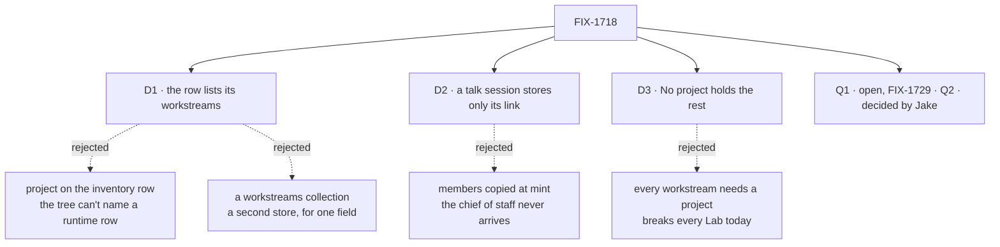

# FIX-1718 · Decisions

[Spec](SPEC.md) · **Decisions** · [Rules](BUSINESS-RULES.md) · [Plan](PLAN.md) · [Docs](DOCS.md) · [Evolution](EVOLUTION.md)

What a project is was Jake's call: data the organization owns, with a conversation minted from a
template ([HOLD](https://github.com/fixpoint-labs/flow-state-dev/pull/2625#issuecomment-5939811709),
2026-10-01). How that works on today's code is the FIX-1728 spike's
([SPIKE.md](https://github.com/fixpoint-labs/flow-state-dev/blob/spike/FIX-1728/specs/spikes/FIX-1728/SPIKE.md),
3 of 3 legs passing, with the control going red): a row in an org collection, a `mintFor:`
template, and a two-sided link. This file decides what the spike left to FIX-1718.

## The tree

Solid edges are what you're signing. Dashed edges lost, and the label says why.

## D1 · A project's row lists its workstreams, and a workstream belongs to at most one project

| | |
|---|---|
| **Instead of** | The project on each workstream's inventory row, or a `project:` line in its `CHANNEL.md` · a `workstreams` collection whose rows name their project |
| **Because** | A project is created at runtime, and a channel's file and its inventory row are written from the tree at boot. The tree can't name a row that doesn't exist yet. The row already is the project's one record, so its workstreams belong there: the chief of staff changes one row, and Shift Manager reads one collection. A collection of workstream rows would hold one field today |
| **Locks in** | `workstreams: string[]` on the row, full channel ids of declared channels. Writing a row refuses an id the inventory doesn't hold, and an id another row already lists. The inventory row and `CHANNEL.md` gain nothing for this. An id whose channel later leaves the tree stays on the row, and the screens say so rather than drop it |

It comes down to when a project exists: at runtime, after the tree was read.

**What would change my mind:** workstreams needing data of their own, such as status or an owner.
Then they become rows of a second collection, the spike's open wall, and this field moves there.

## D2 · A talk session stores only its link; its members and charter come from the template at every start

| | |
|---|---|
| **Instead of** | Members and charter copied into the session when it's minted, as a declared channel's are at first open |
| **Because** | A copy is frozen. A project created before the chief of staff is on the template would never gain the chief of staff, and the same is true of every member edit after it. That's the hole a reviewer found in the earlier draft, and minting doesn't close it. Built onto the template's kind at boot, as `boards:` is, an edit lands on every project's conversation at the next restart |
| **Locks in** | Talk state is `resourceId` plus the transcript. A template may not declare `boards:`: a board per project is the spike's open wall. A declared channel keeps today's behaviour, members copied at first open, unchanged |

It comes down to whether the chief of staff reaches the projects made before it.

**What would change my mind:** a Lab that needs different members per project. Then the row
carries them and the kind reads them from it, not from the session.

## D3 · A workstream no project names sits under No project, and a Lab with no projects runs as it does today

| | |
|---|---|
| **Instead of** | Every workstream required to belong to a project · workstreams with none left out of PROJECTS |
| **Because** | Every Lab on `main` has no projects. Leaving their workstreams out hides the work people do today, and requiring a project stops them. The shell's `unassigned` route already is the project level for them |
| **Locks in** | PROJECTS lists every row, with its workstreams, even a project with none yet. Then No project, when it holds any. No project's Stream and Brief say it has no conversation or brief; Board and Workstreams list its workstreams |

It comes down to every Lab on `main`, which has no projects.

**What would change my mind:** a Lab where No project is a mistake every time. That Lab can
refuse it in its own code; the default stays.

## Jake's calls

Both come from the spike's forks. Q2 is decided. Q1 is open pending the [FIX-1729](https://linear.app/fixpoint-labs/issue/FIX-1729) spike, and
this spec builds its baseline so that either answer swaps the conversation parts only.

### Q1 · When two people talk about one project, do they see each other's lines? · open, pending FIX-1729

- **In plain terms.** Each person gets a private conversation about the project with its seats.
  The project's record is shared, and the conversations aren't. The engine refuses one person's
  reads and posts into another's.
- **The trade-off.** (A) one per person: nothing new below Workforce. (B) one shared thread,
  kept as rows on the project: all Workforce, but the conversation becomes project data.
  (C) sharing sessions between people: an auth change in the engine.
- **Baseline, per Jake:** (A), built here. A shared room is open pending [FIX-1729](https://linear.app/fixpoint-labs/issue/FIX-1729).
  FIX-1650 is single-user first, so v1 has one conversation per project either way.
- **What would change my mind:** a v1 Lab where two real people must read one thread.
- **If wrong:** moving to (B) later adds a thread collection, and today's conversations stay
  readable but private. Choosing (C) puts an engine auth change on this issue's path.
- **Here it shapes:** Stream shows the viewer's own conversation, and a viewer with none sees
  **Join** (BR-20). Rules marked *(baseline)* change if the room is shared. Nothing else does:
  the row, D1, D3 and the grouping hold either way, and the conversation is reached through one
  module on each side ([PLAN guardrails](PLAN.md#guardrails)).

### Q2 · Ship this inside FIX-1650, or wait for the parked rooms work? · decided: ship now (Jake, 2026-10-01)

- **In plain terms.** The epic says no conversation is opened at runtime. Minting one when a
  project is created is exactly that.
- **The trade-off.** Shipping now amends the epic's D2, D3 and ER-3 to allow two runtime moves,
  minting on create and joining, and nothing else. Waiting keeps them, but this issue then has
  no projects to show.
- **Jake's answer:** ship now. FIX-1650 is being amended (#2622) to allow the narrow slice,
  recorded as the first case of FIX-1341's lane.
- **What would change my mind:** the Collab rooms work being close enough to wait for.
- **If wrong:** if Collab redesigns rooms, `bind` and `mintFor:` get renamed. Stored data is two
  fields, so the move is small.
- **Here it shapes:** the whole issue: it is in FIX-1650's scope.

## Decided, not asked

- **Two PRs.** PR 1, Workforce: the row schema, `mintFor:`, the mint reaction, `bind`, `join`
  and the workstream check. PR 2: Shift Manager, the DevTeam profile and the goal check. The
  spike is a write-up with no issue of its own to build it, and this is the first issue that
  needs it.
- **The row's brief is the project's Brief.** The template's charter is the same for every
  project, so it can't be one project's brief.
- **App defaults call `bind` from product code.** A Lab's default projects are created by its
  own code at boot, for the Lab's user, if their rows are absent. No `CHANNEL.md` names a
  project.
- **Talk sessions are never registered in the channel inventory.** They're per person and
  per project; the inventory stays the Lab's declared channels.
- **The project Board is one lane per board-holding workstream,** in the workstream Board's
  columns. A workstream with no board has no lane.
- **A project's address is its row id:** `/p/storefront/stream`. A row id can't be
  `unassigned`, which stays No project's.
- **The DevTeam profile ships two default projects,** one per workstream, so the epic's closure
  has two to find. Its tree gains one board-less workstream and the talk template. The DevForce
  host's "one channel" rule becomes "one channel holds a board", and a template isn't a channel.
- **One project per workstream is checked on write,** not by a lock. Two writers racing is a
  single-user non-case in v1. PLAN names it.

## Considered and dropped

| Alternative | Why not |
|---|---|
| A project as a declared channel, named by a `project:` key | Jake's HOLD: a project is runtime data, not a tree declaration |
| The project in a session's state | Found only by the person who opened it; Jake's fence |
| A `CHANNELS.md` list of rooms | Invent-killed (ER-10) |
| A template written only in TypeScript | Nothing a Lab author can read. Kept for app defaults, which call `bind` from code |
| Registering each talk session in the inventory | Floods the Lab's channel list with per-person conversations |

## Settled

By the FIX-1728 POC on `main` `1e51ab9f`: a seat-like flow creates an org row at runtime, and
another user in the org lists it (P1, P2). Creating it mints the creator's talk session through
`reactTo.created`, with `resourceId` in its state (P1). Another person's session answers 404 to
reads and posts (P3, P6). `join` mints a second session and the row lists both (P4). The
built-in channel kind minted that way can't post (R1), and `CHANNEL.md` refuses an unknown key
(R2). Not exercised: two joins at once.

## How it got here

- **Draft 1** framed a project as a declared channel named by a `project:` key, as epic Q1
  first read. Jake held it.
- **Draft 2 (this)** rewritten onto FIX-1728's model. FIX-1727 is superseded by it. Jake
  then decided Q2 and sent Q1 to [FIX-1729](https://linear.app/fixpoint-labs/issue/FIX-1729).
