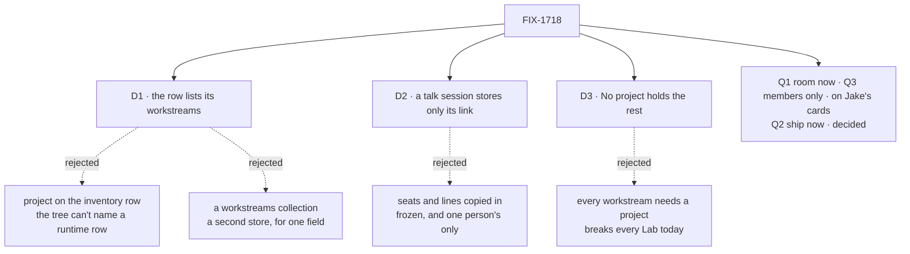

# FIX-1718 · Decisions

[Spec](SPEC.md) · **Decisions** · [Rules](BUSINESS-RULES.md) · [Plan](PLAN.md) · [Docs](DOCS.md) · [Evolution](EVOLUTION.md)

What a project is was Jake's call: data the organization owns, with a conversation minted from a
template ([HOLD](https://github.com/fixpoint-labs/flow-state-dev/pull/2625#issuecomment-5939811709),
2026-10-01). Two spikes showed how to build it on today's code.

- [FIX-1728](https://github.com/fixpoint-labs/flow-state-dev/blob/spike/FIX-1728/specs/spikes/FIX-1728/SPIKE.md)
  showed the org row, the `mintFor:` template, and the two-sided link.
- [FIX-1729](https://github.com/fixpoint-labs/flow-state-dev/blob/spike/FIX-1729/specs/spikes/FIX-1729/SPIKE.md)
  showed one room per project. Its lines are org rows, and each person reaches them through
  their own talk session, gated on the row's `members`.

Both POCs pass, and their controls fail. This file decides what the spikes left to FIX-1718.

## The tree

Solid edges are what you're signing. Dashed edges lost, and the label says why.

## D1 · A project's row lists its workstreams, and a workstream belongs to at most one project

| | |
|---|---|
| **Instead of** | The project named on each workstream's inventory row, or a `project:` line in its `CHANNEL.md` · a `workstreams` collection whose rows name their project |
| **Because** | A project is created at runtime. A channel's file and its inventory row are written from the tree at boot, so they can't name a row that doesn't exist yet. The project row is already the project's one record, so its workstreams belong there. The chief of staff changes one row, and Shift Manager reads one collection. A collection of workstream rows would hold one field today |
| **Locks in** | `workstreams: string[]` on the row, holding full channel ids of declared channels. Writing a row refuses an id the inventory doesn't hold, and an id another row already lists. The inventory row and `CHANNEL.md` gain nothing for this. If a channel later leaves the tree, its id stays on the row, and the screens show it as gone rather than drop it |

It comes down to when a project exists: at runtime, after the tree was read.

**What would change my mind:** workstreams needing data of their own, such as status or an owner.
Then they become rows of a second collection, the spike's open wall, and this field moves there.

## D2 · A talk session stores only its link; its seats and charter come from the template at every start, and its lines from the room

| | |
|---|---|
| **Instead of** | The template's seats and charter copied into the session when it's minted, as a declared channel's are at first open · lines kept as items in the session |
| **Because** | A copy is frozen. A project created before the chief of staff is on the template would never gain the chief of staff, and the same goes for every later edit. A reviewer found that hole in the earlier draft, and minting doesn't close it. Built onto the template's kind at boot, as `boards:` is, an edit lands on every project's room at the next restart. Lines kept in a session are one person's, and a room is everyone's |
| **Locks in** | Talk state is `resourceId` alone. It **grants nothing** (D2's partner rule, BR-13): session state is written by the caller at create, so access is decided by the row. The template's seats (`seats` in `org/resources/projects.ts`, `members:` in a team `CHANNEL.md`) are the seats a post wakes, while the row's `members` are the people who may read. A template may not declare `boards:`, because a board per project is still an open question. A declared channel keeps today's behaviour, unchanged |

It comes down to whether the chief of staff reaches the projects made before it.

**What would change my mind:** a Lab that needs different seats per project. Then the row
carries them, and the kind reads them from the row, not from the session.

## D3 · A workstream no project names sits under No project, and a Lab with no projects runs as it does today

| | |
|---|---|
| **Instead of** | Every workstream required to belong to a project · workstreams with none left out of PROJECTS |
| **Because** | Every Lab on `main` has no projects. Leaving their workstreams out hides the work people do today, and requiring a project stops those Labs. The shell's `unassigned` route already serves as the project level for them |
| **Locks in** | PROJECTS lists every row with its workstreams, even a project that has none yet. Then No project, when it holds any. No project's Stream and Brief say it has no room or brief; its Board and Workstreams list its workstreams |

It comes down to every Lab on `main`, which has no projects.

**What would change my mind:** a Lab where No project is a mistake every time. That Lab can
refuse it in its own code; the default stays.

## Jake's calls

These come from the spikes' forks. Jake decided Q2. Q1 and Q3 are on his cards, and this spec
is written to the recommendation for each.

### Q1 · Build the shared room now, instead of a private thread per person? · on Jake's card, recommended

- **In plain terms.** Everyone on a project talks in one room with its seats. Each person still
  reaches the room through a session of their own, and nobody's session is shared.
- **The trade-off.** A room costs about one more PR. In return, there's no history to move
  later: one person alone in a room is the per-person thread. Private threads are smaller now,
  but their lines stay private if a room comes later.
- **Recommendation:** the room now, as the only talk shape (FIX-1729's option B).
- **What would change my mind:** this issue can't take another PR, or v1 will never have two
  real people in one Lab.
- **If wrong:** about one PR of work nobody needed. The other way round costs a migration of
  thread history.
- **Here it shapes:** the room collections, the gate, the burst rule, the third PR, and the
  room legs of the goal. If Jake says no, the conversation is reached through `talkFor`, `bind`
  and `join` only ([PLAN guardrails](PLAN.md#guardrails)), so per-person threads replace the
  room there, and the row, D1 and D3 are untouched.

### Q3 · Who can read a project's room: its members, or everyone in the Lab? · on Jake's card, recommended

- **In plain terms.** Everyone in the Lab can see that a project exists. The question is whether
  they can read its conversation too.
- **The trade-off.**
  - **Members only.** Reads go through each reader's own session. Every read is a small
    recorded request, so views read on open, on focus and after a wake, not on a timer.
  - **Everyone reads, members post.** Reads are cheap, but every project's conversation is
    open to the whole Lab.
  - **Members only, with cheap reads.** This needs a new engine row fence, which is a
    security change.
- **Recommendation:** members only.
- **What would change my mind:** a Lab that never needs private projects. Then "everyone
  reads" is a one-line change.
- **If wrong:** a few seconds' lag and extra request records, against conversations open to the
  whole Lab.
- **Here it shapes:** BR-14 and BR-23, and the outsider leg of the goal.

### Q2 · Ship this inside FIX-1650, or wait for the parked rooms work? · decided: ship now (Jake, 2026-10-01)

- **In plain terms.** The epic says no conversation is opened at runtime. Minting one when a
  project is created is exactly that.
- **Jake's answer:** ship now. FIX-1650 is being amended (#2622) to allow minting on create and
  joining, and nothing else. This is recorded as the first case of FIX-1341's lane.
- **If wrong:** if Collab redesigns rooms, `bind` and `mintFor:` get renamed. The stored data
  is rows plus one field in each session, so the move is small.

## Decided, not asked

- **Three PRs for review size, or two.** Workforce's room and talk entries, then its `mintFor:`
  and wakes, then Shift Manager. The first two may merge as one. See [PLAN](PLAN.md) for the
  release line.
- **Each seat keeps one conversation per person per room.** A post wakes the seat under the
  poster, so the seat acts with the poster's authority. The seat is given the room's recent
  lines on each wake, so it misses nobody's. A shared seat memory would need a conversation that
  belongs to no single person, which is rejected under Not here.
- **No live push of other members' lines in v1.** Your own post streams to you as today.
  Others' lines arrive on the view's next read: on open, on focus, and after your post's wake.
- **No unread counts.** Shift Manager has no Unread surface for a room to feed, so the read
  cursor lives in the open view, and nothing is stored for it. Unread and a stored cursor
  are listed under Not here.
- **The row's `members` is written only by trusted code:** the app at boot, or the chief of
  staff at create. `join` never adds its caller. A non-member who calls `join` gets nothing.
- **Concurrent joins: `join` is keyed by `(projectId, userId)` and retried, not `sessions` as rows.** It returns the user's listed session, so a second window adopts it, or mints and appends with the counter's retry. Simpler than a third collection, and the pinned row shape stays (BR-16a).
- **A reader never passes an unwritten line.** The counter row keeps a committed watermark; a line missing past a grace period is tombstoned with `create` (BR-16b). The spike's counter CAS carries it, with no new lock.
- **A workstream claim is one shared key,** `workstream-claims/<channelId>`, created with `create`, so two projects can't both claim it (BR-4).
- **Binding is recoverable.** A row whose owner has no session is unbound, and `join`, opening the project, or re-sending the create repairs it (BR-8a).
- **A project belongs to the organization and names no team (Jake, 2026-10-02).** Its workstreams come from any team, and spanning teams is the normal case. A team-only project is allowed, and is not the default (BR-2a).
- **The default talk template is org-level, declared in `org/resources/projects.ts`,** beside the collection. The tree has no `org/channels/` slot. Adding one would be a new folder, which the epic's ER-15 sends back as an escalation. The module is an existing slot, and it is where the Architect put app defaults. A team `CHANNEL.md` marked `mintFor:` stays for a team's own projects. A template's seats may come from any team.
- **One template per collection and kind, across both sites,** refused at boot otherwise (BR-6).
- **The chief of staff's `createProject` tool is this issue's** (PLAN S15), on FIX-1719's seat.
- **Project talk is room rows only.** No `channel-post` mirror in anyone's session.
- **The room's sequence counter is a row of its own,** so editing a project never contends with
  posts. The room retries the counter after a lost race. The engine's three retries lost a post
  in the spike.
- **The row's brief is the project's Brief.** Every project of a template shares the
  template's charter, so the charter can't be one project's brief.
- **App defaults call `bind` from product code.** If a Lab's default rows are absent at boot,
  its own code creates them. No `CHANNEL.md` names a project.
- **Talk sessions are never registered in the channel inventory.**
- **The project Board is one lane per board-holding workstream.** `/p/<row id>/<tab>`; a row id
  can't be `unassigned`.
- **The DevTeam profile ships two default projects, and authenticates three bearer users:** the
  Lab's owner, a second member, and an outsider. The DevForce host's "one channel" rule becomes
  "one channel holds a board", and a template isn't a channel.

## Considered and dropped

| Alternative | Why not |
|---|---|
| A project as a declared channel, named by a `project:` key | Jake's HOLD: a project is runtime data |
| One session several people share (FIX-1729's option A) | It breaks "a session belongs to one person" at seven engine sites. That's an auth change, with 4 to 6 PRs |
| A service principal that owns the room | The poster becomes an unverified label again; isolation off with extra steps |
| A `CHANNELS.md` list of rooms | Invent-killed (ER-10) |
| An `org/channels/` slot for the default template | A new folder slot, which ER-15 sends back to the epic. The projects module already sits at org level |
| Registering each talk session in the inventory | Floods the Lab's channel list |
| A membership check that trusts `resourceId` in session state | A caller writes that state at create (FIX-1729, N1) |

## Settled

These were run on `main` `1e51ab9f`.

**FIX-1728:**
- A row created at runtime is listed by another user in the org.
- Creating it mints the creator's talk session in the same turn.
- Another person's session answers 404.
- The built-in channel kind can't post when minted.
- `CHANNEL.md` refuses an unknown key.

**FIX-1729:**
- Two members read each other's lines by cursor, each through their own session (S3, S4).
- Seats wake under the poster (S5).
- A non-member is refused even with a forged `resourceId`, and the browser route gives 403 (N1).
- A ten-post burst lands whole with the room's retry, and loses one without it (C1). Concurrent joins weren't run; BR-16a's V2 burst covers them.

## How it got here

- **Draft 1** framed a project as a declared channel. Jake held it.
- **Draft 2** moved to FIX-1728's model, with a private thread per person as the baseline.
- **Draft 3 (this)** folds in FIX-1729: one room per project, members only. Jake decided Q2.
