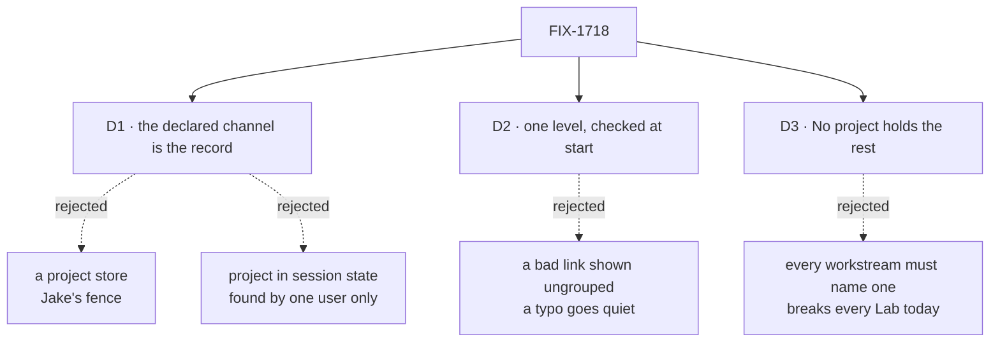

# FIX-1718 · Decisions

[Spec](SPEC.md) · **Decisions** · [Rules](BUSINESS-RULES.md) · [Plan](PLAN.md) · [Docs](DOCS.md) · [Evolution](EVOLUTION.md)

What was considered, what was chosen, why, and what each choice locks in. Three decisions are
the sign-off surface. What a project is was Jake's call, not this spec's: a channel of its own,
named by its workstreams with one `CHANNEL.md` key, with the channel as the durable record
everyone finds and no project store beside channels (the epic's Q1, amended on #2622).

## The tree

Solid edges are what you're signing. Dashed edges lost, and the label says why.

## D1 · The declared channel is the project's record; its inventory row publishes the project on every boot

| | |
|---|---|
| **Instead of** | A project record or store of its own · the project written into the channel's session state at open, where its members and charter go |
| **Because** | Jake's fence: the channel is the durable thing everyone in the Lab finds, and there is no second project store. The `CHANNEL.md` is that record, and the inventory row is how it reaches a browser and a seat, since neither reads the tree. The row is org-scoped; a channel's session is bound to the user it was opened for, so a project kept there would be found by one person only. Session state is also written once, at first open, so on a store that survives a restart an edit to `project:` would never arrive. The row is rewritten from the tree on every boot. The value is built onto the channel kind at boot, as `boards:` is, so a request cannot set it ([BP-031](../../../docs/contributing/best-practices.md)) |
| **Locks in** | One field on the channel row, `project`, `null` when a channel names none and on a row written before it (BP-030). An edit lands on the next restart. Nothing in Layer 1, no session field, user isolation unchanged. A project's Stream and Brief are read through its channel's session, as a workstream's are today; only what a project is, and which workstreams it holds, is org-level here. A row whose channel left the tree keeps its last project, as rows already keep their last members |

It comes down to who can find it: a session answers only the user it was opened for.

**What would change my mind:** Jake asking for an org-scoped project resource of its own, as
boards and the seat inventory are (asked 2026-10-01). Then that resource replaces the one module
that reads projects off the rows, and the `CHANNEL.md` key stays its source.

## D2 · One level, checked at start: `project:` names another declared channel that names none, or the Lab doesn't start

| | |
|---|---|
| **Instead of** | Projects of projects · a link that doesn't resolve shown as a workstream under No project, with a warning |
| **Because** | A typo in a project name should be found at the start, where the author is, not by someone wondering why a workstream left its project. The binder already refuses a `routing:` fallback that names no member, for the same reason. Nesting buys nothing the design calls for: the shell has three levels, and a project inside a project has no screen |
| **Locks in** | `project:` is a full channel id (`<team>.<name>`, as `members:` names full seat ids), so a project can gather workstreams from several teams. It may not name its own channel, a channel the roster doesn't declare, or a channel that itself names a project. Each is refused by name with the others, and nothing is registered. A channel kind `defineChannelFlow` didn't build can't carry `project:`, and is refused as for `boards:` |

It comes down to what a typo does: shown ungrouped, nobody notices until it matters.

**What would change my mind:** a Lab that needs a project of projects. Then the rule loosens to a
chain without cycles, and the shell gets a level to show it.

## D3 · A workstream that names no project sits under No project, and a Lab with no projects runs as it does today

| | |
|---|---|
| **Instead of** | Every workstream required to name a project · channels without one left out of PROJECTS |
| **Because** | Every Lab on `main` declares no project. Requiring one breaks them all at the next start, and leaving them out hides workstreams a person works in today. No project is where they already are: the shell's `unassigned` route is the project level for them |
| **Locks in** | PROJECTS lists each project with its workstreams, then No project with the rest, shown only when there are some. A channel is a project only when a workstream names it, so a project channel nobody names yet is listed under No project as a workstream. No project's Stream and Brief say it has no project channel; its Board and Workstreams list its workstreams |

It comes down to every Lab on `main`: requiring a project stops each one at its next start.

**What would change my mind:** a Lab where No project is a mistake every time. Then that Lab
can turn a missing link into a refusal at boot; the default stays.

## Decided, not asked

- **Two PRs.** PR 1 is Workforce: the key, its check, the row field, `discover`. PR 2 is Shift
  Manager, the DevTeam tree and the goal check, and depends on PR 1.
- **A workstream is a declared channel with its kind and the boards it holds**, as the epic's
  ER-2 asks this issue to write down. A project channel is a channel too: it can hold a board,
  and its rows join the project's Board.
- **The project's Board is one swimlane per workstream**, the project channel's own boards
  first, each drawn with the workstream Board's columns. What sits on a row is FIX-1651's.
- **The project level's team strip** shows the teams with a seat in the project channel's or its
  workstreams' members.
- **A project's address is its channel id**: `/p/eng.storefront/stream`. No project keeps
  `/p/unassigned`, which can't collide, since every channel id carries a dot.
- **The DevTeam tree declares two projects**, `eng.storefront` (the brief for `eng.feature`) and
  a second with a board-less workstream, so the epic's closure has two to find. The DevForce
  host's "one channel" rule becomes "one channel holds a board".
- **Project channels in the DevTeam tree declare no members.** A post there wakes nobody until
  the chief of staff joins (FIX-1719).
- **`discover` names the project** in each channel's entry, and on a project channel the
  workstreams that name it, from the rows it already lists.

## Considered and dropped

| Alternative | Why not |
|---|---|
| A project as a team, or a named pack of channels | Not Jake's answer (epic Q1) |
| The project channel lists its workstreams | Moving a workstream would edit two files; Jake's answer has the workstream name its project |
| A project channel marked by a key of its own | A second key, past the epic's limit of one ([D2](../../epics/FIX-1650/DECISIONS.md#d2)) |
| Loading `org/channels/` so a project can sit at org level | A loader change this issue doesn't need: a full channel id already crosses teams |
| Shift Manager reading each channel's session for its project | One read per channel per refresh, bound to one user and frozen at first open (D1) |
| A project collection of its own now, org-scoped as boards are | Nothing this issue reads needs it: the channel row holds the project. Asked of Jake on 2026-10-01; the one module that reads projects is the swap point |

## Settled

Nothing settled by a run. The facts the design rests on, read on `main` `1e51ab9f` and checked
by the Architect: a channel is a session at its own id (`ChannelManifest.id`,
`manifest.ts:143-149`), opened by `openChannels` for one `userId` and bound to that user, and
left as it is on later boots, with members and charter in its state; the inventory register
runs every boot and writes the org-scoped row from inside that session
(`channel-flow.ts:913-981`); `boards:` is rebuilt from the files on every bind
(`channels.md` → "Opening it").

## How it got here

- **Draft** — framed from Jake's Q1 answer and his fence: the declared channel is the project's
  record, a workstream names its project with one `CHANNEL.md` key checked at start, the row
  publishes it for Shift Manager and `discover`, and No project holds the rest; two PRs.

**Open: none.**
