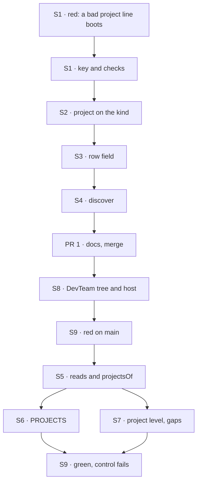

# FIX-1718 · Plan

[Spec](SPEC.md) · [Decisions](DECISIONS.md) · [Rules](BUSINESS-RULES.md) · **Plan** · [Docs](DOCS.md) · [Evolution](EVOLUTION.md)

Written for the implementing agent. IDs cross-reference [BUSINESS-RULES.md](BUSINESS-RULES.md)
(BR-n), [DECISIONS.md](DECISIONS.md) (Dn) and the epic's rules (ER-n). `tdd`. Two PRs.

## Where it stands on `main` `1e51ab9f`

| What | Where | Today |
|---|---|---|
| The closed `CHANNEL.md` key list | `packages/workforce/src/channel/channel-binder.ts:81-89` (`DECLARABLE_KEYS`), refusals in `validate` | Seven keys: `flow`, `description`, `members`, `boards`, `instructions`, `routing`, `boardActions` |
| Facts built onto the kind at boot | `channel-flow.ts:1487-1493` (`withBoards`, `withRouting`, `withBoardActions`) | The seam a roster-wide fact rides; `routing:` is the precedent |
| The channel row | `inventory/collections.ts:105-114` (`channelInventoryRowSchema`), `:162` (client fields) | `id`, `kind`, `members`, `openedAt` |
| The row's writer | `channel-flow.ts:913-981` (`registerChannel`) | Public action, input `{}`, runs every boot from inside the channel's session |
| `discover`'s channel entries | `manifest-sources.ts:248-276` (`channelsSource`) | Members and when it opened |
| Shift Manager's reads | `labs/shift-manager/src/lib/reads.ts:265` (`toWorkstream`), `derive.ts` | Workstream is `{ id, kind, members }` |
| The project level and PROJECTS | `surfaces/Project.tsx`, `surfaces/Sidebar.tsx:172-192`, `routes.ts` (`NO_PROJECT`) | Four gap entries; every workstream listed flat |
| The DevTeam tree and host | `goals/devforce-lab/lab/workforce/teams/eng/channels/feature/`, `host.mts:415` | One channel, and the host refuses a tree with any other number |

## Surfaces

| ID | PR | Package · role | Change | Rules |
|---|---|---|---|---|
| S1 | 1 | `workforce` · binder | Add `project` to `DECLARABLE_KEYS`. In the roster pass, refuse a non-text or empty value, an id the roster doesn't declare, the channel's own id, and a target that declares `project:` itself; refuse `project:` on a kind `defineChannelFlow` didn't build. Collected with the other refusals | BR-6 to BR-11 |
| S2 | 1 | `workforce` · channel kind | Build each channel's project onto the built-in kind at boot (`withProjects`, beside `withRouting`), never into session state | BR-12 BR-13 |
| S3 | 1 | `workforce` · inventory | `project: z.string().nullable().default(null)` on the channel row, in its client fields and in the register's output. `registerChannel` writes it from the kind; its input stays `{}` | BR-13 BR-14 BR-15 |
| S4 | 1 | `workforce` · `discover` | A workstream's entry names its project; a project's names the workstreams that name it, from the rows already listed | BR-16 |
| S5 | 2 | Shift Manager · reads | `toWorkstream` reads `project` (absent or not text is `null`). One module owns every project read: `projectsOf` returns the projects in id order, each with its channel and workstreams, and the No project list, and every surface uses it. Nothing else in Shift Manager knows where a project comes from, so an org-scoped project resource, if Jake asks for one, replaces this module only | BR-3 BR-14 BR-17 BR-24 |
| S6 | 2 | Shift Manager · sidebar | PROJECTS draws `projectsOf`: a project, its workstreams beneath, then No project when non-empty | BR-17 |
| S7 | 2 | Shift Manager · project level | The four tabs: Stream and Brief reuse the workstream's components on the project channel; Board is lanes of the existing Board; Workstreams lists them; the team strip narrows to the project. No project and an unknown id get their named states. **Remove** the four `project*` entries from `gaps.ts`; add the named states beside `turn`'s, which are states, not gaps | BR-18 to BR-23 BR-26 |
| S8 | 2 | DevTeam tree and host | Two project channels with charters and no members; `feature` names one; a board-less workstream names the other. `openLab` refuses unless exactly one channel holds a board, and the profile picks that channel, not `channels[0]` | Goal |
| S9 | 2 | Goal check · `goals/shift-manager/it-groups-workstreams-under-their-projects/` | New. Boots the profile, reads with `createLabReader` over HTTP, as `test/goal-labs.test.ts` does. Control `unlinked` | Goal |
| S10 | 1 and 2 | Docs | [DOCS.md](DOCS.md); one `minor` changeset for `@flow-state-dev/workforce` in PR 1. Shift Manager is private: none | — |

## Sequence



## Checks

| ID | Runs after | Passes when |
|---|---|---|
| V1 | S1 | Binder specs: BR-6 to BR-11 on a fixture roster of a project, two workstreams in two teams, and one of each bad link, all reported in one throw; a roster with no `project:` binds exactly as today |
| V2 | S2 S3 | Inventory spec over a store that survives a restart: the row carries the project; changing the file and booting again changes the row and leaves the session's state untouched; a row stored without the field reads `null`; the register's input still refuses any key |
| V3 | S4 | Manifest-source spec: both entry shapes; a row with no `project` reads as today |
| V4 | S5 to S7 | Shell specs in jsdom: BR-17 to BR-26 over a snapshot; `gaps.ts` differs from `main` only in the four project entries and the new states |
| V5 | S8 | The five devforce-lab checks and `labs/shift-manager` tests pass on the new tree |
| VG | S9 | [The goal](SPEC.md#the-goal-and-how-well-know-its-met): PASS, FAIL under `GOAL_CONTROL=unlinked`, FAIL on `main` |

## Pinned names

| Where | Name | Why pinned |
|---|---|---|
| `CHANNEL.md` key | `project` | What every Lab writes |
| Channel row field | `project: string \| null` | Read by Shift Manager, `discover`, FIX-1719 and FIX-1722/1723 |
| No project's route id | `unassigned` (`NO_PROJECT`, unchanged) | Already shipped |
| Goal control | `unlinked` | The spec's control |

## Guardrails

| Rule | Because |
|---|---|
| The project reaches the row only from the kind built at boot | The register is a public action; a request must not regroup a Lab (BP-031) |
| Every surface groups through `projectsOf`, and nothing else reads `project` | Two screens deriving projects their own way disagree on the stale-row cases (tenet 5), and one module is what a project resource of its own would replace |
| No field on a session, no project collection, nothing in `core` or `engine`, user isolation untouched | Jake's fence; ER-10, ER-15. A project collection waits on Jake; an L1 need is an escalation to the epic |
| A `CHANNEL.md` with no `project:` is today, byte for byte | Every Lab on `main` (BP-035: test the off state) |
| `gaps.ts`: only the four project entries change | ER-8; FIX-1722 and FIX-1651 edit the same file |
| Published prose says seat, never worker as a noun | ER-13 |

## Docs

Reconcile and publish [DOCS.md](DOCS.md): PR 1 the channel key and the row, PR 2 Shift
Manager's README and the epic's shared paragraphs.

## Sketch

```
boot:   roster → binder checks every project line → kind.withProjects({ channel → project })
        register (each channel, its own session) → row { …, project: kind's value }
read:   rows → projectsOf → { projects: [{ channel, workstreams }], noProject: [...] }
screen: project tab → its channel's id → the existing Stream / Brief / Board components
```

**POC:** none. The one fact the design rests on was read, not argued
([Settled](DECISIONS.md#settled)), and the spec rests on no counted list a checker would guard.

## At implement time

- FIX-1722's PR #2621 edits `gaps.ts`, `reads.ts`, `derive.ts`, `routes.ts` and `Sidebar.tsx`.
  Whichever merges second rebases, keeping the other's entries.
- `labs/shift-manager/teams/devteam/fsdev.config.mts:65` reads `roster.channels[0]`'s members as
  the EM addresses. With three channels that is the wrong one; pick the channel holding a board.
- The devforce-lab checks refuse a lab file that spells their held-out feature. Name the new
  channels without it.
- `apps/docs/docs/workforce/channels.md:53` says six keys; the code has seven. It becomes eight.

## Notes from review

None yet.

## Follow-ups

- A session per participant, linked to its channel ([Not here](SPEC.md#not-here)), on Jake's
  call. Shift Manager reaches a channel's session by its id at 13 call sites in 6 files
  (counted on `main` `1e51ab9f`); that is the follow-up's scope, not this issue's.
- An org-scoped project resource, and project data that changes at runtime, pending Jake. The
  swap point is S5's one module.
- `org/channels/` is passed over in silence, as FIX-1719 notes for `org/workers/`.
