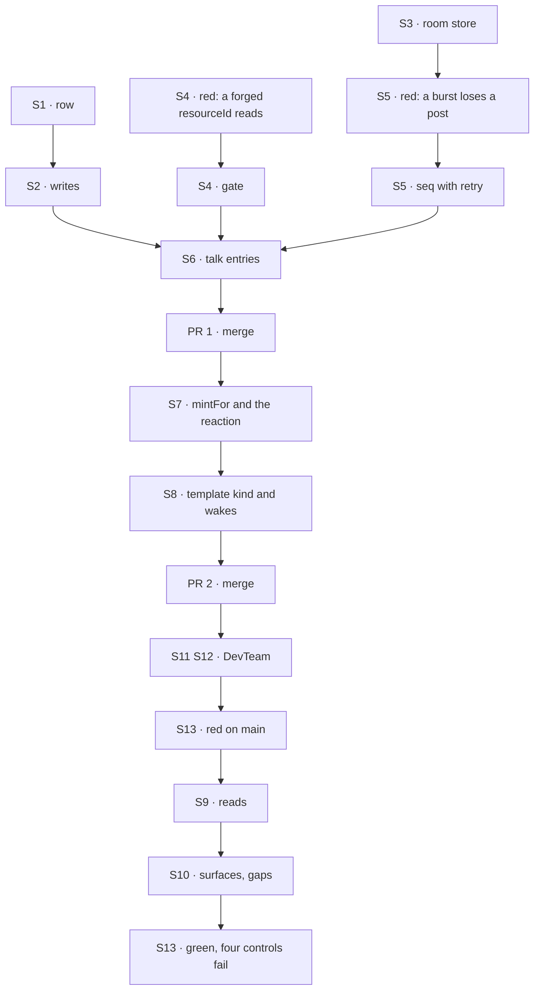

# FIX-1718 · Plan

[Spec](SPEC.md) · [Decisions](DECISIONS.md) · [Rules](BUSINESS-RULES.md) · **Plan** · [Docs](DOCS.md) · [Evolution](EVOLUTION.md)

Written for the implementing agent. IDs cross-reference [BUSINESS-RULES.md](BUSINESS-RULES.md)
(BR-n), [DECISIONS.md](DECISIONS.md) (Dn, Qn) and the epic's rules (ER-n). `tdd`. Three PRs.

**Don't start while the spec is on soft-HOLD** ([SPEC](SPEC.md)). The POCs are the working
sketches of PR 1 and PR 2:
- `specs/spikes/FIX-1728/poc/resource-talk/` on `spike/FIX-1728`;
- `specs/spikes/FIX-1729/poc/shared-room/` on `spike/FIX-1729`.

## Where it stands on `main` `1e51ab9f`

| What | Where | Today |
|---|---|---|
| Org collections a seat writes at runtime | `packages/workforce/src/roster/collections.ts:136-170`; the hire block's `roster.create` at `seat-hire-blocks.ts:229` | The precedent for `projects` and `room-lines` |
| Tree resource modules | `workforce/org/resources/*.ts`, typed by `packages/workforce/src/resource-modules.ts` | Where `projects.ts` goes; no new folder |
| A reaction on create | `packages/core/src/types/resource-change.ts:148-161` (`reactTo.created`) | Runs inside the creating turn |
| Session state at create | `packages/engine/src/routes/session-routes.ts:337-343` takes `body.state`; the owner is the principal (`:300`) | Why the gate reads the owner, not the state |
| CAS retries | `packages/engine/src/stores/resource-cas.ts:92` | Three, then `concurrent_modification` |
| The closed `CHANNEL.md` key list | `packages/workforce/src/channel/channel-binder.ts:81-89` | Seven keys |
| Facts built onto the kind at boot | `channel-flow.ts:1487-1493` (`withBoards`, `withRouting`, `withBoardActions`) | The seam D2 rides |
| Seat wakes | `packages/workforce/src/channel/wake-member-seats.ts:132` | Keyed `channel:<id>` under the posting session |
| Channels registered in the inventory | `packages/workforce/src/inventory/open-inventory.ts:296` | Only channels opened at boot |
| Shift Manager's reads | `labs/shift-manager/src/lib/reads.ts:211`, `derive.ts` (`teamsOf`) | Seats and channels |
| The project level and PROJECTS | `surfaces/Project.tsx`, `surfaces/Sidebar.tsx:173`, `gaps.ts:7-20` | Four gap entries; workstreams flat |
| The DevTeam tree and host | `goals/devforce-lab/lab/workforce/`, `host.mts:123-126` (one bearer principal), `host.mts:415`, `labs/shift-manager/teams/devteam/fsdev.config.mts:65` | One channel and one user |

## Surfaces

| ID | PR | Package · role | Change | Rules |
|---|---|---|---|---|
| S1 | 1 | `workforce` · the row | Row schema and a helper declaring `projects`: org scope, shared across flows, browser read with `expose`. New fields nullable with defaults (BP-023) | BR-2 |
| S2 | 1 | `workforce` · writes | `createProject` and `setWorkstreams`. Rows are written with `create`, never upsert. They refuse `unassigned`, an unknown workstream, and a workstream another row holds. `members` comes from trusted callers only | BR-3 BR-4 |
| S3 | 1 | `workforce` · room store | `room-lines` (one row per line, keys prefixed by project, `prefetchMode: "lazy"`, no browser read) and `room-seq` (one counter row per project, no browser read) | BR-15 BR-17 BR-20 |
| S4 | 1 | `workforce` · the gate | One module: `isMember(row, sessionOwner)`, where the owner comes from the engine's session record. Every room entry calls it. It never reads session state or input | BR-13 BR-14 |
| S5 | 1 | `workforce` · the sequence | One module allocates the next `seq` from `room-seq`, retrying after a lost race past the engine's three; readers skip gaps | BR-16 |
| S6 | 1 | `workforce` · talk kind | The channel kind gains an optional `resourceId` on its state (nullable, default null; BP-030) and five entries. `bind` (internal): writes `resourceId` and appends to `sessions`, refusing per BR-10. `post`, `read { after }` and `answer`: run the gate, then the room store. `join`: members only and idempotent: it returns the session the row lists for the caller; otherwise it mints and appends to `sessions` with S5's retry, keeping the earlier entry if its own member won the race. No entry writes a `channel-post` item | BR-10 BR-11 BR-15 BR-16a BR-17 |
| S7 | 2 | `workforce` · binder | `mintFor` joins `DECLARABLE_KEYS`. A template is not opened and not registered. It's refused with `boards:` or with an unknown collection. The binder installs `reactTo.created` on the named collection, which dispatches to `bind` keyed on the row id | BR-6 to BR-9 |
| S8 | 2 | `workforce` · template kind and wakes | When `resourceId` is set, seats and charter come from the template built onto the kind (`withTemplate`, beside `withBoards`). A post wakes seats once, under the poster, keyed per room, and passes the room's recent lines as context | BR-12 BR-18 |
| S9 | 3 | Shift Manager · reads | `reads.ts` reads `projects/*` once per refresh, beside the inventory. `projectsOf` lives in `derive.ts`, beside `teamsOf`, and groups from the snapshot only | BR-5 BR-22 BR-30 |
| S10 | 3 | Shift Manager · PROJECTS and the project level | PROJECTS draws `projectsOf`. Brief comes from the row, Board from lanes, and Workstreams from the row's list. Stream is `talkFor(project, viewer)`: the viewer's session from `sessions`, then the room read by cursor (kept in the view) on open, on focus and after its own post's wake; or Join; or the members-only state. Named states cover No project and an unknown id. **Remove** the four `project*` entries from `gaps.ts` | BR-23 to BR-29 BR-31 |
| S11 | 3 | DevTeam tree | Adds `org/resources/projects.ts`, `teams/eng/channels/project-talk/CHANNEL.md` (`mintFor: projects`, with the EM as its seat), and one board-less workstream | Goal |
| S12 | 3 | DevTeam profile and host | Bearer auth maps three secrets to three users: the owner, a second member, and an outsider. At boot, the profile creates the two default rows if they're absent, with the first two users as members, and calls `bind` for the owner. `openLab` refuses unless exactly one channel holds a board, and the profile picks that channel, not `channels[0]` | Goal |
| S13 | 3 | Goal check | `goals/shift-manager/it-groups-workstreams-under-their-projects/`, on `it-opens-a-lab`'s harness. It has a browser leg and an HTTP room leg. Controls `unread` and `gap-tabs` swap a Shift Manager module, as that harness does. Controls `no-gate` and `no-retry` swap S4's or S5's module (`no-retry` also drops the `sessions` retry, so the join burst fails too) in the served host; the run fails if a swap never fired | Goal |
| S14 | all | Docs | [DOCS.md](DOCS.md); one `minor` changeset for `@flow-state-dev/workforce` in each of PR 1 and PR 2. Shift Manager is private, so it gets none | — |

## Sequence



## Checks

| ID | Runs after | Passes when |
|---|---|---|
| V1 | S1 S2 | Workforce spec covers the row writes. Each of these is refused, and a refused write leaves the row unchanged: a duplicate id; `unassigned`; an unknown workstream; a workstream that's held. A second user in the org lists the row |
| V2 | S3 to S6 | Workforce spec, FIX-1729's legs made real: <br/>· two members read each other's lines by cursor <br/>· a non-member is refused `read` and `post`, including from a session it created with a forged `resourceId` (BR-13's red state comes first) <br/>· a parallel burst lands whole with the retry, and loses a post with the retry stubbed out <br/>· a parallel burst of joins by two members, each joining twice, leaves exactly one session per member on the row; with the retry stubbed out, an entry is lost <br/>· no session holds a `channel-post` item for project talk <br/>· a line's `userId` ignores any body field <br/>· the browser can't read either collection |
| V3 | S7 S8 | Workforce spec: <br/>· create mints in the same turn, and both sides of the link agree <br/>· outside a turn, nothing mints <br/>· a post wakes the seat once, under the poster, with recent lines <br/>· a seat edit plus a restart reaches an existing talk session <br/>· the inventory has no talk row <br/>· a roster with no `mintFor:` binds as today |
| V4 | S9 S10 | Shell specs in jsdom over a snapshot cover BR-22 to BR-31. `gaps.ts` differs from `main` only in the four project entries. `projectsOf` makes no read |
| V5 | S11 S12 | The five devforce-lab checks and the `labs/shift-manager` tests pass on the new tree. A second boot on a surviving store mints nothing new |
| VG | S13 | [The goal](SPEC.md#the-goal-and-how-well-know-its-met) passes, fails under each of the four controls, and fails on `main` |

## Pinned names

| Where | Name | Why pinned |
|---|---|---|
| Project collection | ref `projects`, keys `projects/<id>`, module `workforce/org/resources/projects.ts` | Read by Shift Manager and FIX-1719 |
| Row | `{ id, title, brief, status, ownerUserId, members: string[], workstreams: string[], sessions: { sessionId, userId }[] }` | The appendix's contract |
| Room collections | `room-lines` (`{ projectId, seq, userId, author, body }`), `room-seq/<projectId>` | FIX-1729's names, shared with #2622 |
| `CHANNEL.md` key | `mintFor` | What a Lab writes; the epic's one key |
| Talk state | `resourceId: string \| null` | The session side of the link; grants nothing |
| Talk entries | `bind` (internal), `join`, `post`, `read { after }`, `answer` | FIX-1719 calls them |
| Refusal code | `not-a-member` | What a non-member gets, in specs and the goal |
| No project's route id | `unassigned` (`NO_PROJECT`, unchanged) | Already shipped |
| Goal controls | `unread`, `gap-tabs`, `no-gate`, `no-retry` | The spec's controls |

## Guardrails

| Rule | Because |
|---|---|
| The gate reads the session owner from the engine's record, and `members` from the row. It never reads either from input or from session state | BP-031. Session state is written by the caller at create (FIX-1729, N1) |
| `members` is written only by trusted code; `join` never adds its caller | Otherwise joining would grant itself access |
| No project field in any session's state; a talk session holds `resourceId` only | Jake's fence |
| Nothing registers a talk session in `inventory/channels/*` | The Lab's channel list stays its declared channels |
| Project talk is written to `room-lines` only, never mirrored as `channel-post` items | One home for a project's conversation; a mirror would be a second transcript to keep in step |
| The gate and the sequence allocator are each a module of their own | So the `no-gate` and `no-retry` controls can swap exactly one thing |
| The conversation is swappable. Shift Manager reaches a project's conversation only through `talkFor(project, viewer)`, and Workforce reaches the room only through the talk entries | If Jake's Q1 card says no, private threads replace these, and the row and grouping stay |
| `projectsOf` derives only from the snapshot. It makes no read of its own, and never reads a room or a talk session to group | One read per refresh (tenet 5); grouping never depends on membership |
| Nothing in `core` or `engine`, and user isolation untouched | ER-10, ER-15. An L1 need is an escalation to the epic |
| A `CHANNEL.md` with no `mintFor:` behaves as today, byte for byte | Every Lab on `main` (BP-035: test the off state) |
| In `gaps.ts`, only the four project entries change | ER-8; FIX-1722 and FIX-1651 edit the same file |
| Published prose says seat, never worker as a noun | ER-13 |

## Sketch

```
create:  createProject(row with members) → projects.create
         → reactTo.created → talk.bind → state.resourceId; row.sessions += { sessionId, userId }
post:    talk.post(body) → isMember(row, session.owner)? → seq = nextSeq(room-seq, retry)
         → room-lines.create({ projectId, seq, userId: session.owner, author: null, body })
         → wake seats under the poster, with recent lines → seat → talk.answer → room-lines
read:    talk.read({ after }) → isMember? → room-lines by project prefix, seq > after
screen:  talkFor(project, viewer) → read on open, focus, after own post's wake
```

**POC:** none of this issue's own. The model rests on FIX-1728's and FIX-1729's, which ran
([Settled](DECISIONS.md#settled)).

## At implement time

- FIX-1722's PR #2621 edits `gaps.ts`, `reads.ts`, `derive.ts`, `routes.ts` and `Sidebar.tsx`.
  Sequence PR 3 after it, or rebase keeping its entries.
- The minted session is a child of the session whose turn created the row, and it outlives that
  session.
- How many recent lines a seat gets on a wake is the implementer's call. Keep it bounded.
- The devforce-lab checks refuse a lab file that spells their held-out feature. Name the new
  workstream and template without it.
- `apps/docs/docs/workforce/channels.md:53` says six keys, but the code has seven. It becomes
  eight.
- Once #2622's rewrite merges, re-read the epic's D2, D3 and ER-3 and match its wording.

## Notes from review

- Cursor asked for project grouping to have one home. Applied: fetch in `reads.ts`, group in
  `derive.ts`.
- Cursor asked that `projectsOf` not read again. Applied as a guardrail and in V4.

## Follow-ups

- **Live push of other members' lines.** In v1, the UI reads the room on focus or after a wake,
  because there is no cross-user push.
- Unread counts and a stored read cursor (a user-scoped collection keyed by project, per
  FIX-1729), if an Unread surface needs them.
- Inviting a member after create.
- A workstream collection, if workstreams need data of their own (D1's flip).
- Editing a project after create; a Linear pointer on the row.
