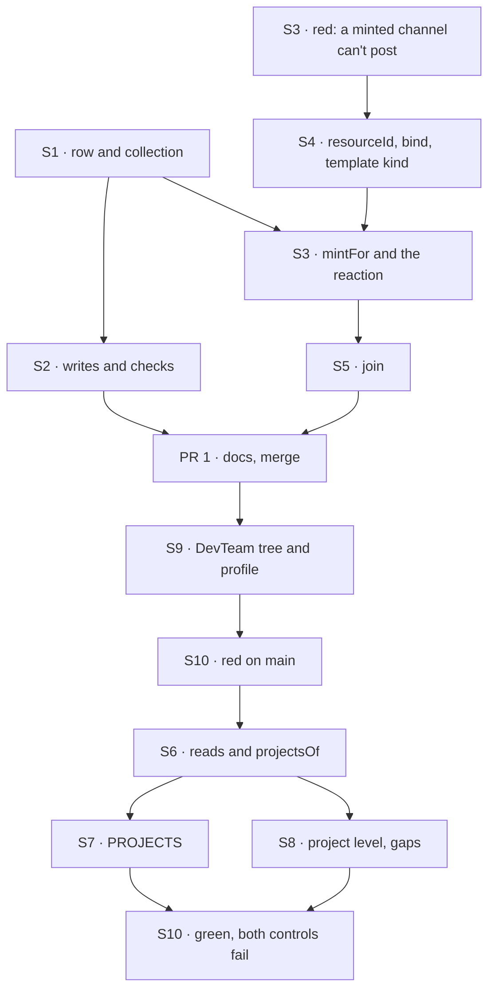

# FIX-1718 · Plan

[Spec](SPEC.md) · [Decisions](DECISIONS.md) · [Rules](BUSINESS-RULES.md) · **Plan** · [Docs](DOCS.md) · [Evolution](EVOLUTION.md)

Written for the implementing agent. IDs cross-reference [BUSINESS-RULES.md](BUSINESS-RULES.md)
(BR-n), [DECISIONS.md](DECISIONS.md) (Dn, Qn) and the epic's rules (ER-n). `tdd`. Two PRs.
**Don't start while the spec is on soft-HOLD** ([SPEC](SPEC.md)). The FIX-1728 POC
(`specs/spikes/FIX-1728/poc/resource-talk/` on `spike/FIX-1728`) is the working sketch of PR 1.

## Where it stands on `main` `1e51ab9f`

| What | Where | Today |
|---|---|---|
| Org collections a seat writes at runtime | `packages/workforce/src/roster/collections.ts:136-170`, the hire block's `roster.create` at `seat-hire-blocks.ts:229` | The precedent for `projects` |
| Tree resource modules | `workforce/org/resources/*.ts`, typed by `packages/workforce/src/resource-modules.ts` | Where `projects.ts` goes; no new folder |
| A reaction on create | `packages/core/src/types/resource-change.ts:148-161` (`reactTo.created`) | Runs inside the creating turn |
| The closed `CHANNEL.md` key list | `packages/workforce/src/channel/channel-binder.ts:81-89` | Seven keys |
| Facts built onto the kind at boot | `channel-flow.ts:1487-1493` (`withBoards`, `withRouting`, `withBoardActions`) | The seam D2 rides |
| The channel kind minted from a block | `channel-flow.ts:1378` and its session state | Can't post: state is only written by `openChannels` (the spike's R1) |
| Channels registered in the inventory | `packages/workforce/src/inventory/open-inventory.ts:296` | Only channels opened at boot |
| Shift Manager's reads | `labs/shift-manager/src/lib/reads.ts:211` (`INVENTORY_PATTERNS`), `derive.ts` (`teamsOf`) | Seats and channels |
| The project level and PROJECTS | `surfaces/Project.tsx`, `surfaces/Sidebar.tsx:173`, `gaps.ts:7-20` | Four gap entries; workstreams flat |
| The DevTeam tree and host | `goals/devforce-lab/lab/workforce/`, `host.mts:415`, `labs/shift-manager/teams/devteam/fsdev.config.mts:65` | One channel, and `channels[0]` taken as the EM's |

## Surfaces

| ID | PR | Package · role | Change | Rules |
|---|---|---|---|---|
| S1 | 1 | `workforce` · the row | The project row schema and a helper that declares the `projects` collection: org scope, shared across flows, browser read with `expose`. New fields nullable with defaults (BP-023) | BR-2 |
| S2 | 1 | `workforce` · writes | `createProject` and `setWorkstreams` blocks: `create`, never upsert; refuse `unassigned`, an id not in the inventory, and an id another row lists | BR-3 BR-4 |
| S3 | 1 | `workforce` · binder | `mintFor` joins `DECLARABLE_KEYS`. A file carrying it is a template: not opened, not registered, refused with `boards:` or an unknown collection. The binder installs `reactTo.created` on the named collection, dispatching to the template kind's `bind` keyed on the row id | BR-6 BR-7 BR-8 BR-9 |
| S4 | 1 | `workforce` · channel kind | Optional `resourceId` on session state (nullable, default null; BP-030). Internal `bind`: writes `resourceId` and appends `{ sessionId, userId }` to the row, refusing per BR-10. When `resourceId` is set, members and charter come from the template built onto the kind (`withTemplate`, beside `withBoards`), not from state | BR-10 BR-12 |
| S5 | 1 | `workforce` · `join` | Mints the caller's own talk session for a row, or returns the one they have | BR-11 |
| S6 | 2 | Shift Manager · reads | `reads.ts` reads `projects/*` once per refresh beside the inventory, into the snapshot. `projectsOf` lives in `derive.ts` beside `teamsOf` and groups from the snapshot only | BR-5 BR-15 BR-23 |
| S7 | 2 | Shift Manager · sidebar | PROJECTS draws `projectsOf` | BR-15 |
| S8 | 2 | Shift Manager · project level | Brief from the row; Stream is `talkFor(project, viewer)`: the viewer's session from `sessions`, or Join; Board is lanes of the existing Board; Workstreams lists the row's. Named states for No project and an unknown id. **Remove** the four `project*` entries from `gaps.ts` | BR-16 to BR-22 BR-24 |
| S9 | 2 | DevTeam tree and profile | Tree: `org/resources/projects.ts`, `teams/eng/channels/project-talk/CHANNEL.md` (`mintFor: projects`, members the EM), and one board-less workstream. Profile: at boot, create the two default rows if absent and call `bind` for the Lab's user. `openLab` refuses unless exactly one channel holds a board, and the profile picks that one, not `channels[0]` | Goal |
| S10 | 2 | Goal check | `goals/shift-manager/it-groups-workstreams-under-their-projects/`, built on `it-opens-a-lab`'s harness (Vite build, served profile, Chromium, `controls/` module swap). Controls `unread`, `gap-tabs` | Goal |
| S11 | 1 and 2 | Docs | [DOCS.md](DOCS.md); one `minor` changeset for `@flow-state-dev/workforce` in PR 1. Shift Manager is private: none | — |

## Sequence



## Checks

| ID | Runs after | Passes when |
|---|---|---|
| V1 | S1 S2 | Workforce spec: a duplicate id, `unassigned`, an unknown workstream and a workstream another row holds are each refused, and a refused write leaves the row unchanged; a second user in the org lists the row |
| V2 | S3 to S5 | Workforce spec, the spike's legs made real: create mints in the same turn and both sides of the link agree; outside a turn nothing mints; `join` mints and is idempotent; `bind` refuses BR-10; a minted session posts and wakes the template's members; a members edit plus restart reaches an existing talk session; the inventory has no talk row; a roster with no `mintFor:` binds as today |
| V3 | S6 to S8 | Shell specs in jsdom over a snapshot: BR-15 to BR-24; `gaps.ts` differs from `main` only in the four project entries; `projectsOf` makes no read |
| V4 | S9 | The five devforce-lab checks and `labs/shift-manager` tests pass on the new tree; a second boot on a surviving store mints nothing new |
| VG | S10 | [The goal](SPEC.md#the-goal-and-how-well-know-its-met): PASS; FAIL under `unread` and under `gap-tabs`; FAIL on `main` |

## Pinned names

| Where | Name | Why pinned |
|---|---|---|
| Collection | ref `projects`, keys `projects/<id>`, module `workforce/org/resources/projects.ts` | Read by Shift Manager and FIX-1719 |
| Row | `{ id, title, brief, status, ownerUserId, workstreams: string[], sessions: { sessionId, userId }[] }` | The appendix's contract |
| `CHANNEL.md` key | `mintFor` | What a Lab writes; the epic's one key |
| Talk state | `resourceId: string \| null` | The session side of the link |
| Entries | `bind` (internal), `join` | FIX-1719 calls them |
| No project's route id | `unassigned` (`NO_PROJECT`, unchanged) | Already shipped |
| Goal controls | `unread`, `gap-tabs` | The spec's controls |

## Guardrails

| Rule | Because |
|---|---|
| No project field in any session's state; the talk session holds `resourceId` only | Jake's fence; a session is found by one person |
| Nothing registers a talk session in `inventory/channels/*` | The Lab's channel list stays its declared channels (FIX-1415's hole) |
| `bind` and `join` take the principal from the request's verified identity, never from input | BP-031 |
| `projectsOf` derives only from the snapshot: no read of its own, and no talk session read to group | One read per refresh (tenet 5); grouping never depends on whose sessions you can see |
| Every surface groups through `projectsOf` | Two screens deriving projects their own way disagree on stale ids |
| The conversation is swappable: Shift Manager finds a project's conversation only through one function (`talkFor(project, viewer)`), and Workforce mints one only in `bind` and `join` | Q1 is open pending FIX-1729. A shared room replaces those and the *(baseline)* rules, not the row or the grouping |
| Nothing in `core` or `engine`; user isolation untouched | ER-10, ER-15. An L1 need is an escalation to the epic |
| A `CHANNEL.md` with no `mintFor:` is today, byte for byte | Every Lab on `main` (BP-035: test the off state) |
| `gaps.ts`: only the four project entries change | ER-8; FIX-1722 and FIX-1651 edit the same file |
| Published prose says seat, never worker as a noun | ER-13 |

## Sketch

```
create:  createProject(row) → projects.create(id, row)
         → reactTo.created → dispatcher{ key: row.id } → talk kind.bind
         → talk.state.resourceId = id; row.sessions += { sessionId, userId }
default: profile boot → row absent? create it, then bind for the Lab's user
read:    snapshot.projects + snapshot.inventory → projectsOf → { projects, noProject }
stream:  row.sessions.find(userId === viewer) ?? Join → the existing Stream component
```

**POC:** none of this issue's. The model rests on FIX-1728's, which ran and is cited in
[Settled](DECISIONS.md#settled).

## At implement time

- FIX-1722's PR #2621 edits `gaps.ts`, `reads.ts`, `derive.ts`, `routes.ts` and `Sidebar.tsx`.
  Sequence PR 2 after it, or rebase keeping its entries.
- Appending to `sessions` needs a concurrency check: two joins at once were never tested.
- The minted session is a child of the session whose turn created the row, and outlives it.
- The devforce-lab checks refuse a lab file that spells their held-out feature. Name the new
  workstream and template without it.
- `apps/docs/docs/workforce/channels.md:53` says six keys; the code has seven. It becomes eight.
- Re-read the epic's D2, D3 and ER-3 once #2622's rewrite merges, and match its wording.

## Notes from review

- Cursor: keep project grouping in one home. Applied: fetch in `reads.ts`, group in `derive.ts`.
- Cursor: `projectsOf` must not read again. Applied as a guardrail and in V3.

## Follow-ups

- A shared room per project, if FIX-1729 lands on it (Q1). The swap points are `talkFor`, `bind` and `join`.
- A workstream collection, if workstreams need data of their own (D1's flip).
- Editing a project after create; a Linear pointer on the row.
