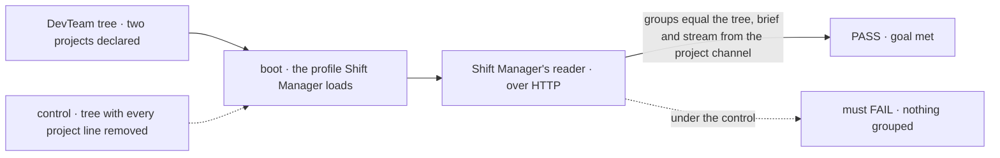
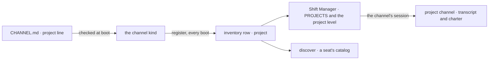

# FIX-1718 · Projects in Shift Manager: workstreams grouped under a project, read from the Lab's own tree

**Spec** · [Decisions](DECISIONS.md) · [Rules](BUSINESS-RULES.md) · [Plan](PLAN.md) · [Docs](DOCS.md) · [Evolution](EVOLUTION.md)

## Who feels this, before and after

| Someone who… | Today | After |
|---|---|---|
| **runs a Lab in Shift Manager** | PROJECTS lists every workstream on its own, and a project's four tabs are empty states that say "arrives with FIX-1650" | Each workstream sits under the project it belongs to. A project's Stream, Board, Workstreams and Brief show that project's own conversation, rows, workstreams and brief |
| **writes a Lab's tree** | Has nowhere to say which workstreams make up a project | Declares the project as a channel, whose body is the brief, and adds one line, `project: <channel id>`, to each workstream's `CHANNEL.md` |
| **has a Lab that declares no project** | — | Changes nothing. Every workstream is listed under **No project**, and the Lab starts as it does today ([D3](DECISIONS.md#d3)) |
| **mistypes the project a workstream names** | — | The Lab refuses to start, naming the channel and the link that doesn't resolve ([D2](DECISIONS.md#d2)) |
| **is a seat looking for a project's channel** (the chief of staff, once FIX-1719 ships) | `discover` lists channels with nothing to say which belong together | `discover` names each channel's project, so a seat finds a project the way a person does |
| **builds another Shift Manager screen** (FIX-1722, FIX-1723, FIX-1651) | Has no project to group by | Reads `project` on the workstream the shared reader already returns ([appendix](BUSINESS-RULES.md#appendix--downstream-reads)) |

Jake answered the epic's Q1 on 2026-10-01: a project is a channel of its own. He then fenced
how: the channel is a durable record everyone in the Lab can find, a session is someone's live
handle onto it, and there is no project store beside channels (epic Q1, as amended on #2622).
Here the declared channel is that record, and what a project is reaches everyone through the
org-scoped inventory row, never through a session: a channel's session is bound to the user it
was opened for. Sessions per participant, and a project resource of its own, wait on Jake
([Not here](#not-here)).

## The goal, and how we'll know it's met

**A person opening Shift Manager on a Lab finds each workstream under the project its own
`CHANNEL.md` names, and each project's Stream, Board, Workstreams and Brief come from that
project's declared channel, with nothing new in Layer 1, no project folder and no store beside
channels.**

| Is it the right goal? | |
|---|---|
| **The real need** | "Workstreams grouped under a project, read from the Lab's own tree" (the issue's title), filling the project level FIX-1662 drew empty, under Jake's answer and fence on Q1 |
| **Smaller, and rejected** | "PROJECTS groups by a key." It renders a tree, and the project's Stream and Brief stay empty, which is the half a person uses |
| **Bigger, and not this issue's** | [Not here](#not-here): board contents, the chief of staff joining, runtime channel admin, per-participant sessions, a project resource of its own |
| **Not done if** | A project needs a folder, a type or a store of its own · a Lab with no `project:` line fails to start or loses a workstream · any project tab still shows "arrives with FIX-1650" · a project's Stream shows a workstream's conversation, or the reverse · an edit to `project:` never reaches the screen after a restart |



The check compares what the reader groups against what the canonical tree declares, so the
control's stripped tree must fail it.

| How we verify | |
|---|---|
| **Goal check** | `goals/shift-manager/it-groups-workstreams-under-their-projects/` · no model: nothing here is a model's turn · run by the implementer at completion · verdict in the implementation PR |
| **Signal** | Through Shift Manager's own reader over HTTP: at least two projects, and every workstream under exactly the project its `CHANNEL.md` names; each project's Brief equals its `CHANNEL.md` body; a line posted on the project's Stream is in the project channel's transcript and in no workstream's; no project gap copy is reachable. `discover` is proved by its spec (PLAN V3): no DevTeam seat holds it until FIX-1719 |
| **Input** | The DevTeam profile (`labs/shift-manager/teams/devteam`), its tree carrying two project channels and their workstreams (PLAN S8), a fresh store |
| **Anti-game** | Expected groups are read from the canonical tree, never written in the check. No row seeded by hand. The post goes through the channel's `post` action, as the composer sends it |
| **Control that must fail** | `GOAL_CONTROL=unlinked`: the profile boots a copy of the tree with every `project:` line removed; "every workstream under its project" FAILS, all under No project. Today's `main` FAILS: rows carry no project |

## What changes

![Before: a channel's CHANNEL.md says nothing about a project; its inventory row holds id, kind and members; Shift Manager lists every workstream under PROJECTS and shows the project level's four tabs as empty states. After: a workstream's CHANNEL.md names its project channel, checked at boot; the row also names that project; Shift Manager groups workstreams under projects, fills the four tabs from the project channel, and lists channels nobody links under No project; discover names each channel's project](figures/what-changes.svg)

The left half is today. On the right, the tree gains one line and the row one field.

**What a Lab writes:**

```diff
  teams/eng/channels/
+   storefront/CHANNEL.md        # a project: its body is the brief
    feature/CHANNEL.md
      ---
      description: Where this team talks about the feature it is building.
      members: [eng.em, eng.coder, eng.reviewer]
      boards: [work]
+     project: eng.storefront
      ---
```

**What a channel's inventory row carries** (`inventory/channels/<channelId>`):

```diff
  { id: "eng.feature", kind: "channel", members: [...], openedAt: "…",
+   project: "eng.storefront" }      # null when the CHANNEL.md names none, or on an older row
```

## How a project reaches the screen



The project is written from the trusted tree at boot, never from a request.

## What stays as it is

- Channels stay declared on disk and opened at boot. A project is a `CHANNEL.md` and a restart.
- A channel is still a session at its own id, opened for the Lab's user and bound to them, with
  its members and its charter. User isolation is unchanged.
- The workstream level and the shell's frame, `/p/<id>/<tab>` included. Of `gaps.ts`, only
  the four project entries are replaced ([ER-8](../../epics/FIX-1650/BUSINESS-RULES.md#what-no-child-may-do)).
- `@flow-state-dev/core` and `@flow-state-dev/engine`: no change.

<a name="not-here"></a>
## Not here

| What | Owner |
|---|---|
| A session per participant, linked to its channel | A separate follow-up, on Jake's call (asked 2026-10-01). Not designed here |
| An org-scoped project resource of its own, as boards and the seat inventory are, and project data that changes at runtime: status, membership edits | Pending Jake (asked 2026-10-01). Every project read here goes through one module, so that swap replaces it and nothing else (PLAN S5) |
| What sits on a workstream's board, its progress and results | FIX-1651 |
| The chief of staff joining a project's channel and posting there | FIX-1719, by being a `members:` entry on the project channel (BR-16) |
| Opening, retiring or inviting to a channel at runtime | Parked ([epic D3](../../epics/FIX-1650/DECISIONS.md#d3)) |
| Channels declared under `org/channels/` | A follow-up; a project channel sits in a team's `channels/` today |

## Sign off

**[The goal](#the-goal-and-how-well-know-its-met), at that size:** grouping and all four
project tabs filled from the project's declared channel. If wrong: we ship a tree that groups
and a project level that still reads nothing.

1. **[D1](DECISIONS.md#d1) · The declared channel is the project's record; its inventory row
   publishes the project on every boot.** If wrong: an edit waits for a restart, and one stored
   field is carried forward.
2. **[D2](DECISIONS.md#d2) · One level, checked at start: a broken link stops the Lab, by
   name.** If wrong: a typo costs a failed start where a quiet misgrouping would have run.
3. **[D3](DECISIONS.md#d3) · A workstream that names no project sits under No project.** If
   wrong: a pseudo-project in the tree that some Labs never leave.

**Open: none.** D1 is the one to weigh: it is where Jake's fence lands. The cases:
[BUSINESS-RULES.md](BUSINESS-RULES.md). Engineering calls: [DECISIONS.md](DECISIONS.md#decided-not-asked).

Feature · `@flow-state-dev/workforce` (L2) + Shift Manager + the DevTeam tree + docs · medium ·
2 PRs · child of epic [FIX-1650](../../epics/FIX-1650/SPEC.md) · blocked by nothing
