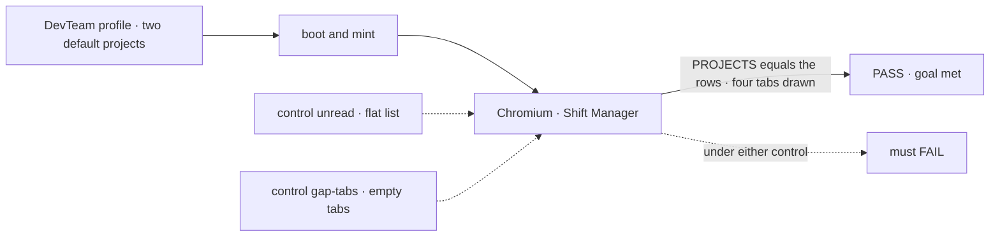
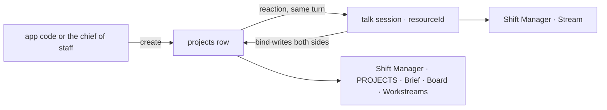

# FIX-1718 · Projects in Shift Manager: workstreams grouped under a project the Lab creates

**Spec** · [Decisions](DECISIONS.md) · [Rules](BUSINESS-RULES.md) · [Plan](PLAN.md) · [Docs](DOCS.md) · [Evolution](EVOLUTION.md)

> **Direction draft, on soft-HOLD.** Rewritten onto the model the
> [FIX-1728 spike](https://github.com/fixpoint-labs/flow-state-dev/pull/2629) proved, after
> Jake's [HOLD](https://github.com/fixpoint-labs/flow-state-dev/pull/2625#issuecomment-5939811709)
> on the earlier "a project is a declared channel" draft. Jake has since confirmed FIX-1650
> ships projects now ([Q2](DECISIONS.md#q2)). Whether people share one room per project is open
> pending the [FIX-1729](https://linear.app/fixpoint-labs/issue/FIX-1729) spike; this spec builds a conversation per person as the baseline, and
> keeps the conversation parts swappable ([Q1](DECISIONS.md#q1)).
> It merges only after the epic amendment
> ([#2622](https://github.com/fixpoint-labs/flow-state-dev/pull/2622), being rewritten to the
> same model) lands and Jake clears the HOLD. [FIX-1727](https://linear.app/fixpoint-labs/issue/FIX-1727)'s
> "a project is a channel" language is stale. FIX-1728 is the source.

## Who feels this, before and after

| Someone who… | Today | After |
|---|---|---|
| **runs a Lab in Shift Manager** | PROJECTS lists every workstream on its own. A project's four tabs are empty states that say "arrives with FIX-1650" | Each project the Lab holds is listed with its workstreams beneath it. Its Stream is their own conversation about the project, and its Board, Workstreams and Brief show that project's work |
| **builds a Lab** | Has no project to create | Ships default projects from the app's own code, or lets the chief of staff create them at runtime (FIX-1719). The shape of a project's conversation is one `CHANNEL.md` marked `mintFor: projects` |
| **has a Lab with no projects** | — | Changes nothing. Every workstream is listed under **No project** ([D3](DECISIONS.md#d3)) |
| **is a second person in the same Lab** | — | Sees every project, and gets a conversation of their own by joining. The baseline; a shared room is open ([Q1](DECISIONS.md#q1)) |
| **builds another Shift Manager screen** (FIX-1722, FIX-1723, FIX-1651) | Has no project to group by | Reads the project rows the shared reader already returns ([appendix](BUSINESS-RULES.md#appendix--downstream-reads)) |

Jake's direction (2026-10-01): a project is data the organization owns, usually created by the
chief of staff or pointing at a Linear project. It isn't a declared channel. Talking about a
project happens in a conversation minted from a template when the project is created.

## The goal, and how we'll know it's met

**A person opening Shift Manager on a Lab finds every project the Lab holds, each with the
workstreams its record names, and each project's Stream, Board, Workstreams and Brief show that
project's work. Nothing new in Layer 1, no project folder, no project field in anyone's session,
and the Lab's channel list stays the channels its tree declares.**

| Is it the right goal? | |
|---|---|
| **The real need** | The issue's title, under Jake's direction: grouping, plus the project level FIX-1662 drew empty |
| **Smaller, and rejected** | "PROJECTS groups by a field." It draws a tree, and leaves Stream and Brief empty: the half a person uses |
| **Bigger, and not this issue's** | [Not here](#not-here): a thread several people share, the chief of staff's tools, editing a project after it's created, Linear sync |
| **Not done if** | Any project tab still shows "arrives with FIX-1650" · a Lab with no projects fails to start or loses a workstream · a talk session shows up in the channel inventory · a project's data is read from a session · the screens show anything a fresh read of the rows wouldn't |



| How we verify | |
|---|---|
| **Goal check** | `goals/shift-manager/it-groups-workstreams-under-their-projects/`, built like `it-opens-a-lab`: Shift Manager is built with Vite and served over the DevTeam profile, then Chromium walks it. No model, out of CI. The implementer runs it, and the verdict goes in the implementation PR |
| **Signal** | Rendered in the browser, graded against the store read by the check's own requests: PROJECTS equals the `projects` rows, each with exactly the workstreams its row names, then No project. For every project, **all four tabs** open: Brief equals the row's brief, a line posted in Stream is in the viewer's talk session and in no other, Board draws a lane per board-holding workstream, and Workstreams lists the row's. No gap copy is reachable. The channel inventory equals the tree's declared channels: no talk session among them |
| **Input** | The DevTeam profile with its two default projects ([PLAN S9](PLAN.md#surfaces)), a fresh store |
| **Anti-game** | Expected projects come from the store, never from the check. The rows are written by the profile's own code through the same entry the chief of staff will use. The post goes through the composer |
| **Controls that must fail** | `GOAL_CONTROL=unread` swaps the project reader for the flat list on `main`, so PROJECTS fails. `GOAL_CONTROL=gap-tabs` swaps the project level for `main`'s, so the four-tab leg fails. Today's `main` fails both |

## What changes

![Before: CHANNEL.md says nothing about a project, the inventory row holds id, kind and members, PROJECTS lists every workstream flat, and the project level is four empty states. After: an org collection holds project rows with title, brief, workstreams and talk sessions; one CHANNEL.md marked mintFor projects is a template, not a channel; creating a row mints the creator's talk session, which holds only the project's id; PROJECTS groups workstreams by the rows, the four tabs fill from the row and your talk session, and the inventory is unchanged](figures/what-changes.svg)

On the left, today. On the right, a new collection of rows, one template, and a talk session
per person that points back at its row.

**What a project row holds** (`projects/<id>`, org-scoped, readable by the browser):

```diff
+ { id: "storefront", title: "Storefront rebuild", brief: "Ship the new checkout…",
+   status: "active", ownerUserId: "…",
+   workstreams: ["eng.feature"],                  # declared channels; one project each
+   sessions: [{ sessionId: "dsx_…", userId: "…" }] }  # each person's talk session
```

**What a Lab writes, once:**

```diff
  teams/eng/channels/
+   project-talk/CHANNEL.md     # mintFor: projects · a template: never opened at boot
    feature/CHANNEL.md          # unchanged
```

## How a project reaches the screen



The row is the only home of a project's data. The talk session holds one field, the row's id.

## What stays as it is

- Declared channels are opened at boot and registered in the inventory as today. A workstream is
  still a declared channel with its kind and boards (ER-2). The inventory row is unchanged.
- Sessions stay bound to the person who opened them. User isolation is unchanged.
- The shell's frame, `/p/<id>/<tab>` included. In `gaps.ts`, only the four project entries are
  replaced ([ER-8](../../epics/FIX-1650/BUSINESS-RULES.md#what-no-child-may-do)).
- `@flow-state-dev/core` and `@flow-state-dev/engine`: no change.

<a name="not-here"></a>
## Not here

| What | Owner |
|---|---|
| One room several people share about a project | Open, pending [FIX-1729](https://linear.app/fixpoint-labs/issue/FIX-1729) ([Q1](DECISIONS.md#q1)). The conversation parts are swappable (PLAN guardrails) |
| The chief of staff creating projects, assigning workstreams, joining | FIX-1719, through the entries this issue ships |
| Editing a project after it's created, other than its workstreams; a Linear pointer on the row | A follow-up once FIX-1719 says what it changes |
| What sits on a board, its progress and results | FIX-1651 |
| Retiring, inviting to or renaming a conversation at runtime | Parked (FIX-1341's lane; epic D3 as amended) |
| A workstream as a row of its own | The spike's open wall: a second `mintFor:` template over a `workstreams` collection |

## Sign off

**[The goal](#the-goal-and-how-well-know-its-met), at that size:** grouping plus all four
project tabs, proved in a browser. If wrong: a project level that draws but never shows a
person anything they'd use.

1. **[D1](DECISIONS.md#d1) · A project's row lists its workstreams.** If wrong: one more
   field to move if workstreams become rows of their own.
2. **[D2](DECISIONS.md#d2) · A talk session stores only its link.** Members and charter come from
   the template at every start. If wrong: a Lab can't freeze one project's members.
3. **[D3](DECISIONS.md#d3) · A workstream no project names sits under No project.** If wrong:
   a pseudo-project some Labs never leave.

**Open:** [Q1](DECISIONS.md#q1), per-person conversations or a shared room, pending
[FIX-1729](https://linear.app/fixpoint-labs/issue/FIX-1729); per person is the baseline. **Decided by Jake:** [Q2](DECISIONS.md#q2), projects
ship inside FIX-1650.

Feature · `@flow-state-dev/workforce` (L2) + Shift Manager + the DevTeam profile + docs ·
medium · 2 PRs · child of epic [FIX-1650](../../epics/FIX-1650/SPEC.md) · blocked by #2622's
rewrite merging, and Jake clearing the HOLD
