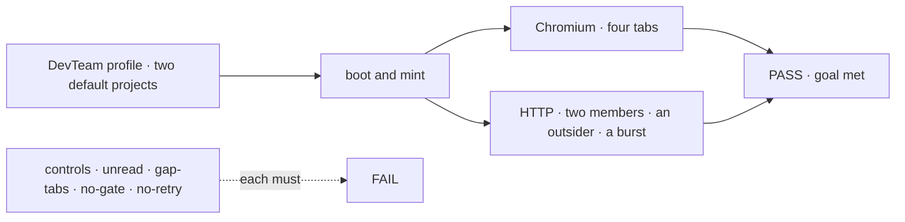
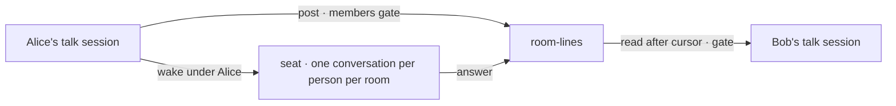

# FIX-1718 · Projects in Shift Manager: workstreams grouped under a project, and the project's room

**Spec** · [Decisions](DECISIONS.md) · [Rules](BUSINESS-RULES.md) · [Plan](PLAN.md) · [Docs](DOCS.md) · [Evolution](EVOLUTION.md)

> **Direction draft, on soft-HOLD.** This is written onto two spikes:
> - [FIX-1728](https://github.com/fixpoint-labs/flow-state-dev/pull/2629): a project is an org
>   row, with a conversation minted from a template.
> - [FIX-1729](https://github.com/fixpoint-labs/flow-state-dev/pull/2632): that conversation is
>   one room per project, stored on the project.
>
> Jake decided that FIX-1650 ships projects now ([Q2](DECISIONS.md#q2)). Two calls are on his
> cards, and this spec is written to the recommendation for both:
> - a shared room now ([Q1](DECISIONS.md#q1));
> - only members read it ([Q3](DECISIONS.md#q3)).
>
> It merges only after the epic amendment
> ([#2622](https://github.com/fixpoint-labs/flow-state-dev/pull/2622), getting the same fold)
> lands and Jake clears the
> [HOLD](https://github.com/fixpoint-labs/flow-state-dev/pull/2625#issuecomment-5939811709).
> [FIX-1727](https://linear.app/fixpoint-labs/issue/FIX-1727)'s "a project is a channel" is
> stale.

## Who feels this, before and after

| Someone who… | Today | After |
|---|---|---|
| **runs a Lab in Shift Manager** | PROJECTS lists every workstream on its own. A project's four tabs are empty states that say "arrives with FIX-1650" | Each project is listed with its workstreams beneath it. Its Stream is the project's room, and its Board, Workstreams and Brief show its work |
| **is one of a project's members** | — | Reads and posts in the same room as the other members. The project's seats answer there, for everyone. Other members' lines arrive the next time the view reads, not live |
| **is in the Lab but not a member** | — | Sees that the project exists, and no conversation ([Q3](DECISIONS.md#q3)) |
| **builds a Lab** | Has no project to create | Ships default projects from the app's own code, or lets the chief of staff create them (FIX-1719). One `CHANNEL.md` marked `mintFor: projects` names the seats a room wakes |
| **has a Lab with no projects** | — | Changes nothing. Every workstream is listed under **No project** ([D3](DECISIONS.md#d3)) |
| **builds another Shift Manager screen** (FIX-1722, FIX-1723, FIX-1651) | Has no project to group by | Reads the project rows the shared reader already returns ([appendix](BUSINESS-RULES.md#appendix--downstream-reads)) |

## The goal, and how we'll know it's met

**A person opening Shift Manager on a Lab finds every project the Lab holds, each with the
workstreams its record names. Each project's four tabs show that project's work, and its Stream
is one room its members share and nobody else reads. The design adds nothing to Layer 1, no
project folder, no project field in anyone's session, and no talk session in the channel list.**

| Is it the right goal? | |
|---|---|
| **The real need** | The issue's title, under Jake's direction: grouping, plus the project level FIX-1662 drew empty, with a conversation the project's people share |
| **Smaller, and rejected** | A private thread per person. It's smaller now, but moving to a room later leaves the old lines private (FIX-1729, fork 1) |
| **Bigger, and not this issue's** | [Not here](#not-here): live push, unread counts, invites, the chief of staff's tools, Linear sync |
| **Not done if** | Any of these: <br/>· a project tab still shows "arrives with FIX-1650" <br/>· a Lab with no projects fails to start <br/>· a non-member reads or posts a room <br/>· a burst of posts loses one <br/>· a talk session shows up in the channel inventory <br/>· project data is read from a session |



| How we verify | |
|---|---|
| **Goal check** | `goals/shift-manager/it-groups-workstreams-under-their-projects/`, built like `it-opens-a-lab`. No model, out of CI. The implementer runs it, and the verdict goes in the implementation PR |
| **Signal · screens** | Chromium walks the built Shift Manager over the DevTeam profile, graded against the store. PROJECTS equals the `projects` rows, each with exactly the workstreams it lists, then No project. For every project, **all four tabs** open: <br/>· Brief equals the row's brief <br/>· a line posted in Stream is in `room-lines` <br/>· Board draws a lane per board-holding workstream <br/>· Workstreams lists the row's workstreams <br/>· no gap copy is reachable |
| **Signal · room** | Over HTTP as three verified users: <br/>· two members, each through their own talk session, read each other's lines by cursor <br/>· a seat's answer is in the room for both <br/>· the outsider's `read` and `post` are refused, even from a session it created with the project's `resourceId` in its state <br/>· two members post a parallel burst, and every post lands <br/>· the channel inventory equals the tree's declared channels |
| **Input** | The DevTeam profile ([PLAN S12](PLAN.md#surfaces)), with its two default projects and three bearer users, on a fresh store |
| **Anti-game** | Expected values come from the store, never from the check. Rows are written by the profile's own code, through the entries the chief of staff will use. Posts go through the composer and the talk session |
| **Controls that must fail** | Today's `main` fails all of these: <br/>· `unread`: the project reader becomes `main`'s flat list, so PROJECTS fails <br/>· `gap-tabs`: the project level becomes `main`'s, so the four-tab leg fails <br/>· `no-gate`: the membership check is removed, so the outsider leg fails <br/>· `no-retry`: the room's sequence retry is removed, so the burst loses a post |

## What changes


On the left, today. On the right, two org collections and one template. Each person reaches
the shared room through a talk session of their own.

```diff
+ projects/storefront   { id, title, brief, status, ownerUserId,
+                         members: ["alice", "bob"],          # who reads and posts the room
+                         workstreams: ["eng.feature"],       # declared channels; one project each
+                         sessions: [{ sessionId, userId }] } # each member's talk session
+ room-lines/storefront/… { projectId, seq, userId, author, body }   # created, never edited
+ room-seq/storefront     { next }                                   # the counter, alone
  teams/eng/channels/
+   project-talk/CHANNEL.md   # mintFor: projects · a template: never opened at boot
```

## How a line reaches every member



Nobody's session is shared. The room is org data, and the gate is the project row.

## What stays as it is

- Declared channels are opened at boot and registered in the inventory as today. A workstream is
  still a declared channel with its kind and boards (ER-2). The inventory row is unchanged.
- Sessions stay bound to the person who opened them. User isolation is unchanged.
- The shell's frame, `/p/<id>/<tab>` included. In `gaps.ts`, only the four project entries are
  replaced ([ER-8](../../epics/FIX-1650/BUSINESS-RULES.md#what-no-child-may-do)).
- `@flow-state-dev/core` and `@flow-state-dev/engine`: no change.

<a name="not-here"></a>
## Not here

| What | Owner |
|---|---|
| Other members' lines arriving live | The spike's open wall. In v1 the view reads on open, on focus and after its own post's wake |
| Unread counts and a stored read cursor | Out. Shift Manager has no Unread surface today, so the cursor lives in the open view only |
| Inviting someone to a project | A follow-up, written by trusted code. In v1 `members` is set when the row is created |
| A conversation that belongs to no single person: a shared session, or one seat memory per room | Rejected by FIX-1729 (option A); an engine auth change |
| The chief of staff creating projects, setting workstreams and members | FIX-1719, through the entries this issue ships |
| Editing a project after create, beyond its workstreams; a Linear pointer | A follow-up |
| What sits on a board | FIX-1651 |
| Retiring or renaming a room | Parked (FIX-1341's lane; epic D3 as amended) |
| One transcript home for channels and rooms | Flagged for `audit-coherence`: channels keep items, rooms keep rows |

## Sign off

**[The goal](#the-goal-and-how-well-know-its-met), at that size:** grouping, all four tabs, and
a members-only shared room, proved in a browser and over HTTP. If wrong, there are two ways it
fails. A project level that draws, but shows nothing a person would use. Or a room an outsider
can read.

1. **[D1](DECISIONS.md#d1) · A project's row lists its workstreams.** If wrong: one field to
   move if workstreams become rows of their own.
2. **[D2](DECISIONS.md#d2) · A talk session stores only its link.** Its seats come from the
   template at every start, and its lines come from the room. If wrong: a Lab can't give one
   project different seats.
3. **[D3](DECISIONS.md#d3) · A workstream no project lists sits under No project.** If wrong:
   a pseudo-project some Labs never leave.

**On Jake's cards, written to the recommendation:** [Q1](DECISIONS.md#q1), a shared room now;
[Q3](DECISIONS.md#q3), members only. **Decided by Jake:** [Q2](DECISIONS.md#q2), projects ship
inside FIX-1650.

Feature · `@flow-state-dev/workforce` (L2) + Shift Manager + the DevTeam profile + docs ·
medium-large · 3 PRs · child of epic [FIX-1650](../../epics/FIX-1650/SPEC.md) · blocked by
#2622's rewrite merging, and Jake clearing the HOLD
