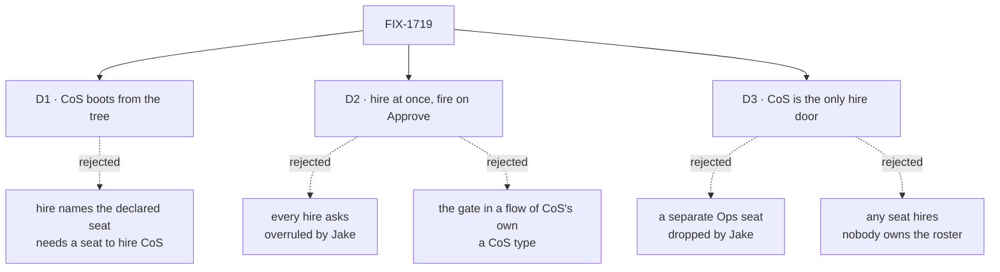

# FIX-1719 · Decisions

[Spec](SPEC.md) · **Decisions** · [Rules](BUSINESS-RULES.md) · [Plan](PLAN.md) · [Docs](DOCS.md) · [Evolution](EVOLUTION.md)

What was considered, what was chosen, why, and what each choice locks in. Three decisions are
the sign-off surface. The hire policy is Jake's answer to the epic's
[Q2](../../epics/FIX-1650/DECISIONS.md#q2) (#2602, comment 5937962361). The seat set (CoS only,
no Ops) is his later call, relayed on #2613 (comment 5939127612) and being confirmed with him
directly.

## The tree

Solid edges are what you're signing. Dashed edges lost, and the label says why.

## D1 · CoS exists because the tree declares it: booted at start like team seats, never hired at runtime

| | |
|---|---|
| **Instead of** | `hire` naming a declared seat: the seat-hire input points at `org/workers/chief-of-staff/`, reads its `WORKER.md` and writes a roster row |
| **Because** | A declared seat already has a path to running: the reader lists it and the seat factory boots it. Team seats work that way today. The org reader passes over `org/workers/` and the id needs a team ([epic, settled](../../epics/FIX-1650/DECISIONS.md#decided-in-review-recorded-so-no-child-reopens-them)), so the change is the reader and a teamless id, nothing else. The other half has three costs: CoS is the hirer, so something else would have to hire it first; a roster row copies a file that keeps changing, so the two drift or reload re-reads the file; and the hire blocks run in the browser-safe package root, which can't read files. Opt-in stays a document: the file is the opt-in ([ER-6](../../epics/FIX-1650/BUSINESS-RULES.md#what-a-team-gets-and-what-it-doesnt)). `org/workers/` stays a declaration path, never a hire cell ([ER-7](../../epics/FIX-1650/BUSINESS-RULES.md#what-a-team-gets-and-what-it-doesnt)) |
| **Locks in** | An org seat's id is its folder name, with no dot, so it can't collide with a team seat (`<team>.<name>`) or a hired one (`<org>.<seatId>`). CoS changes by editing its file and restarting, like any declared seat. `fire` refuses it, and every declared seat, with the message it already gives |

It comes down to who starts CoS: hiring it at runtime needs a hirer that isn't CoS.

**What would change my mind:** a Lab that must add CoS to a running deployment with no restart.
Then `hire` gains a declared-seat input on top of this, not instead of it.

## D2 · CoS hires without asking; every fire and repair waits for Approve in Inbox; hire approval is one list entry away

| | |
|---|---|
| **Instead of** | Every hire and fire asked, as the epic recommended and ER-4 still reads · or the gate written in a flow of CoS's own |
| **Because** | Jake's answer. A hire is cheap to undo and visible at once in TEAMS; a fire ends a seat's work, so the person decides it ([ER-20](../../epics/FIX-1650/BUSINESS-RULES.md#what-a-team-gets-and-what-it-doesnt)). The gate sits on the hire capability's tools, as an option naming which changes ask first. Not in the hire blocks, because an admin action mounts those directly and is already a person's act, and FIX-1621 keeps its blocks ungated for the same reason. Not in CoS's flow, because CoS is the built-in agent kind and a flow of its own is a CoS type ([ER-11](../../epics/FIX-1650/BUSINESS-RULES.md#what-no-child-may-do)). The ask is the stock `human_approval` suspension Inbox already renders; a tool that suspends inside a model's turn resumes there and turns Deny into a result the model reads (FIX-814) |
| **Locks in** | The option defaults to nothing asked, so every app on the capability today is unchanged. The DevTeam Lab passes `["fire"]`. FIX-1621's `rehire` always asks ([ER-5](../../epics/FIX-1650/BUSINESS-RULES.md#what-a-team-gets-and-what-it-doesnt)), whatever the list says. A verb that asks, in an app without durable execution, is refused by name, never run unasked |

It comes down to Jake's answer: hiring is the step he wants without a click.

**What would change my mind:** CoS hiring seats nobody wanted. Then the Lab adds `hire` to the
list, a one-line change, and no seat already hired changes.

## D3 · CoS is the only seat that hires or fires; another seat that wants a hire messages CoS, and CoS decides

| | |
|---|---|
| **Instead of** | A separate Ops seat holding hire and fire beside CoS, as the epic recommended · or any seat a Lab chooses holding the hire tools |
| **Because** | Jake: "we probably don't need Ops; CoS has hire; other workers ask CoS and it decides." One seat that knows the roster is one place a person looks and one place a request lands. A seat's request needs no new mechanism: CoS has a door, and a message to it is the request. The rule is enforced where tools already are fenced: the hire tools reach only a seat whose `tools:` names them, and the DevTeam tree names them on CoS alone |
| **Locks in** | The person's point of contact also changes the roster, so CoS's brief carries both jobs. Firing still asks the person, so CoS never ends a seat alone. A Lab can still write `tools: [hire]` on another seat; that is the Lab's call, and the docs say the convention is CoS only |

It comes down to Jake's call: one admin seat, and everyone else asks it.

**What would change my mind:** CoS's turns getting crowded by roster work so the person can't get
a straight answer. Then hiring moves to a second seat, as its own issue.

## Decided, not asked

- **Two PRs.** PR 1 boots org seats (reader, teamless id, the published-tree row) and needs
  nothing from FIX-1621. PR 2 carries `askBefore`, the CoS template, the DevTeam profile and the
  goal check, and waits on FIX-1621, because fire must go through its one remove path ([ER-19](../../epics/FIX-1650/BUSINESS-RULES.md#what-a-team-gets-and-what-it-doesnt)).
- **Org seat ids are the bare folder name.** `org/workers/chief-of-staff/` is `chief-of-staff`.
  The published document address `workers/<worker>/<name>` already uses it.
- **An `org/workers/<name>/` folder with no `WORKER.md` is reported**, as it is under a team. The
  docs example with `org/workers/build/resources/` gains its `WORKER.md`.
- **An org seat reads org-level skills, packages and references, then its own.** No team level,
  and no `TEAM.md` instructions.
- **CoS holds `discover`, posting to channels, `hire` and `fire`.** It joins no project: it posts
  to each project's room by being on FIX-1718's default template's `members:` ([ER-1](../../epics/FIX-1650/BUSINESS-RULES.md#what-a-team-gets-and-what-it-doesnt)).
- **CoS hires only kinds the Lab registers**, through the capability's existing `allowKinds`.
- **CoS's `tools:` name FIX-1621's `brokenSeats` and `rehire` (`rehire` gated always)**, so an
  orphan is listed with its reason and repaired through the same door.
- **The template id is `chief-of-staff`.** Pinned so the screens can find it.
- **The DevTeam profile moves to a store that survives a restart** and reloads hired seats at
  boot, as kitchen-sink does; it starts fresh today.

## Considered and dropped

| Alternative | Why not |
|---|---|
| CoS in a `teams/org/` team | No loader change, and forks the locked tree. The epic rejected it |
| Boot CoS in every Lab | Gives a seat to Labs that never asked. The epic and Jake: opt-in |
| A "request a hire" tool or queue for other seats | A second channel for what a message to CoS already carries |
| A cap on how many seats CoS may hire | Not asked for; `allowKinds` and the switch in D2 cover the risk Jake took on |
| A shift or slot field on the seat row | FIX-1723 derives both from existing state |

## Settled

- **An org seat can't be hired on `main`** — **REFUTED**, read-based, recorded on the epic
  ([Decided in review](../../epics/FIX-1650/DECISIONS.md#decided-in-review-recorded-so-no-child-reopens-them)).
- **Every reader that splits a seat id on a dot is listed** — **CONFIRMED** on `main`
  `70ceb5df` by [`poc/id-readers/check.mjs`](poc/id-readers/check.mjs): eight sites, three
  in scope, one seam for FIX-1723. Its planted control fails.
- **Fire through CoS fits FIX-1621** — read against its merged spec: its D1 makes `fire` itself
  the one remove path (roster row, address, inventory row) with no gate in the blocks, and
  leaves the ask to this issue. CoS's gated `fire` tool calls that block on Approve.

## How it got here

- **Draft** — framed as the epic's Q2 as Jake answered it: org seats boot from the tree with a
  teamless id, Ops hires at once and fires behind a stock approval set on the hire
  capability, two PRs with only the second waiting on FIX-1621.
- **Pivot: one org admin seat** — Ops dropped; CoS holds hire and fire and other seats ask it by
  message, because Jake decided CoS alone owns hire (#2613, comment 5939127612). The PR split
  moved to the engineering calls to keep three sign-off decisions.

**Open: none.**
