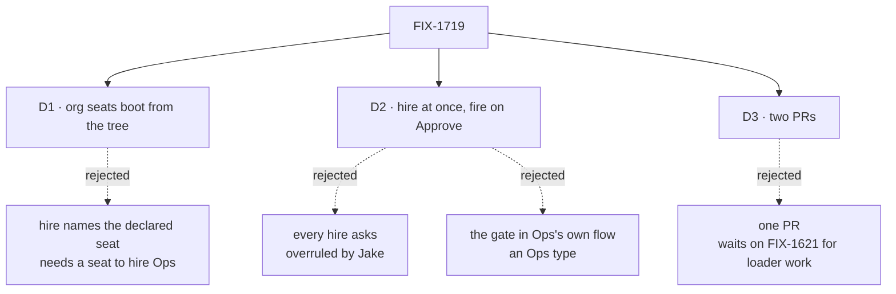

# FIX-1719 · Decisions

[Spec](SPEC.md) · **Decisions** · [Rules](BUSINESS-RULES.md) · [Plan](PLAN.md) · [Docs](DOCS.md) · [Evolution](EVOLUTION.md)

What was considered, what was chosen, why, and what each choice locks in. Three decisions are
the sign-off surface. The seat set and the hire policy are Jake's answer to the epic's
[Q2](../../epics/FIX-1650/DECISIONS.md#q2) (#2602, comment 5937962361), carried here, not
reopened.

## The tree

Solid edges are what you're signing. Dashed edges lost, and the label says why.

## D1 · CoS and Ops exist because the tree declares them: booted at start like team seats, never hired at runtime

| | |
|---|---|
| **Instead of** | `hire` naming a declared seat: the seat-hire input points at `org/workers/ops/`, reads its `WORKER.md` and writes a roster row |
| **Because** | A declared seat already has a path to running: the reader lists it and the seat factory boots it. Team seats work that way today. The org reader passes over `org/workers/` and the id needs a team ([epic, settled](../../epics/FIX-1650/DECISIONS.md#decided-in-review-recorded-so-no-child-reopens-them)), so the change is the reader and a teamless id, nothing else. The other half has three costs: someone must hire Ops before Ops can hire anything, so the first hire needs a door that isn't Ops; a roster row copies a file that keeps changing, so the two drift or reload re-reads the file; and the hire blocks run in the browser-safe package root, which can't read files. Opt-in stays a document: the files are the opt-in ([ER-6](../../epics/FIX-1650/BUSINESS-RULES.md#what-a-team-gets-and-what-it-doesnt)). `org/workers/` stays a declaration path, never a hire cell ([ER-7](../../epics/FIX-1650/BUSINESS-RULES.md#what-a-team-gets-and-what-it-doesnt)) |
| **Locks in** | An org seat's id is its folder name, with no dot, so it can't collide with a team seat (`<team>.<name>`) or a hired one (`<org>.<seatId>`). CoS and Ops change by editing their files and restarting, like any declared seat. `fire` refuses them with the message it already gives a declared seat |

It comes down to who starts Ops: hiring it at runtime needs a hirer that isn't Ops.

**What would change my mind:** a Lab that must add CoS or Ops to a running deployment with no
restart. Then `hire` gains a declared-seat input on top of this, not instead of it.

## D2 · Ops hires without asking; every fire and repair waits for Approve in Inbox; hire approval is one list entry away

| | |
|---|---|
| **Instead of** | Every hire and fire asked, as the epic recommended and ER-4 still reads · or the gate written in Ops's own flow |
| **Because** | Jake's answer. A hire is cheap to undo and visible at once in TEAMS; a fire ends a seat's work, so the person decides it ([ER-20](../../epics/FIX-1650/BUSINESS-RULES.md#what-a-team-gets-and-what-it-doesnt)). The gate sits on the hire capability's tools, as an option naming which changes ask first. Not in the hire blocks, because an admin action mounts those directly and is already a person's act. Not in Ops's flow, because Ops is the built-in agent kind and a flow of its own is an Ops type ([ER-11](../../epics/FIX-1650/BUSINESS-RULES.md#what-no-child-may-do)). The ask is the stock `human_approval` suspension Inbox already renders; a tool that suspends inside a model's turn resumes there and turns Deny into a result the model reads (FIX-814) |
| **Locks in** | The option defaults to nothing asked, so every app on the capability today is unchanged. The DevTeam Lab passes `["fire"]`. FIX-1621's repair verbs always ask ([ER-5](../../epics/FIX-1650/BUSINESS-RULES.md#what-a-team-gets-and-what-it-doesnt)), whatever the list says. A verb that asks, in an app without durable execution, is refused by name, never run unasked |

It comes down to Jake's answer: hiring is the step he wants without a click.

**What would change my mind:** Ops hiring seats nobody wanted. Then the Lab adds `hire` to the
list, a one-line change, and no seat already hired changes.

## D3 · Two PRs: org seats boot first, Ops's approval and the DevTeam profile after FIX-1621

| | |
|---|---|
| **Instead of** | One PR, after FIX-1621 merges |
| **Because** | The loader half needs nothing from FIX-1621 and closes a gap on its own: a published document address that names no seat. Ops's fire must go through FIX-1621's one remove path ([ER-19](../../epics/FIX-1650/BUSINESS-RULES.md#what-a-team-gets-and-what-it-doesnt)), so only that half waits |
| **Locks in** | PR 1 ships org seats with no Ops and no gate. PR 2 carries the gate, the templates, the DevTeam profile and the goal check |

It comes down to what waits on FIX-1621: only the fire does.

## Decided, not asked

- **Org seat ids are the bare folder name.** `org/workers/ops/` is `ops`. The published document
  address `workers/<worker>/<name>` already uses it.
- **An `org/workers/<name>/` folder with no `WORKER.md` is reported**, as it is under a team. The
  docs example with `org/workers/build/resources/` gains its `WORKER.md`.
- **An org seat reads org-level skills, packages and references, then its own.** No team level,
  and no `TEAM.md` instructions.
- **CoS holds `discover` and posting to channels, no hire tool.** Which project channel it joins
  is FIX-1718's ([ER-1](../../epics/FIX-1650/BUSINESS-RULES.md#what-a-team-gets-and-what-it-doesnt)).
- **Ops hires only kinds the Lab registers**, through the capability's existing `allowKinds`.
- **The template ids are `chief-of-staff` and `ops`.** Pinned so the screens can find them.
- **The DevTeam profile moves to a store that survives a restart** and reloads hired seats at
  boot, as kitchen-sink does; it starts fresh today.

## Considered and dropped

| Alternative | Why not |
|---|---|
| CoS and Ops in a `teams/org/` team | No loader change, and forks the locked tree. The epic rejected it |
| Boot both seats in every Lab | Gives seats to Labs that never asked. The epic and Jake: opt-in |
| A cap on how many seats Ops may hire | Not asked for; `allowKinds` and the switch in D2 cover the risk Jake took on |
| A shift or slot field on the seat row | FIX-1723 derives both from existing state |

## Settled

- **An org seat can't be hired on `main`** — **REFUTED**, read-based, recorded on the epic
  ([Decided in review](../../epics/FIX-1650/DECISIONS.md#decided-in-review-recorded-so-no-child-reopens-them)).
- **Every reader that splits a seat id on a dot is listed** — **CONFIRMED** on `main`
  `70ceb5df` by [`poc/id-readers/check.mjs`](poc/id-readers/check.mjs): eight sites, three
  in scope, one seam for FIX-1723. Its planted control fails.

## How it got here

- **Draft** — framed as the epic's Q2 as Jake answered it: org seats boot from the tree with a
  teamless id, Ops hires at once and fires behind a stock approval set on the hire
  capability, two PRs with only the second waiting on FIX-1621.

**Open: none.**
