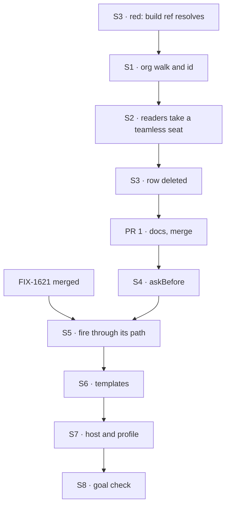

# FIX-1719 · Plan

[Spec](SPEC.md) · [Decisions](DECISIONS.md) · [Rules](BUSINESS-RULES.md) · **Plan** · [Docs](DOCS.md) · [Evolution](EVOLUTION.md)

Written for the implementing agent. IDs cross-reference [BUSINESS-RULES.md](BUSINESS-RULES.md)
(BR-n), [DECISIONS.md](DECISIONS.md) (Dn) and the epic's rules (ER-n). `tdd`. Two PRs (D3).

## Where it stands on `main` `70ceb5df`

| What | Where | Today |
|---|---|---|
| The roster reader | `packages/workforce/src/loader/read-workforce-directory.ts:14-16`, `mintWorkerId` `:341` | Walks `teams/<t>/workers/` only; an org `workers/` is passed over in silence; an id needs a team |
| Readers that split an id on a dot | `read-workforce.ts:187` (`splitWorkerId`), `seat-packages.ts:57`, `seat-references.ts:164` (`placeOfSeat`, exported) | Assume `<team>.<name>`. Full list: [`poc/id-readers/check.mjs`](poc/id-readers/check.mjs) |
| A seat's skills | `loader/read-seat-skills.ts:162` | Takes `{ team, worker }`, validates `team` |
| Hire and fire | `seat-hire-blocks.ts` · `seat-hire-capability.ts` | No gate. `fire` keeps the inventory row until FIX-1621 |
| A tool that suspends mid-turn | `packages/core/src/blocks/generator.ts:1367-1380`, `:1570-1590` (FIX-814) | Supported under durable execution; reject becomes a completed denial result |
| The DevTeam host | `goals/devforce-lab/lab/host.mts:472` · `labs/shift-manager/teams/devteam/fsdev.config.mts` | Built-in `agent` kind with no capabilities; in-memory stores; no hired-seat reload |
| The open published-tree row | `packages/workforce/test/published-tree-surface.test.ts:168-175` | `build` named as unresolvable, owner FIX-1414 |

## Surfaces

| ID | PR | Package · role | Change | Rules |
|---|---|---|---|---|
| S1 | 1 | `workforce` loader · roster reader | Walk `org/workers/<name>/` beside the team walk, same slot rules, same refusals, reusing the worker-slot walk `resource-walk.ts` already has (`walkWorkers`, which takes `teamId: undefined` for the org level) so the roster and the resources never disagree on what a slot is. Mint the bare name. **Remove** "an org-level `workers/` is passed over in silence" from the header and docs | BR-1 BR-3 BR-4 BR-6 |
| S2 | 1 | `workforce` · the three IN readers, plus skills | One exported parser, `parseDeclaredSeatId` (pinned), turns a declared id into `{ team?, name }`: dotless is an org seat, `<team>.<name>` a team seat. `splitWorkerId`, `resolveHeldPackages`, `placeOfSeat` and `readSeatSkills` all call it; none splits on its own. `placeOfSeat` returns `{ team: undefined, worker }` for an org seat, and the parser's tests sit with `placeOfSeat`'s, since both are public. An org seat reads org level, then its own folder | BR-5 |
| S3 | 1 | `workforce` test · published tree | Delete the `build` row from `KNOWN_UNRESOLVABLE_REFS`; the docs example gains `org/workers/build/WORKER.md` | BR-7 |
| S4 | 2 | `workforce` · seat-hire capability | `askBefore` option on `createSeatHireCapability`, default `[]`. The tool path validates, raises `human_approval` with `data: { verb, seatId, kind }`, then on Approve re-validates and applies; on Deny returns a denial result. Refuses a gated verb when `ctx.suspend` is absent. Refuses a hire whose seat id a declared seat holds, via `kindAt` on the bare id. Mounts FIX-1621's `rehire` (always gated) and `brokenSeats`. The blocks themselves stay ungated | BR-10 BR-12 BR-13 BR-15 BR-16 BR-17 BR-18 BR-20 |
| S5 | 2 | `workforce` · fire | The gated tool calls the `fire` block, which FIX-1621 makes the one remove path (roster row, address, inventory row). No CoS-specific remove. If FIX-1621 has not merged, stop: this surface waits | BR-11 ER-19 |
| S6 | 2 | DevTeam Lab · tree | `org/workers/chief-of-staff/WORKER.md` (`flow: agent`, `tools: [hire, fire, rehire, brokenSeats]`, discover, post), with a brief that covers both jobs: answering the person, and deciding on hires a person or a seat asks for. No team seat's `tools:` names a hire tool | BR-21 BR-22 BR-23 |
| S7 | 2 | DevTeam Lab · host and profile | Install `createWorkforceCapability`, channel post and `createSeatHireCapability({ askBefore: ["fire"], allowKinds })` on the agent kind. The profile gets a store that survives a restart and reloads hired seats at boot | BR-8 BR-9 BR-19 |
| S8 | 2 | Goal check · `goals/org-seats/cos-changes-the-roster/` | New. Control `deny-fire` | Goal |
| S9 | 1 and 2 | Docs | [DOCS.md](DOCS.md) operations; one `minor` changeset for `@flow-state-dev/workforce` in each PR | — |

## Sequence



## Checks

| ID | Runs after | Passes when |
|---|---|---|
| V1 | S1 S2 | Loader specs: BR-1 to BR-6 on a fixture tree with one org seat, one team seat of the same name, and one broken org slot |
| V2 | S2 | `check.mjs` run by hand as a spec gate (not wired into default vitest) still classifies every split, the IN sites now through `parseDeclaredSeatId`; parser specs on both id shapes; every existing `workforce` test passes unchanged (BR-2) |
| V3 | S3 | `published-tree-surface` passes with the row removed (BR-7) |
| V4 | S4 | Capability spec over a durable in-memory runtime: ask raised for fire, none for hire; Approve applies; Deny changes nothing; restart between ask and answer keeps the ask (BR-10 to BR-18). Off state: `askBefore` omitted behaves exactly as today |
| V5 | S7 | The four `devforce-lab` checks and `it-waits-for-a-person-before-it-files` pass with the templates in the tree |
| VG | S8 | [The goal](SPEC.md#the-goal-and-how-well-know-its-met): PASS, then FAIL under `GOAL_CONTROL=deny-fire`, and FAIL on `main` |

## Pinned names

| Where | Name | Why pinned |
|---|---|---|
| `createSeatHireCapability` option | `askBefore: readonly ("hire" \| "fire")[]` | Public. DevTeam passes `["fire"]`: hire proceeds, fire asks. `rehire` asks regardless |
| Declared-seat id parser | `parseDeclaredSeatId` · exported beside `placeOfSeat` | The one teamless rule every IN reader uses (S2) |
| Suspension `data` | `{ verb, seatId, kind }` | Inbox and FIX-1722 read it ([downstream reads](BUSINESS-RULES.md#appendix--downstream-reads-fix-17221723)) |
| Template seat id | `chief-of-staff` | The screens find it |
| Goal control | `deny-fire` | The spec's control |

## Guardrails

| Rule | Because |
|---|---|
| Every id reader goes through `parseDeclaredSeatId`; `check.mjs` stays green | An invariant loosened at one reader is found by review at the next (tenet 5) |
| Nothing in `core` or `engine` changes; no CoS, admin, project or org-seat type | ER-6, ER-10, ER-11 |
| The ask is raised only for a change that would succeed, and re-checked on resume | A person approving a change that then fails is worse than no ask |
| Org comes from the principal, never the request body | ER-7, BP-031 |
| `askBefore` omitted is today, byte for byte | Existing apps on the capability (BP-035: test the off state) |
| Published prose says seat and agent kind, never worker as a noun | ER-13. `org/workers/` is a path and stays |

## Docs

Reconcile and publish [DOCS.md](DOCS.md): PR 1 the loader paragraphs, PR 2 the new page and the
epic's shared section.

## Sketch and POC

```
seat-hire tool, for a verb in askBefore:
    check the change would succeed           ← same checks as today
    ctx.suspend(human_approval, { verb, seatId, kind })
    on Approve → check again, apply          ← fire: FIX-1621's path
    on Deny    → "not changed", as a result
```

**POC:** [`poc/id-readers/check.mjs`](poc/id-readers/check.mjs) lists every dot-split in
`packages/workforce/src` and `labs/shift-manager/src` and fails on one the spec didn't
classify. On `main` `70ceb5df`: eight sites, PASS. `PLANT=1` adds an unclassified site and
FAILS. It answers "which readers assume a team"; it does not change behaviour.

## At implement time

- FIX-1621's spec is on `main`: `fire` is its one remove path, and it pins `brokenSeats` and
  `rehire` on `createSeatHireBlocks` for this issue to mount. Its prose still says "Ops" where it
  means the admin seat; read that as CoS.
- Shift Manager's `toSeat` (`labs/shift-manager/src/lib/reads.ts:258`) reads a dotless id as its
  own team. FIX-1723 owns that screen; tell its thread, don't edit it.
- Check whether `createFlowState` refuses two flows with one key. If it overwrites, the DevTeam
  host refuses an org seat named like a channel kind.
- The epic's closure control still reads "Deny the hire". The amendment recording Q2 (#2609) changes it.

## Notes from review

From Cursor on #2613 (review 5384025389), for the implementer. The parser pin, the downstream
appendix, the slimmer docs draft, `check.mjs` as a hand-run gate and the `walkWorkers` reuse are
folded above.

- "**PLAN S1–S2** are one logical 'org seat identity' change; merging surface IDs is bookkeeping only."
- "**Goal (S8):** real-model + double restart is the right anti-game bar; expect slow/flaky automation unless capped — that is cost, not a reason to drop the goal."
- "fold or shorten `EVOLUTION.md` if epic amendment already records Q2."

## Follow-ups

- `org/channels/` has the same silent pass-over `org/workers/` had. Not in scope (FIX-1414's
  fence).
