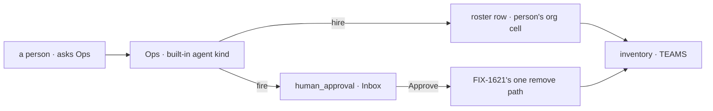

# FIX-1719 · CoS and Ops: two org seats a Lab adds, with Ops hiring and firing seats on the person's approval

**Spec** · [Decisions](DECISIONS.md) · [Rules](BUSINESS-RULES.md) · [Plan](PLAN.md) · [Docs](DOCS.md) · [Evolution](EVOLUTION.md)

## Who feels this, before and after

| Someone who… | Today | After |
|---|---|---|
| **runs a Lab alone and wants to know who is on what** | Nobody to ask. They open TEAMS and the boards and piece it together | They ask the chief of staff (CoS), a seat that reads the roster and posts to a project's channel |
| **needs one more coder** | Edits a `WORKER.md` and restarts, or writes and guards a hire action | Asks Ops. Ops hires a seat of a kind the Lab registers, without asking, and the seat is still there after a restart |
| **needs one fewer** | Edits files and restarts | Asks Ops. Ops raises the fire in Inbox; Approve removes the seat, Deny leaves it ([D2](DECISIONS.md#d2)) |
| **builds a Lab and wants CoS and Ops** | Writes `org/workers/ops/WORKER.md` and gets no seat and no error | Adds two `WORKER.md` files under `org/workers/` and installs the hire capability once. A Lab that adds neither gets neither ([D1](DECISIONS.md#d1)) |
| **wants every hire asked again later** | No such policy | Adds `hire` to the one list that says which changes ask first. No code beyond that line |

Jake answered the epic's Q2 on #2602: "For now, ops can just hire without asking." Fire and
retire still ask. Hire approval is a switch the Lab can turn back on.

## The goal, and how we'll know it's met

**A Lab that declares CoS and Ops gets both as running seats, and a person changes who works
there by asking Ops: a hire lands at once, a fire lands only on Approve, and both survive a
restart, with nothing new in Layer 1, no new noun and no second hire store.**

| Is it the right goal? | |
|---|---|
| **The real need** | "A person can ask CoS who's working on what and approve Ops hire/fire from Inbox without editing files and restarting" (the issue's done-when), under Jake's Q2 answer: hire without asking |
| **Smaller, and rejected** | "Org seats load." Closes FIX-1414's gap and changes nothing a person feels: nobody can ask for a seat |
| **Bigger, and not this issue's** | The Chief of Staff and Roster screens (FIX-1722, FIX-1723) · shift status and slot use (FIX-1723) · CoS routing requests into tasks or answering asks for the person · detecting a seat whose kind is gone (FIX-1621) · opening channels at runtime ([epic D3](../../epics/FIX-1650/DECISIONS.md#d3)) |
| **Not done if** | CoS or Ops exists only in a test's hand-built record, not from the tree · a fire lands without Approve · Deny changes anything · a fired seat is back, or still listed, after a restart · a hire asks when the policy says it doesn't · Ops can fire CoS, itself, or a declared team seat |


The fire leg is the one a hollow build skips. Deny must leave the seat listed after a restart.

| How we verify | |
|---|---|
| **Goal check** | `goals/org-seats/ops-changes-the-roster/` · real model for Ops's turns · run by the implementer at completion · verdict in the implementation PR |
| **Signal** | The seat inventory and the stored roster, read after each restart through the routes Shift Manager reads: after the hire, the new seat is listed and answers its door, and no `human_approval` was raised; after the fire's Approve, the seat is gone from both and its address no longer answers. CoS answers "who is on the feature channel" naming the declared seats |
| **Input** | The DevTeam tree with the two templates added, a held-out seat name the check picks at run time, a store that survives a restart |
| **Anti-game** | No hire or fire block called by the check; every change goes through Ops's own turn. No restart skipped. The approval goes through the engine's resume route, as Inbox sends it |
| **Control that must fail** | `GOAL_CONTROL=deny-fire`: "seat gone" FAILS. Today's `main` FAILS at boot: no CoS or Ops seat exists |

## What changes


The left half is today. On the right, the only new path is the approval in front of fire.

**What a Lab writes:**

```diff
  workforce/
    org/
+     workers/
+       chief-of-staff/WORKER.md    # flow: agent · discover, post to channels
+       ops/WORKER.md               # flow: agent · tools: [hire, fire]
    teams/eng/workers/…
```

```diff
  const agent = defineAgentWorkerFlow({
    uses: [
      workforce,
+     createSeatHireCapability({ kinds, register, unregister, askBefore: ["fire"] }),
    ],
  });
```

## How a request reaches the roster



Org seats are booted from the tree, never hired at runtime, and Ops cannot fire them.

## What stays as it is

- Team seats, their ids (`<team>.<name>`) and every reader's behaviour on them.
- The hire blocks mounted directly by an action: an admin route is already a person's act and asks nothing.
- `@flow-state-dev/core` and `@flow-state-dev/engine`: no change. The approval is the stock `ctx.suspend`.
- Channels stay declared on disk. Neither seat opens or retires one.

## Not here

| What | Owner |
|---|---|
| The Chief of Staff screen | FIX-1722 (FIX-1649), reading [the seat data this issue ships](BUSINESS-RULES.md#what-the-screens-read) |
| The Roster screen, shift status (on shift, on call, off shift) and slot use | FIX-1723, derived from existing seat and run state; no field here |
| CoS turning a request into a task, messaging a seat, answering an ask for the person, reassigning | FIX-1722 to scope, against FIX-1651 (board contents) and FIX-1671 (answering an ask) |
| Briefings on a schedule, "on call for" a webhook | FIX-1637 (wake) |
| Finding a seat whose kind is gone; one remove path for fire and retire | FIX-1621 |

## Sign off

**[The goal](#the-goal-and-how-well-know-its-met), at that size:** both seats from the tree, a
hire at once, a fire on Approve, all across restarts. If wrong: we ship seats that load while
the roster still changes only by editing files.

1. **[D2](DECISIONS.md#d2) · Ops hires without asking; every fire and repair waits for Approve;
   hire approval is one list entry away.** If wrong: a model adds seats nobody chose, and the
   cleanup is firing them one approval at a time.
2. **[D1](DECISIONS.md#d1) · CoS and Ops exist because the tree declares them, booted at start
   like team seats.** If wrong: adding Ops to a running Lab needs a restart.
3. **[D3](DECISIONS.md#d3) · Two PRs: org seats boot first, Ops's approval after FIX-1621.**
   If wrong: one PR waits on FIX-1621 for loader work that never needed it.

**Open: none.** D2 is the one to weigh. Reasoning and what lost: [DECISIONS.md](DECISIONS.md).
The cases: [BUSINESS-RULES.md](BUSINESS-RULES.md).

Feature · `@flow-state-dev/workforce` (L2) + the DevTeam Lab + docs · large · 2 PRs · child of
epic [FIX-1650](../../epics/FIX-1650/SPEC.md) · build blocked by FIX-1621 (PR 2 only)
