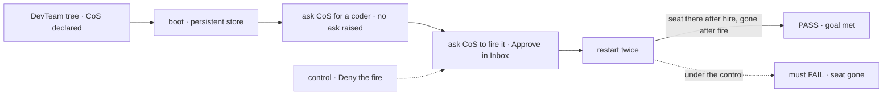
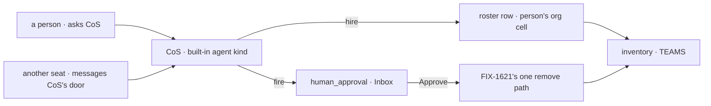

# FIX-1719 · Chief of Staff: one org admin seat a Lab adds, hiring seats at once and firing them on the person's approval

**Spec** · [Decisions](DECISIONS.md) · [Rules](BUSINESS-RULES.md) · [Plan](PLAN.md) · [Docs](DOCS.md) · [Evolution](EVOLUTION.md)

## Who feels this, before and after

| Someone who… | Today | After |
|---|---|---|
| **runs a Lab alone and wants to know who is on what** | Nobody to ask. They open TEAMS and the boards and piece it together | They ask the chief of staff (CoS), the one org seat that reads the roster and posts to a project's channel |
| **needs one more coder** | Edits a `WORKER.md` and restarts, or writes and guards a hire action | Asks CoS. CoS hires a seat of a kind the Lab allows, without asking, and the seat is still there after a restart |
| **needs one fewer** | Edits files and restarts | Asks CoS. CoS raises the fire in Inbox; Approve removes the seat, Deny leaves it ([D2](DECISIONS.md#d2)) |
| **is a seat that thinks the team needs help** | Has no way to ask | Messages CoS, and CoS decides whether to hire. No seat but CoS hires ([D3](DECISIONS.md#d3)) |
| **builds a Lab and wants a CoS** | Writes `org/workers/chief-of-staff/WORKER.md` and gets no seat and no error | Adds that one file and installs the hire capability once. A Lab that doesn't add it has no CoS ([D1](DECISIONS.md#d1)) |

Jake answered the epic's Q2 on #2602: "For now, ops can just hire without asking." He has since
dropped Ops as a seat: CoS holds hire, and other seats ask CoS (comment on #2613, pending his
direct confirmation). Fire still asks. Hire approval is a switch the Lab can turn back on.

## The goal, and how we'll know it's met

**A Lab that declares a chief of staff gets it as a running seat, and a person changes who
works there by asking it: a hire lands at once, a fire lands only on Approve, and both survive
a restart, with nothing new in Layer 1, no new noun and no second hire store.**

| Is it the right goal? | |
|---|---|
| **The real need** | "A person can ask CoS who's working on what and approve … hire/fire from Inbox without editing files and restarting" (the issue's done-when), under Jake's answers: hire without asking, CoS the one hire door |
| **Smaller, and rejected** | "Org seats load." Closes FIX-1414's gap and changes nothing a person feels: nobody can ask for a seat |
| **Bigger, and not this issue's** | The Chief of Staff and Roster screens (FIX-1722, FIX-1723) · shift status and slot use (FIX-1723) · CoS turning requests into tasks or answering asks for the person (FIX-1726) · detecting a seat whose kind is gone (FIX-1621) · opening channels at runtime ([epic D3](../../epics/FIX-1650/DECISIONS.md#d3)) |
| **Not done if** | CoS exists only in a test's hand-built record, not from the tree · a fire lands without Approve · Deny changes anything · a fired seat is back, or still listed, after a restart · a hire asks when the policy says it doesn't · a seat other than CoS can hire or fire · CoS can fire itself or a declared team seat |



The fire leg is the one a hollow build skips. Deny must leave the seat listed after a restart.

| How we verify | |
|---|---|
| **Goal check** | `goals/org-seats/cos-changes-the-roster/` · real model for CoS's turns · run by the implementer at completion · verdict in the implementation PR |
| **Signal** | The seat inventory and the stored roster, read after each restart through the routes Shift Manager reads: after the hire, the new seat is listed and answers its door, and no `human_approval` was raised; after the fire's Approve, the seat is gone from both and its address no longer answers. CoS answers "who is on the feature channel" naming the declared seats. The coder seat holds no `hire` tool |
| **Input** | The DevTeam tree with the CoS template added, a held-out seat name the check picks at run time, a store that survives a restart |
| **Anti-game** | No hire or fire block called by the check; every change goes through CoS's own turn. No restart skipped. The approval goes through the engine's resume route, as Inbox sends it |
| **Control that must fail** | `GOAL_CONTROL=deny-fire`: "seat gone" FAILS. Today's `main` FAILS at boot: no CoS seat exists |

## What changes


The left half is today. On the right, the only new path is the approval in front of fire.

**What a Lab writes:**

```diff
  workforce/
    org/
+     workers/
+       chief-of-staff/WORKER.md    # flow: agent · tools: [hire, fire, rehire, brokenSeats] · discover, post to channels
    teams/eng/workers/…              # no tools: [hire] anywhere here
```

```diff
  const agent = defineAgentWorkerFlow({
    uses: [
      workforce,
+     createSeatHireCapability({ kinds, register, unregister, askBefore: ["fire"] }),
    ],
  });
```

## How a request reaches the roster



A seat's request is an ordinary message to CoS's door; nothing new carries it. Declared seats,
CoS included, are booted from the tree and can't be fired.

## What stays as it is

- Team seats, their ids (`<team>.<name>`) and every reader's behaviour on them.
- The hire blocks mounted directly by an action: an admin route is already a person's act and asks nothing.
- `@flow-state-dev/core` and `@flow-state-dev/engine`: no change. The approval is the stock `ctx.suspend`.
- Channels stay declared on disk. CoS neither opens nor retires one.

## Not here

| What | Owner |
|---|---|
| The Chief of Staff screen | FIX-1722 (FIX-1649), reading [the seat data this issue ships](BUSINESS-RULES.md#appendix--downstream-reads-fix-17221723) |
| The Roster screen, shift status (on shift, on call, off shift) and slot use | FIX-1723, derived from existing seat and run state; no field here |
| CoS turning a request into a task, messaging a seat, answering an ask for the person, reassigning | FIX-1726: tools on the CoS seat (Layer 2), after FIX-1671 (answering an ask). CoS's hire and fire tools are this issue's; FIX-1722 owns only the screen |
| Briefings on a schedule, "on call for" a webhook | FIX-1637 (wake) |
| Finding a seat whose kind is gone; one remove path for fire and retire | FIX-1621 |

## Sign off

**[The goal](#the-goal-and-how-well-know-its-met), at that size:** CoS from the tree, a hire at
once, a fire on Approve, all across restarts. If wrong: we ship a seat that loads while the
roster still changes only by editing files.

1. **[D2](DECISIONS.md#d2) · CoS hires without asking; every fire and repair waits for Approve;
   hire approval is one list entry away.** If wrong: a model adds seats nobody chose, and the
   cleanup is firing them one approval at a time.
2. **[D3](DECISIONS.md#d3) · CoS is the only seat that hires or fires; other seats ask it by
   message.** If wrong: the person's one contact also carries the roster, and a second admin
   seat comes back as its own issue.
3. **[D1](DECISIONS.md#d1) · CoS exists because the tree declares it, booted at start like team
   seats.** If wrong: adding CoS to a running Lab needs a restart.

**Open: none.** D2 is the one to weigh. The PR split (org seats first, the fire gate after
FIX-1621) is an engineering call in [DECISIONS.md](DECISIONS.md#decided-not-asked). The cases:
[BUSINESS-RULES.md](BUSINESS-RULES.md).

Feature · `@flow-state-dev/workforce` (L2) + the DevTeam Lab + docs · large · 2 PRs · child of
epic [FIX-1650](../../epics/FIX-1650/SPEC.md) · build blocked by FIX-1621 (PR 2 only)
