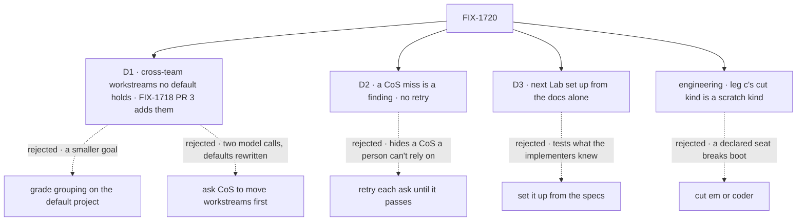

# FIX-1720 · Decisions

[Spec](SPEC.md) · **Decisions** · [Rules](BUSINESS-RULES.md) · [Plan](PLAN.md) · [Docs](DOCS.md)

The [closure rule](../../../docs/contributing/orchestration.md#the-closure-issue-every-epic-ends-in-qa)
fixes what the plan holds and in what order; the epic fixes the legs, their input and their
controls ([FIX-1650 → How we verify](../../epics/FIX-1650/SPEC.md#the-goal-and-how-well-know-its-met),
[ER-9](../../epics/FIX-1650/BUSINESS-RULES.md#the-closure)). These cards are the calls left
open. D1 to D3 are the sign-off; the rest are decided so nobody decides them on the day.

## The tree

Solid edges are what was chosen. Dashed edges lost, and the label says why.

## D1 · Leg a's cross-team project needs workstreams on two teams that no default project holds; FIX-1718's PR 3 adds them, and the closure depends on that PR

| | |
|---|---|
| **Instead of** | (a) Grading grouping on the profile's default project `storefront`, and CoS's two projects with no workstreams. (b) Asking CoS first to take workstreams off `storefront`, then create the new project with them |
| **Because** | A workstream belongs to at most one project, claimed at create ([FIX-1718 BR-4](../FIX-1718/BUSINESS-RULES.md#what-a-workstream-and-a-project-are)). As FIX-1718 plans the DevTeam tree, its only two workstreams, `eng.feature` and `ops.release`, are both claimed by the default `storefront` at boot ([FIX-1718 S11, S12](../FIX-1718/PLAN.md#surfaces)), so any project CoS creates is refused every workstream, or holds none. The epic's goal is workstreams found *under the projects CoS created*, and Jake's call is that projects are usually cross-team. (a) is the smaller goal: grouping proved only on a row app code wrote. (b) rewrites the defaults FIX-1718's own check grades and doubles the model calls the leg rests on |
| **Locks in** | **FIX-1718's PR 3 (its S11, the DevTeam tree) adds one board-less workstream on each of its two teams that no default project lists** (the epic coordinator's call). Tree only, no product code; FIX-1718's and the devforce-lab checks stay green. The closure depends on that PR: no run starts until it has merged, and a run that finds either workstream missing or claimed files a finding against FIX-1718 |

**What would change my mind:** the owner ruling that the profile's default projects are what the
epic means by "the projects CoS created". Then (a), and the epic's anti-game line is amended.

**What being wrong costs:** two small tree files in FIX-1718's PR 3 that only the closure reads.

It comes down to whose project is graded: grouping on the default row proves app code, not CoS.

## D2 · A CoS turn that doesn't do what the person asked is a finding, never retried as flake

| | |
|---|---|
| **Instead of** | Retrying each CoS ask, the same words, up to three times, and grading the first that lands |
| **Because** | The epic's promise is that a person changes the Lab *by asking CoS*. A person asks once. A CoS that needs a second ask to call its tool is a brief or tool-description problem FIX-1719 or FIX-1718 owns, and a retry would hide it from the report. Every step is graded on the store and on CoS's own session (the tool call and its result), so a miss is diagnosable: the report shows what CoS did instead |
| **Locks in** | Each CoS turn and the room's answer runs once. A miss is filed like any other finding, against the child whose tool or brief it is, with the session's items quoted. The model is named in the report. A provider error (no response, a rate limit) is *blocked*, not failed, and that one turn is re-run |

**What would change my mind:** two consecutive runs that miss on different steps with no change in
between. Then the model, not CoS, is the variable, and the plan names a stronger one.

**What being wrong costs:** a full re-run for a model's off day, about nine graded turns each time.

It comes down to what a person does: they ask once, so a retry grades a CoS nobody uses.

## D3 · The next-Lab journey is set up by a writer that reads only the published docs

| | |
|---|---|
| **Instead of** | (a) The closure worker adding CoS and a project template to the pentest Lab from these specs. (b) No journey: the DevTeam Lab already opted in |
| **Because** | The epic's fourth team "declares one talk template for its projects and opts into CoS as one document". DevTeam's opt-in was written by the implementers, who read the specs; only a reader who has the docs alone tests what a Lab author gets. (a) proves what the implementers knew. (b) skips the team the closure rule says to walk |
| **Locks in** | An isolated sub-agent sees only the published pages (DOCS.md lists them) and a scratch copy of `goals/pentest-lab/lab/`. It writes the CoS document, the capability install, the project collection and template, and lists every step it had to guess. Then the person asks CoS for a project and a seat in Shift Manager over that copy. Each guessed step and each failed step is a finding. Nothing is committed |

**What would change my mind:** the docs naming a generator that adds CoS to a Lab. Then the writer
runs it.

**What being wrong costs:** a writer that fails on something a real author would ask about,
filed as a doc gap that a sentence fixes.

It comes down to the reader: only a docs-only writer tests what a Lab author reads.

## Decided, not asked

- **Leg c's cut kind is a scratch kind** (engineering call). The DevTeam host registers `em`,
  `coder` and the built-in `agent`, and declared seats run on each, so cutting one fails the
  boot, not a hire. Boot 1 runs a scratch patch that adds one more kind (a copy of `agent` under a
  run-picked name) to the map and to `allowKinds`; CoS hires a seat on it; boot 2 is the commit
  as shipped. The patch is printed in the report.
- **Only rows CoS created in this run are graded in leg a.** The profile's default projects
  are FIX-1718's, graded by its check in part 3. Leg a diffs the `projects` rows against the
  boot's snapshot. This is how the epic's *"no project seeded by Lab code"* is kept on a profile
  that seeds defaults.
- **A CoS-created project's Board** shows its named no-board state when none of its workstreams
  holds a board (the DevTeam profile allows one board). Gap copy there is a finding; the
  board-lane view is graded on `storefront` by FIX-1718's check.
- **The outsider step follows the epic's pending members-only call** ([epic Q1, 4](../../epics/FIX-1650/DECISIONS.md#pending-4)).
  If Jake answers "the whole Lab reads", the step flips to *reads the room* by a small amendment.
- **The person asks CoS through Shift Manager's Chief of Staff view** (FIX-1722's), and answers
  asks in Inbox, the way a person would. No route is called to make a change.
- **A browser check is attempted here first**, and handed to `fsd-qa` over the mailbox only if no
  browser can run ([orchestration.md](../../../docs/contributing/orchestration.md#the-closure-issue-every-epic-ends-in-qa)).
- **Docs get a smoke-follow**: D3's writer and part 4's docs row. Corpus polish is the wrap.

## Considered and dropped

| Alternative | Why not |
|---|---|
| Kitchen-sink's tree, or the pentest Lab, for legs a to c | The epic pins the DevTeam profile; the Architect rules kitchen-sink out |
| Driving CoS over HTTP instead of the browser | Grades a route, not what a person touches; FIX-1719's check already does it |
| Skip a child's check because a leg covers it | None is fully covered: re-hire, the three-user room and the burst controls are the children's alone |
| Fix a small gap inside the closure PR | A gap is a child of the epic, on its own route |

## Open / Settled

**Open: none.** Settled: none. No POC: the one premise D1 rests on, that the planned DevTeam tree
leaves no unclaimed workstream, is read off FIX-1718's merged plan (S11, S12) and BR-4.

## How it got here

- **Draft** — the epic's three legs in a browser on the DevTeam Lab, CoS driven through the
  Chief of Staff view with a real model and no retry; only CoS-created rows graded; the missing
  unclaimed cross-team workstreams added up front rather than found late; the next Lab set up from the
  docs alone.
- **D1's vehicle (Oct 2)** — the epic coordinator kept the recommendation and moved the vehicle
  from a new child of FIX-1650 to FIX-1718's PR 3, which already owns the DevTeam tree (S11).
