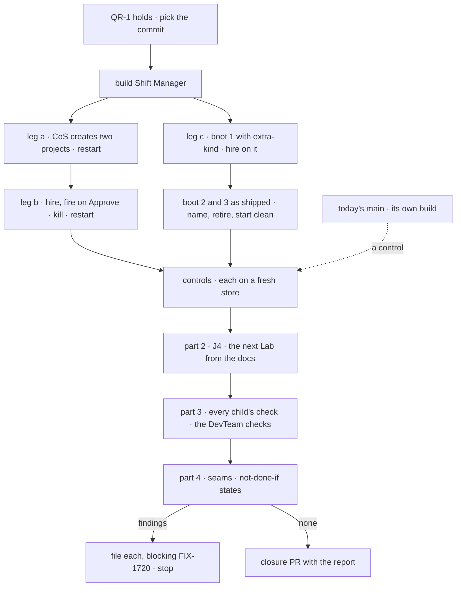

# FIX-1720 · Plan

[Spec](SPEC.md) · [Decisions](DECISIONS.md) · [Rules](BUSINESS-RULES.md) · **Plan** · [Docs](DOCS.md)

Written for the closure worker, which owns the step definitions. It starts when QR-1 holds, and
adds only the goal check. Names from the children are read off their **merged** specs on `main`
and their shipped code (FIX-1621, FIX-1718, FIX-1719, and FIX-1722 for the Chief of Staff view).
Where a merged spec or the code renames something below, that name wins.

## Surfaces

| ID | Where | Change |
|---|---|---|
| S1 | `goals/shift-manager/one-person-runs-a-labs-projects-and-people/` | `goal.md` from [SPEC.md's goal](SPEC.md#the-goal-and-how-well-know-its-met) in the `goals/README.md` format; `run.mts`: builds Shift Manager from the commit, starts `pnpm --filter @flow-state-dev/shift-manager start --team devteam` over a run-scoped store file, stops, kills and restarts it, and drives Chromium through the [Sequence](#sequence). Page and store helpers are imported from `goals/lib` or the Shift Manager checks they live in, never copied |
| S2 | `controls/` under S1 | The scratch patches: `extra-kind` (leg c's boot 1), `no-cos`, `no-tool`. Each applied to a copy of the commit, never committed, printed in full in the report. `deny-fire` and `deny-retire` are clicks, not patches |
| S3 | J4's scratch copy | A copy of `goals/pentest-lab/lab/` that D3's writer edits; deleted after the run |
| S4 | The closure PR | Only after a run that files nothing: S1 with its verdict log, the report as its body. No changeset |

## Sequence

Legs a and b share one store and one server; leg c runs on its own store, because its boot 1 is
a patched build.

## Checks

Every row read on the page is compared by id with what the store returns through the Lab's
routes, never with Shift Manager's state. Names marked *held-out* are picked at run time.
The person is the profile's owner; the second member and the outsider are its other two users.

| ID | Passes when |
|---|---|
| a1 | **Ask for two projects.** In the Chief of Staff view, the person asks CoS for project P1 (held-out title) holding one workstream of each of two teams ([D1](DECISIONS.md#d1)'s), members the person and the second member, and P2 (held-out title) with no workstreams. CoS's session holds two `createProject` calls with ok results; the `projects` rows not in the boot's snapshot are exactly P1 and P2, owned by the person, each with the person's talk session in `sessions` |
| a2 | **PROJECTS.** Lists P1 and P2 by title among the store's rows; beneath P1, exactly its two workstreams, from two teams; the defaults are unchanged; no restart and no file change happened between a1 and a2 |
| a3 | **Four tabs, each project.** Brief equals the row's brief. Workstreams lists the row's, each linking to its workstream. Board shows its named no-board state. Stream: a fresh token posted in P1's composer is a `room-lines` row whose `userId` is the person; a template seat's answer is a later row with `author` set, and both are on screen after the wake. No gap copy is reachable on any tab |
| a4 | **Org-wide, members only.** In a second context, the second member opens P1's Stream and reads both lines. In a third, the outsider's PROJECTS lists P1 and P2, and P1's Stream shows the members-only state with no line of the room in the page |
| a5 | **Restart.** a2 to a4 read again on a new process, the same store |
| a6 | **Where it lives.** The channel inventory equals the tree's declared channels. The person's talk session for P1 holds `resourceId` = P1 and no other project field |
| b1 | **Hire.** The person asks CoS for a coder seat (held-out name). CoS's session holds a `hire` call with an ok result; no new `human_approval` suspension exists; TEAMS lists the seat, matching a new roster row and inventory row |
| b2 | **Restart.** TEAMS still lists it; its roster row is there; the boot names no problem |
| b3 | **Fire asks.** The person asks CoS to fire it. Inbox shows a `human_approval` naming `fire`, the seat and its kind; roster and inventory unchanged. Restart: the ask is still in Inbox, the seat still listed |
| b4 | **Approve.** Approve in Inbox: the seat leaves TEAMS, its roster row and inventory row are gone. Restart: still gone |
| b5 | **A kill mid-change.** b1 and b3 for a second held-out seat, then Approve with the server `SIGKILL`ed as the resume request lands. Restart: either both rows gone and the ask answered, or both present and the ask still in Inbox. Never one row without the other |
| b6 | **No other seat hires.** In the feature workstream's composer, the person asks the EM seat to hire a third held-out seat. No roster row appears |
| c1 | **Boot 1, `extra-kind`.** The person asks CoS for a seat S (held-out) on the scratch kind K. TEAMS lists S |
| c2 | **Boot 2, as shipped.** The boot's problems name S. The person asks CoS which seats won't start: CoS's `brokenSeats` result lists S with `kind-gone`, its answer on screen names S, and S's roster row is unchanged |
| c3 | **Retire.** The person asks CoS to retire S. Inbox shows the ask; Approve |
| c4 | **Boot 3.** The boot names no problem; TEAMS doesn't list S; neither store has its row |

## Controls

Each runs on a fresh store and must fail its leg at its own step, leaving the rest green. One that
fails at setup, reddens another leg, or is missing from the commit is a finding.

| Control | Changes | Must fail | Stays green | Named by |
|---|---|---|---|---|
| Today's `main` | The commit before FIX-1650's first child merged | a1 · b1 · c1, no CoS seat | — | Epic goal |
| `deny-fire` | Deny instead of Approve at b4 | b4, "seat gone" | a · c | Epic goal |
| `no-cos` | CoS's `WORKER.md` removed (S2). The Chief of Staff view shows its no-CoS state, so the person asks the EM seat as in b6. Runs b1 only | b1, "seat appears" | — | Epic goal |
| `no-tool` | `createProject` removed from CoS's `tools:` (S2) | a1, "two rows" | b · c | FIX-1718's name |
| `deny-retire` | Deny instead of Approve at c3 | c4, "no problem at boot" | a · b | This plan |

## Part 2 · the team the legs don't walk

| ID | Team | Passes when |
|---|---|---|
| J4 | **Builds the next Lab** | [D3](DECISIONS.md#d3)'s writer, seeing only the pages [DOCS.md](DOCS.md) lists and S3, adds CoS, the hire capability with `askBefore: ["fire"]`, the `projects` collection with its template and the project tools, and returns every step it guessed: none. Shift Manager over S3's config boots with no problem; the person asks CoS for a project and a seat; PROJECTS lists the project with a room the person can post in, and TEAMS lists the seat. `labs/shift-manager` is untouched |

The epic's other three teams are legs a, b and c.

## Part 3 · every child's check

| ID | Passes when |
|---|---|
| P3.1 | FIX-1621's `goals/hire-plane/repairs-a-seat-whose-kind-was-cut/`, with `fire-keeps-inventory` failing |
| P3.2 | FIX-1719's `goals/org-seats/cos-changes-the-roster/`, with `deny-fire` failing · FIX-1718's `goals/shift-manager/it-groups-workstreams-under-their-projects/`, its `cos` leg included, with `unread`, `gap-tabs`, `no-gate`, `no-retry` and `no-tool` each failing · D1's child's check |
| P3.3 | Every check that boots the DevTeam tree stays green: `goals/devforce-lab/*` and the `goals/shift-manager/*` checks that start `--team devteam`; `goals/hire-plane/*`; CI green on the SHA |

## Part 4 · gap sweep

Only what parts 1 to 3 don't grade. Each row is one of the epic's
[coordination seams](../../epics/FIX-1650/PLAN.md#coordination-seams-to-watch) or fences.

| Check | Passes when |
|---|---|
| **One remove path (ER-19)** | Read off the source: only the `fire` block deletes a hired seat's inventory row, and CoS's fire, retire and kitchen-sink's admin fire all reach it |
| **One orphan read (ER-5)** | CoS's `brokenSeats` tool is FIX-1621's block; no second detector in the set's diff |
| **The DevTeam tree, host and profile** | CoS's `tools:` holds `hire`, `fire`, `rehire`, `brokenSeats`, `createProject`, `setWorkstreams`; the host installs each; no team seat's `tools:` names a hire tool |
| **The approval card** | CoS's fire and retire asks render in Inbox through the existing `human_approval` card, and resume from it |
| **Gap copy (ER-8)** | No reachable Shift Manager copy says something "arrives with FIX-1650" or waits on "org seats" shipping; FIX-1651's and FIX-1652's entries are unchanged |
| **Layer fence (ER-10, ER-11, ER-21, ER-22)** | The set's diff from today's-`main` control to the commit adds nothing under `packages/core` or `packages/engine` naming a Project, Workstream, CoS or admin seat; no `workforce/projects/`, `workforce/agents/` or `CHANNELS.md`; `CHANNEL.md`'s key list gains only `mintFor`; no second hire store |
| **Vocabulary (ER-13)** | The pages the set published use "seat", never "worker", as a noun |
| **Docs published (ER-18)** | Every row of the epic's [ownership table](../../epics/FIX-1650/DOCS.md#ownership) is on the commit |

A doc gap follows [QR-26](BUSINESS-RULES.md#what-happens-to-a-finding).

## Pinned names

| Where | Name |
|---|---|
| Goal check | `goals/shift-manager/one-person-runs-a-labs-projects-and-people/` |
| Steps | `a1` to `a6`, `b1` to `b6`, `c1` to `c4`, `J4`, `P3.1` to `P3.3` |
| Controls | `deny-fire`, `no-cos`, `no-tool`, `deny-retire`; scratch patch `extra-kind` |

Everything else is yours to name.

## Guardrails

| Rule | Because |
|---|---|
| No product change, and no control switch in Shift Manager or any package | The closure proves what shipped; a switch written for a test is product code |
| Every change goes through a CoS turn or an Inbox click; no hire, fire or project block is called by the check | The epic's anti-game; a route call proves the route, not the person's path |
| Every row compared by id against the store, never Shift Manager's state | A shell that draws its own rows passes a check that reads the shell |
| One graded turn per CoS step (D2) | A retry grades a CoS nobody uses |
| Scratch patches are printed in full | A patch that changes more than it says is how a leg passes hollow |
| Every check on the one commit; today's `main` only as a control | A pass elsewhere proves nothing about the set |
| Findings are filed, never fixed here | The closure rule |

## Docs

No reader-facing change. [DOCS.md](DOCS.md) says what the run follows.

## At implement time

- Re-read the merged specs and their amendments; take the store's env name and the three users'
  secrets from FIX-1718 S12 and FIX-1719 S7 as shipped.
- FIX-1722's `it-briefs-and-talks-with-the-chief-of-staff` uses the DevTeam profile as its
  *no CoS* Lab, and FIX-1719 adds CoS to that tree. If FIX-1719 lands without moving that leg,
  P3.3 fails there: a finding against FIX-1719. Raised to the coordinator at spec time.
- Shift Manager's `toSeat` reads a dotless seat id as its own team (FIX-1719 → At implement
  time). If TEAMS draws `chief-of-staff` wrongly, that is FIX-1723's (QR-25).
- `SIGKILL` in b5 races the resume on purpose; run it until each outcome has been seen once in
  development, and grade only "never one row without the other".
- Chromium is at `/opt/pw-browsers`; the model is `openai/gpt-5.4-mini` unless D2's flip names
  a stronger one.

## Follow-ups

None raised. D1's child is filed on approval by the epic coordinator.
