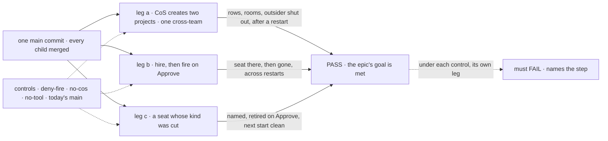

# FIX-1720 · Closure: one person runs a Lab's projects and people from Shift Manager

**Spec** · [Decisions](DECISIONS.md) · [Rules](BUSINESS-RULES.md) · [Plan](PLAN.md) · [Docs](DOCS.md)

## Five people, before and after

| Someone who… | Today | After this closes |
|---|---|---|
| **decides whether the epic is done** | Three children, each green on its own commit and its own fixture | One report on one `main` commit: legs a to c in a browser on the DevTeam Lab, each control's FAIL, the next-Lab journey, every child's check, the seam sweep, each finding and its retest |
| **runs a Lab alone in Shift Manager** | Nothing proves the pieces meet | Proven on the DevTeam Lab with a real model: asks the chief of staff (CoS) for two projects, one spanning two teams, and finds them under PROJECTS with a room; hires and fires through CoS; every change survives a restart |
| **is in the Lab but not on a project** | Nothing proves projects are org-wide | Proven: sees every project CoS created, and no conversation in a room they aren't a member of |
| **shipped a release that cut a kind** | FIX-1621's check runs on a fixture | Proven on the DevTeam Lab: CoS names the broken seat, retires it on Approve, and the next start names nothing |
| **builds the next Lab** | Nothing tells them whether the docs are enough | Proven: the pentest Lab gets a CoS and a project template by a writer who read only the published docs |

## The goal, and how we'll know it's met

**On one `main` commit with every child of FIX-1650 merged, the epic's goal holds in a real
browser on the DevTeam Lab: a person finds the projects CoS created for them, one spanning two
teams, each with a room its members share and an outsider can't read; changes who works there
through CoS, a hire at once and a fire only on Approve; clears a seat whose kind was cut; and
every change survives a restart, with nothing new in Layer 1 and no second hire or project
store. The next Lab gets the same from the docs alone, and every child's own check passes on
that commit.**

| Is it the right goal? | |
|---|---|
| **The real need** | The [epic's goal](../../epics/FIX-1650/SPEC.md#the-goal-and-how-well-know-its-met) on the assembled set, as [ER-9](../../epics/FIX-1650/BUSINESS-RULES.md#the-closure) and the [closure rule](../../../docs/contributing/orchestration.md#the-closure-issue-every-epic-ends-in-qa) ask; projects org-wide and usually cross-team (Jake) |
| **Smaller, and rejected** | "Re-run each child's check on one commit." FIX-1718's and FIX-1719's checks each stop where the other starts: neither asks CoS for a project in a browser, and FIX-1621's runs on kitchen-sink's kind |
| **Bigger, and not this issue's** | Product work of any kind · what sits on a board (FIX-1651) · the CoS and Roster screens (FIX-1722, FIX-1723) · live push of room lines · docs polish (the epic's wrap) |
| **Not done if** | A leg ran on a tree other than DevTeam's · checks ran on different commits · a project was graded that CoS didn't create in this run · no graded project spans two teams · a CoS step was retried until it passed · a restart was skipped · a fire or retire landed without Approve, or a Deny changed something · a seat other than CoS hired · a fired or retired seat is back after a restart, or still in TEAMS · a cut kind was mapped onto another without a person asking · a project's data or conversation is in session state · a control never failed, or failed at setup · a finding was fixed in the closure PR, or deferred |

Every step reads the page against what the running Lab's store holds, and each control breaks
exactly one leg at its own step.

| How we verify | |
|---|---|
| **Goal check** | `goals/shift-manager/one-person-runs-a-labs-projects-and-people/`, real Chromium on a production build of the one commit, legs a to c then the controls. Committed by the closure PR. Run on demand, at this closure and each later epic closure that touches CoS; not a CI gate (QR-5). Verdict in that PR |
| **Signal** | Per step in [PLAN.md → Checks](PLAN.md#checks). a: two rows CoS created, owned by the person, one listing workstreams of two teams; four tabs each; a post and a seat's answer in the room; the outsider sees both rows and no conversation. b: hire with no ask raised; fire with an ask that survives a restart, gone only after Approve; a team seat asked to hire doesn't. c: CoS names the seat `kind-gone`; after Approve, no refused seat at start |
| **Model** | Real: every CoS turn and the room's answer. Each is graded once, never retried ([D2](DECISIONS.md#d2)) |
| **Input** | The DevTeam profile (`labs/shift-manager/teams/devteam`) over `goals/devforce-lab/lab/` as the children leave it, plus [D1](DECISIONS.md#d1)'s workstreams; a store file fresh per run, kept across its restarts |
| **Anti-game** | No assertion on a child's output or Shift Manager's state. Only rows CoS created in this run are graded; the profile's default projects are left alone. Every change goes through a CoS turn or an Inbox click |
| **Control that must fail** | `deny-fire`: b's "seat gone" FAILS. `no-cos` (CoS's document removed): the same hire asked of a team seat, "seat appears" FAILS. `no-tool`: a's "two rows" FAILS. Today's `main`: all three legs FAIL |

Part 2 walks the one team the legs don't: someone building the next Lab ([D3](DECISIONS.md#d3)).
Part 3 re-runs every child's check on its green path, skipping the controls part 1 already
failed; part 4 asserts the epic's seams and its Layer 1 fence by script. All on the same commit.

## What changes

Read the commit line: today each check sits on its own commit and fixture; after, all sit on one,
on the DevTeam Lab, and a finding sends the whole stack round again.

## What stays as it is

- **No product work.** A gap becomes a child of FIX-1650 that blocks this issue, fixed on its own
  route; the closure PR carries the goal check and the report only.
- **No committed input of its own.** D1's workstreams ship in FIX-1718's PR 3. Every variant (an extra kind for leg c, the controls,
  the next-Lab copy) is a patch on a scratch copy of the commit, printed in the report.
- **Every child's acceptance** stands as its spec wrote it; a child's check that fails is a
  finding, never a rewrite.

## Sign off

**[The goal](#the-goal-and-how-well-know-its-met), at that size:** the epic's three legs on the
DevTeam Lab in a browser, a real model, the next Lab from the docs, one commit. If wrong: the
epic wraps on checks that never met each other, or waits on a bar nobody asked for.

1. **[D1](DECISIONS.md#d1) · Leg a's cross-team project needs workstreams on two teams that no
   default project already holds; FIX-1718's PR 3 adds them, and the closure depends on that
   PR.** If wrong: two tree files only the closure reads, or a first run that fails on a gap
   we can already see.
2. **[D2](DECISIONS.md#d2) · A CoS turn that doesn't do what the person asked is a finding, never
   retried as flake.** If wrong: a model's off day costs a whole re-run, or a CoS a person can't
   rely on passes.
3. **[D3](DECISIONS.md#d3) · The next-Lab journey is set up by a writer that reads only the
   published docs; every step it had to guess is a finding.** If wrong: the docs ship with a gap
   only the implementers could cross.

**Open: none.** D1 is the one to weigh. Reasoning and what lost: [DECISIONS.md](DECISIONS.md).
The cases: [BUSINESS-RULES.md](BUSINESS-RULES.md).

Improvement · closure (QA) · `goals/` only · medium, repeats per finding · 1 PR after a clean run
· epic [FIX-1650](../../epics/FIX-1650/SPEC.md), closure · required · runs after FIX-1621,
FIX-1718 and FIX-1719 merge, and FIX-1722 and FIX-1723, the surfaces the legs drive · Linear [FIX-1720](https://linear.app/fixpoint-labs/issue/FIX-1720)
