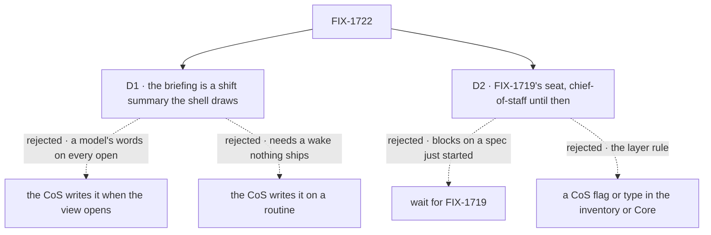

# FIX-1722 · Decisions

[Spec](SPEC.md) · **Decisions** · [Rules](BUSINESS-RULES.md) · [Plan](PLAN.md) · [Docs](DOCS.md)

Two decisions are the sign-off surface; no fork is open. The epic's D1 to D3 and ER-1 to ER-15
([FIX-1649](../../epics/FIX-1649/DECISIONS.md)) bind this issue and are not reopened. Jake put
Chief of Staff in the epic on 2026-10-01; that call is not reopened either.

## The tree

Solid edges are what you're signing. Dashed edges lost.

## D1 · The briefing is a shift summary Shift Manager draws from its own reads

| | |
|---|---|
| **Instead of** | The CoS seat writing the briefing each time the view opens · the CoS writing one on a schedule (v2's *Shift handoff briefing, daily 08:00 and 20:00*) |
| **Because** | v2's brief is counts and a list: what needs you, the asks with Approve and Deny, how many sessions run across how many streams. Shift Manager already reads every one of those for the sidebar, Inbox and Tasks, in one snapshot. Drawing them as a summary means the brief can't disagree with Inbox's count, costs no model call, writes nothing into the conversation, and works in a Lab with no CoS seat at all. Putting those words in the CoS's mouth when the seat never said them is the shell inventing a colleague (epic ER-5; ER-15 for a session). A CoS that writes the brief on open spends a model call and a conversation turn on every landing, and can miscount. One on a schedule needs a wake the Lab doesn't have yet (FIX-1637) |
| **Locks in** | The summary sits at the top of the view, labelled as the shift summary, not as the CoS. Its asks use Inbox's card and answer path, so answering in either place clears both. The CoS speaks only in the conversation, and only what its session stores |

It comes down to who said it: a seat-written brief is a model's words that can contradict Inbox.

**What would change my mind:** you want the CoS's own judgement in the brief, what matters
today and not just counts. Then the CoS writes one on a routine once wake ships, and this
summary is what a Lab without one sees.

**If wrong:** the first screen reads as a dashboard over a chat rather than a colleague
briefing you. A CoS-written brief is additive later; nothing here has to be removed for it.

## D2 · The CoS is FIX-1719's seat; until it lands, the one seat a Lab declares as `chief-of-staff`

| | |
|---|---|
| **Instead of** | Waiting for FIX-1719 to merge before building the view · a CoS flag on the inventory row, or a CoS type anywhere in Core or Engine |
| **Because** | Everything the conversation needs already ships: a seat's door on its inventory row, the send path with its *delivered* rule (FIX-1690), and the session reads. The only thing missing is which seat is the CoS, and FIX-1719 owns that contract ([FIX-1650](../../epics/FIX-1650/DECISIONS.md#q2): an org seat under `org/workers/` on the `agent` kind). An org seat isn't hireable until FIX-1719 lands, so the interim is a team's worker named `chief-of-staff`. One function holds the rule; when FIX-1719 lands, that function changes and nothing else. A flag or a type would add a Workforce noun the layer rule forbids (epic ER-7) |
| **Locks in** | The seat whose name is exactly `chief-of-staff`, in any team or, once FIX-1719 lands, the org. None: the summary shows, and the conversation is a named state saying the Lab declares no chief of staff. Two: a named state naming both, and no guess. The seat must have a door; one without says it takes no message |

It comes down to timing: waiting blocks the view on a spec that has only just started.

**What would change my mind:** FIX-1719 marking the CoS somewhere the inventory row doesn't
carry. Then that read joins the shell's snapshot, and the function reads it.

**If wrong:** a Lab that named its CoS otherwise renames one seat folder, and the rule changes in
one function.

## Decided, not asked

- **Every Lab lands on Chief of Staff.** `/`, `/cos` and any unknown path draw it; Inbox stays at
  `/inbox`. A Lab with no CoS seat lands there too, on the summary and the named state. One
  landing is easier to teach than a landing that depends on the Lab.
- **One running conversation per person.** The person's newest session on the CoS seat's flow
  that no channel or parent started. With none, the first line opens one through the same door.
  No *new conversation* control: v2 draws none. The `agent` kind sends the model its last 50
  turns; the screen still shows every stored item.
- **The reply is the session's.** While the door's request runs, a working line; then the
  session's items after the person's line, drawn with the registry message and tool cards
  already copied in. Tool calls the CoS makes show as tool cards; v2's *open →* chips under a
  reply are not built.
- **The rail.** STREAMS: each workstream's running rows and its members' pending asks, from the
  snapshot. ON CALL: FIX-1723's on-call derivation, read from the one function it pins; until it
  merges, a named gap naming FIX-1723. The summary's sentence leaves out *workers on call* until
  then.
- **Left out of v2's drawing:** the suggestion chips (they promise actions the CoS's tools
  decide, FIX-1719's), the person's name in the greeting (Shift Manager knows a user id, not a
  name), the composer's *I'll route it* placeholder (also a promise about its tools; the
  placeholder names the CoS instead), and the entry's status dot (no defined meaning).
- **The sidebar is shared with FIX-1723.** This issue adds the Chief of Staff entry above Inbox;
  FIX-1723 adds Roster under Tasks, the TEAMS rows and the footer's counts. Neither touches the
  other's entries.

## Considered and dropped

| Alternative | Why not |
|---|---|
| Inbox stays the landing; Chief of Staff is one more entry | v2 and the issue make it the default screen; Jake's call put it in the epic as that |
| Land on Inbox when the Lab has no CoS seat | Two landings to explain, and the summary is useful without a seat |
| A fresh conversation on each visit | The CoS forgets what you told it an hour ago; the seat keeps one session per direct conversation already |
| A CoS-only send path that skips the door | A second write into a seat's session (epic ER-15) |
| Derive on call here | FIX-1723 owns it and pins one function; a second copy drifts |

## How it got here

- **Draft**: framed as the landing view v2 draws, built only from shipped reads and the shipped
  send path; the briefing became a shift summary the shell draws (D1), and the CoS seat is
  FIX-1719's with a named interim (D2). Boundaries agreed with FIX-1719 (it owns the seat data)
  and FIX-1723 (it owns on call and the rest of the sidebar).
