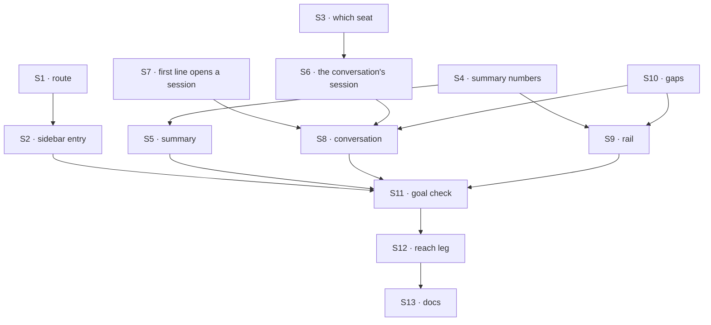

# FIX-1722 · Plan

[Spec](SPEC.md) · [Decisions](DECISIONS.md) · [Rules](BUSINESS-RULES.md) · **Plan** · [Docs](DOCS.md)

Written for the implementing agent. IDs cross-reference [BUSINESS-RULES.md](BUSINESS-RULES.md)
(BR-n), [DECISIONS.md](DECISIONS.md) (D-n) and the epic's rules (ER-n). `tdd`. One PR, from
`main`, inside `labs/shift-manager` and `goals/shift-manager/`. It does not wait on FIX-1719 or
FIX-1723 ([what each supplies](#what-siblings-supply)).

## Surfaces

| ID | Where · role | Change | Rules |
|---|---|---|---|
| S1 | `src/lib/routes.ts` · the route | Add the `cos` level at `/cos`; `/` and anything unknown parse to it instead of Inbox | BR-1 |
| S2 | `src/surfaces/Sidebar.tsx` · the entry | *Chief of Staff* first, above Inbox, current on the `cos` level. Touch no other entry (FIX-1723's) | BR-2 |
| S3 | `src/lib/derive.ts` · who is the CoS | One function from the inventory's seats to *one CoS · none · several*, D2's rule. The only place the rule lives | D2 BR-10 to BR-12 |
| S4 | `src/lib/derive.ts` · the summary's numbers | Pending asks, running rows and the workstreams they run in, per-stream running and needs-you, all from the loaded snapshot with the helpers Tasks, Inbox and the workstream panel already use (`openRows`, `asksFor`, the column reads) | D1 BR-4 BR-7 BR-19 |
| S5 | `src/surfaces/ChiefOfStaff.tsx` · the summary | The summary block and its ask list, each ask drawn by the component Inbox draws it with and answered through Inbox's answer path, not a copy of either. Per-section failure lines | D1 BR-4 to BR-9 |
| S6 | `src/lib/cos.ts` (or beside `send.ts`) · the conversation | Find the person's newest direct session on the CoS seat's flow from the snapshot's session listing (`flowId` equals the seat, no `parentSessionId`); read its message and tool items; after a send, read again | BR-14 BR-17 |
| S7 | `src/lib/send.ts` · the first line | Let `sendTurn` take a target with no session: it sends without one and takes the session id from the door's answer, then confirms delivery as today. Every other caller is unchanged | BR-15 |
| S8 | `src/surfaces/ChiefOfStaff.tsx` · the conversation | Items drawn with the registry message and tool copies already installed; the composer is `TurnComposer` (or its shared state) on the S6 target; the working line; BR-11 to BR-13's named states | BR-10 to BR-18 |
| S9 | `src/App.tsx` · the rail | The right panel's slot at the `cos` level: STREAMS from S4; ON CALL from FIX-1723's function, or its gap line | BR-19 BR-20 |
| S10 | `src/gaps.ts` · the gaps | Entries for ON CALL before FIX-1723, and BR-11's no-CoS text | BR-9 BR-11 BR-20 ER-5 |
| S11 | `goals/shift-manager/it-briefs-and-talks-with-the-chief-of-staff/` | The goal check, its fixture Lab and both controls | the goal |
| S12 | `goals/shift-manager/it-opens-a-lab/` | Its **reach** leg opens Inbox by its route, not by landing; add Chief of Staff to the levels it reaches | BR-1 |
| S13 | Docs | [DOCS.md](DOCS.md): the README's opening, *What you see*, *What a Lab's config provides* | — |

**Removed:** Inbox as the fallback route. Nothing else.

## Sequence



One PR; no PR plan.

<a name="what-siblings-supply"></a>
## What siblings supply, and what happens before they land

| From | What this issue reads | Before it merges |
|---|---|---|
| **FIX-1719** · the CoS and Ops seats | The seat inventory contract, from FIX-1719 (#2613): rows `{ id, kind, door }`; org seats by bare folder name (`chief-of-staff`, `ops`) with no team; team seats `<team>.<name>`; Ops-hired seats `<org>.<seatId>`, split with `splitSeatAddress`; a fired seat has no row; the CoS reached through its door. This issue owns none of it | D2's rule needs nothing new: the name after `splitSeatAddress` is `chief-of-staff`. Org seats aren't hireable yet, so the fixture declares the CoS under a team; once FIX-1719 lands it moves to `org/workers/` and nothing in the shell changes. Org seats have no team: `Seat.team` becomes optional where the shell reads it (BP-030), and TEAMS listing teamless seats is FIX-1723's |
| **FIX-1723** · Roster | The one on-call function it pins in `derive.ts` (on shift · on call · off shift), and its sidebar entries | ON CALL and the summary's on-call clause are named gaps (BR-9, BR-20). Whichever PR merges second rebases the shared sidebar and `derive.ts`; the entries don't overlap |
| **FIX-1697** · v2 and the final theme (PR #2605) | The design-system tokens | The view uses tokens only, so it lands in either order. v2's hand-back is the final one, so ER-9 is met once #2605 merges |
| **The epic** · ER-10 | An amendment adopting v2's Chief of Staff destination | Jake's 2026-10-01 call is the authority; the coordinator records the amendment. This PR doesn't merge before it |

## Checks

| ID | Runs after | Passes when |
|---|---|---|
| V1 | S1, S2 | `/`, `/cos` and an unknown path parse to `cos`; every other route round-trips as before; the entry is first and current only on `cos` (BR-1, BR-2) |
| V2 | S3 | `chief-of-staff` (org) and `desk.chief-of-staff` (team) are each found; both together, or two teams, give the several state; none gives its state; `desk.chief-of-staffs` and `chief` are not; a teamless row reads without error (BR-10 to BR-12) |
| V3 | S4, S5 | Against the in-process fixture Lab: the summary's numbers equal what Inbox and Tasks draw from the same snapshot; answering an ask from the summary clears it in Inbox and the other way round; a failed read draws only its section's failure (BR-4 to BR-8). Negative: a written-in count fails |
| V4 | S6 | Of the person's sessions on the CoS flow, the newest with no parent is chosen; a channel-heard or child session is never chosen; with none, the target has no session (BR-14) |
| V5 | S7 | A target with no session sends without one, takes the id from the answer and confirms delivery in that session; existing callers' tests pass unchanged (BR-15) |
| V6 | S8 | Delivered, refused, not sent and unconfirmed behave as other composers'; the working line shows while the request runs and a second line can't be sent; a reply the session doesn't hold is never drawn (BR-15 to BR-18) |
| V7 | S9, S10 | STREAMS counts equal each workstream's rows and members' asks; ON CALL shows its gap line with no FIX-1723 function, and the function's seats with it (BR-19, BR-20) |
| V8 | all | Static: no literal colour outside token definitions; no tree or seat name in `src` beyond D2's one rule; registry copies byte-equal their source; nothing outside `labs/shift-manager` and `goals/` changes |
| VG | S11 | [The goal](SPEC.md#the-goal-and-how-well-know-its-met) PASSES, after `GOAL_CONTROL=optimistic-reply` FAILED at **talk** and `GOAL_CONTROL=static-brief` FAILED at **inline** |

## Pinned names

| Where | Name | Why pinned |
|---|---|---|
| Route | `/cos` | Links and the goal check type it |
| CoS rule | the seat whose name after `splitSeatAddress` is exactly `chief-of-staff` | D2; FIX-1719's org seat id (#2613), and a Lab's team seat before it |
| Goal check | `goals/shift-manager/it-briefs-and-talks-with-the-chief-of-staff/` | The epic's closure runs it |
| Controls | `GOAL_CONTROL=optimistic-reply`, `GOAL_CONTROL=static-brief` | The goal names them |

Everything else is yours to name.

## Guardrails

| Rule | Because |
|---|---|
| The summary and the rail read the one snapshot, through the helpers the other screens use | A second derivation of the same count drifts, and the brief contradicts Inbox (D1) |
| An ask is drawn and answered by Inbox's component and path, never a copy | Epic: one rendering per ask kind; answering in either place clears both |
| Nothing is drawn in the CoS's voice that its session doesn't hold | ER-5, ER-15. The summary is labelled as Shift Manager's |
| Every line goes through `sendTurn`; S7 extends it, nothing bypasses it | ER-15: one write path into a seat's session, one meaning of *delivered* |
| The CoS rule lives in one function (S3) | FIX-1719 changes it there and nowhere else (D2) |
| On call is FIX-1723's function, never re-derived here | Two derivations disagree on the first edge case |
| No FSD package changes | ER-7. A component that won't take the skin goes to FIX-1655 |

## Docs

Reconcile [DOCS.md](DOCS.md) against the running app and publish it in this PR, through
`docs-writer` then `docs-editor`, after VG passes.

## Sketch · pseudocode, illustrative, react to the shape

```
open /cos:
    snap      ← the shell's one snapshot                          (as the sidebar)
    summary   ← pending asks, running rows, streams they run in   (D1, same helpers)
                each ask → Inbox's card · answer → Inbox's path
    cos       ← the CoS rule over snap's seats                    (D2: one · none · several)
    convo     ← snap's sessions where flowId = cos.id and no parent, newest
                items of convo, if any
    rail      ← per stream: running rows · members' asks; on call ← FIX-1723's fn or its gap
send line:
    sendTurn({ flow: cos.id, door: cos.door, session: convo?.id }, line)
        no session → the door's answer names it                  (S7)
    while running: working line · then re-read convo's items
```

**POC:** none. The premises are read off code on `main` at 70ceb5dfb, not argued: the `agent`
kind's `run` action declares `userMessage` and takes `{ message }`, so it is a door
(`packages/workforce/src/agent-worker-flow.ts`, `seat-door.ts`); a send with no session id
creates one and the answer carries it (`packages/client/src/action-client/`,
`ExecuteActionResponse.session`); the session listing carries `flowId` and `parentSessionId`
(`packages/client/src/types/index.ts`); the shell's send path confirms delivery by reading the
session back (`labs/shift-manager/src/lib/send.ts`). V4 and V5 exercise them first.

**Factual base:** no counted facts; no checker.

## At implement time

- **Re-read FIX-1719's spec (#2613) as merged.** If the contract above changed, S3 follows it. If
  org seats are hireable by then, the fixture's CoS sits under `org/workers/`.
- **Read FIX-1723's merged spec or PR** for the on-call function's name. If it has merged, wire
  ON CALL and drop the two gap entries.
- **Confirm a channel-heard CoS session has a parent** (or is otherwise told apart from a direct
  one) in the session listing. If it doesn't, raise it before choosing a session by anything
  weaker: showing a channel's conversation as the person's would be wrong.
- **The model.** The fixture's CoS runs `openai/gpt-5.4-mini`; the goal check needs a key in the
  environment and says so when it is missing, rather than passing.
- **ER-10.** Check the epic amendment adopting the Chief of Staff destination is on `main`; if it
  isn't, tell the coordinator rather than merging.

## Notes from review

None yet.
