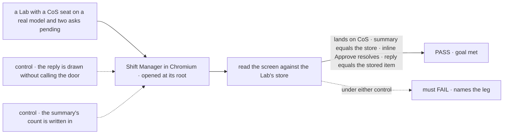
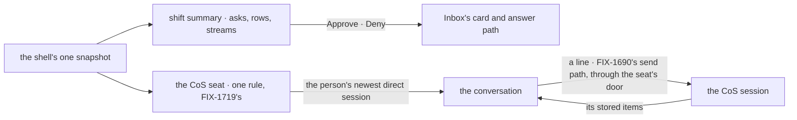

# FIX-1722 · Shift Manager has no Chief of Staff view: a person can't open the operation's briefing and talk to the CoS seat from the shell

**Spec** · [Decisions](DECISIONS.md) · [Rules](BUSINESS-RULES.md) · [Plan](PLAN.md) · [Docs](DOCS.md)

## Five people, before and after

| Someone who… | Today | After |
|---|---|---|
| **opens Shift Manager on a Lab** | Lands on Inbox, a list of asks | Lands on **Chief of Staff**: a shift summary of what waits on them and what is running, a conversation with the Lab's chief-of-staff seat, and each workstream's counts beside it |
| **has asks waiting** | Opens Inbox and answers each there | Answers them from the summary with the same card Inbox draws; answering in one place clears both |
| **wants to tell the operation something** | Picks a worker and a task, or types `@worker` in a workstream | Types to the CoS seat. The line goes in through the seat's own door and shows *delivered* only once the seat's session holds it; the reply is whatever that session stores |
| **runs a Lab with no CoS seat** (DevTeam today) | n/a | Still lands on Chief of Staff and sees the summary; the conversation is a named state saying the Lab declares no chief of staff and how to add one |
| **builds FIX-1719** (the CoS and Ops seats) | Has no screen where the CoS meets the person | Fills a view that already exists: the shell finds the CoS through one rule, and the seat's tools decide what it can do |

## The goal, and how we'll know it's met

**A person opening any Lab in Shift Manager lands on Chief of Staff, sees a summary of what
waits on them and what is running that agrees with the store, can answer those asks there, and
can talk to the Lab's CoS seat, with every line and reply being what that seat's session holds.**

| Is it the right goal? | |
|---|---|
| **The real need** | The issue: *"A Lab opened in Shift Manager lands on Chief of Staff, shows its briefing, and a person can send the CoS seat a message and see its reply."* v2 makes it the default screen: *"a conversation with a chief-of-staff worker who briefs you on what needs you, lets you answer asks inline, and routes requests to workers"* |
| **Smaller, and rejected** | "The screen renders v2's layout." Met by drawing a canned brief and echoing the person's line locally, which is the shell inventing a colleague (epic ER-5, ER-15) |
| **Bigger, and not this issue's** | What the CoS *can do*: create tasks, message workers, resolve asks, reassign (its tools and seat, FIX-1719) · on shift and on call (FIX-1723) · v2's removed tabs and the rest of v2's structure (the epic's amendment) |
| **Not done if** | A Lab opens anywhere but Chief of Staff · the summary's counts differ from what Inbox, Tasks and the store hold · an ask answered from the summary still shows in Inbox, or the other way round · a line shows *delivered* before the CoS session holds it · a reply is drawn that the session doesn't hold · a Lab with no CoS seat breaks the screen or hides the summary · anything new lands in Core or Engine |



The check grades the screen against the CoS session and the suspensions the store holds, never
against Shift Manager's own state.

| How we verify | |
|---|---|
| **Goal check** | `goals/shift-manager/it-briefs-and-talks-with-the-chief-of-staff/` · real model, `openai/gpt-5.4-mini` on the built-in `agent` kind · real Chromium · run at implementation, verdict in the implementation PR |
| **Signal** | **landing**: `/` and an unknown path draw the CoS view, its sidebar entry current. **summary**: the needs-you count equals the store's pending asks, every one is listed, and each stream's running and needs-you counts equal its rows and its members' asks. **inline**: Approve on one summary item leaves one fewer pending suspension in the store, and both the summary and Inbox drop it. **talk**: a fresh token typed to the CoS is a user item in the CoS seat's session the moment *delivered* is drawn, and the reply on screen is that session's next assistant item, by id. **again**: a reload shows the same conversation. **no CoS**: DevTeam lands on the view with its summary and the named state in place of the composer |
| **Input** | A fixture Lab: a CoS seat on the `agent` kind with a real model, a seat that raises two approvals at boot, one workstream with a board. DevTeam's profile for the **no CoS** leg |
| **Anti-game** | Oracles are the Lab's routes read by the check's own requests; nothing reads Shift Manager's state. The model's words aren't graded, only that the screen shows the item the session stored. Tokens are fresh per run |
| **Control that must fail** | `GOAL_CONTROL=optimistic-reply`: the composer draws the line and a canned reply without calling the door. Must FAIL at **talk**. `GOAL_CONTROL=static-brief`: the summary's count is written in. Must FAIL at **inline**, where the store drops to one and the summary stays at two. Today's `main` fails **landing** and everything after it |

## What changes


The bottom row is all this issue adds: one entry, one view, and nothing outside the lab. The CoS
seat is an input, drawn dashed.

A Lab adds a CoS by declaring a seat. Until FIX-1719 lands, a team's worker does it
([D2](DECISIONS.md#d2)); FIX-1719 then moves it to `org/workers/` and Shift Manager follows:

```diff
  workforce/teams/desk/workers/
+   chief-of-staff/WORKER.md     # flow: agent · the instructions are the Lab's
```

## How a line reaches the CoS and back



The summary and the counts come from one snapshot, so they never disagree. The conversation is
an ordinary session of the CoS seat, written through the send path every composer already uses.

## What stays as it is

- **Every FSD package.** Nothing in Core, Engine, Workforce or the registry changes; the view
  lives in `labs/shift-manager`.
- **Inbox, Tasks and their routes**, at `/inbox` and `/tasks`; Inbox stops being the default.
- **The send path** ([FIX-1690](https://linear.app/fixpoint-labs/issue/FIX-1690)): the CoS
  composer is one more caller of it, with its *delivered*, refused, not-sent and unconfirmed
  states.
- **What the CoS can do.** Its instructions and tools are the Lab's, and FIX-1719's for the
  default seat. This view grants it nothing.
- **v2's removed tabs** (workstream Brief and Results, the task's tabs, the project's tabs):
  not needed for the landing, so not touched here.

## Sign off

**[The goal](#the-goal-and-how-well-know-its-met), at that size:** land on Chief of Staff,
answer the summary's asks there, and talk to the CoS seat for real. If wrong: a demo screen
that looks like v2 and does nothing the store can confirm.

1. **[D1](DECISIONS.md#d1) · The briefing is a shift summary Shift Manager draws from its own
   reads, not words the CoS writes on every open.** The one to weigh: v2 draws it in the CoS's
   voice. If wrong: the screen reads as a dashboard above a chat, and a CoS-written brief is
   added later beside it.
2. **[D2](DECISIONS.md#d2) · The CoS is FIX-1719's seat; until it lands, the one seat a Lab
   declares as `chief-of-staff`, found by one rule in one place.** If wrong: a Lab renames one
   seat, and the rule changes in one function.

Open: none. The cases: [BUSINESS-RULES.md](BUSINESS-RULES.md).

Feature · private app `labs/shift-manager` · no FSD package changes · medium · 1 PR · epic
[FIX-1649](../../epics/FIX-1649/SPEC.md) · reads [FIX-1719](https://linear.app/fixpoint-labs/issue/FIX-1719)
(CoS seat, in spec) and [FIX-1723](https://linear.app/fixpoint-labs/issue/FIX-1723) (on call,
in spec) · look from v2 ([FIX-1697](https://linear.app/fixpoint-labs/issue/FIX-1697), PR #2605)
