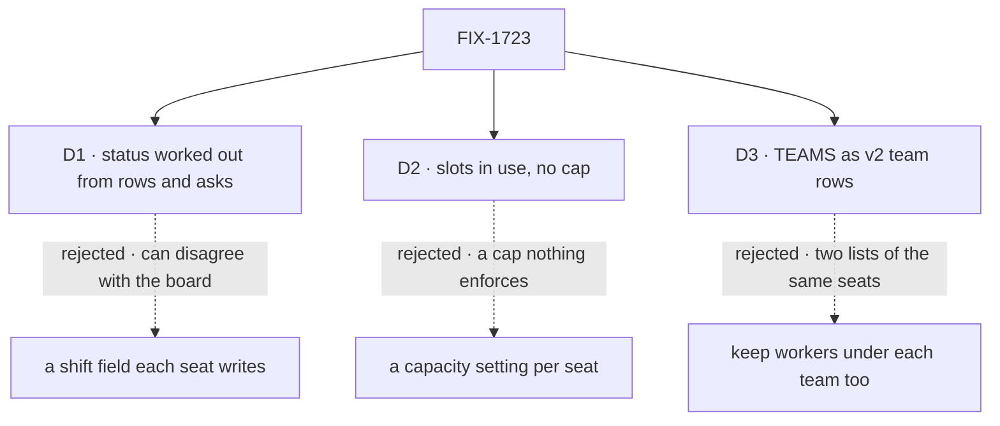

# FIX-1723 · Decisions

[Spec](SPEC.md) · **Decisions** · [Rules](BUSINESS-RULES.md) · [Plan](PLAN.md) · [Docs](DOCS.md)

What was considered, what was chosen, and what each choice locks in. Three decisions are the
sign-off surface; nothing is open.

## The tree

Solid edges are what you're signing. Dashed edges lost, and the label says why.

## D1 · A worker's status is worked out from what the Lab already records, not stored as a new field

| | |
|---|---|
| **Instead of** | A shift field on the seat (on shift, on call, off shift) that the seat or Workforce writes as it works |
| **Because** | The board rows and the pending asks already say what each worker is doing; Shift Manager reads both today. A second record of the same fact can disagree with the first, and then the Roster lies with authority. The layer rule keeps shift words out of Core and Engine, and deriving keeps them out of Workforce's stored shape too (tenet 2: one primitive stays the source) |
| **Locks in** | **On call means "waits on you"** until standing watches ship: a worker that only waits for a webhook or a schedule reads off shift until FIX-1675 gives it something to read. One rule decides status for every screen, including Chief of Staff's, so a later meaning (a watch, *in review*) is added in one place |

It comes down to agreement with the board: a stored status can drift from it, a derived one can't.

**What would change my mind:** a status the Lab's records can't show at all, such as a worker
paused by a person. That would be a seat setting in Workforce, and the rule would read it.

## D2 · Slots show how many tasks a worker holds now, with no "of N"

| | |
|---|---|
| **Instead of** | A capacity per worker, a new setting in its worker file, drawn as v2 draws it: "2/3 slots" and empty squares for the free ones |
| **Because** | Nothing in a Lab limits how many rows a worker takes. A cap on screen that the board doesn't keep tells a person a worker is full when it isn't, or free when the board will hand it a fourth row anyway. A held task (running, or waiting on you) is a fact the board records |
| **Locks in** | Roster says *2 in use*, with one square per held task, a task parked waiting on you included. No one can see that a worker is full, and Chief of Staff (FIX-1722) can't route by free slots. Adding a cap later is a seat setting **and** a board rule that refuses the extra row, not a label |

It comes down to enforcement: a cap only the screen knows about is a promise the board breaks.

**What would change my mind:** you want "full" to mean something now. Then the cap is its own
issue in Workforce, where a board refuses a row past it, and Roster draws its free squares the
day it ships.

## D3 · TEAMS becomes v2's team rows of status squares; the worker list moves to Roster

| | |
|---|---|
| **Instead of** | Keeping v1's workers listed under each team (Jake's correction on v1) and adding Roster beside it |
| **Because** | v2 is the final hand-back, and it answers that correction with a screen: each team row shows one square per worker and opens Roster filtered to the team ([v2 README](https://github.com/fixpoint-labs/flow-state-dev/blob/fa1b85160b477ea7d58b73da3f6e2cc051914c87/specs/epics/FIX-1649/assets/design/v2/README.md#the-pass-2-open-list-item-by-item)). Two lists of the same seats, one in the sidebar and one on Roster, is two places to keep in step |
| **Locks in** | A worker's name is one click away from the sidebar, not on it. Each square still names its worker on hover, and still stands for exactly one seat, so the epic's closure check keeps a per-seat read. Moving a sidebar section is an epic change (ER-10): this spec waits on the epic amendment that adopts v2's Roster and TEAMS |

It comes down to the final hand-back: v2 redrew TEAMS on purpose, and keeping both lists double-draws every seat.

## Decided, not asked

- **On shift is a running task only.** v2 also counts *in review*, which no row status means yet
  (FIX-1651); it joins the rule when it exists.
- **Queued and errored tasks hold no slot.** Nothing has claimed a queued one; nothing waits on
  an errored one, which NEEDS YOU on the board still shows.
- **An ask counts only for the seat its session names**, never a guess.
- **The sidebar and workstream panel switch to the three new words**; *working / waiting on you
  / idle* is retired.
- **Waits-on lists only what waits on you.** Webhooks and routines are a named gap owned by
  FIX-1675, and the summary counts *waiting on you*, not v2's "subscriptions".
- **A worker row shows its kind** where v2 shows focus; the harness keeps its FIX-1652 gap.
- **The title is the look's name** (*Day shift*, *Night shift*), then the team, and it follows the
  look whenever it changes. The Day/Night switch is FIX-1725's; Roster doesn't touch it.
- **No polling.** Roster draws the shared snapshot and says when it was read.
- **Jump to's worker results open Roster**, as v2 does.
- **Seats are grouped by the address FIX-1719 fixes** (its [BR-22](https://github.com/fixpoint-labs/flow-state-dev/pull/2613)):
  an org seat (a bare name, such as CoS and Ops) goes in one **Staff** group, first, as v2 draws
  the chief; a team seat `<team>.<name>` under its team; a hired seat `<org>.<seatId>` is split
  with Workforce's own `splitSeatAddress` and grouped by its seat id. Today Shift Manager makes
  every dotless id a one-seat team, which this fixes. That issue owns the row; this spec reads it.

## Considered and dropped

| Alternative | Why not |
|---|---|
| A status field in the seat inventory row, written by Workforce on claim and release | The simpler-looking approach, and the one D1 rejects: a second write path for a fact the board already holds, in L2's stored shape |
| Channel membership as on call (a member wakes on a post) | Whether a channel wakes its members depends on its kind's notify slot, which a browser can't read. Every member would read on call whether or not anything wakes it |
| A Roster read in Workforce, served to the browser | Moves a screen's grouping into a package for one consumer. The inventory and boards are already readable |
| Counting pending asks as slots | An ask is waiting, not work held; v2 draws asks under waits-on, not as squares |

## How it got here

- **Draft** — framed as a page Jake added to the epic from v2; status worked out from board
  rows and pending asks in Shift Manager, no new field; slots in use without a cap; TEAMS
  redrawn as v2's team rows; one PR in `labs/shift-manager` with a goal check of its own.
- **Review** — org seats grouped as Staff per FIX-1719's seat address; BR-12's counts made exact;
  the Day/Night switch left to FIX-1725. From the second look: the goal names seat matching as a
  best match with a FIX-1672 gap line and an oracle that resolves seats on its own; a failed asks
  read marks every screen *partial*, not Roster alone; the rule is one `seatStates` over the
  snapshot that every count reduces from. D1–D3 unchanged.

**Open: none.**
