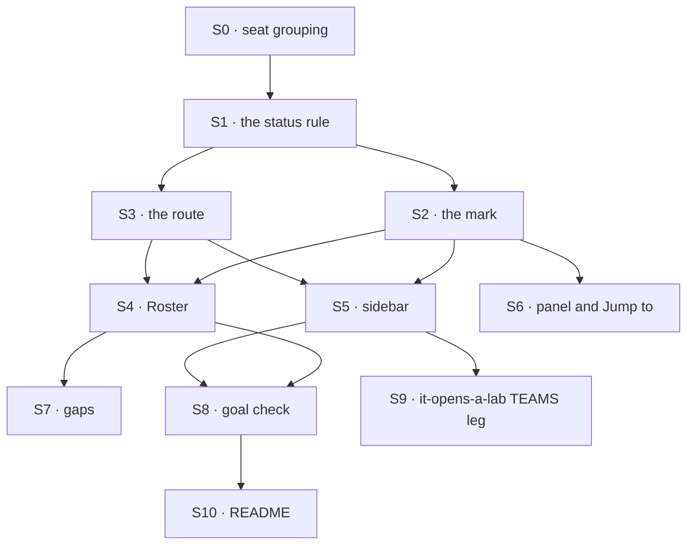

# FIX-1723 · Plan

[Spec](SPEC.md) · [Decisions](DECISIONS.md) · [Rules](BUSINESS-RULES.md) · **Plan** · [Docs](DOCS.md)

Written for the implementing agent. IDs cross-reference [BUSINESS-RULES.md](BUSINESS-RULES.md)
(BR-n) and [DECISIONS.md](DECISIONS.md) (D-n). `tdd`. One PR, all in `labs/shift-manager`
and `goals/shift-manager`. No FSD package changes.

## Surfaces

| ID | Package · role | Change | Rules |
|---|---|---|---|
| S0 | `shift-manager` · reads (`toSeat`) | Group a seat by its address per FIX-1719's BR-22: dotless → Staff; `<org>.<seatId>` → split with `splitSeatAddress` from `@flow-state-dev/workforce/browser`, then by the seat id; `<team>.<name>` → its team. Needs the snapshot's organization | BR-13a BR-13b |
| S1 | `shift-manager` · the derive module (`src/lib/derive.ts`) | The one status rule: a seat's held tasks, pending asks and status from a loaded snapshot (D1). **Replaces** `workerStatus` and its `WorkerStatus` type; held excludes queued and errored | BR-1–BR-6 |
| S2 | `shift-manager` · the status mark (`src/components/ui.tsx`) | **Replace** `StatusWord`'s three words with v2's three marks (on shift solid, on call half, off shift outline) and labels, from design-system tokens only | BR-6 |
| S3 | `shift-manager` · routes | A `roster` level with an optional team, `/roster[?team=<id>]`; an unknown team reads as All | BR-8 BR-13 |
| S4 | `shift-manager` · a Roster surface | The page: title, summary, team picker, three groups, worker rows with slots, HOLDING chips to the task route, waits-on, and the FIX-1675 and FIX-1652 gap lines (D2) | BR-7–BR-12 BR-18–BR-20 |
| S5 | `shift-manager` · the sidebar | The Roster entry under Tasks with counts; TEAMS as team rows of squares opening Roster (D3); the footer's counts. **Removes** the per-team worker list. Leaves the Chief of Staff entry to FIX-1722 | BR-14–BR-16 |
| S6 | `shift-manager` · the workstream panel and Jump to | The panel's member status through S1/S2; Jump to's worker results open S3's route | BR-6 BR-17 |
| S7 | `shift-manager` · gaps | One entry for standing watches, naming FIX-1675; one for a read that left a workstream's tasks out | BR-11 BR-19 |
| S8 | `goals/shift-manager/it-shows-who-is-on-shift/` | The goal check, its Lab of two teams and two controls (VG) | all |
| S9 | `goals/shift-manager/it-opens-a-lab/` | Re-point the TEAMS leg at the squares: each still one seat, under its team | BR-15 |
| S10 | `labs/shift-manager/README.md` | Per [DOCS.md](DOCS.md) | — |

## Sequence



## Checks

| ID | Runs after | Passes when |
|---|---|---|
| V0 | S0 | BR-13a, BR-13b: `chief-of-staff` and `ops` land in Staff; `<org>.eng.coder-2` lands in `eng`; `eng.coder` unchanged |
| V1 | S1 | BR-1–BR-5 as unit cases, including: running beats waiting; an ask alone is on call; queued, errored and finished alone are off shift; the legacy word; an unresolved assignee and an unowned ask count for nobody. The existing `workerStatus` cases move here with the new words (D1) |
| V2 | S3 | Round-trip of `/roster` and `/roster?team=`; an unknown team parses to All (BR-13) |
| V3 | S4 | Rendered against a snapshot fixture: groups, slots squares equal held count with no free squares (D2), chips link to the task route, both gap lines present; BR-18–BR-20 each draw their partial state |
| V4 | S5 | Squares per team equal that team's seats; counts equal S1's over the snapshot; no worker list remains (D3) |
| V5 | S6 | The panel's word for a seat equals Roster's (BR-6); a Jump to worker result navigates to `/roster` |
| VG | S8 | [The goal](SPEC.md#the-goal-and-how-well-know-its-met): `goals/shift-manager/it-shows-who-is-on-shift/run.mts` PASSES, after it FAILED under `GOAL_CONTROL=ignore-asks` and `GOAL_CONTROL=count-queued` on the signals named there |
| V6 | S9 | `it-opens-a-lab` PASSES on both Labs, and its `static-names` control still FAILS at the TEAMS leg |

Second paths (BP-035): a failed boards read (BR-19), a failed asks read (BR-20), an inventory row
with no team dot, and a Lab with one team (the picker shows All and that team).

## Pinned names

| Where | Name | Why pinned |
|---|---|---|
| Route | `/roster`, `?team=` | A person bookmarks it; v2 names the destination |
| Labels | *on shift*, *on call*, *off shift* | The design's words, and Chief of Staff (FIX-1722) uses the same ones |
| Goal check | `goals/shift-manager/it-shows-who-is-on-shift/`, `GOAL_CONTROL=ignore-asks`, `count-queued` | The spec's goal names them |

Everything else is yours to name.

## Guardrails

| Rule | Because |
|---|---|
| Every screen that shows a worker's status calls S1, and nothing else derives one (tenet 5). Chief of Staff's on-call count reads it too | Two rules for one status is the Roster and the panel disagreeing on the same seat |
| A seat's held tasks resolve through the existing seat-for-row rule, never a new matcher | The boards, Tasks and the panel already agree on who holds a row; a second matcher splits them |
| No Workforce, Core or Engine change. A need for one stops the build and goes back to the spec | D1, and the epic's layer rule |
| Colours and marks come from design-system tokens only | The epic's skin check (leg c) sweeps the shell |
| The goal check's oracle is the store through the Lab's routes, never `src/lib/*` | Grading the screen against its own reads proves nothing |

## Docs

Reconcile [DOCS.md](DOCS.md) against the shipped page after VG passes, then publish it to
`labs/shift-manager/README.md`. Private app: no changeset, no `apps/docs` page.

## Sketch · pseudocode, illustrative, react to the shape

```
status(seat, snapshot):
    held  ← rows the seat holds that are running or waiting on you
    asks  ← pending asks whose session names the seat
    if any held is running:          on shift
    else if held or asks non-empty:  on call
    else:                            off shift
slots(seat) ← count(held)            no capacity (D2)
roster(team?) ← inventory seats, filtered by team, grouped by status
```

**POC:** none. The rule is a regrouping of what the panel already computes, and every input is
on today's snapshot; the goal check is the evidence.

## At implement time

- **The epic amendment.** Moving TEAMS and adding a destination is an ER-10 epic change. Confirm
  the FIX-1649 amendment adopting v2's Roster and TEAMS has merged before this PR merges.
- **FIX-1722's sidebar.** It adds the Chief of Staff entry in the same component. Rebase onto
  whichever lands first; the order is Chief of Staff, Inbox, Tasks, Roster.
- **FIX-1719's seat rows** (spec PR #2613, BR-22). Re-read its contract before S0; if it has
  moved, S0 follows it. A team whose id equals the org id would read as hired: note, don't guard.
- **FIX-1651 and FIX-1675.** If *in review* or standing watches have shipped, they join S1, in one
  place, and their gap lines go.

## Follow-ups

- Tasks grouped by worker could show the same status and slots v2 draws there. Not in this scope.
- A worker cap a board enforces, if Jake wants "full" to mean something (D2's mind-changer).
