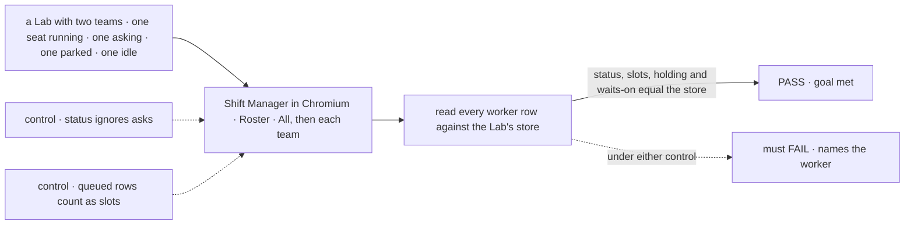
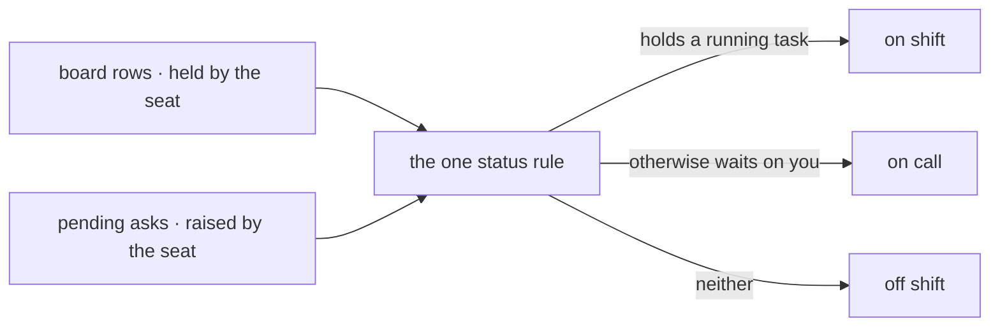

# FIX-1723 · Shift Manager Roster: every worker, the tasks it holds, and who is on shift, on call or off shift

**Spec** · [Decisions](DECISIONS.md) · [Rules](BUSINESS-RULES.md) · [Plan](PLAN.md) · [Docs](DOCS.md)

## Five people, before and after

| Someone who… | Today | After |
|---|---|---|
| **wants to know who is working right now** | Reads one word per seat in the sidebar and adds them up | Opens **Roster**: every worker **on shift**, **on call** or **off shift**, with counts |
| **wants to know who is waiting on them** | Works out from Inbox which worker asked | Sees those workers **on call**, each with what it waits on |
| **is about to give a worker more work** | Counts its rows in Tasks by worker | Reads its **slots in use** and the tasks it holds, one click from each |
| **looks after one team of several** | Scrolls TEAMS for that team | Picks the team on Roster, or clicks its TEAMS row of status squares |
| **reads the workstream panel** | Sees *working / waiting on you / idle* | Sees Roster's three words, from the same rule |

The final design draws a Roster, and Jake put it in this epic before closure. Shift Manager
already reads the seats and boards; it lacks the page and a status readable at a glance.

## The goal, and how we'll know it's met

**A person running a Lab in Shift Manager opens Roster and sees every worker it has, each on
shift, on call or off shift as the Lab's own records say, with the tasks it holds and what it
waits on, for all teams or one.** Which worker holds a task is read from the task's assignee, a
best match until a declared assignee-to-seat map ships (FIX-1672); a task whose assignee matches
no single worker counts for no one, and Roster says so.

| Is it the right goal? | |
|---|---|
| **The real need** | The issue: *"a Roster listing its workers with slots and shift status that match the running Workforce"*. The design: a ROSTER entry, all teams or one, per-team counts ([v2](https://github.com/fixpoint-labs/flow-state-dev/blob/fa1b85160b477ea7d58b73da3f6e2cc051914c87/specs/epics/FIX-1649/assets/design/v2/README.md)) |
| **Smaller, and rejected** | "The Roster page renders." A page of the right shape over a status nobody checked against the board is a page a person learns not to trust |
| **Short of the design, and decided** | **Slots show the count in use, not "2 of 3".** Nothing in a Lab caps how much a worker takes, so there is no "of 3" to read ([D2](DECISIONS.md#d2)). **On call** is *waits on you* until standing watches ship (FIX-1675) |
| **Bigger, and not this issue's** | Who is on a team and the CoS and Ops seats (FIX-1719) · standing watches, the webhooks and routines a worker is on call for (FIX-1675) · the harness a worker runs (FIX-1652) · a declared map from a task's assignee to its seat, so an ambiguous assignee can't leave a working seat reading off shift (FIX-1672) · Chief of Staff (FIX-1722) · removing tabs v2 dropped |
| **Not done if** | A worker shows on shift with no running task, or off shift while an ask of its is in Inbox · the sidebar's counts and Roster's disagree · the team filter shows a seat from another team · a seat in the Lab's inventory is missing from Roster · an org seat (CoS, Ops) shows as a team of its own · asks failed to load and any screen shows a status without the shared *partial* mark |

The check reads the Lab's store through its own routes, never Shift Manager's state, and grades
every worker the screen draws.

| How we verify | |
|---|---|
| **Goal check** | `goals/shift-manager/it-shows-who-is-on-shift/` · model n/a (scripted stub runs that hold until stopped) · real Chromium · run by the implementer at completion · verdict in the implementation PR |
| **Signal** | Reached by clicking Roster, then each team. For every inventory seat: its group equals what [BR-1 to BR-4](BUSINESS-RULES.md#status) give from the stored rows and asks; its slots equal its held rows; its HOLDING chips and waits-on entries are exactly those rows and asks. Each team filter lists exactly its seats. The sidebar's counts equal the page's |
| **Input** | A Lab of two teams and one org-level seat, with seats built into each state: a held run, a pending ask, a parked row, an unclaimed queued row, nothing. Every assignee names exactly one seat, so the best match is never in play. Another spread must pass too |
| **Anti-game** | No assertion on Shift Manager's modules. The oracle is the store, read by the script, and it resolves a row to a seat by its own simpler rule (the assignee equals the seat id or name), never by Shift Manager's best match: reusing that would grade the screen against itself. The fixtures are built so both rules agree |
| **Control that must fail** | `GOAL_CONTROL=ignore-asks`: status reads board rows only. Must FAIL at *status equals the store's* on the asking seat. `GOAL_CONTROL=count-queued`: queued rows count as slots. Must FAIL at *slots equal held rows* on the queued seat. Today's `main` fails: there is no Roster |

## What changes

Everything after is read from what the Lab already records. Nothing is added to Workforce,
Core or Engine, and no one edits a file: a Lab that opens today opens with a Roster.

## How a worker's status is decided

One rule, in Shift Manager, read by Roster, the sidebar and the workstream panel alike.
Chief of Staff (FIX-1722) reads it too rather than deciding again.

## What stays as it is

- **Workforce, Core and Engine.** No shift word in L1; no field on a seat or a row.
- **Who is on a team.** The seat inventory as shipped; FIX-1719 adds the org seats.
- **Tasks, Inbox, the boards, and the tabs v2 removes.**
- **When the Lab is read**: boot, Retry, after an answer. Roster says when.

## Sign off

**[The goal](#the-goal-and-how-well-know-its-met), at that size:** every worker, its status
as the Lab records it, its tasks and what it waits on, for all teams or one. If wrong: a Roster
that looks right and disagrees with the board.

1. **[D1](DECISIONS.md#d1) · Status is worked out from what the Lab already records, not
   stored as a new field on a seat.** If wrong: a webhook or routine worker reads off shift
   until FIX-1675 ships standing watches.
2. **[D2](DECISIONS.md#d2) · Slots show how many tasks a worker holds now, with no "of N".**
   If wrong: no one can see a worker is full, and adding a cap later is a seat setting plus a
   board rule. **The one to weigh.**
3. **[D3](DECISIONS.md#d3) · TEAMS becomes v2's team rows of status squares; the worker list
   moves to Roster.** If wrong: a seat's name is one click further away than Jake's v1
   correction asked.

**Open: none.** Reasoning and what lost: [DECISIONS.md](DECISIONS.md). The cases:
[BUSINESS-RULES.md](BUSINESS-RULES.md).

Feature · private app `labs/shift-manager` only · medium · 1 PR · epic
[FIX-1649](../../epics/FIX-1649/SPEC.md) · reads [FIX-1719](https://linear.app/fixpoint-labs/issue/FIX-1719)'s
seats · shares the sidebar with [FIX-1722](https://linear.app/fixpoint-labs/issue/FIX-1722)
