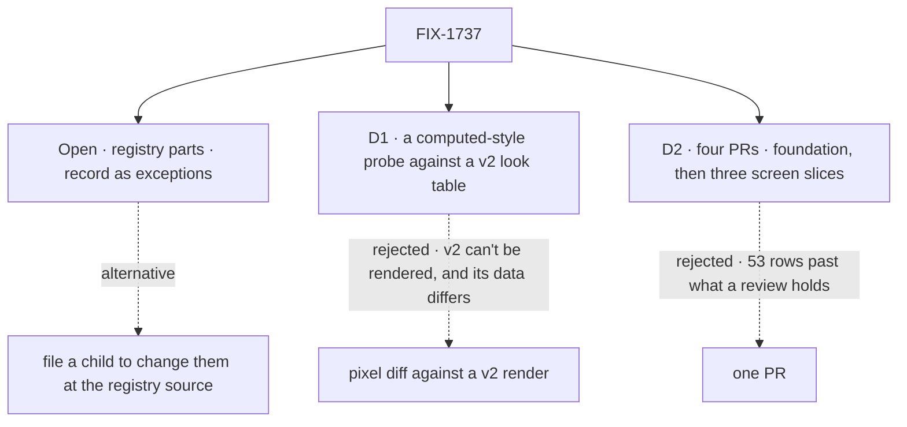

# FIX-1737 · Decisions

[Spec](SPEC.md) · **Decisions** · [Rules](BUSINESS-RULES.md) · [Plan](PLAN.md) · [Docs](DOCS.md)

## The tree

## Open · The registry parts: record them as exceptions, or file a child to change them at the source?

**In plain terms.** A few parts of Shift Manager are FSD components copied in unedited: the ask
card's Approve and Reject buttons, the message, reasoning and tool cards, and a handful of pill
shapes inside them. The epic says only their source may change them (ER-6), and named FIX-1655
for that. FIX-1655 is Done. So after this issue, Inbox and Chief of Staff still show a filled red
**Reject** and rounded pills where v2 draws a bordered **Deny** and square corners, and the task
session's cards keep the registry's layout. Nobody is on the hook for that today.

It comes down to who else sees the change: the registry's buttons and cards are every app's.

**The trade-off.** Changing them at the source is the only honest way to match v2 (no copy may be
edited), but it changes those components for every app that uses them, which is a product
decision about FSD's defaults, not about Shift Manager. Recording them as exceptions keeps FSD
untouched and makes the gap visible: the check lists each by name and skips only those.

**My recommendation: record them as named exceptions**, and let the ask buttons move when
FIX-1652 settles what Approve and Deny are called and do, since that touches the same card.
Square corners are not part of the exception: any registry corner that reads the theme's radius
is squared here, through the theme; only what can't is listed.

**What would change my mind.** You want Inbox and Chief of Staff to show v2's buttons before
the epic closes. Then a child changes the registry's approval card to a token-driven secondary
style for Deny, blocking FIX-1663.

**What being wrong costs.** Two screens show red Reject until FIX-1652 lands; reversible at
any time with one small child.

## D1 · "Matches v2" is graded by a computed-style probe against a line-cited v2 look table

| | |
|---|---|
| **Instead of** | Screenshot diffs against a render of v2 |
| **Because** | v2 can't be rendered: it is a Claude Design template whose runtime (`support.js`) was not handed back ([v2 README](../../epics/FIX-1649/assets/design/v2/README.md)). And v2's mock data (Acme, PAY-14) is not any Lab's, so a pixel diff would flag every line of content. What v2 decides is a short list of properties per role: family, size and weight, surface, radius, highlighter, width. A probe reads exactly those, on every element, in both shifts |
| **Locks in** | The look table is the contract for "matches v2". What it doesn't list (spacing within a couple of pixels, an icon's shape) isn't graded; each slice PR carries day and night screenshots of its screens for a person's eye |

It comes down to whether v2 can be rendered at all: without its runtime there is nothing to diff against.

## D2 · Four PRs: the foundation and the check first, then three screen slices in parallel

| | |
|---|---|
| **Instead of** | One PR for all 53 rows · one PR per screen with no shared foundation |
| **Because** | 53 rows over about twenty files is past what one review holds. Ten rows are shared parts every screen uses (mono meta, surfaces, corners, title scale, state squares, tabs, composer, widths); landing them once, with the check, lets three slices run in parallel without rebasing on each other |
| **Locks in** | The check lands red-free on what A covers, and each slice adds its screens' rows to the table. The issue is Done when the assembled check passes on `main`, not on the last merge |

It comes down to review size: one PR carries 53 rows, past what a review holds.

## Decided, not asked

- **Only rows whose Needs is "—".** A row that waits on a sibling in part (progress counted from
  rows, an ask's wait time, worker avatars) waits whole and is drawn with its sibling, so no
  screen shows half a model the sibling may define differently ([ER-5](../../epics/FIX-1649/BUSINESS-RULES.md#what-a-team-gets-and-what-it-doesnt)).
  Inside an in-scope row, an avatar or a slot pip waits with F6 or its sibling.
- **The sidebar and inspector surfaces are two new names in Shift Manager**, with neutral
  fallbacks to existing tokens and v2's values in the design-system package. FSD's registry
  tokens don't change.
- **The footer takes v2's form** (on shift, on call, the person's initials); the epic's
  "sessions live and the user" line is amended with it.
- **Behaviour checks that pin changed copy are updated in the same slice**, and each still fails
  under its existing control.

## Considered and dropped

| Option | Why it lost |
|---|---|
| Writing a stand-in runtime to render v2 | Large, and a guess at what `support.js` does; a wrong render is a wrong reference |
| Extending the look goal (`it-takes-its-look-from-the-design-system`) | That goal grades *whose* values paint; this one grades *where* they paint. Mixed, a failure can't say which promise broke |
| Drawing the partly blocked rows now | See *Decided, not asked* |

## How it got here

- **Draft** — framed on the 2026-10-02 audit: 53 drawable rows, a computed-style probe against a
  line-cited v2 look table as the check, four PRs; registry parts left as the one open fork.
