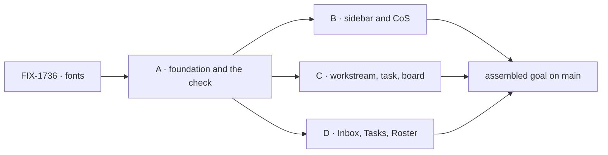

# FIX-1737 · Plan

[Spec](SPEC.md) · [Decisions](DECISIONS.md) · [Rules](BUSINESS-RULES.md) · **Plan** · [Docs](DOCS.md)

Discipline: `tdd`, with the goal check as the outer loop. Four PRs ([D2](DECISIONS.md#d2)).
Starts after FIX-1736 merges. Code paths are relative to `labs/shift-manager/src/`; row IDs and
v2 lines are in [`assets/GAPS.md`](assets/GAPS.md).

## Surfaces

| ID | Where | Change | Rules |
|---|---|---|---|
| S1 | `goals/shift-manager/it-draws-v2s-look/` | `goal.md` from SPEC's goal; `run.mts`: build, start over DevTeam, visit every screen by clicking, both shifts, both widths; the v2 look table (role → expected computed properties → v2 line); legs type, surface, marks, layout, content; controls `drift`, `unclassified` as scratch patches | BR-5–21 |
| S2 | `labs/design-system/shift-manager.css` + its test | `--sidebar` and `--inspector` in both shifts, v2's values; the test covers them and still checks leg c's tolerance | BR-9 |
| S3 | `styles.css` | The two names with neutral fallbacks to existing tokens, in the base layer | BR-9 |
| S4 | `components/ui.tsx` and a mono-meta primitive | The shared parts: meta text, state square, Tabs (W4), title scale. Remove the `rounded*` classes in shell code | BR-6–8, 11 |
| S5 | `components/TurnComposer.tsx`, `surfaces/Stream.tsx` composer | v2's one-line composer (C9, W12) | BR-6 |
| S6 | `App.tsx`, `surfaces/Sidebar.tsx` frame | Widths, rail breakpoint (F8, F9), surfaces (F3) | BR-9, 12, 13 |
| S7 | `surfaces/Sidebar.tsx` entries, `surfaces/ChiefOfStaff.tsx` | Slice B rows | BR-6, 10 |
| S8 | `surfaces/Workstream.tsx`, `Stream.tsx`, `TaskSession.tsx`, `TaskFrame.tsx`, `TaskInspector.tsx`, `Project.tsx`, `components/Board.tsx`, `lib/columns.ts` | Slice C rows | BR-10, 11, 15–17 |
| S9 | `surfaces/Inbox.tsx`, `components/AskCard.tsx`, `surfaces/Tasks.tsx`, `surfaces/Roster.tsx` | Slice D rows | BR-10, 11, 14, 18, 19 |
| S10 | The behaviour checks BR-22 names | Copy and test ids updated with their slice | BR-22 |
| S11 | `labs/shift-manager/README.md` | [DOCS.md](DOCS.md), with the slice that changes each line | — |

Removed: the separate WAITING ON YOU column (W11), the native checkboxes (K3), `bg-muted/50`
board boxes (P8), the "3 sessions · user" footer line (F22), the orange `rounded` blocked badge in Tasks (K9).

## PR plan

Slice membership has one source, [`poc/scope/scope.json`](poc/scope/scope.json): `check.mjs`
reads it and asserts this table's rows match it.

| id | deliverables (audit rows) | depends_on |
|---|---|---|
| A · foundation and the check | S1 with the global rows (fonts, radius, surfaces, highlighter, widths) and the frame; S2–S6. F2, F3, F4, F5, F7, F8, F9, W4, C9, W12 | FIX-1736 merged |
| B · sidebar and Chief of Staff | S7, its look-table rows, S10 for F22. F12–F16, F18, F20, F22, C1, C2, C3 (shell), C5 (shell), C7, C8, C10 | A |
| C · workstream, task, board | S8, its rows, S10 for W11, T7. W1, W5, W11, T7, T9, T13, P2, P5, P7, P8 | A |
| D · Inbox, Tasks, Roster | S9, its rows, S10 for I3, I8, I18, K1, K4, K5, R6. I1, I2, I3, I5, I8, I11, I17, I18, K1–K5, K8, K9, R1, R6, R8 | A |

Each PR's probe run covers the screens it has added; a screen joins the sweep with its slice.
Done is the assembled run on `main`, after D.

## Checks

| ID | After | Passes when |
|---|---|---|
| G | each PR, and assembled | `it-draws-v2s-look` passes on the rows present; `drift` and `unclassified` FAIL as SPEC names. Today's `main` fails every leg (shown once, in A) |
| C1 | A | Token test: both new names set in both shifts, darker than `--background`, none within 3 of a registry default |
| C2 | A | Leg c (`it-takes-its-look-from-the-design-system`) still passes, `hardcoded-accent` still fails |
| C3 | C | `columns.test.ts` asserts column order, not only mapping |
| C4 | each slice | Every BR-22 check passes and fails under its control |
| SP-1 | G | The look table's rows each cite a v2 line; a row with none fails setup |
| SP-2 | each PR | The slice touches only its rows' surfaces plus S10, S11 |
| SP | each PR | BP-035 second paths: night, 1100px, a Lab with no CoS seat, Inbox empty, Tasks with queued hidden and none queued |

## Pinned names

| Name | Why |
|---|---|
| `goals/shift-manager/it-draws-v2s-look/` | The epic's closure runs it as leg d |
| Legs `type`, `surface`, `marks`, `layout`, `content`; controls `drift`, `unclassified` | Named in the epic and the closure plan |
| `--sidebar`, `--inspector` | v2's own names; FIX-1663's leg c reads every declared value |

## Guardrails

| Rule | Because |
|---|---|
| No edit to a registry copy; no new FSD token | ER-6 and D2 of the epic: a restyled copy drifts, a Lab look in FSD breaks leg c |
| Grade computed style, never class names | A class can say one thing and paint another (F1 did) |
| Every look-table row cites a v2 line, and draws only what v2 draws | Otherwise the check grades a taste, not the design |
| No colour literal in shell code; new surfaces go through tokens | Leg c and the static colour check |
| The highlighter is set only from a needs-you condition | v2's rule; a decorative use breaks **marks** in both directions |
| A behaviour check is updated, never loosened | It keeps proving what it proved; its control is the proof |
| The probe stays cheap: one navigation spine per lab (reuse `it-opens-a-lab`'s), shift and width toggled in place, one `page.evaluate` sweep per stable screen state, one store read for **content**, and `GOAL_PAGES` for partial runs on slice PRs | Per-element Playwright loops over 7 screens, 2 shifts and 2 widths make slice feedback slow enough to skip |

## Docs

[DOCS.md](DOCS.md): README lines, each published with the slice that changes it.

## The sketch

None. The probe follows `it-takes-its-look-from-the-design-system`'s read loop; lift shared page
helpers into `goals/lib` rather than copying.

**POC:** `poc/scope/check.mjs` re-derives the counts from the audit: 117 rows, 110 gaps, 56 with
Needs "—", 53 in scope (29 look, 6 layout, 18 content), slices 10/15/10/18. `--plant` adds an
unclassified row and fails. It reads slices from `scope.json` and fails if this PR plan stops matching it. Run before publishing: PASS, and FAIL under `--plant`.

## At implement time

- Re-read the audit against `main`: FIX-1719 (#2645) or a sibling may have shipped data that
  moves a row into or out of scope. Moving a row is a note on the PR, not a re-spec.
- Measure why `rounded` paints 4px though `--radius*` is 0; if the theme can't reach a registry
  part's radius, it joins the exceptions list by name.
- The CoS conversation (C5) needs a stored exchange. Seed one without a model if the CoS lab
  allows it; otherwise C5's rows run only with a key, and the verdict says which.
- FIX-1736's font load decides whether **type**'s loaded test reads `document.fonts` or a width.

## Follow-ups

- If the open fork goes to a child: the registry approval card's Deny as a token-driven
  secondary style, blocking FIX-1663.
