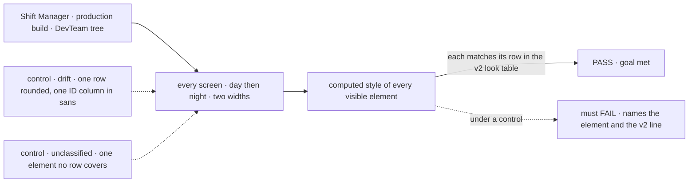

# FIX-1737 · Shift Manager matches v2's look

**Spec** · [Decisions](DECISIONS.md) · [Rules](BUSINESS-RULES.md) · [Plan](PLAN.md) · [Docs](DOCS.md)

## Five people, before and after

| Someone who… | Today | After |
|---|---|---|
| **opens Shift Manager day to day** | v2's colours on a generic layout: system sans everywhere, no monospace meta, rounded corners, a sidebar lighter than the page | v2's type, surfaces and square corners on every screen, day and night |
| **scans for what needs them** | The yellow highlighter shows up on Roster only; task states are words | The highlighter marks exactly what waits on them; every task state is v2's square |
| **works Inbox and Tasks** | No ID or TIME column, queued shown by default, no *From the session* | v2's Inbox and Tasks, with the content the Lab already holds |
| **reviews a screen against the design** | Holds a screenshot beside a template that can't be rendered | Reads one check that names the element and the v2 line it departs from |
| **decides whether the epic is done** | No check notices any of the 51 look and layout gaps | The closure's leg d runs that check on the closure commit |

The audit ([`assets/GAPS.md`](assets/GAPS.md), 2026-10-02) found 110 gaps from v2; 53 can be
drawn now and are this issue's.

## The goal, and how we'll know it's met

**A person using Shift Manager, day or night, sees every screen in design v2's look (its type,
surfaces, square corners, marks, proportions, and the content v2 draws that the Lab already
holds), except where a sibling's data, a structure kept from v1, or a registry part decides
otherwise; and a check fails the moment a screen drifts from v2.**

| Is it the right goal? | |
|---|---|
| **The real need** | Jake asked whether the epic fully delivers v2's theme and base UI. The answer adopted: the epic targets v2's look for everything not blocked on sibling data ([epic amendment](../../epics/FIX-1649/EVOLUTION.md#amendment--2026-10-02--v2s-look)) |
| **Smaller, and rejected** | "The theme values are v2's." True today, and the screens still don't look like v2. Every look check passes on it |
| **Bigger, and not this issue's** | Rows waiting on FIX-1650, 1651 or 1652 data, FIX-1675 or FIX-1474 · the kept v1 structure, X1 to X7 · the fonts (FIX-1736, which blocks this) · the registry parts ([open](DECISIONS.md#open)) |
| **Not done if** | A font is named but not loaded · the check passes a screen with an element it never classified · it reads class names · a screen was graded in one shift only · a behaviour check was loosened rather than updated · a registry copy was edited · the highlighter marks something nobody must act on |

The check reads what Chromium paints, against a table where every row cites the v2 line it
came from.

| How we verify | |
|---|---|
| **Goal check** | `goals/shift-manager/it-draws-v2s-look/` · model n/a · real Chromium · run by the implementer at each slice and on the assembled set · verdict in each implementation PR; the epic's closure re-runs it as leg d |
| **Signal** | Five legs, tagged `<leg> [<screen> <shift>]`: **type** (both fonts loaded, not only named; mono on meta; title scale), **surface** (v2's surfaces; radius 0 outside the [registry list](BUSINESS-RULES.md#registry-parts)), **marks** (the highlighter on every needs-you element and nothing else; state squares), **layout** (widths; the rail drops below 1180px), **content** (each drawable row, equal to the store). Zero failures, every visible element classified |
| **Input** | DevTeam (`--team devteam`) with one ask pending and runs live, as the audit rendered it; the CoS conversation on `it-briefs-and-talks-with-the-chief-of-staff`'s lab. At 1600×1000 and 1100×1000. A different Lab must pass too |
| **Anti-game** | Grade computed values, never class names. No row exists that v2 doesn't draw. No registry copy edited, no behaviour check weakened. The check does not count until FIX-1736 has merged |
| **Control that must fail** | `GOAL_CONTROL=drift`: one sidebar row rounded, Tasks' ID cells in sans. Must FAIL at **surface** on that row and **type** on those cells, both shifts, nothing else. `GOAL_CONTROL=unclassified`: one element no row covers; must FAIL at totality. Today's `main` fails every leg |

## What changes

Read across a leg: today nothing checks it; after, every screen it touches is graded. No Lab
changes a file.

## What stays as it is

- **Every route, tab and action.** v2's removed tabs stay (X1 to X7).
- **The theme values** v2 set on 2026-10-01, and leg c: no Shift Manager value without the import.
- **Registry copies stay unedited** ([ER-6](../../epics/FIX-1649/BUSINESS-RULES.md#what-no-child-may-do)).
- **What a surface means.** A row that waits on a sibling keeps its named empty state.

## Sign off

**[The goal](#the-goal-and-how-well-know-its-met), at that size:** v2's look on every screen,
day and night, for everything not blocked on a sibling, with a check that names any drift. If
wrong: we call the epic v2-matched while screens still read as v1, or wait on rows nobody can draw yet.

1. **[Open](DECISIONS.md#open) · The registry parts: FIX-1655 is Done, so no one owns them.**
   Recommend: record them as named exceptions, not a new child. **The one to weigh.**
2. **[D1](DECISIONS.md#d1) · "Matches v2" means a computed-style probe against a line-cited
   v2 look table, not a pixel diff.** If wrong: a drift the table doesn't list, spacing or an
   icon's shape, passes unseen.
3. **[D2](DECISIONS.md#d2) · Four PRs: the foundation and the check first, then three screen
   slices in parallel.** If wrong: three slices rebase on shared parts twice.

Reasoning and what lost: [DECISIONS.md](DECISIONS.md). The cases: [BUSINESS-RULES.md](BUSINESS-RULES.md).

Feature · private app `labs/shift-manager` and `labs/design-system`, `goals/shift-manager/` · large
(53 rows) · 4 PRs · epic [FIX-1649](../../epics/FIX-1649/SPEC.md) · blocked by
[FIX-1736](https://linear.app/fixpoint-labs/issue/FIX-1736) · blocks FIX-1663
