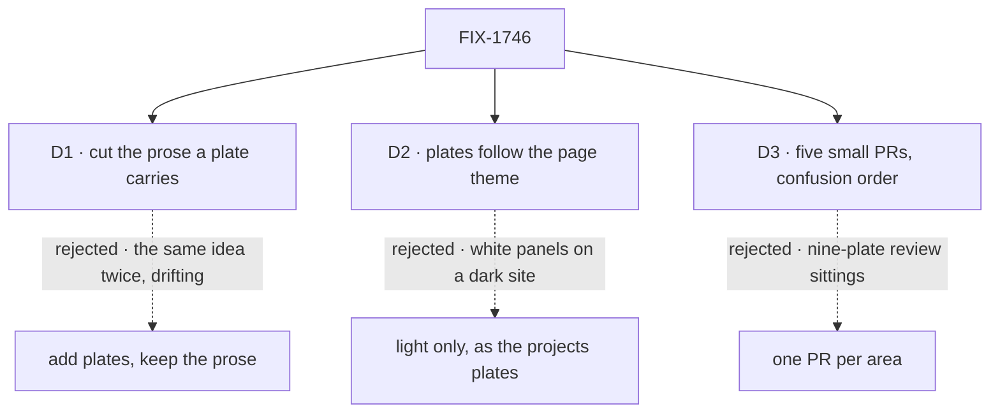

# FIX-1746 · Decisions

[Spec](SPEC.md) · **Decisions** · [Rules](BUSINESS-RULES.md) · [Plan](PLAN.md) · [Docs](DOCS.md)

What was considered, what was chosen, and what each choice locks in. Three decisions are the sign-off surface.

## The tree

Solid edges are what you're signing. Dashed edges lost, and the label says why.

## D1 · Where a plate carries a boundary, the prose that explained it is cut to one paragraph saying what to look at

| | |
|---|---|
| **Instead of** | Adding the plate and keeping the prose |
| **Because** | The ask is "more diagrams, fewer words". A skimming reader gets the boundary once, from the picture. Two statements of one boundary, in two shapes, drift on the next edit and the reader can't tell which is right (tenet 6, readability is an output) |
| **Locks in** | The plate is where each boundary is stated. A behaviour change has to redraw it, and its alt text has to carry the whole content, because a screen reader, a search index and an agent reading the markdown get only that. What stays in prose: error codes, limits, code examples, migration steps, tips |

It comes down to the skimming reader: keeping the prose hands them one boundary twice, in two shapes.

**What would change my mind:** knowing these pages are read mostly by tools that skip images. Then the prose stays and the plate is an addition.

## D2 · Each plate carries a light and a dark palette in one file and follows the page's theme

| | |
|---|---|
| **Instead of** | Copying the projects plates exactly, which are light-only with a white background |
| **Because** | The docs site opens in dark mode by default. A light-only plate is a white panel on a near-black page. Measured: the site sets `color-scheme` from its theme toggle, and an SVG's own dark-mode rule inside an `` follows it in Chromium ([Settled](#settled)) |
| **Locks in** | One look, both themes, in every plate. The five projects plates get the dark palette once their PR merges: style block only, words and layout untouched. Everything else about them is copied: walls, cards, the *not a copy* footer, the type scale |

It comes down to the site's default: light-only plates are white slabs on every page that has one.

**What would change my mind:** wanting the white paper-card look on purpose, as a brand choice in both themes.

## D3 · Five small PRs, in order of confusion, Workforce first

| | |
|---|---|
| **Instead of** | One PR per area: Workforce, then the user docs |
| **Because** | Each plate is reviewed against the code while it is fresh, one to three per sitting. The channel and hiring pages, where readers trip most, reach readers first |
| **Locks in** | PR 1 sets the look the other four copy. Changing the look after it merges means redrawing merged plates. Four PRs are independent; the guides PR follows the fundamentals PR because it reuses two of its plates |

It comes down to one review sitting: three plates are checked properly, nine are skimmed.

**What would change my mind:** preferring one sitting per area to five short ones.

## Decided, not asked

- **Hand-authored SVG, beside the page that uses it**, as the projects plates are. No generator: about eleven files under 150 lines each, and a hand-written file is diffable in review. A page reusing a plate links the one file by relative path rather than copying it.
- **The visual language is the projects plates':** labelled walls for homes, cards for things, a footer naming what is *not a copy*, boxes not steps. Width `940`, system fonts only, no external anything ([`spec-figures.md`](../../../docs/contributing/spec-figures.md)).
- **No plate for pages that teach file layout or commands:** Code on disk, Capabilities on disk, Packages on disk, Installation, Project structure, Setting up models, Existing project, Quick start. A file tree is a list, and a diagram of a list is harder to read.
- **Plates name only what the docs and API already name.** "Org plane" and "user plane" are not terms the product uses, so plates say *organization*, *user-owned* and *shared across flows*.
- **The guide-style pages are `apps/docs/guides/`**, the Guides sidebar (`sidebarsGuides.ts`). There is no `docs/guides/`. Of its pages, only Board lifecycle and Anatomy of a flow teach a shape; the rest are task walkthroughs.
- **Published prose goes through `docs-writer` then `docs-editor`, run by the coordinator** per PR, because the implementing worker can't dispatch them. The worker drafts plates, claims and the brief.
- **The transcript-trust plate on Channels waits** for the open post-author change to land, since it changes what a line records.

## Considered and dropped

| Alternative | Why not |
|---|---|
| Mermaid diagrams in the docs | Mermaid lays out steps and arrows; the ask is containment and walls, and mermaid rearranges those its own way |
| Two image files per plate, swapped by theme | Two files drift apart; one file with both palettes can't |
| Inline the SVG into the page as a component, styled by site CSS | Follows the toggle in every browser, but the file stops rendering on its own on GitHub and needs build config. The `` route already follows the toggle in Chromium and stays legible elsewhere |
| A script that generates plates from data | Eleven plates don't pay for a generator, and a generated layout is what makes boundaries look like flowcharts |

## Settled

- **A plate's own dark palette follows the site's theme toggle** — **CONFIRMED** in Chromium: an SVG in an `` takes the page's `color-scheme`, light or dark, whatever the OS says; with no page `color-scheme` the OS decides. The live site's CSS sets `color-scheme` from the toggle (`html[data-theme=dark]`). Run: `bash specs/issues/FIX-1746/poc/theme-follow/run.sh`. Other browsers are unmeasured; a plate that falls back to the OS still paints its own background, so it stays legible.

## How it got here

- **Draft** — framed as boundary plates for the pages readers trip on, prose cut where a plate carries it; the projects plates' look with a dark palette added; five small PRs, Workforce first.

**Open: none.**
