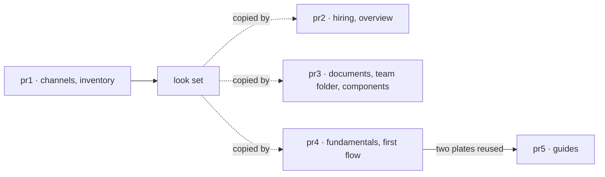

# FIX-1746 · Plan

[Spec](SPEC.md) · [Decisions](DECISIONS.md) · [Rules](BUSINESS-RULES.md) · **Plan** · [Docs](DOCS.md)

Written for the implementing agent. IDs cross-reference [BUSINESS-RULES.md](BUSINESS-RULES.md) (BR-n) and [DECISIONS.md](DECISIONS.md) (Dn). Docs only: neither `tdd` nor `diagnose`; the checks below replace a test suite. Five PRs.

## Surfaces

Plates live beside their page (`apps/docs/docs/workforce/<name>.svg`, as the projects plates do). Words cut are the section's prose today, fences excluded.

| ID | Page · section | Plate | Shows | Prose it replaces | PR |
|---|---|---|---|---|---|
| S1 | `workforce/channels.md` · What a channel is | `channel-parts` (drawn, [figure](figures/channel-parts.svg)) | Registered channel kind and seat · the channel's session (state: members, charter; items: lines, route decisions) · the seat's own session · org board rows and inventory row; footer: no board in the session, inventory is not the check, only the answer line lands | Paragraphs 2 to 5, about 155 words, to one paragraph. The tip box stays | 1 |
| S2 | `workforce/inventory.md` · opening and When to use which source | `seat-channel-records` | One seat and one channel, and each record about them: the tree (declares), inventory rows (registered, never deleted), roster row (hired, deleted on fire), the channel's session state (the check). Copies marked | About 300 of the 2 sections' words; the source list becomes the plate | 1 |
| S3 | `workforce/durable-hire.md` · Who can reach a hired seat | `hired-seat-reach` (drawn, [figure](figures/hired-seat-reach.svg)) | Org-visible and user-owned seat in acme: address, pin, who can see the row, who can use the seat; outside acme: 404 and absent from the flow list; footer: the row is not the seat, the address is not a permission, inventory outlives firing | The bullets and the Alice/Bob example, about 250 of 337 words. The resolver paragraph stays | 2 |
| S4 | `workforce/durable-hire.md` · What a seat saves for a person | `seat-person-data` | Where a person's data lands: one cell per person per organization for a hired seat, one per person per seat address when flow-isolated, and the person's own cell outside hired seats, which seats can't read | About 150 of 249 words. The projected-resource warning and the upgrade link stay | 2 |
| S5 | `workforce/built-in-worker.md` · What isolation does and does not give you | reuses S4 | — | About 60 of 143 words. The rename and no-migration warning stays | 2 |
| S6 | `workforce/overview.md` · What a Workforce app looks like | `workforce-parts` | Your files (`WORKER.md`, `CHANNEL.md`) · what hiring makes (one flow copy per worker, the one channel kind) · what stays the flow's (sessions, resources, boards) | About 120 of 245 words, plus What it will not do | 2 |
| S7 | `workforce/documents-on-disk.md` · Who reaches what | `document-reach` | `references/`: nested walls, organization ⊃ team ⊃ worker folder, a seat reaches its own wall and those around it. `resources/`: one organization wall, folders as labels only | The tree listing and about 250 of 609 words. The filter code and `references:` narrowing stay | 3 |
| S8 | `workforce/workers-on-disk.md` · What a team folder keeps to itself | reuses S7 | — | About 60 of 104 words | 3 |
| S9 | `workforce/ui.md` · Where each component reads from | `ui-read-sources` | Three sources as homes: one session's items (live, survives reload), a standing org collection (read on mount), the flow list (read once) | About 150 of 228 words | 3 |
| S10 | `fundamentals/state-and-scopes.md` · The four scopes, Why four scopes? | `state-scopes` | Org and user scopes shared across flows (user isolated per flow copy when set), session per conversation (state, items, metadata, journal, the resources an action declares), request scratch, and the `client` wall the browser sees through | Why four scopes? (100 words) and about 120 of The other three scopes | 4 |
| S11 | `fundamentals/overview.md` · State in four scopes | reuses S10 | — | The lifetime table | 4 |
| S12 | `fundamentals/flows.md` · How an instance is addressed, What the definition owns | `flow-type-instance` | The definition (transports, `configSchema`, internal entries) · each instance (id, config bag, resources, isolation) · each session belongs to the instance that created it | About 250 words across the two sections. The refusal table stays | 4 |
| S13 | `getting-started/your-first-flow.md` · What just happened | `first-flow-homes` | Browser (`useSession`: items and client data) · server (the registered flow runs the blocks) · store (session state, items) | Rewrites the 69 words around the plate | 4 |
| S14 | `guides/board-lifecycle.md` · A board is two things, What a board is not | `board-two-things` | Stored task rows, at the backing that sets their lifetime, beside the drain, a block that runs only inside a request | About 120 of 234 words | 5 |
| S15 | `guides/anatomy-of-a-flow.md` · 3 and 5 | reuses S10, S12 | — | A sentence or two each | 5 |
| S16 | `workforce/project-*.svg`, five files | recolour | Dark palette added, style block only (BR-16) | — | first PR cut after the projects PR merges |

No plate, by decision: Code on disk, Capabilities on disk, Packages on disk, Installation, Project structure, Setting up models, Existing project, Quick start ([Decided, not asked](DECISIONS.md#decided-not-asked)).

## Sequence · the PR plan

| Sub-PR | Deliverables | depends_on |
|---|---|---|
| pr1-channels | S1, S2 | — |
| pr2-hiring | S3, S4, S5, S6 | — |
| pr3-tree-and-ui | S7, S8, S9 | — |
| pr4-fundamentals | S10, S11, S12, S13 | — |
| pr5-guides | S14, S15 | pr4-fundamentals |

All five are independent of each other except pr5. Every PR copies the palette and type scale of the two drawn plates verbatim, so they can be built in parallel. Build pr1 first anyway when the coordinator can: it is the one Jake sees first.

## Checks

Each runs per PR, on that PR's plates and pages.

| ID | Passes when |
|---|---|
| V1 | CI's Docs Site Build (`pnpm docs:build`) is green |
| V2 | The PR body carries a claims table: for every boundary claim on every plate, the file and lines that make it true, and the test that pins it or *read only* (BR-1, BR-2) |
| V3 | The [figure verify block](../../../docs/contributing/spec-figures.md#verify-bp-003) check 4 over the PR's plates reports `ext=0 themes≥1 aria≥1`, and the same check over one current projects plate reports `themes=0`: the control |
| V4 | Screenshots of each changed page from the built site, toggle on light and on dark, in the PR (BR-12, BR-13) |
| V5 | `docs-editor` returns SHIP on the changed prose, and answers each plate's questions (below) from the plate and its alt text alone |
| V6 | Section word counts before and after are in the PR, and each cut section is at or under one paragraph plus what BR-8 keeps (BR-7) |
| V7 | Every inbound `#anchor` link into a changed page still resolves; no new broken-anchor warnings in the build log (BR-9) |

**Questions per plate**, for V5 (write the rest the same way, two or three each): S1, *where do a board's rows live?* · *is the inventory's member list what a post is checked against?* S3, *can Bob in acme call Alice's research seat?* · *can an acme browser list it?*

## Claims checked for the two drawn plates

| Claim | Where it is true |
|---|---|
| One `channel` instance; each channel is a session on it | `packages/workforce/src/channel/channel-flow.ts:1-12`, `cardinality: "singleton"` at `:1377` |
| `members` and `instructions` are the session's state, written once at open | `channel-flow.ts:83-95` (`channelSessionStateSchema`) |
| A post is checked against the session's `members` | `channel-flow.ts:231-249` (`lineFor`, `boundChannel(ctx.session.state)`) |
| Lines are `channel-post` items; the transcript is rebuilt from them | `channel-flow.ts:9-12`; `channel/channel-post-line.ts:19`; route decisions `channel-route` |
| Board rows are an org-scoped task ledger, id `<channel>.<board>`, never in the session | `channel/channel-board.ts:1-12, 238`; `channel-flow.ts:421` reads names from the kind, not state |
| A woken seat runs in its own session, keyed `channel:<channelId>` | `channel/wake-member-seats.ts:8-10, 132` |
| The inventory's channel row holds a copy of `members`; nothing deletes a row | `inventory/open-inventory.ts:17-27` |
| Org-visible address `<org>.<seatId>`, user-owned `<org>.~<user>.<seatId>` | `roster/address.ts:33-51` |
| Org roster readable by an org browser, exposing `seatId`, `flow`, `instructions` | `roster/collections.ts:136-167`; test `packages/workforce/test/cross-org-collection-read.test.ts` |
| User-owned row: owner-private, no browser read | `roster/collections.ts:182-190` |
| Outside the pin: `404 Unknown flow`, left out of the flow list | `packages/engine/src/routes/instance-caller.ts:117`, `route-utils.ts:849`, `http-handlers.ts:761-765`; pin stored in `registry/flow-registry.ts:635-660` |
| Firing deletes the roster row; the inventory row stays | `packages/workforce/src/seat-hire-blocks.ts:9-10, 249-250, 268` |

Anchors already found for the other plates, to start from: S4 `packages/engine/src/stores/scope-keys.ts:41-55, 160-175`; S7 `packages/workforce/src/seat-references.ts:15, 175`, `resources-from-docs.ts:46, 77`; S10 `scope-keys.ts:219` (tenant), `engine/src/registry/errors.ts:126`, `core/src/flow/defineFlow.ts:56-77`; S12 `engine/src/routes/action-routes.ts:255`.

## Guardrails

| Rule | Because |
|---|---|
| Re-verify every claim on the PR's base, even for the two drawn plates | Five open PRs touch these pages and this code; the anchors above are `main` at the spec's head |
| Copy the drawn plates' `<style>` block verbatim into each new plate | One look across sixteen files is what D2 and D3 promise, and a palette that drifts per file is the failure |
| The alt text carries the whole plate | It is all a screen reader, search and an agent reading markdown get (D1) |
| Change no code, and no prose outside the cut sections | Docs-only scope; a reviewer checks only what the ranked list names |
| A plate that disagrees with the page follows the code, and the page is fixed in the same PR | A plate is the boundary's only statement after D1; it can't start out wrong |

## Docs

This issue *is* the docs change. [DOCS.md](DOCS.md) drafts the replacement paragraph for each section. Per PR, the coordinator dispatches `docs-writer` with only that PR's `DOCS.md` operations and the plates, then `docs-editor`, round-tripping until SHIP (three rounds, then the coordinator). The implementing worker cannot dispatch them; it hands the coordinator the brief: pages, sections, plates, alt texts, the V5 questions. No changeset: `apps/docs` is private.

## Sketch

None. The two drawn plates are the sketch.

**POC:** [`poc/theme-follow/`](poc/theme-follow/run.sh), `bash specs/issues/FIX-1746/poc/theme-follow/run.sh`. It showed an SVG in an `` takes the page's `color-scheme` in Chromium, so a plate with its own dark-mode rule follows the site toggle. The premise held; D2 rests on it.

## At implement time

- **Open PRs on these pages.** Projects (four stacked PRs) adds a room section to Channels and edits Inventory. Org seats from `org/workers/` edits Workers on disk and Documents on disk, and changes which references a seat at org level reaches: draw S7 after it lands. Stored-seat repair edits Hiring at runtime and Inventory. The post-author change rewrites Channels' transcript section. Rebase on fresh `main`; re-check S1 to S9 against whatever merged.
- **Inventory keys.** The page says a seat row is `inventory/seats/<seatId>`. The ready-made hire writes it at the seat's address (`seat-hire-blocks.ts:250`), which for a hired seat is `<org>.<seatId>`. S2 shows the code; correct the table (BR-2).
- **S16** runs in whichever PR is cut first after the projects PR merges. If none is, file it on the projects issue instead.
- **Guides reach docs images** by relative path across plugins (`../docs/fundamentals/…`). Confirm the build resolves it, or keep a copy beside the guide.

## Follow-ups

- A transcript-trust plate for Channels (who the server vouches for, what a poster only claims), once the post-author change lands.
- The other guides and the Atlas pages, if Jake wants them after pr5.
