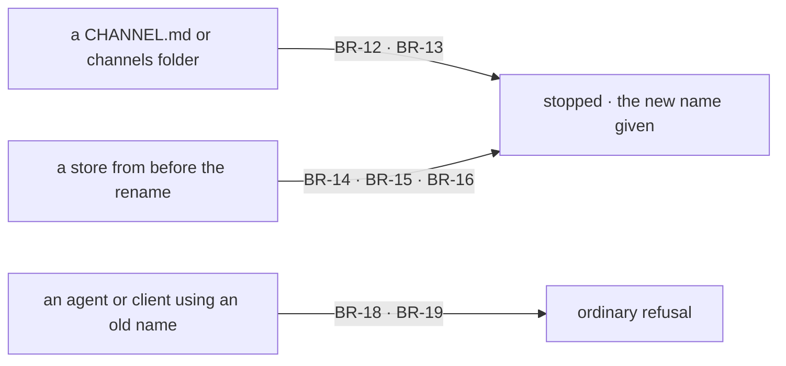

# FIX-1748 · Business rules

[Spec](SPEC.md) · [Decisions](DECISIONS.md) · **Rules** · [Plan](PLAN.md) · [Docs](DOCS.md) · [Evolution](EVOLUTION.md)

The cases, written as rules. A rename changes no behaviour, so most rules say what a person or an agent now *meets*. The rest say what happens when old names meet new code. The *proved by* column is the check the plan runs.

## What a builder, an agent or a person meets

| # | When | Then | Proved by |
|---|---|---|---|
| BR-1 | A builder imports from any published package | Only mailbox names are exported. No export, type or constant carries `channel` for the pipe | Typecheck of every renamed consumer · guard |
| BR-2 | A team writes `teams/<team>/mailboxes/<name>/MAILBOX.md` | Mailbox `<team>.<name>` loads and opens, by the same id rule as today | Renamed loader and binder suites |
| BR-3 | A builder adds a kind under `workforce/flows/mailboxes/` | `fsdev gen` exports it in `mailboxKinds` and reports "mailbox kind(s)" | Renamed codegen suite |
| BR-4 | An agent in a seat posts, reads or discovers | It calls `post-to-mailbox`, asks for the `mailboxes` domain, and every tool and action description says mailbox | Renamed capability and discovery suites · guard |
| BR-5 | A person posts from Shift Manager or the kitchen-sink | The line is a `mailbox-post` item; labels, placeholders and errors say mailbox | Renamed e2e and Shift Manager suites · copy table in the PR |
| BR-6 | Someone opens the DevTool's Inventory tab | It reads `inventory/mailboxes/` and titles the section "Registered mailboxes" | Renamed inventory-view suite |

## What stays

| # | When | Then | Proved by |
|---|---|---|---|
| BR-7 | A person opens Inbox | It lists the asks across every mailbox, as today. Nothing calls one mailbox an inbox | Shift Manager suite unchanged · copy review |
| BR-8 | A person opens a workstream | It is a declared mailbox and the boards it holds ([D3](DECISIONS.md#d3)) | Shift Manager goals |
| BR-9 | A mailbox holds a board | The board's id is `<mailboxId>.<board>`. Rows stored under it keep their keys, because the key never said channel | Board suites unchanged |
| BR-10 | Anyone posts, wakes, routes or files a row | Behaviour is identical. Only names in the assertions change | Every renamed suite, same assertions |
| BR-11 | Code or docs use the word for something else | A trace channel, Redis pub/sub, Postgres `LISTEN`, a Slack channel and a side channel stay | Guard's survivor list, phrase by phrase |

## Old files

| # | When | Then | Proved by |
|---|---|---|---|
| BR-12 | A tree still holds a `CHANNEL.md` or a `teams/*/channels/` folder | The loader reports one error per file naming `MAILBOX.md` and `mailboxes/`. Never skipped silently; hosts treat errors as fatal, as documented | Loader suite, red first on the unchanged loader |
| BR-13 | A tree still holds `workforce/flows/channels/` | `fsdev gen` refuses and names `flows/mailboxes/` | Codegen suite |

## Old data

| # | When | Then | Proved by |
|---|---|---|---|
| BR-14 | A boot opens mailboxes over a store whose session at that id is on the old `channel` kind | The boot stops. The message says the store predates the rename and must be reset, not that someone else's session collides | Binder suite · goal check |
| BR-15 | DevTeam boots over a store written before the rename | The store is moved aside, never deleted; the boot logs where and starts fresh | Extends the DevTeam legacy-store suite |
| BR-16 | The kitchen-sink boots over a filesystem or Postgres store written before the rename | The boot stops, names each stale mailbox and says how to reset, as its organization check does | Kitchen-sink boot suite |
| BR-17 | A store holds old records under a custom kind's name | Lab detectors key on the store, not the kind: an old inventory row or `channel-post` item marks it pre-rename (BR-15, BR-16) | Lab suites, one custom-kind case |
| BR-18 | An agent asks discovery for `channels` | Refused with the valid domains listed, as for any unknown domain | Discovery suite |
| BR-19 | A client calls an action on the old `channel` kind | Unknown flow, as for any kind that isn't registered | Existing route suite |

## Docs and the guard

| # | When | Then | Proved by |
|---|---|---|---|
| BR-20 | Someone follows `/docs/workforce/channels` | They land on `/docs/workforce/mailboxes` | Docs build · redirect check |
| BR-21 | The docs build | It passes, and no page in scope says channel for the pipe or calls one mailbox an inbox | Docs build · guard |
| BR-22 | The guard runs on any tree | Every tracked file is classified or it fails. A planted product line counts. Today's `main` fails | The guard and its two controls |

Old data meets new code at three gates, and each one names the rename:

## Failure taxonomy

Every old file and old store is fatal at boot or at `fsdev gen`, with the new name in the message. A Lab store is set aside, never deleted. An old name from an agent or a client is an ordinary refusal. Nothing degrades silently, and nothing retries.

## Acceptance criteria this issue owns

[The goal](SPEC.md#the-goal-and-how-well-know-its-met): on each PR's head, the guard passes on the surfaces that PR renamed and the boot leg stops by name, after both failed under their controls.
