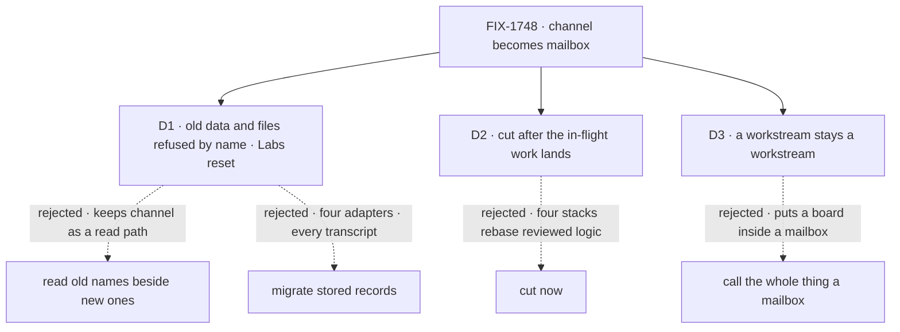

# FIX-1748 · Decisions

[Spec](SPEC.md) · **Decisions** · [Rules](BUSINESS-RULES.md) · [Plan](PLAN.md) · [Docs](DOCS.md) · [Evolution](EVOLUTION.md)

The word and its fences are the owner's lock, not reopened here. These three calls are what the lock left open.

## The tree

Solid edges are what you're signing. Dashed edges lost, and the label says why.

## D1 · Data and files from before the rename are refused by name, and in-repo Labs reset their stores; nothing reads the old names

| | |
|---|---|
| **Instead of** | Reading old names beside the new ones (BP-030's dual-read), or a migration that rewrites stored sessions, items and inventory rows |
| **Because** | No outside implementations, and the lock forbids `channel` as a wire name, which a dual-read keeps. A migration rewrites every transcript item and inventory row in four store adapters, for data a Lab mostly rebuilds from its files. This week the repo chose reset over migrate twice for the same break: kitchen-sink's organization id, and DevTeam's |
| **Locks in** | A Lab store from before doesn't carry over: its transcripts, runtime-created projects and hired seats are set aside (DevTeam) or deleted (kitchen-sink). The old words live in one refusal module until 1.0 |

It comes down to the wire: reading old names keeps `channel` there, which the lock rules out.

Without D1 an old store still fails, but blames a collision and gives the wrong advice ([Settled](#settled)).

**What would change my mind:** a store you use, such as your DevTeam Lab or the deployed kitchen-sink database, holding history you want kept. Then a one-off script migrates that store once, and nothing reads old names after.

## D2 · Cut the rename once the in-flight Workforce and Shift Manager work lands, then the docs

| | |
|---|---|
| **Instead of** | Cutting now, and asking four in-flight stacks to redo their changes under the new names |
| **Because** | The rename is a mechanical sweep the guard checks, so re-running it on a newer `main` is cheap. The in-flight PRs carry reviewed logic, which isn't. FIX-1718's last three PRs, 76 files and about 650 lines saying channel, aren't on `main` yet |
| **Locks in** | The code cut waits on FIX-1718's stack, FIX-1715's fix and Shift Manager's redesign (FIX-1737); the docs wait on FIX-1746's five diagram PRs, so no plate is renamed twice |

It comes down to who redoes work: the sweep re-runs for free, and reviewed logic doesn't.

**What would change my mind:** FIX-1718's stack staying stalled. Its PRs 2 and 3 merged into stacked branches, not `main`, and PR 4 targets one of them. If it isn't retargeted within days, cut now and hand it one rebase.

## D3 · In Shift Manager a workstream stays a workstream, and "mailbox" names its conversation

| | |
|---|---|
| **Instead of** | Renaming workstreams to mailboxes in Shift Manager |
| **Because** | A workstream is a mailbox plus the boards it holds, under a project ([FIX-1662 D2](../FIX-1662/DECISIONS.md#d2), FIX-1718). Calling it all a mailbox puts a board inside a mailbox, which the lock rules out |
| **Locks in** | Shift Manager shows both words: workstreams in the sidebar and headings, mailbox where the conversation is meant |

It comes down to where a board sits: beside the mailbox, never inside it.

**What would change my mind:** wanting Shift Manager to teach one word, and accepting a board described as part of a mailbox.

## Decided, not asked

- **Names follow mechanically**, pinned in [the plan](PLAN.md#pinned-names).
- **No deprecated aliases.** The lock says code too; pre-1.0 the break ships as `minor`.
- **Two PRs, not one per layer.** Shift Manager, the DevTool and the goals read the wire, and a workforce test reads tree shapes from the docs, so a layer split needs the aliases the lock forbids.
- **Other meanings stay**, each named in the guard: trace channel, pub/sub, `LISTEN`, Slack, side channel.
- **History stays.** Specs, CHANGELOGs and released notes keep the old word; an unshipped changeset naming a renamed surface is reworded.
- **The docs page moves** to `/docs/workforce/mailboxes`, and the old address redirects.
- **No new type**: the same flow kind, renamed. No L1 Mailbox, no pipe beside agent-mailbox.

## Considered and dropped

| Alternative | Why not |
|---|---|
| Rename the copy, keep the wire | The lock rules it out |
| `inbox` for the pipe | Inbox is the ask list across mailboxes (FIX-1662) |
| One implementation with agent-mailbox | Same concept, different transport; the lock asks for no second pipe type, not one codebase |

## Settled

- **The inventory's numbers** — **CONFIRMED** by [`poc/channel-inventory/`](poc/channel-inventory/inventory.mjs) on `6e8685e79`: every file classified, both controls red. Its first survivor rule absorbed a planted line, and was narrowed.
- **An old store already fails, with the wrong advice** — **CONFIRMED** from the binder's occupant check: another kind at the id throws, telling the person to rename. BR-14 fixes the advice.

## How it got here

- **Draft** — a locked rename with three calls left open: old data, timing, Shift Manager's two words. One atomic code cut, then docs; proved by a tree-wide guard and a boot over old data.

**Open: none.**
