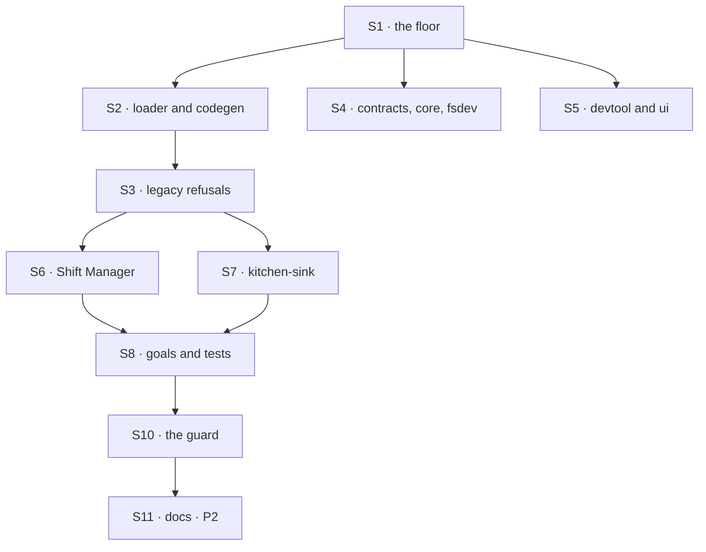

# FIX-1748 · Plan

[Spec](SPEC.md) · [Decisions](DECISIONS.md) · [Rules](BUSINESS-RULES.md) · **Plan** · [Docs](DOCS.md) · [Evolution](EVOLUTION.md)

For the implementing agent; BR-n and D-n cite [rules](BUSINESS-RULES.md) and [decisions](DECISIONS.md). `tdd`: renamed suites are the net; refusals are the only new behaviour. Two PRs.

## Inventory · `origin/main` at `6e8685e79`

Re-derived by `node specs/issues/FIX-1748/poc/channel-inventory/inventory.mjs` (per-name hit counts: `--json`). A *product line* means the pipe; a *survivor* is another meaning, in English phrases only. An unclassified file fails the run.

| Group | Measured over | Files | Product lines |
|---|---|---|---|
| Public API, published packages | `packages/<published>/src/**` | 54 | 1,306 |
| UI: Shift Manager, kitchen-sink, DevTool | `labs/**`, `apps/kitchen-sink/**`, `packages/{devtool,ui}/**` | 53 | 446 |
| Goals | `goals/**` | 145 | 1,890 |
| Docs | `apps/docs/**`, `docs/**` but `internal/`, READMEs | 44 | 924 |
| Tests | `test/`, `e2e/`, `*.test.*`, `*.spec.*` | 92 | 2,083 |
| **In scope** | | **388** | **6,649** |
| Not renamed: history | retained specs, `docs/internal/`, CHANGELOGs, pending changesets | 435 | — |
| Not renamed: process | `.agents/`, `.omp/`, `.github/`, `CLAUDE.md`, all other meanings | 9 | — |

- **Exports:** 70 identifiers, all in `workforce`, plus `channels` in `contracts`' `MANIFEST_DOMAINS`, re-exported by `core`.
- **File convention:** 26 `CHANNEL.md`, 24 `channels/` folders, 1 kind file under `flows/channels/`, and 72 more paths named channel (31 goals, 22 tests, 11 API, 5 UI, 3 docs).
- **Routes:** none defined with the word. It reaches URLs only as the kind in `/flows/:kind/actions/:action` and the action `registerChannelInInventory` (19). Shift Manager's `/w/<id>` has none.
- **Stored wire names:** kind `channel`, `channelId` on membership rows, `channel-post` and `channel-route` items, `inventory/channels/`, `channelRoutedPost` seat state.
- **Model- and trace-facing:** `post-to-channel`, discovery `channels`, `channelKinds`, `channel-*` block names, capability `channel-post`, refusal `talk-on-a-channel`.

These counts are a snapshot. FIX-1718 PRs 2–4 add 76 files and about 650 lines, so the cut re-runs the script with `--json` and works from that, not from this table.

## Surfaces

| ID | Package · role | Change | Rules |
|---|---|---|---|
| S1 | `workforce` · the floor | `src/channel/` → `src/mailbox/`, and every name in it. **Remove** each `channel` export | BR-1 BR-4 BR-9 BR-10 |
| S2 | `workforce` · loader, codegen | `MAILBOX.md` under `mailboxes/`; `flows/mailboxes/`; `mailboxKinds` | BR-2 BR-3 |
| S3 | `workforce` · legacy refusals | One module holds the old words: loader errors, gen refusal, the binder's message for the old kind | BR-12–14 |
| S4 | `contracts`, `core`, `fsdev` | Discovery domain, tool text, `gen` output | BR-3 BR-4 BR-18 |
| S5 | `devtool`, `ui` registry | Inventory tab; `mailbox-route` suppressed | BR-6 |
| S6 | Shift Manager | Reads, data attributes, copy; DevTeam's set-aside learns the old kind | BR-5 BR-7 BR-8 BR-15 BR-17 |
| S7 | kitchen-sink | Tree, controls, sections, copy, e2e selectors; the stale-store check learns the old kind | BR-5 BR-16 BR-17 |
| S8 | goals, tests | Rename directories, files and subjects with their code; assertions keep their meaning | BR-10 |
| S9 | READMEs, changeset | READMEs; the tree shapes `published-tree-surface.test.ts` reads from `apps/docs` | BR-1 |
| S10 | The guard | The POC as `scripts/check-mailbox-rename.mjs` in CI, scoped per PR | BR-22 |
| S11 | Docs (P2) | [DOCS.md](DOCS.md) | BR-20 BR-21 |

## Sequence

### PR plan

| id | Deliverables | depends_on |
|---|---|---|
| P1 · the cut | S1–S10, atomic. `minor`: `workforce`, `contracts`, `core`, `fsdev`; `patch`: `devtool` | FIX-1718 PRs 2–4 on `main` · #2604 · FIX-1737 #2675 #2681 #2682 #2683 |
| P2 · the docs | S11; guard widened to docs | P1 · FIX-1746 #2674 #2676 #2677 #2679 #2680 |

## Checks

| ID | Runs after | Passes when |
|---|---|---|
| V1 | S1 S2 S4 | Typecheck and renamed suites pass, assertions unchanged but for names |
| V2 | S3 | BR-12–14, red first on today's code |
| V3 | S6 | BR-15 via the DevTeam legacy-store suite; BR-17's custom-kind case |
| V4 | S7 | BR-16; `talk-from-page` and `workforce-shell` e2e on the new labels |
| V5 | S8 | Every goal the sweep touched passes under its new name |
| VG | S10 | [The goal](SPEC.md#the-goal-and-how-well-know-its-met): guard green on P1's scope after red on today's `main` and `PLANT=product`; the boot leg stops by name after failing with its detector removed |
| V6 | S11 | Docs build; redirect resolves; guard green with docs in scope |

The second path (BP-035) is the old store and tree: V2–V4. Detection only reads, so concurrent boots can't race.

## Pinned names

| Where | Name | Why pinned |
|---|---|---|
| Record | `MAILBOX.md` in `teams/<team>/mailboxes/<name>/`; kinds in `workforce/flows/mailboxes/` | A builder types them |
| Stored | kind `mailbox`; items `mailbox-post`, `mailbox-route`; `inventory/mailboxes/<id>`; field `mailboxId` | In every store |
| Agent-facing | `post-to-mailbox`, capability `mailbox-post`, domain `mailboxes`, `registerMailboxInInventory` | Models read them |
| Code | `mailbox`, `Mailbox`, `MAILBOX` where `channel` stood; plural `mailboxes`; `mailboxKinds` | The lock: code too |
| Docs | `/docs/workforce/mailboxes`, **Mailboxes** | Linked from outside |

Everything else is yours to name.

## Guardrails

| Rule | Because |
|---|---|
| One sweep: no aliases or deprecated re-exports | An alias is the temporary wire name the lock forbids |
| Old words only in S3 and the survivor list | Anywhere else is a missed rename |
| Never widen a survivor rule to go green; never let one match code | Two have swallowed product lines ([Settled](DECISIONS.md#settled)) |
| Never delete a store: set aside, or stop | D1's price is history; a moved file is recoverable |
| Rename paths, headers, test names (BP-034) | A `channel-*.test.ts` testing mailboxes is drift |
| No behaviour change rides along | Suites are the net only while assertions hold |

## Docs

Publish [DOCS.md](DOCS.md) in P2, after P1 and FIX-1746's plates. P1 touches only READMEs and the shapes the tree test pins.

**POC:** [`poc/channel-inventory/`](poc/channel-inventory/inventory.mjs) re-derives the inventory, asserts totality, drafts the guard. All three controls go red (`PLANT=unclassified`, `product`, `wire`); the last two only after survivor rules were narrowed twice.

## At implement time

- Re-run the inventory; check FIX-1718, #2604 and FIX-1737 (D2's flip).
- Unshipped changesets naming renamed surfaces get reworded.
- Check [Evolution](EVOLUTION.md)'s names against code, not specs.

## Notes from review

- "Drop wire-shaped patterns from survivors (`input.channels`, `channels: z.array`): they are product in `inventory-collections.test.ts`." — cursor ([thread](https://github.com/fixpoint-labs/flow-state-dev/pull/2686#discussion_r4171324001)). Fixed in the POC; counts above re-run.
- "Promote a thin `scripts/check-mailbox-rename.mjs`: classify every path (totality), then the product scan, with its functions exported for vitest as `check-isolation-coordinate.mjs` does. The full inventory stays in the POC for `--json` at the cut." — cursor ([thread](https://github.com/fixpoint-labs/flow-state-dev/pull/2686#discussion_r4171324004), [thread](https://github.com/fixpoint-labs/flow-state-dev/pull/2686#discussion_r4171324008))
- "Tie the `PLANT=product` control to a green-tree vitest fixture; on today's `main` the guard is red everywhere." — cursor ([thread](https://github.com/fixpoint-labs/flow-state-dev/pull/2686#discussion_r4171324014))
- "Re-run the inventory at the cut instead of trusting the PLAN counts." — cursor ([thread](https://github.com/fixpoint-labs/flow-state-dev/pull/2686#discussion_r4171324010)). Optionally add `poc/channel-inventory/README.md`.

Inputs, not instructions.

## Follow-ups

- Remove S3 at 1.0; file it when P1 merges.
- The Workforce App Lab project spec (#2420) renames at its next refresh.
