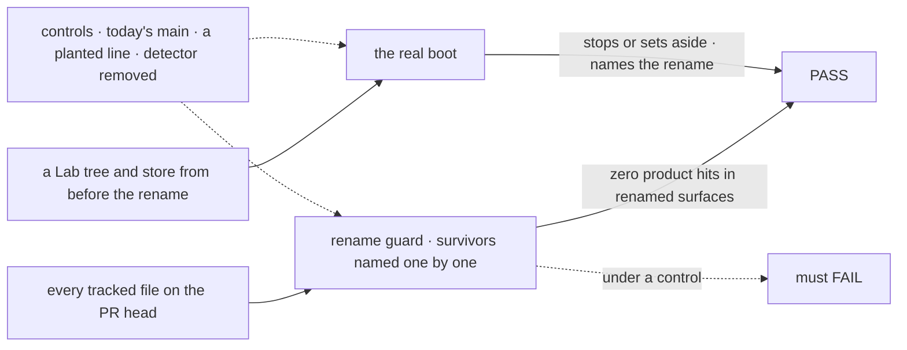

# FIX-1748 · Rename product "channel" → "mailbox"

**Spec** · [Decisions](DECISIONS.md) · [Rules](BUSINESS-RULES.md) · [Plan](PLAN.md) · [Docs](DOCS.md) · [Evolution](EVOLUTION.md)

## Six people, before and after

| Someone who… | Today | After |
|---|---|---|
| **writes a team's conversation on disk** | Adds `teams/eng/channels/feature/CHANNEL.md` | Adds `teams/eng/mailboxes/feature/MAILBOX.md`. A leftover `CHANNEL.md` is reported, with the name to use |
| **builds on `@flow-state-dev/workforce`** | Imports `channelFlow`, renders `channel-post` items | Imports `mailboxFlow`, renders `mailbox-post` items. Old names don't resolve |
| **is an agent in a seat** | Calls `post-to-channel`, discovers `channels` | Calls `post-to-mailbox`, discovers `mailboxes` |
| **posts in Shift Manager or the kitchen-sink** | Reads "channel" in posting and error copy | Reads "mailbox". Inbox still lists the asks across all of them |
| **reopens a Lab whose store predates the rename** | n/a | Kitchen-sink stops and says to reset. DevTeam sets the store aside, says where, starts fresh |
| **follows an old docs link** | `/docs/workforce/channels` | Redirected to `/docs/workforce/mailboxes` |

"Channel" reads as a Slack room. What Workforce ships is one addressable two-way conversation that several writers post into. The owner locked **mailbox**, the same idea as agent-mailbox.

## The goal, and how we'll know it's met

**Everywhere a builder, an agent or a person meets the one-conversation pipe — the code they import, the files they write, what the store keeps, Shift Manager and the docs — it is called a mailbox, and nothing still answers to "channel".**

| Is it the right goal? | |
|---|---|
| **The real need** | "Full rename including wire … do not leave `channel` as a temporary wire name" ([FIX-1748](https://linear.app/fixpoint-labs/issue/FIX-1748), the owner's lock) |
| **Smaller, and rejected** | "Docs and UI say mailbox." It leaves `channel` in the API, the files and the store, which is the half the lock names explicitly |
| **Bigger, and not this issue's** | One codebase shared with agent-mailbox, or renaming Inbox. The lock asks for one concept, not one implementation, and Inbox stays FIX-1662's |
| **Not done if** | The guard passes because a survivor rule swallowed a product line · a pre-rename Lab boots with mailboxes missing their history and no message · a leftover `CHANNEL.md` is skipped silently · an old docs link 404s · anything calls one mailbox an inbox |



The guard reads the whole tree, not a remembered list; the boot leg reads what a person sees. Each must fail under its control.

| How we verify | |
|---|---|
| **Goal check** | The guard, promoted from [`poc/channel-inventory/`](poc/channel-inventory/inventory.mjs) into CI, and `goals/workforce-mailboxes/a-pre-rename-lab-is-refused-by-name/`. No model. The implementer runs both per PR; the verdict goes in it |
| **Signal** | Guard: every file classified, zero product hits in the PR's renamed surfaces. Boot: stops or sets the store aside, naming the rename; never opens |
| **Input** | Today's tree; a fixture with one `CHANNEL.md` and a store with one old-kind session. A custom-kind mailbox on a fresh store must open |
| **Anti-game** | Never widen a survivor rule to go green. Assert on the message a person reads, not that something threw |
| **Control that must fail** | Guard on today's `main` (388 files, measured) and with `PLANT=product`. Boot leg with the legacy detector removed must FAIL on *boot stopped with the rename named* |

## What changes


Read across each row: every place the word lives moves together. Below the fence is what doesn't move.

**For someone building on Workforce, the change looks like this:**

```diff
- workforce/teams/eng/channels/feature/CHANNEL.md
+ workforce/teams/eng/mailboxes/feature/MAILBOX.md

- import { channelFlow, openChannels } from "@flow-state-dev/workforce";
- await openChannels(workforce.channels, { client, userId });
+ import { mailboxFlow, openMailboxes } from "@flow-state-dev/workforce";
+ await openMailboxes(workforce.mailboxes, { client, userId });

- const lines = items.filter((item) => item.component === "channel-post");
+ const lines = items.filter((item) => item.component === "mailbox-post");
```

## What stays as it is

- **Inbox** is Shift Manager's list of asks across mailboxes (FIX-1662). It is never one mailbox.
- **Boards** stay task ledgers a mailbox holds. Seat, kind and agent keep their names.
- **Workstream** stays Shift Manager's name for a team's mailbox and its boards ([D3](DECISIONS.md#d3)).
- **Behaviour**: posting, waking, routing and membership rules. Board ids keep their shape.
- **Other meanings**: trace, pub/sub and Slack channels. **History**: specs, CHANGELOGs, released notes.

## Sign off

**[The goal](#the-goal-and-how-well-know-its-met), at that size:** product and wire, measured by a guard over the whole tree and a boot over old data. If wrong: we ship new copy over an old wire, or a Lab that opens with silent holes.

1. **[D1](DECISIONS.md#d1) · Data and files from before the rename are refused by name, and in-repo Labs reset their stores; nothing reads the old names.** If wrong: someone loses Lab history they wanted.
2. **[D2](DECISIONS.md#d2) · Cut the rename once the in-flight Workforce and Shift Manager work lands, then the docs.** If wrong: days of delay, or four stacks rebased for nothing.
3. **[D3](DECISIONS.md#d3) · In Shift Manager a workstream stays a workstream, and "mailbox" names its conversation.** If wrong: two words where you wanted one.

**Open: none.** D1 is the one to weigh: the only call that loses data.

Rename · `workforce` · `contracts` · `core` · `fsdev` · `devtool`, plus Shift Manager, kitchen-sink, goals and docs · large: 388 files, 13 wire names, 26 `CHANNEL.md` files · 2 PRs · no epic
