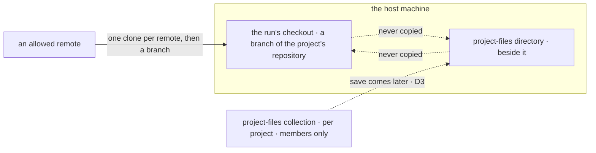

# FIX-1762 · Business rules

[Spec](SPEC.md) · [Decisions](DECISIONS.md) · **Rules** · [Plan](PLAN.md) · [Docs](DOCS.md) · [Evolution](EVOLUTION.md)

The cases, written as rules. Each says what a person or the system does and what happens. The
*proved by* column is the check the plan runs. Rules marked **(D3)** assume the recommended
boundary-only answer.

## Recording a repository

| # | When | Then | Proved by |
|---|---|---|---|
| BR-1 | A member creates a project with a `repository` | The row stores it as given; the Brief shows it | CI · goal leg a |
| BR-2 | A project is created without one | `repository` is `null`. It is a full project: room, members, workstreams as today | CI |
| BR-3 | A member sets, changes or clears it later | The row holds the new value; nothing else on the row moves | CI |
| BR-4 | A non-member tries to set it | Refused, `not-a-member`, as `setWorkstreams` is | CI |
| BR-5 | The value is a bare filesystem path (`/home/x/repo`, `./repo`, `C:\repo`) or starts with `-` | Refused, `invalid-repository` | CI |
| BR-6 | The value carries a credential: any userinfo on `http(s)` (`https://tok@host/…`) or a password on any scheme | Refused, `invalid-repository`, and the value is not echoed in the error. An SSH login name with no password is allowed: `git@host:org/repo` and `ssh://git@host/org/repo` both pass | CI · both SSH spellings accepted |
| BR-7 | A row written before this change is read | Reads with `repository: null` (BP-023, BP-030) | CI over a stored legacy row |
| BR-8 | Two members set it at once | One value wins whole; neither is merged into the other | CI |
| BR-9 | The chief of staff sets or changes a repository, at create or later | The change pauses for a person's approval in Inbox (`human_approval`), as a fire does. Approve writes it; Deny writes nothing and the chief of staff is told (D2) | CI · deny path asserted |

## Which remotes the host will reach

| # | When | Then | Proved by |
|---|---|---|---|
| BR-10 | A run's project names a remote whose scheme or host the operator did not list | Refused at the attempt, naming the remote and "not allowed on this host"; nothing is cloned | Goal leg d |
| BR-11 | The remote is `file://` | Refused unless the operator lists `file` explicitly. The goal check opts in | CI |
| BR-12 | Git is run on a remote | Arguments end option parsing (`--`) before the remote, and git's allowed protocols are only the listed schemes; `ext::` and other transports never run | CI with an `ext::` and an `ssh://-o…` value |
| BR-13 | Where the repository comes from | Only from stored, server-written data: the board's workstream, its claim and the project row. Nothing in the row's input, metadata or a model's output can choose it (BP-031) | CI · a row carrying a repository in its input is ignored |

## Running work in the project's repository

| # | When | Then | Proved by |
|---|---|---|---|
| BR-14 | A coding row runs for a workstream whose project records an allowed repository | The run's checkout is a new branch of that repository, cut from its default branch. Nobody named a folder | Goal leg a |
| BR-15 | The first run for a remote on this host | The host clones it once, under the folder checkouts already live in. Later runs reuse that clone | CI |
| BR-16 | Two runs for one remote start at once | One clone is made; neither run sees a half-made one | CI |
| BR-17 | A new row starts on a remote the host already cloned | The clone is fetched, and its record of the remote's default branch refreshed, before the branch is cut. A remote that renamed its default branch is followed | CI · default-branch rename case |
| BR-18 | A row retries | It continues in its existing checkout. No fetch, no rebase, no reset | CI |
| BR-19 | The project records no repository | Refused before any harness runs, naming the project and "no repository" (D1) | Goal leg c |
| BR-20 | The workstream belongs to no project | Refused the same way, naming the workstream | CI |
| BR-21 | The project's repository changed after a row started | The row's next attempt is refused, naming both repositories; its checkout is untouched. Rows filed after the change use the new one | CI · goal leg b for the new row |
| BR-22 | The host cannot reach or read an allowed remote | The attempt fails before the harness runs, naming the remote; no credential is printed | CI |
| BR-23 | An app passes a fixed `sourceRepo` as today | Unchanged behaviour, through the same provisioning path | Existing harness-manager suite, unchanged |

## The project's own files

| # | When | Then | Proved by |
|---|---|---|---|
| BR-24 | A coding run starts | It gets a directory for project files beside its checkout, never inside the worktree, and its prompt context names it | Goal leg a |
| BR-25 | The run writes there | Nothing it writes appears in the checkout's `git status`, and nothing from the checkout is copied there | Goal leg a |
| BR-26 | **(D3)** The run ends | The directory is not saved to the collection in this slice. A host may fill the before/after hook itself | CI · hook called on success and on failure |
| BR-27 | Project files are stored | Under `project-files/<projectId>/…`. A read is allowed only to the project's `members`, checked against the row; no browser read | CI · a member of project A reading B's key is refused |
| BR-28 | **(D3)** Any later lay-out or save from a run | Only when the run's owner is a member of the resolved project, checked inside `projectWorkspace`; and only the project's own keys, filtered at the source (BP-033). Handing a run the whole collection is not allowed: a mount lists everything it is given | Rule for the follow-up. In this slice `projectWorkspace` gives a run no file access at all (V6) |
| BR-29 | A project has no repository | Its files collection still exists and is still the project's | CI |

The two boxes on the host never feed each other. Code comes from an allowed remote; the
collection is the project's, and joining it to the run's directory is the open D3.

## Failure taxonomy

Every refusal (BR-4, 5, 6, 10, 11, 19, 20, 21, 22) happens before an agent is paid and names its
reason. None retries on its own: each needs a person to fix the project, its workstreams, the
host's list or its access. A denied chief-of-staff change (BR-9) writes nothing.

## Acceptance criteria this issue owns

[The goal](SPEC.md#the-goal-and-how-well-know-its-met): on the DevTeam Lab, a run for a project
that names allowed repository A commits on a branch of A with its project-files directory
outside the worktree, a new row after switching to B lands on B, a project with none is refused
before any harness runs, a disallowed remote is refused with nothing cloned, and the same check
FAILS under `GOAL_CONTROL=fixed-source`.
