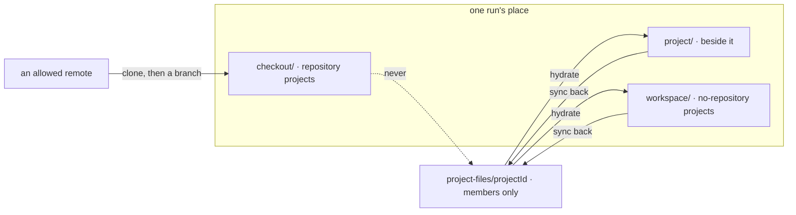

# FIX-1762 · Business rules

[Spec](SPEC.md) · [Decisions](DECISIONS.md) · **Rules** · [Plan](PLAN.md) · [Docs](DOCS.md) · [Evolution](EVOLUTION.md)

The cases, written as rules. Each says what a person or the system does and what happens. The
*proved by* column is the check the plan runs. Slice 1 only; later slices are in
[EVOLUTION.md](EVOLUTION.md).

## Recording a repository

| # | When | Then | Proved by |
|---|---|---|---|
| BR-1 | A member creates a project with a `repository` | The row stores it; the Brief shows it | CI · goal leg a |
| BR-2 | A project is created without one | `repository` is `null`. A full project, and its coding rows run on its files (BR-20) | CI · goal leg b |
| BR-3 | A member sets, changes or clears it later | The row holds the new value; nothing else on the row moves | CI |
| BR-4 | A non-member tries to set it | Refused, `not-a-member` | CI |
| BR-5 | The value is a bare filesystem path or starts with `-` | Refused, `invalid-repository` | CI |
| BR-6 | The value carries a credential: userinfo on `http(s)`, or a password on any scheme | Refused, `invalid-repository`, not echoed. `git@host:org/repo` and `ssh://git@host/org/repo` pass | CI · both SSH spellings |
| BR-7 | A row written before this change is read | Reads with `repository: null` (BP-023, BP-030) | CI over a stored legacy row |
| BR-8 | Two members set it at once | One value wins whole | CI |
| BR-9 | The chief of staff sets or changes a repository, at create or later | Pauses on `human_approval` in Inbox. Approve writes it; Deny writes nothing | CI · deny path |

## Which remotes the host reaches

| # | When | Then | Proved by |
|---|---|---|---|
| BR-10 | A project names a remote whose scheme or host the operator did not list | Refused at provisioning, naming the remote; nothing is cloned | Goal leg c |
| BR-11 | The remote is `file://` | Refused unless the operator lists `file` | CI |
| BR-12 | Git runs on a remote | `--` before the remote; `GIT_ALLOW_PROTOCOL` is the listed schemes only; `ext::` never runs | CI with `ext::` and `ssh://-o…` |
| BR-13 | Where a run's source comes from | Only stored, server-written data: the board's workstream, its claim, the project row. Nothing in a row's input, metadata or a model's output (BP-031) | CI |

## A project with a repository

| # | When | Then | Proved by |
|---|---|---|---|
| BR-14 | A coding row runs | `checkout/` is a new branch of the project's repository, cut from its default branch. Nobody named a folder | Goal leg a |
| BR-15 | The first run for a remote on this host | One clone, under the host's root, reused after | CI |
| BR-16 | Two first runs for one remote at once | One clone; neither sees a half-made one | CI |
| BR-17 | A new row on a cloned remote | Fetched, default-branch record refreshed, then the branch is cut | CI · default-branch rename |
| BR-18 | A row retries | Same checkout. No fetch, rebase or reset | CI |
| BR-19 | The project's repository changed after a row started | The row keeps the remote recorded on its run; new rows use the new one | CI |
| BR-21 | The host cannot read an allowed remote | Fails before the harness runs, naming the remote; no credential printed | CI |
| BR-22 | An app passes a fixed `sourceRepo` | Unchanged behaviour through the same path | Existing suite |

## A project with no repository

| # | When | Then | Proved by |
|---|---|---|---|
| BR-20 | A coding row runs | The run's cwd is `workspace/`, hydrated from `project-files/<projectId>/`. The first run starts empty | Goal leg b |
| BR-23 | The run writes, edits or deletes a file | Synced back: a tool worker after each write, a harness at turn end and when parked | Goal leg b |
| BR-24 | A second run in the project starts | It sees what the first saved | Goal leg b |
| BR-25 | Two runs edit the same file | Three-way merge per file; a conflict is reported on the run, never overwritten. A run deletes only files it hydrated | CI |
| BR-26 | The place is lost | The next attempt hydrates again; nothing else to restore | CI |
| BR-27 | Local git inside `workspace/` | Allowed for diffs; never the record | — |

## The project's files, either kind

| # | When | Then | Proved by |
|---|---|---|---|
| BR-28 | A repository project's run starts | `project/` beside `checkout/`, never inside it, hydrated and synced back as BR-23 | Goal leg a |
| BR-29 | A run writes in `project/` | Absent from `git status`; nothing from `checkout/` reaches the collection | Goal leg a |
| BR-30 | Any hydrate or flush | Only the run's project's keys, filtered at the source (BP-033); never the whole collection | Goal leg b · a run in another project sees nothing |
| BR-31 | The run's owner is not a member of the project | Refused before any hydrate, naming the project | CI · a non-member attempt |
| BR-32 | A person reads project files | Members only; no browser read in this slice | CI |
| BR-33 | The workstream belongs to no project | Refused, naming the workstream | CI |

Code comes from the remote and stays in git; the project's files come from and return to the
collection, one project's keys at a time.

## Failure taxonomy

Refusals (BR-4, 5, 6, 10, 11, 21, 31, 33) happen before an agent is paid and name their reason;
none retries on its own. A sync conflict (BR-25) is an outcome on the run, not a failure. A failed
sync at turn end is reported on the run and retried at the next save point.

## Acceptance criteria this issue owns

[The goal](SPEC.md#the-goal-and-how-well-know-its-met): legs a–c pass on the DevTeam Lab, and
leg a FAILS under `GOAL_CONTROL=fixed-source` and leg b under `GOAL_CONTROL=no-sync-back`.
