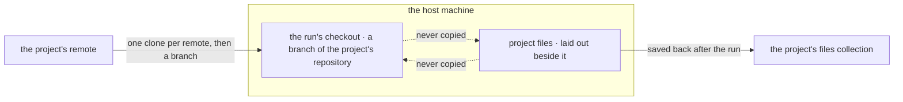

# FIX-1762 · Business rules

[Spec](SPEC.md) · [Decisions](DECISIONS.md) · **Rules** · [Plan](PLAN.md) · [Docs](DOCS.md) · [Evolution](EVOLUTION.md)

The cases, written as rules. Each says what a person or the system does and what happens. The
*proved by* column is the check the plan runs.

## Recording a repository

| # | When | Then | Proved by |
|---|---|---|---|
| BR-1 | A project is created with a `repository` | The row stores it as given; the Brief shows it | CI · goal leg a |
| BR-2 | A project is created without one | `repository` is `null`. It is a full project: room, members, workstreams as today | CI |
| BR-3 | A member sets, changes or clears it later | The row holds the new value; nothing else on the row moves | CI |
| BR-4 | A non-member tries to set it | Refused, `not-a-member`, as `setWorkstreams` is | CI |
| BR-5 | The value is a bare filesystem path (`/home/x/repo`, `./repo`, `C:\repo`) | Refused, `invalid-repository`: a project records a remote, not a checkout | CI |
| BR-6 | The value carries a user or password (`https://tok@host/…`) | Refused, `invalid-repository`, and the value is not echoed in the error | CI |
| BR-7 | A row written before this change is read | Reads with `repository: null` (BP-023, BP-030) | CI over a stored legacy row |
| BR-8 | Two members set it at once | One value wins whole; neither is merged into the other | CI |

## Running work in the project's repository

| # | When | Then | Proved by |
|---|---|---|---|
| BR-9 | A coding row is run for a workstream whose project records a repository | The run's checkout is a new branch of that repository, cut from its default branch. Nobody named a folder | Goal leg a |
| BR-10 | The first run for a remote on this host | The host clones it once, under the folder checkouts already live in. Later runs reuse that clone | CI |
| BR-11 | Two runs for one remote start at once | One clone is made; neither run sees a half-made one | CI |
| BR-12 | A new row starts on a remote the host already cloned | The clone is fetched before the branch is cut, so the branch starts from the remote's current default branch | CI |
| BR-13 | A row retries | It continues in its existing checkout. No fetch, no rebase, no reset | CI |
| BR-14 | The project records no repository | The row is refused before any harness runs, naming the project and "no repository" | Goal leg c |
| BR-15 | The workstream belongs to no project | Refused the same way, naming the workstream | CI |
| BR-16 | The project's repository changed after a row started | The row's next attempt is refused, naming both repositories; its checkout is untouched. Rows filed after the change use the new one | CI · goal leg b for the new row |
| BR-17 | The host cannot reach or read the remote | The attempt fails before the harness runs, naming the remote; no credential is printed | CI |
| BR-18 | Where the repository comes from | Only from stored, server-written data: the workstream's claim and the project row. Nothing in the row's input, metadata or a model's output can point a run at another repository (BP-031) | CI · a row carrying a repository in its input is ignored |
| BR-19 | An app passes a fixed `sourceRepo` as today | Unchanged behaviour, byte for byte | Existing harness-manager suite |

## The project's own files

| # | When | Then | Proved by |
|---|---|---|---|
| BR-20 | A coding run starts in a project | The project's files are laid out in a directory beside the checkout, never inside it, and the run is told where | Goal leg a |
| BR-21 | The run writes or edits a file there | After the run it is in the project's files collection, under that project only | Goal leg a |
| BR-22 | The run is over | The checkout's `git status` shows nothing from the project's files; the collection holds nothing from the checkout | Goal leg a |
| BR-23 | Two runs in one project edit the same file | Settled by the projection's existing outcomes; the conflict is reported on the run, never silently lost | CI |
| BR-24 | A person reads a project's files | Members only. The collection has no browser read in this slice | CI |
| BR-25 | A project has no repository | Its files collection still exists and is still the project's. Only coding needs a repository | CI |

The two boxes on the host never feed each other. Code comes from the remote; the project's
files come from and return to the collection.

## Failure taxonomy

Every refusal (BR-4, 5, 6, 14, 15, 16, 17) happens before an agent is paid and names its reason.
None retries on its own: each needs a person to fix the project, its workstreams or the host. A
failed save of project files after a run is reported on the run and does not fail the code work
the run committed.

## Acceptance criteria this issue owns

[The goal](SPEC.md#the-goal-and-how-well-know-its-met): on the DevTeam Lab, a run for a project
that names repository A commits on a branch of A, a new row after switching to B lands on B, a
project with none is refused before any harness runs, a kept note lands in the project's files
and not the checkout, and the same check FAILS under `GOAL_CONTROL=fixed-source`.
