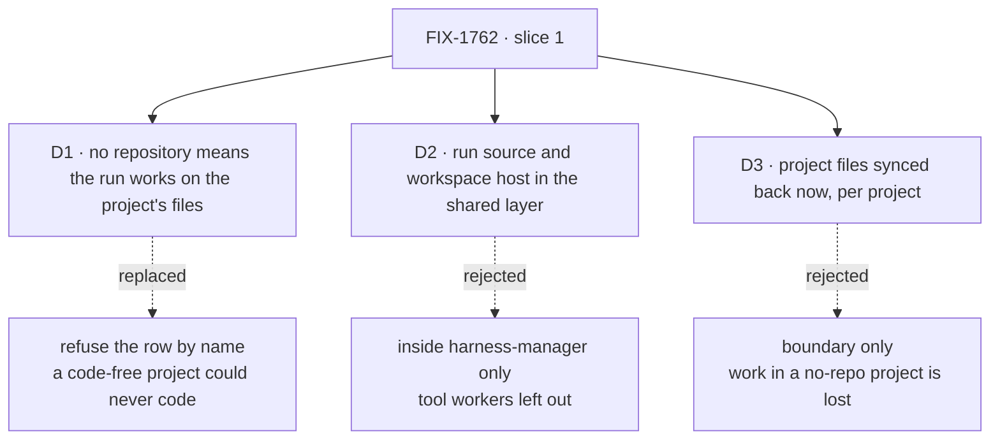

# FIX-1762 · Decisions

[Spec](SPEC.md) · **Decisions** · [Rules](BUSINESS-RULES.md) · [Plan](PLAN.md) · [Docs](DOCS.md) · [Evolution](EVOLUTION.md)

What was decided, by whom, why, and what each choice locks in. Jake made the three carded calls
on 2026-10-04 from the design page ([EVOLUTION.md](EVOLUTION.md)); they shape slice 1 most.

## The tree

Solid edges are what Jake signed. Dashed edges lost, and the label says why.

## D1 · A project with no repository runs coding rows on its files, starting empty and synced back

| | |
|---|---|
| **Instead of** | Refusing the row by name (this PR's first draft) |
| **Because** | Jake: "If a project has no repo, then it means we are starting with a clean slate of files … otherwise there is nothing to check into and how do we retain data?" With no git, the sync is the save. The bash tools already work this way, so the machinery exists |
| **Locks in** | The `project-files/<projectId>` collection is the record for a no-repository project's code as well as its notes, merged per file with conflicts reported, never overwritten. Adding a repository later leaves those files where they are; seeding a repository from them is not in these slices |

It comes down to how the work is kept: with no repository and no sync, there is nothing.

## D2 · The run source and the workspace host live in the shared workspace layer; harness-manager is the first caller

| | |
|---|---|
| **Instead of** | Both inside harness-manager, as earlier drafts had it |
| **Because** | A tool worker, where FSD runs the model loop and edits through bash and file tools, needs the same repository worktree and project files a harness worker does ([EVOLUTION.md → harness vs tool](EVOLUTION.md#harness-worker-and-tool-worker)). One host for both means one set of rules. Slice 1 is the cheapest time to put it there |
| **Locks in** | Every worker kind provisions, saves, restores and releases through one host interface; harness-manager depends on `@flow-state-dev/workspace`. The workspace layer knows sources, branches and places, never projects; Workforce fills the source |

It comes down to a tool worker that needs a repository: in harness-manager it gets none.

## D3 · Project files are synced back in this slice, scoped to one project

| | |
|---|---|
| **Instead of** | Boundary only: a directory with nothing saved (round 1's recommendation) |
| **Because** | D1 makes the save the only record for a no-repository project, and an agent's notes in a repository project would otherwise vanish. The existing projection does the three-way flush; what it lacks is a scope to one project's keys, which this slice adds |
| **Locks in** | Every run hydrates before and syncs back after: a tool worker after each write, a harness at turn end and when parked. The scope and a membership check are on every hydrate and flush |

It comes down to a project with no repository: without the save, every run starts from nothing.

## Decided by Jake, 2026-10-04

"I confirm all of your recommendations in the your calls section. Lets get all of this added to
the PR." From the design page, besides D1–D3:

- **FSD guarantees uncommitted repository work** until it is pushed: a `worktree-overlay/<runId>`
  collection plus a git bundle for unpushed commits. A provider's snapshot is only a fast-resume
  cache. Built in slice 2, [FIX-1766](https://linear.app/fixpoint-labs/issue/FIX-1766).
- **The overlay lives in an FSD collection**, not a hidden git ref on the customer's repository:
  no push rights needed from the first minute, nothing left on their git host.
- **FIX-1762 stays slice 1.** Slices 2–4 are filed under epic FIX-1763:
  [FIX-1766](https://linear.app/fixpoint-labs/issue/FIX-1766) checkpoint and restore (with the
  Lost and Restoring states, and provisioning state on the run record),
  [FIX-1767](https://linear.app/fixpoint-labs/issue/FIX-1767) a Vercel sandbox host,
  [FIX-1768](https://linear.app/fixpoint-labs/issue/FIX-1768) push and retire.
- **A repository is not a projected resource**: a projected collection serves read-only records;
  a repository is a remote with its own history, branches and push. The project holds a reference;
  the checkout is the projection.

## Round 1 calls that still stand

- **Who sets a repository.** Members directly; the chief of staff pauses for a person's approval in
  Inbox (`human_approval`), as before a fire.
- **The operator's remote allowlist**: schemes and hosts; `file://` off unless listed; a value
  starting with `-` refused; git run with `--` and `GIT_ALLOW_PROTOCOL` limited to the list.
- **The value**: a remote string or `null`. A bare path and a credential (userinfo on http(s), or a
  password) are refused; SSH login names (`git@host:path`, `ssh://git@host/path`) are fine.
- **One clone per remote** under the host's root, fetched with the default-branch record refreshed
  before each new branch, never on retry.
- **Per-project isolation**: keys `project-files/<projectId>/…`, every hydrate and flush filtered at
  the source to the run's project, and the run's owner checked against the row's `members`.

## Decided, not asked

- **The run source answers** `{ kind: "repo", repo, baseRef }`, `{ kind: "files", projectId }` or a
  refusal. The workspace layer treats `projectId` as an opaque scope key into the collection the
  source declares.
- **A row keeps the remote it started on**, recorded on its run record at first provision; a
  repository change applies to new rows. (Replaces round 1's "refuse on retry".)
- **A workstream in no project is still refused**, naming it: there is no project to keep files in.
- **The base stays where the row started**; rebasing is a separate, explicit step.
- **Tool workers adopt the host when one needs a repository.** In slice 1 the bash tool keeps its
  own projection; the shared host is ready for it.
- **PR plan: four PRs as a GitHub stack**, shape in [PLAN.md](PLAN.md#pr-plan). An engineering call.

## Considered and dropped

| Alternative | Why not |
|---|---|
| Refuse coding rows in a no-repository project | Replaced by D1 |
| Boundary only for project files | Replaced by D3 |
| A local checkout path on the project, or an operator's map of remote to folder | A path someone names; the issue rules it out |
| A hidden git ref for uncommitted work | Needs push rights early and leaves refs on the customer's repo |
| Rely on the sandbox provider's snapshot | Not crash-safe, one region, one provider ([EVOLUTION.md](EVOLUTION.md#holding-uncommitted-work)) |
| A `Project` or `Repository` type in core | Layer 1 stays free of Workforce concepts |

## How it got here

- **Draft** — repository on the project row, resolved through the workstream's claim; per-run
  source and clone cache in harness-manager; project files beside the checkout. Three PRs.
- **Review round 1** — added the remote allowlist and the chief of staff's Inbox approval; reopened
  D3 recommending boundary only; one provisioning path.
- **Owner direction, 2026-10-04** — Jake confirmed the design page's calls: a no-repository project
  runs on its files (D1), the run source and workspace host move to the shared layer (D2), project
  files sync back in slice 1 (D3), and slices 2–4 are filed as FIX-1766–1768. Because a project
  with no repository otherwise had no way to keep work, and tool workers need the same machinery.
