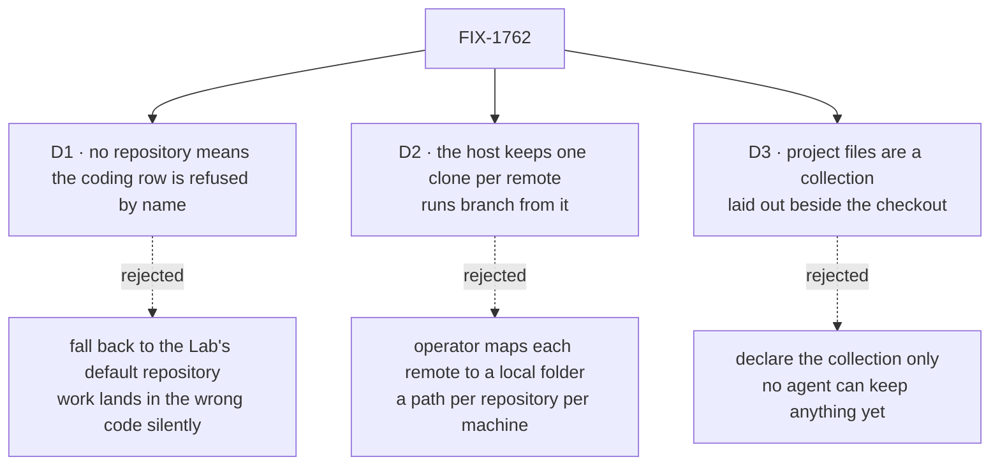

# FIX-1762 · Decisions

[Spec](SPEC.md) · **Decisions** · [Rules](BUSINESS-RULES.md) · [Plan](PLAN.md) · [Docs](DOCS.md) · [Evolution](EVOLUTION.md)

What was considered, what was chosen, why, and what each choice locks in. Three decisions are
the sign-off surface. Everything else here is context for them.

## The tree

Solid edges are what you're signing. Dashed edges lost, and the label says why.

## D1 · A coding row in a project with no repository is refused, by name, before any agent runs

| | |
|---|---|
| **Instead of** | Falling back to a default repository the Lab's operator wired at boot |
| **Because** | A fallback makes "no repository" mean "some repository": a person who forgot to set it gets work in code that is not theirs, and nothing on screen says so. A refusal names the project and the fix. Tenet 7: the loud failure is the honest one |
| **Locks in** | A Lab that runs every project against one repository says so on each project. A Lab that keeps a fixed `sourceRepo` and does not use project resolution is unaffected |

It comes down to a person who forgot: the fallback runs their feature in someone else's code.

**What would change my mind:** a Lab that genuinely wants one repository for all projects and
many projects. Then a Lab-level default with the project overriding it is cheap to add, and
nothing here blocks it.

## D2 · The host keeps one clone per repository and cuts every run's branch from it; nobody maps a remote to a folder

| | |
|---|---|
| **Instead of** | The operator writing a map from each remote to a clone they keep on the machine |
| **Because** | The issue's point is that nobody names a path. A per-repository map is a path per repository per machine, and it goes stale the moment a project changes its repository. One clone per remote, kept under the folder checkouts already live in, needs no per-repository setup |
| **Locks in** | What a run can reach is what the host's own git credentials can reach. A private repository the host can't read fails at the run's first attempt, by name. The host's disk holds one clone per repository ever used, until someone deletes it |

It comes down to the issue's own line: the map is a path someone names, for every repository.

**What would change my mind:** a host that must not reach the network. Then the same clone cache
can be seeded by hand, and the map is not needed for that either.

## D3 · The project's own files are a collection, laid out beside the checkout for a coding run and saved back after it

| | |
|---|---|
| **Instead of** | Declaring the collection and the rule now, with no run able to write to it until project memory exists |
| **Because** | The issue puts it in this slice: memory and anything an agent keeps "is written there". A collection no run reaches is a rule nobody can break and nobody can test. The existing projection already lays a collection into a directory and reconciles it back; pointing it at a directory beside the checkout, never inside, is the issue's own "same machine for the side files". No new sync code |
| **Locks in** | Every coding run in a project with files pays a lay-out before and a save after. Two runs in one project writing the same note settle through the projection's existing conflict outcomes, which the run's record reports |

It comes down to whether anything can keep a note now: the smaller option ships a promise nothing exercises.

**What would change my mind:** if the first writer of project files is an agent with no
filesystem (a chief of staff's memory), not a coding run. Then the collection ships alone and
the directory comes with the first coding agent that needs it.

## Decided, not asked

- **The repository is a remote, stored as a string on the project row**; `null` means none.
  `https://`, `ssh://`, `git@host:path` and `file://` are accepted. A bare filesystem path is
  refused ("a remote, not a checkout path"). A URL carrying a user or password is refused, so
  no credential is ever stored or shown.
- **Set at create (`createProject.repository`) or later (`setRepository`), by members only**,
  as `setWorkstreams` is. The chief of staff gets `setRepository` as a tool beside its two.
- **The Brief tab shows it.** A remote with no credentials in it is not a secret.
- **A run branches from the repository's default branch** as the clone reports it. No per-project
  base ref in this slice.
- **The clone is fetched only before cutting a new branch**, never on a retry of an existing one.
  A retry continues the work it left; it is not rebased.
- **A row already started keeps its checkout.** If its project's repository changed since, the
  next attempt is refused, naming both repositories, and nothing in the checkout is touched (the
  existing ownership guard). New rows use the new repository.
- **The resolution lives in Workforce, the mechanism in harness-manager.** Harness-manager learns
  a generic per-run "where does this run's code come from" hook and a clone cache; it never
  imports Workforce and never says "project". Workforce supplies the policy: workstream → claim →
  project → repository and files.
- **PR plan: three PRs** (harness-manager hook · Workforce row and files · Lab wiring and goal
  check), shape in [PLAN.md](PLAN.md#pr-plan). An engineering call.

## Considered and dropped

| Alternative | Why not |
|---|---|
| Store a local checkout path on the project | The issue rules it out: the row is org-wide and outlives any one machine |
| A repository on the workstream (mailbox) instead of the project | A workstream is declared in a file; the repository is runtime data a person changes. The project is the org's record of the work |
| A repository on the board row (task) | Caller-writable input deciding where a run writes is the hazard BP-031 names, and the manager already refuses it |
| Copy project files into the checkout under a dot-folder | Gets committed or lost with the branch; the issue forbids it |
| A new `Project` or `Repository` type in core | Layer 1 stays free of Workforce concepts ([FIX-1650 ER-10](../../epics/FIX-1650/BUSINESS-RULES.md#what-no-child-may-do)) |

## How it got here

- **Draft** — framed as "the work ignores which code a project is about"; the repository rides on
  the existing project row, a coding run resolves it through its workstream's claim, harness-manager
  gains a generic per-run source and a clone cache, and the project's files are a collection laid
  beside the checkout through the existing projection. Three PRs.

**Open: none.**
