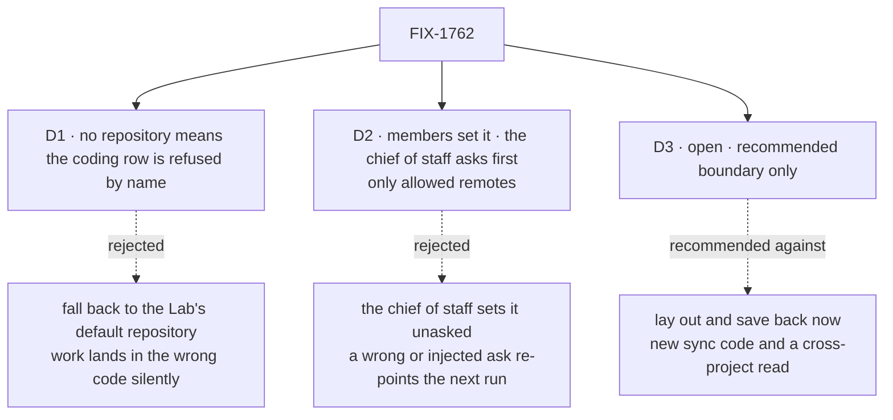

# FIX-1762 · Decisions

[Spec](SPEC.md) · **Decisions** · [Rules](BUSINESS-RULES.md) · [Plan](PLAN.md) · [Docs](DOCS.md) · [Evolution](EVOLUTION.md)

What was considered, what was chosen, why, and what each choice locks in. Two decisions and one
open fork are the sign-off surface. Everything else here is context for them.

## The tree

Solid edges are what you're signing. Dashed edges lost, and the label says why. D3 is still open.

## Open · D3 · Does a run's project-files directory get saved back to the project in this slice?

**Plain terms.** The issue's third item says a project's own files (memory, notes an agent keeps)
live with the project, never in the checkout. We can ship the *place and the rule* now: a
members-only collection per project, and a directory beside each checkout that is never inside
it. Or we can also copy those files in before each run and save them back after.

**The trade-off.** Saving back needs sync code harness-manager does not have today (it has no
dependency on the workspace package and no lay-out or save step), and the existing sync binds a
whole collection, so a run in one project could read or write another project's files unless we
build a per-project filter first. The boundary needs neither. The price is that an agent's notes
do not outlive the run yet, so item 3 ships smaller than the issue's words.

**My recommendation: boundary only.** The manager gets a generic directory beside the checkout and
a before/after hook a host can fill; Workforce declares the collection, keyed by project. The save
comes with the first agent that writes project memory.

**What would change my mind:** a coding agent that needs project memory this cycle.

**What being wrong costs:** notes an agent writes during a run are lost when the run ends, until
the follow-up lands. Nothing is lost from the code, and nothing built here is thrown away.

It comes down to new sync code and a per-project filter that don't exist yet; the boundary needs neither.

## D1 · A coding row in a project with no repository is refused, by name, before any agent runs

| | |
|---|---|
| **Instead of** | Falling back to a default repository the Lab's operator wired at boot |
| **Because** | A fallback makes "no repository" mean "some repository": a person who forgot to set it gets work in code that is not theirs, and nothing on screen says so. A refusal names the project and the fix. Tenet 7: the loud failure is the honest one |
| **Locks in** | A Lab that runs every project against one repository says so on each project. A Lab that keeps a fixed `sourceRepo` and does not use project resolution is unaffected |

It comes down to a person who forgot: the fallback runs their feature in someone else's code.

**What would change my mind:** a Lab that genuinely wants one repository for many projects. Then
a Lab-level default the project overrides is cheap to add.

## D2 · Members set the repository directly; the chief of staff asks a person in Inbox first; both only within the operator's allowed remotes

| | |
|---|---|
| **Instead of** | The chief of staff setting it on its own, the way it hires |
| **Because** | A repository decides what code the next coding run executes with the host's credentials. A mistaken or prompt-injected chief of staff could point it at code nobody chose. The chief of staff's fire already asks through the same `human_approval` pause; a repository change is at least as hard to undo once a run has used it. A member typing it themselves is already the person deciding |
| **Locks in** | Every repository the chief of staff sets, at create or later, waits on a click in Inbox. The host's git only ever reaches remotes the operator listed: a scheme and host allowlist, `file://` off unless listed, a value starting with `-` refused, the clone run with `--` and git's protocol list limited to the allowed schemes. Access is the host's own git credentials; a private repository it can't read fails at the first run, named |

It comes down to a wrong or injected ask: unasked, the next run executes code nobody chose.

**What would change my mind:** repository changes turning out frequent and routine; then it lands
at once, as a hire does, still inside the operator's list.

## Decided, not asked

- **The repository is a remote, stored as a string on the project row**; `null` means none. A
  bare filesystem path, a value starting with `-`, and a credential (userinfo on `http(s)`, or a
  password anywhere) are refused at the write; an SSH login name like `git@` is fine. Whether a remote is *allowed* is the host's call, checked at the run.
- **The host keeps one clone per remote**, under the folder checkouts already live in, and cuts
  each run's branch from it, off the remote's default branch. Nobody maps a remote to a folder:
  that would be the path-per-repository the issue rules out.
- **One provisioning path.** Every attempt resolves `{ repo, baseRef }` before provisioning; a
  fixed `sourceRepo` is a resolver that always returns it. No "one of two" mode.
- **The clone is fetched only before cutting a new branch**, never on a retry.
- **A row already started keeps its checkout.** If its project's repository changed since, the
  next attempt is refused, naming both, and nothing in the checkout is touched.
- **Project files are isolated by key**: `project-files/<projectId>/…`, read only through a
  Workforce accessor that checks the row's `members`. No browser read. With the boundary-only
  answer to D3, no run reads the collection at all; a later save must filter at the source to the
  run's project (BP-033), never mount the whole collection.
- **The resolution lives in Workforce, the mechanism in harness-manager**, which never imports
  Workforce or says "project".
- **PR plan: three PRs**, shape in [PLAN.md](PLAN.md#pr-plan). An engineering call.

## Considered and dropped

| Alternative | Why not |
|---|---|
| Store a local checkout path on the project | The issue rules it out: the row is org-wide and outlives any one machine |
| An operator's map of remote → local clone | A path per repository per machine, stale when a project switches |
| A repository on the workstream (mailbox) | A workstream is declared in a file; the repository is runtime data a person changes |
| A repository on the board row (task) | Caller-writable input deciding where a run writes is the hazard BP-031 names |
| Copy project files into the checkout under a dot-folder | Gets committed or lost with the branch; the issue forbids it |
| A new `Project` or `Repository` type in core | Layer 1 stays free of Workforce concepts ([FIX-1650 ER-10](../../epics/FIX-1650/BUSINESS-RULES.md#what-no-child-may-do)) |

## How it got here

- **Draft** — framed as "the work ignores which code a project is about"; the repository rides on
  the existing project row, resolved through the workstream's claim; harness-manager gains a
  per-run source and a clone cache; project files laid beside the checkout through the existing
  projection. Three PRs.
- **Review round 1** — added the operator's remote allowlist and made a chief-of-staff repository
  change ask in Inbox (D2 replaced the clone-vs-map card, which became an engineering call),
  because a model-writable remote could point the host's git anywhere; reopened D3 with a
  boundary-only recommendation, because harness-manager has no sync step today and the existing
  sync can't isolate one project's files; one provisioning path instead of two modes.
