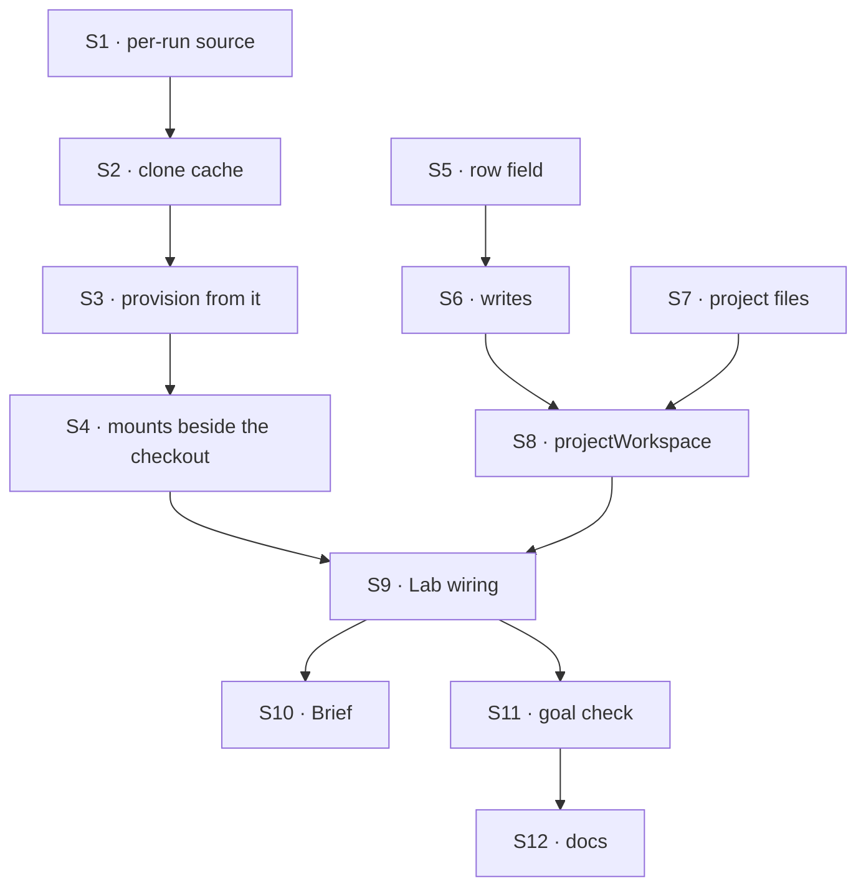

# FIX-1762 · Plan

[Spec](SPEC.md) · [Decisions](DECISIONS.md) · [Rules](BUSINESS-RULES.md) · **Plan** · [Docs](DOCS.md) · [Evolution](EVOLUTION.md)

Written for the implementing agent. IDs cross-reference [BUSINESS-RULES.md](BUSINESS-RULES.md)
(BR-n) and [DECISIONS.md](DECISIONS.md) (Dn). `tdd`. Three PRs.

## Surfaces

| ID | Package · role | Change | Rules |
|---|---|---|---|
| S1 | `harness-manager` · workspace config | `sourceRepo` stays (a local repository, today). Add the alternative: a per-run **source resolver**, handed the block context only (the `HarnessResolver` shape), returning `{ remote }` or a refusal reason. Exactly one of the two; both or neither is refused at construction | BR-14 BR-18 BR-19 |
| S2 | `harness-manager` · the clone cache | Under `workspace.root`, one clone per remote, keyed by a hash of the normalized remote. Created once under a lock; fetched before a **new** branch is cut, never on retry. Base = the clone's default branch (`origin/HEAD`) (D2) | BR-10 BR-11 BR-12 BR-13 BR-17 |
| S3 | `harness-manager` · provisioning | With a resolver: resolve at the attempt, before the harness; refuse with the reason; cut the worktree from the S2 clone. The construction-time guards that read `sourceRepo` (`assertBaseRefExists`, the identity check, `phase.validate`) run per attempt against the resolved clone. The existing identity guard refuses a checkout of another repository (BR-16) | BR-9 BR-14 BR-16 BR-17 |
| S4 | `harness-manager` · beside-the-checkout mounts | The resolver may also return mounts for a sibling directory (`<checkout>.files/`, outside the worktree); hydrate before the harness step, flush after, through `@flow-state-dev/workspace`'s projection. The run context gains its path for the prompt. Flush outcomes go on the run record (D3) | BR-20 BR-21 BR-22 BR-23 |
| S5 | `workforce` · the project row | `repository: string \| null`, default `null`; exposed to the browser. A shared validator: remote forms accepted, bare paths and userinfo refused (`invalid-repository`) | BR-1 BR-2 BR-5 BR-6 BR-7 |
| S6 | `workforce` · project writes | `createProject` takes optional `repository`; new `setRepository` (members only, CAS retry like the others), added to `defineProjectBlocks().actions` | BR-1 BR-3 BR-4 BR-8 |
| S7 | `workforce` · project files | `project-files/**` collection, org-scoped, shared across flows, lazy, no browser read; keys `<projectId>/<path>` | BR-21 BR-24 BR-25 |
| S8 | `workforce` · `projectWorkspace({ mailboxId })` | Returns the S1 resolver (workstream claim → project → repository, refusals BR-14/15) and the S4 mounts (S7, scoped to that project), plus the capability declaring the collections it reads. The only place "project" meets the manager | BR-9 BR-14 BR-15 BR-18 BR-20 |
| S9 | Lab · DevTeam profile and `goals/devforce-lab/lab/host.mts` | Build the manager with `projectWorkspace`; drop the fixed `sourceRepo`; default project `storefront` records the scratch repository's `file://` remote; CoS gets `setRepository` as a tool | BR-9 |
| S10 | Shift Manager · project Brief | Show the repository, or "No repository" | BR-1 BR-2 |
| S11 | Goal check | `goals/devforce-lab/it-codes-in-the-projects-repository/`, legs a–c, `GOAL_CONTROL=fixed-source` | goal |
| S12 | Docs | Per [DOCS.md](DOCS.md). One `minor` changeset each for `workforce` and `harness-manager` | — |

## Sequence



### PR plan

| PR | Deliverables | depends_on |
|---|---|---|
| A | S1 S2 S3 S4, harness-manager README | — |
| B | S5 S6 S7, workforce README and `projects.md` | — |
| C | S8 S9 S10 S11, the rest of S12 | A, B |

A and B are independent. S8 sits in C because it is the one surface that needs both.

## Checks

| ID | Runs after | Passes when |
|---|---|---|
| V1 | S1 | Both or neither of `sourceRepo` and the resolver is refused at construction; fixed `sourceRepo` suite unchanged (BR-19) |
| V2 | S2 | Two concurrent first runs on one `file://` remote make one clone (BR-11); a second row sees a commit pushed to the remote after the first (BR-12); a retry does not fetch (BR-13) |
| V3 | S3 | A resolver refusal fails the attempt with no harness call (BR-14); an unreachable remote does too, with no credential in the message (BR-17); a changed remote on retry is refused naming both (BR-16) |
| V4 | S4 | A file written beside lands in the collection; `git status` in the worktree is clean of it; a worktree file never reaches the collection (BR-20–22); a two-writer conflict is on the run record (BR-23) |
| V5 | S5 S6 | BR-1–BR-8, incl. a stored legacy row and a CAS race on `setRepository` |
| V6 | S7 S8 | The resolver reads only claim and row; a row whose `input` names a repository is ignored (BR-18); a workstream with no project and a project with no repository refuse by name (BR-14, BR-15); a non-member read of `project-files` is refused (BR-24) |
| VG | S11 | [The goal](SPEC.md#the-goal-and-how-well-know-its-met): PASSES legs a–c, after the same run FAILED under `GOAL_CONTROL=fixed-source` on *branch contains marker A* |

D1 is V3+V6, D2 is V2, D3 is V4. The second path (BP-035): legacy row (V5), concurrent first
clone (V2), retry after a repository change (V3).

## Pinned names

| Where | Name | Why pinned |
|---|---|---|
| Project row field | `repository` | Public: Shift Manager, the chief of staff and apps read it |
| Write | `setRepository` | Public: the chief of staff's tool name and an action key |
| Collection pattern | `project-files/**` | A public storage key, like `projects/*` |
| Refusal reason | `invalid-repository` | Joins `ProjectRefusalReason` |

Everything else is yours to name.

## Guardrails

| Rule | Because |
|---|---|
| Harness-manager never imports Workforce or says "project" | It serves any host; Workforce plugs policy into a generic hook (Jake's L1/L2 rule, applied one layer up) |
| Where a run's code comes from is derived from server-written data only (BP-031) | A row's input is model-writable; a model choosing the repository is the hazard the manager already refuses for paths |
| The project-files directory is never inside the worktree, and no step copies between them | It is the issue's one hard line; a dot-folder in the checkout gets committed |
| One convergence point for "which remote": S8's resolver. S9 and the goal call it; nothing re-derives the chain (tenet 5) | A second derivation is how a run ends up on the wrong repository |
| No fetch, reset or rebase of an existing branch | Provisioning's existing promise: never discard uncommitted work |
| No new noun in core or engine; no "seat" naming in anything new | Jake's standing rules |

## Docs

Reconcile and publish [DOCS.md](DOCS.md) in PR B (Workforce pages) and PR C (harness-manager
section once S9 proves it), after V5 and VG pass.

## Sketch · pseudocode, illustrative, react to the shape

```
host:      manager({ workspace: { root, ...projectWorkspace({ mailboxId }) } })
attempt:   source ← resolver(ctx)                 refusal → fail before harness  (D1)
           clone  ← cache(root, source.remote)    clone once under lock; fetch if new branch  (D2)
           tree   ← worktree(clone, branch, base = clone default branch)
           beside ← hydrate(source.mounts) into "<tree>.files/"                  (D3)
           run harness(cwd = tree), prompt names beside
           flush(beside) → outcomes on the run record
workforce resolver: claim(mailboxId) → project row → repository / project-files/<id>/
```

**POC:** none. The two premises it rests on are code reads: harness-manager already cuts
worktrees from a host repository and guards identity per checkout (`workspace.ts`), and the
projection already hydrates and flushes arbitrary collections into a host directory
(`@flow-state-dev/workspace`).

## At implement time

- `Mount` binds a whole collection to a prefix. Confirm it can be scoped to one project's keys
  (`<projectId>/…`); if not, filter at the source (BP-033) rather than load and discard.
- FIX-1720 (closure) and FIX-1761 are in flight on Shift Manager; rebase S10 over them.
- `goals/devforce-lab/lab/scratch-repo.mts` already makes a bare repository; reuse it for the
  `file://` remotes.

## Follow-ups

- The later overlay: dirty checkout paths kept through the same projection if the machine is lost.
- A per-project base branch, if a Lab needs one.
- Cleaning up clones no project names any more.
