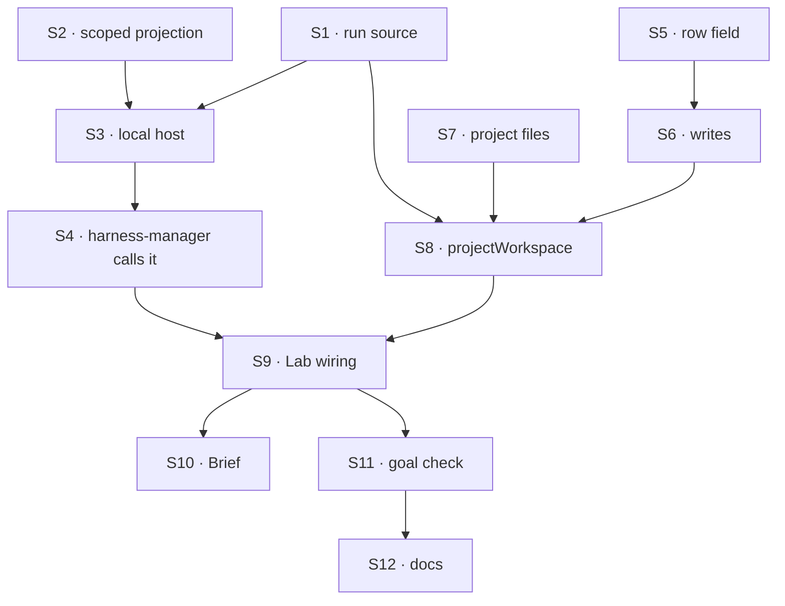

# FIX-1762 · Plan

[Spec](SPEC.md) · [Decisions](DECISIONS.md) · [Rules](BUSINESS-RULES.md) · **Plan** · [Docs](DOCS.md) · [Evolution](EVOLUTION.md)

Written for the implementing agent. IDs cross-reference [BUSINESS-RULES.md](BUSINESS-RULES.md)
(BR-n) and [DECISIONS.md](DECISIONS.md) (Dn). `tdd`. Four PRs as a GitHub stack. Slice 1 of the
design in [EVOLUTION.md](EVOLUTION.md); leave the slice 2 seams (checkpoint, restore) as named
no-ops, not as code.

## Surfaces

| ID | Package · role | Change | Rules |
|---|---|---|---|
| S1 | `workspace` · run source | A `RunSource` type (its own name, not `HarnessResolver`), handed the block context only, answering `{ kind: "repo", repo, baseRef }`, `{ kind: "files", projectId }` or a refusal | BR-13 |
| S2 | `workspace` · scoped projection | A mount scoped to a key prefix: list, hydrate and flush touch only `<prefix>/…`, filtered at the source | BR-25 BR-30 |
| S3 | `workspace` · local workspace host | `provision · save · release` (with `checkpoint`/`restore` as declared no-ops for slice 2) over a host directory. Repo: remote allowlist, one clone per remote under a lock, refreshed default branch, `checkout/` worktree, `project/` beside it. Files: `workspace/` hydrated from the scoped mount. Save = flush of `project/` or `workspace/`. Git through the same `run()` and lock pattern harness-manager uses today, moved here | BR-10–12 BR-14–18 BR-20–21 BR-23 BR-26 BR-28 BR-29 |
| S4 | `harness-manager` · first caller | One provisioning path through the host: a fixed `sourceRepo` is a constant repo source. The run record keeps the resolved remote and base at first provision (BR-19). Save at turn end and when parked; `after` on harness failure too. The checkout derivation, ownership and "never discard work" stay | BR-18 BR-19 BR-22 BR-23 |
| S5 | `workforce` · project row | `repository: string \| null`, default `null`, exposed; shared validator (BR-5, BR-6) | BR-1–BR-8 |
| S6 | `workforce` · writes | `createProject.repository`; `setRepository` (members, CAS retry) | BR-1 BR-3 BR-4 BR-8 |
| S7 | `workforce` · project files | `project-files/**`, org-scoped, shared, lazy, no browser read, keys `<projectId>/…`; members-checked read | BR-32 |
| S8 | `workforce` · `projectWorkspace({ board })` | The run source: board → mailbox → claim → project → repo or files; membership check of the run's owner; declares S7 and the claim/row reads it needs | BR-13 BR-31 BR-33 |
| S9 | Lab · DevTeam profile, `goals/devforce-lab/lab/host.mts` | Manager built on `localWorkspaceHost` with `projectWorkspace`; allowed remotes incl. `file`; `storefront` on the scratch repo's `file://` remote; a `sandbox` project with none; chief-of-staff `setRepository` and repository-at-create pause on `human_approval` | BR-9 |
| S10 | Shift Manager · Brief | Repository, or "No repository · runs on project files" | BR-1 BR-2 |
| S11 | Goal check | `goals/devforce-lab/it-codes-in-the-projects-repository/`, legs a–c, controls `fixed-source` and `no-sync-back` | goal |
| S12 | Docs | Per [DOCS.md](DOCS.md); `minor` changesets for `workspace`, `workforce`, `harness-manager` | — |

## Sequence



### PR plan

A GitHub stack: each PR's base is the branch of the one below it, so each diff shows only its own
change. PR 2 is independent and goes off `main`.

| PR | Branch | Base | Deliverables | depends_on |
|---|---|---|---|---|
| 1 | `fix/FIX-1762-1-workspace-host` | `main` | S1 S2 S3, workspace README | — |
| 2 | `fix/FIX-1762-2-project-repository` | `main` | S5 S6 S7, workforce README, `projects.md` | — |
| 3 | `fix/FIX-1762-3-harness-manager` | PR 1 | S4, harness-manager README | 1 |
| 4 | `fix/FIX-1762-4-lab-and-goal` | PR 3 | S8 S9 S10 S11, the rest of S12; merges `main` after PR 2 lands | 2, 3 |

S1 lands first in PR 1 as types only. S4 moves harness-manager's git calls behind the host with
its existing suite green before any new behaviour.

## Checks

| ID | Runs after | Passes when |
|---|---|---|
| V1 | S2 | A mount scoped to `a/` never lists, hydrates or flushes a `b/` key; a run deletes only what it hydrated (BR-25, BR-30) |
| V2 | S3 repo | Allowlist refusals incl. `file://` unlisted, `ext::`, `ssh://-o…`, before any git process (BR-10–12); one clone under concurrency (BR-16); default-branch rename followed (BR-17); retry does not fetch (BR-18) |
| V3 | S3 files | First run `workspace/` empty; a write is in the collection after save; next provision sees it; a lost place re-hydrates (BR-20, BR-23, BR-24, BR-26) |
| V4 | S4 | Existing harness-manager suite unchanged through the host (BR-22); save at turn end, on park and on harness failure; recorded remote kept after a repository change (BR-19) |
| V5 | S5 S6 | BR-1–8, legacy row, CAS race, both SSH spellings |
| V6 | S8 | Source reads only claim and row (BR-13); a non-member's attempt is refused before hydrate (BR-31); no project → refused (BR-33) |
| V7 | S9 | Chief-of-staff repository change on Deny writes nothing (BR-9) |
| VG | S11 | [The goal](SPEC.md#the-goal-and-how-well-know-its-met): legs a–c PASS after leg a FAILED under `fixed-source` and leg b under `no-sync-back` |

D1 is V3+leg b, D2 is V4 (harness-manager reaches git only through the host), D3 is V1+V3. The
second path (BP-035): legacy row, concurrent clone, retry, harness failure, deny, non-member.

## Pinned names

| Where | Name | Why pinned |
|---|---|---|
| Project row field | `repository` | Public |
| Write | `setRepository` | Public: a chief-of-staff tool and an action key |
| Collection | `project-files/**` | Public storage key |
| Place directories | `checkout/`, `project/`, `workspace/` | The agent and the person read them; slice 2 checkpoints them |
| Run source kinds | `repo`, `files` | The seam slices 2–4 build on |
| Refusal reason | `invalid-repository` | Joins `ProjectRefusalReason` |

## Guardrails

| Rule | Because |
|---|---|
| The workspace layer never says "project"; harness-manager never imports Workforce | Workforce fills the source; workers stay generic (D2) |
| Run source from server-written data only (BP-031) | A row's input is model-writable |
| Allowlist checked before any git process | Members and, with approval, a model write the remote |
| `projectWorkspace` derives the mailbox from the board | Two ids that can disagree is a wrong-repository bug |
| One provisioning path, one host | Two modes is two places to forget |
| Every hydrate and flush is key-scoped and membership-checked | A whole-collection mount reads every project |
| `project/` and `workspace/` are never inside `checkout/` | The issue's hard line |
| No fetch, reset or rebase of an existing branch | Never discard work |
| No new noun in core or engine; no "seat" in anything new | Jake's standing rules |

## Docs

Publish [DOCS.md](DOCS.md) per PR: workspace section with PR 1, Workforce with PR 2,
harness-manager with PR 3, the guide line with PR 4 after the goal check passes.

## Sketch · pseudocode, illustrative

```
host = localWorkspaceHost({ root, remotes, source })
attempt:  src ← source(ctx)                       refusal → fail before harness
          place ← host.provision(src, run)        repo: allow? clone once, worktree, project/ hydrate
                                                  files: workspace/ hydrate (scoped)
          harness(cwd = place.cwd)                 save at turn end / park / failure
          host.save(place)                         flush project/ or workspace/ (scoped)
          host.release(place)                      slice 1: keep the directory, as today
```

**POC:** none. The projection's three-way flush and baseline are shipped (`@flow-state-dev/workspace`);
what it lacks, the key scope, is S2 and is proven by V1.

## At implement time

- FIX-1720 and FIX-1761 are in flight on Shift Manager; rebase S10.
- Reuse `goals/devforce-lab/lab/scratch-repo.mts` for the `file://` remote.

## Notes from review

- "Remote normalisation: `https://h/x`, `https://h/x.git` and `git@h:x` are one repository; key the clone by a normalised remote or by its own identity." — [second look](https://github.com/fixpoint-labs/flow-state-dev/pull/2723#issuecomment-5981203741)
- "Confirm a refusal at provisioning does not consume an attempt or get retried." — same
- "Check the sibling directory names can't collide with lock or marker names, and that cleanup handles them deliberately." — same
- "Log the clone cache path so the operator can see it." — same

These are inputs, not instructions.

## Follow-ups

- [FIX-1766](https://linear.app/fixpoint-labs/issue/FIX-1766) checkpoint and restore for repositories (slice 2).
- [FIX-1767](https://linear.app/fixpoint-labs/issue/FIX-1767) Vercel sandbox host (slice 3).
- [FIX-1768](https://linear.app/fixpoint-labs/issue/FIX-1768) push and retire (slice 4).
- Seeding a repository from a no-repository project's files; cleaning up unused clones.
