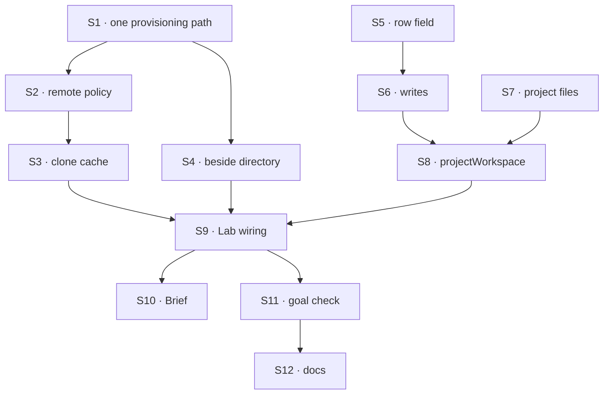

# FIX-1762 · Plan

[Spec](SPEC.md) · [Decisions](DECISIONS.md) · [Rules](BUSINESS-RULES.md) · **Plan** · [Docs](DOCS.md) · [Evolution](EVOLUTION.md)

Written for the implementing agent. IDs cross-reference [BUSINESS-RULES.md](BUSINESS-RULES.md)
(BR-n) and [DECISIONS.md](DECISIONS.md) (Dn). `tdd`. Three PRs. Written for D3 answered
**boundary only**; if Jake picks the save, S4 grows a filtered lay-out and save (BR-28) and PR A
splits into A1 (S1–S3) and A2 (S4).

## Surfaces

| ID | Package · role | Change | Rules |
|---|---|---|---|
| S1 | `harness-manager` · one provisioning path | Provisioning takes a resolved `{ repo, baseRef }` per attempt. The workspace config takes a **run source** callback (its own type, not `HarnessResolver`), handed the block context only, answering `{ remote }`, `{ repo, baseRef }` or a refusal reason. A fixed `sourceRepo` becomes a constant source. Every site that reads `config.sourceRepo`/`baseRef` today (probe, branch refusal, identity guard, `worktree prune/add`, failure cleanup, `branch -D`, `guards.ts`, `ask.ts`, `phase.validate`) reads the resolved value instead | BR-13 BR-19 BR-23 |
| S2 | `harness-manager` · remote policy | `workspace.remotes.allow`: schemes and hosts the operator lists; `file` only when listed. Checked at the attempt before any git call. Git runs on a remote with `--` before it and `GIT_ALLOW_PROTOCOL` set to the allowed schemes | BR-10 BR-11 BR-12 |
| S3 | `harness-manager` · clone cache | Under `workspace.root`, one clone per remote. Created once under a lock, through the existing `run()` and the `acquireCheckout` locking pattern; fetched before a **new** branch (with the remote's default-branch record refreshed, e.g. `remote set-head --auto`), never on retry; base = the clone's default branch | BR-14–BR-18 BR-21 BR-22 |
| S4 | `harness-manager` · the beside directory | A sibling directory per checkout, outside the worktree, created at provisioning and named in the run's prompt context; optional host `before`/`after` hooks around the harness step, `after` called on success **and** failure. No lay-out or save of its own (D3) | BR-24 BR-25 BR-26 |
| S5 | `workforce` · the project row | `repository: string \| null`, default `null`; exposed to the browser. A shared shape validator: remote forms accepted; bare paths, a leading `-` and userinfo refused (`invalid-repository`); SSH login names without a password allowed | BR-1 BR-2 BR-5 BR-6 BR-7 |
| S6 | `workforce` · project writes | `createProject` takes optional `repository`; new `setRepository` (members only, CAS retry like the others) in `defineProjectBlocks().actions` | BR-1 BR-3 BR-4 BR-8 |
| S7 | `workforce` · project files | `project-files/**` collection, org-scoped, shared across flows, lazy, no browser read; keys `<projectId>/<path>`; a read accessor that checks the row's `members` | BR-27 BR-29 |
| S8 | `workforce` · `projectWorkspace({ board })` | Takes the same board declaration the manager drains and derives its mailbox from the board id; no separately passed mailbox. Returns the S1 run source (claim → project → repository; refusals BR-19/20) and the capability declaring what it reads. The only place "project" meets the manager | BR-13 BR-19 BR-20 |
| S9 | Lab · DevTeam profile, `goals/devforce-lab/lab/host.mts` | Build the manager with `projectWorkspace`; drop the fixed `sourceRepo`; list allowed remotes (`file` for the Lab's local repos); `storefront` records the scratch repository's `file://` remote; the chief of staff's `createProject` with a repository and its new `setRepository` tool pause on `human_approval` | BR-9 BR-14 |
| S10 | Shift Manager · project Brief | Show the repository, or "No repository" | BR-1 BR-2 |
| S11 | Goal check | `goals/devforce-lab/it-codes-in-the-projects-repository/`, legs a–d, `GOAL_CONTROL=fixed-source` | goal |
| S12 | Docs | Per [DOCS.md](DOCS.md). One `minor` changeset each for `workforce` and `harness-manager` | — |

## Sequence



### PR plan

| PR | Deliverables | depends_on |
|---|---|---|
| A | S1 S2 S3 S4, harness-manager README | — |
| B | S5 S6 S7, workforce README and `projects.md` | — |
| C | S8 S9 S10 S11, the rest of S12 | A, B |

A lands S1 first as a pure refactor commit with the existing suite green, then S2–S4.

## Checks

| ID | Runs after | Passes when |
|---|---|---|
| V1 | S1 | The existing harness-manager suite passes unchanged through the new path with a constant source (BR-23); a source refusal fails the attempt with no harness call (BR-19) |
| V2 | S2 | A disallowed host, `file://` without opt-in, `ext::…` and `ssh://-oProxyCommand=…` are each refused before any git process starts (BR-10–12) |
| V3 | S3 | Two concurrent first runs on one remote make one clone (BR-16); a new row sees a commit pushed after the first (BR-17); a remote that renamed its default branch after the first clone is followed (BR-17); a retry does not fetch (BR-18); a changed remote on retry is refused naming both (BR-21) |
| V4 | S4 | The beside directory is outside the worktree; a file written there is absent from `git status`; `after` runs on harness failure too (BR-24–26) |
| V5 | S5 S6 | BR-1–BR-8, incl. a stored legacy row, a CAS race, and both SSH spellings accepted while `https://tok@…` is refused |
| V6 | S7 S8 | The source reads only claim and row; a row's input naming a repository is ignored (BR-13); a board whose mailbox is in no project refuses by name (BR-20); a member of A reading B's files is refused (BR-27); the source hands a run no file access, so a non-member's attempt reaches no project file (BR-28) |
| V7 | S9 | A chief-of-staff repository change on Deny writes nothing (BR-9) |
| VG | S11 | [The goal](SPEC.md#the-goal-and-how-well-know-its-met): PASSES legs a–d, after the same run FAILED under `GOAL_CONTROL=fixed-source` on *branch contains marker A* |

D1 is V1+V6, D2 is V2+V7, D3 is V4. The second path (BP-035): legacy row (V5), concurrent first
clone (V3), retry after a repository change (V3), harness failure (V4), deny (V7).

## Pinned names

| Where | Name | Why pinned |
|---|---|---|
| Project row field | `repository` | Public: Shift Manager, the chief of staff and apps read it |
| Write | `setRepository` | Public: the chief of staff's tool name and an action key |
| Collection pattern | `project-files/**` | A public storage key, like `projects/*` |
| Refusal reason | `invalid-repository` | Joins `ProjectRefusalReason` |

Everything else is yours to name, including the run-source type (not `HarnessResolver`).

## Guardrails

| Rule | Because |
|---|---|
| Harness-manager never imports Workforce or says "project" | It serves any host; Workforce plugs policy into a generic hook |
| Where a run's code comes from is derived from server-written data only (BP-031) | A row's input is model-writable |
| The operator's remote list is checked before any git process, and git never sees an unchecked remote | The project row is writable by members and, with approval, a model |
| S8 derives the mailbox from the board it is given; nobody passes a mailbox id beside it | Two ids that can disagree is a silent wrong-repository bug |
| One provisioning path; no branch on "fixed or resolved" past S1's source | Two modes is two places to forget, e.g. cleanup on the wrong repository |
| The beside directory is never inside the worktree, and no step copies between them | It is the issue's one hard line |
| No fetch, reset or rebase of an existing branch | Provisioning's existing promise: never discard uncommitted work |
| No new noun in core or engine; no "seat" naming in anything new | Jake's standing rules |

## Docs

Reconcile and publish [DOCS.md](DOCS.md) in PR B (Workforce pages) and PR C (harness-manager
section, once the goal check passes).

## Sketch · pseudocode, illustrative, react to the shape

```
host:      manager({ workspace: { root, remotes, ...projectWorkspace({ board }) } })
attempt:   src ← runSource(ctx)                     refusal → fail before harness   (D1)
           if src.remote: allowed?(src.remote) else refuse                          (D2)
                          repo ← cache(root, src.remote)   clone once under lock; fetch if new branch
           tree   ← provision(repo, baseRef)        the one path, as today
           beside ← sibling dir of tree, outside it; before?(…) ; harness(cwd = tree) ; after?(…)
workforce: board → mailbox → claim → project row → repository
```

**POC:** none. Premises re-read on `main` in review round 1: harness-manager has no workspace
dependency and no lay-out or save step, which is why D3 is recommended as boundary only.

## At implement time

- FIX-1720 and FIX-1761 are in flight on Shift Manager; rebase S10 over them.
- `goals/devforce-lab/lab/scratch-repo.mts` already makes a bare repository; reuse it.

## Notes from review

- "Remote normalisation: `https://h/x`, `https://h/x.git` and `git@h:x` are one repository; if they hash apart, BR-21 refuses a row nobody changed. State the normalisation rule or key the clone by its own identity." — [second look](https://github.com/fixpoint-labs/flow-state-dev/pull/2723#issuecomment-5981203741)
- "BR-14 timing: resolution happens after the row is claimed. Confirm a refusal does not consume an attempt or get retried." — same (now BR-19)
- "Sibling `<checkout>.files/`: check the name can't collide with `LOCK_SUFFIX`/marker names and that cleanup removes or keeps it deliberately; hydrate on a retry over an unflushed directory is a conflict case." — same
- "Clone cache growth: log the clone path so the operator can see it." — same
- "S2 should follow existing `run()` and `acquireCheckout`; S4 should flush on harness failure, like claude-code's reconcile on error." — [Cursor](https://github.com/fixpoint-labs/flow-state-dev/pull/2723#discussion_r4178120357) (folded into S3 and S4)
- "Consider V4/V6 asserting list scope is the projectId prefix, not the whole project-files pattern." — [Cursor](https://github.com/fixpoint-labs/flow-state-dev/pull/2723#discussion_r4178120360) (BR-27/28)

These are inputs, not instructions.

## Follow-ups

- Saving project files from a run (D3's other branch), filtered per project (BR-28).
- The later overlay: dirty checkout paths kept if the machine is lost.
- A per-project base branch, if a Lab needs one.
- Cleaning up clones no project names any more.
