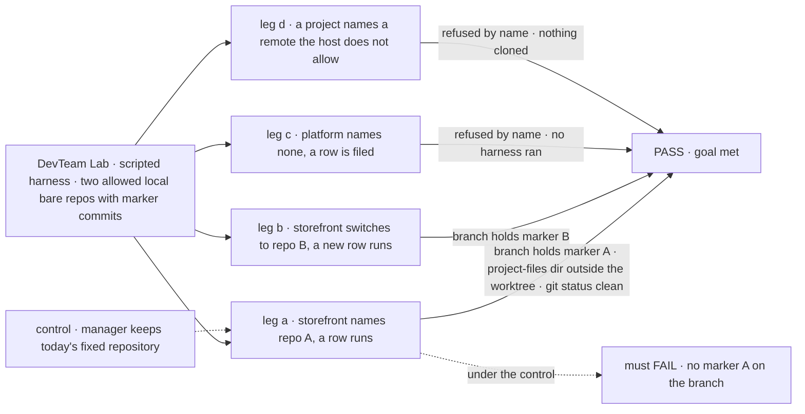
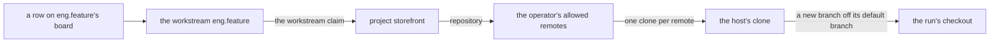

# FIX-1762 · A project records its repository, and a harness worktree is mapped from it

**Spec** · [Decisions](DECISIONS.md) · [Rules](BUSINESS-RULES.md) · [Plan](PLAN.md) · [Docs](DOCS.md) · [Evolution](EVOLUTION.md)

## Five people, before and after

| Someone who… | Today | After |
|---|---|---|
| **asks the chief of staff for a coding project** | Gets a project with a title, a brief and workstreams, and no way to say which code it is about | Names the remote. The chief of staff asks them to approve it in Inbox, then the project keeps it and the Brief shows it |
| **approves a feature in that project** | The coding run works in whatever single repository the Lab's operator wired at boot | The run works in a fresh branch of that project's repository. Nobody names a folder |
| **runs two projects on two codebases in one Lab** | Can't: one Lab, one repository | Each project's work lands in its own repository, as long as the Lab's operator allows that host |
| **keeps a project with no code** (a launch, a hiring plan) | A project | Still a project. A coding row filed there is refused with the reason, before any agent is paid |
| **has an agent write project notes during a run** | Notes go wherever the agent wrote them, often into the checkout, where they get committed | The run has a directory for project files beside its checkout, never inside it. Keeping those files after the run is the open question, [D3](DECISIONS.md#open) |

## The goal, and how we'll know it's met

**A person sets a repository on a project, and every coding run for that project's work
starts from that repository, without anyone naming a folder, and only from a remote the Lab's
operator allows; the project's own files have a place that is never the checkout.**

| Is it the right goal? | |
|---|---|
| **The real need** | "A Shift Manager project is not useful for coding until the system knows which repository it belongs to … the worktree is mapped from that repo. The user does not name a path." And: memory and anything an agent keeps "is written there", not in the checkout ([FIX-1762](https://linear.app/fixpoint-labs/issue/FIX-1762), first child of epic [FIX-1763](https://linear.app/fixpoint-labs/issue/FIX-1763)) |
| **Smaller, and rejected** | "The project row has a `repository` field." Shippable while runs still use the Lab's one repository |
| **Smaller, and recommended for item 3** | The project's files get their place and their boundary, but nothing is saved back from a run yet. An agent's note does not outlive the run. This is the hardest sign-off line ([D3](DECISIONS.md#open)) |
| **Bigger, and not this issue's** | Uncommitted work surviving the loss of the machine (the later overlay) · pushing or opening a pull request · several machines |
| **Not done if** | A run's branch is cut from the Lab's default repository while its project names another · a project with no repository silently runs against a default · a remote the operator did not allow is cloned · a changed repository quietly reuses a checkout of the old one · a file in the project-files directory shows up in `git status` |



The check reads the branch the run actually committed on and the host's clone folder, not
what the resolver returned. The dashed path is today's wiring, and it must fail.

| How we verify | |
|---|---|
| **Goal check** | `goals/devforce-lab/it-codes-in-the-projects-repository/` · model `n/a` (scripted harness: the property is where the checkout comes from) · run by the implementer at completion · verdict in the implementation PR |
| **Signal** | Leg a: the run's branch contains marker A and the run's own commit; no input the person gave names a folder; the file the run wrote to its project-files directory is outside the worktree and absent from `git status`. Leg b: a new row's branch contains marker B, not A. Leg c: refused naming `platform` and "no repository", harness never called. Leg d: refused naming the remote, and no clone of it exists |
| **Input** | Two `file://` bare repositories the check makes, each with one unique marker commit, with the host opting in to `file://`. Different default-branch names must pass too |
| **Anti-game** | No asserting on the resolver's return value or the row field alone. No fixed `sourceRepo` in the profile. No marker commit in the Lab's default scratch repository |
| **Control that must fail** | `GOAL_CONTROL=fixed-source`, the manager built with today's fixed repository: leg a FAILS on *branch contains marker A*. Today's `main` FAILS the same signal |

## What changes


Left is today: one repository for every project. Right is after: the repository rides on the
project, and the project's files have a place beside the checkout, never inside it.

**The person, or an app's own call:**

```diff
  createProject({
    id: "storefront",
    title: "Storefront",
    workstreams: ["eng.feature", "ops.release"],
+   repository: "https://github.com/acme/storefront.git",
  })
+ setRepository({ projectId: "storefront", repository: "git@github.com:acme/storefront-v2.git" })
+ setRepository({ projectId: "storefront", repository: null })   // a project with no code
```

**The Lab's operator, once, in its host:**

```diff
  harnessManager({
    boardCollectionId: work.id,
    boardCollection: work,
-   workspace: { root, sourceRepo, baseRef },
+   workspace: {
+     root,
+     remotes: { allow: ["github.com"] },              // file:// only if listed
+     ...projectWorkspace({ board: work }),          // the same board the manager drains
+   },
    harness: …,
  })
```

## How a run finds its repository



Every step is stored, server-written data, and the operator's list is the last gate. A
workstream belongs to at most one project, so the chain has one answer.

## What stays as it is

- **Layer 1.** No engine or core change. The repository is a field on the existing `projects` row
  ([FIX-1650 D2](../../epics/FIX-1650/DECISIONS.md#d2)); no second project store.
- **The run's own checkout.** Still derived from the row, still never reset. A fixed `sourceRepo`
  behaves as today: it becomes the one-repository case of the same path.
- **Not built here:** pushing, pull requests, auto-commit, the later overlay that keeps dirty
  paths if the machine is lost, and (if D3 is approved as recommended) saving project files
  back from a run.

## Sign off

**[The goal](#the-goal-and-how-well-know-its-met), at that size:** the run really starts from the
project's repository, only from allowed remotes, and the project's files are never in the
checkout. If wrong: we ship an address on a project that the work ignores, or one that lets a
chat point the host's git anywhere.

**Open · [D3](DECISIONS.md#open) · Does a run's project-files directory get saved back to the
project in this slice?** Recommended: no, boundary only. If wrong: an agent's notes for the
project are lost at the end of each run until a follow-up builds the save.

1. **[D1](DECISIONS.md#d1) · A coding row in a project with no repository is refused, by name,
   before any agent runs.** If wrong: a Lab that wanted one shared repository sets it on each
   project, one call each.
2. **[D2](DECISIONS.md#d2) · Members set the repository directly; the chief of staff asks a person
   in Inbox first; both only within the operator's allowed remotes.** If wrong: one extra click
   each time the chief of staff sets a repository.

D3 is the one to weigh. Reasoning and what lost: [DECISIONS.md](DECISIONS.md). The cases:
[BUSINESS-RULES.md](BUSINESS-RULES.md).

Feature · `workforce` + `harness-manager` + Shift Manager lab · large · 3 PRs · epic
[FIX-1763](https://linear.app/fixpoint-labs/issue/FIX-1763) (first child) · aligns with
[FIX-1650](https://linear.app/fixpoint-labs/issue/FIX-1650)
