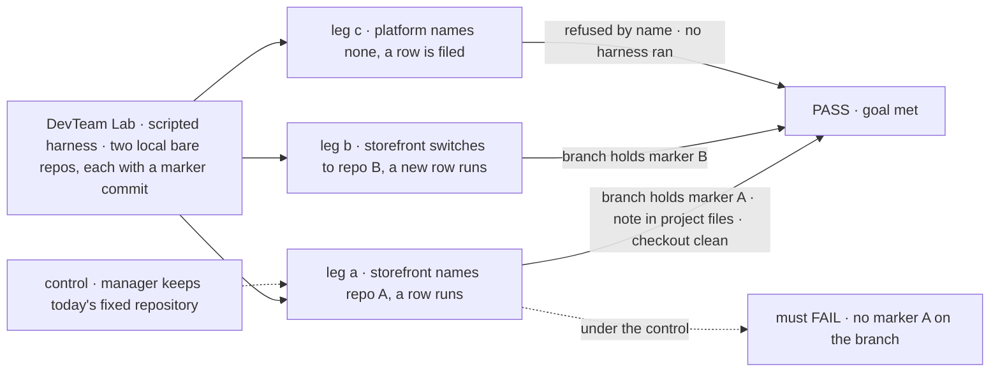
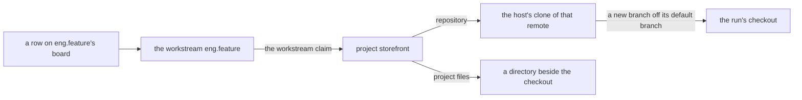

# FIX-1762 · A project records its repository, and a harness worktree is mapped from it

**Spec** · [Decisions](DECISIONS.md) · [Rules](BUSINESS-RULES.md) · [Plan](PLAN.md) · [Docs](DOCS.md) · [Evolution](EVOLUTION.md)

## Five people, before and after

| Someone who… | Today | After |
|---|---|---|
| **asks the chief of staff for a coding project** | Gets a project with a title, a brief and workstreams, and no way to say which code it is about | Says "it's `github.com/acme/storefront`". The project keeps that address, and the Brief shows it |
| **approves a feature in that project** | The coding run works in whatever single repository the Lab's operator wired at boot, whichever project the work is for | The run works in a fresh branch of that project's repository. Nobody names a folder |
| **runs two projects on two codebases in one Lab** | Can't: one Lab, one repository | Each project's work lands in its own repository |
| **keeps a project with no code** (a launch, a hiring plan) | A project | Still a project. A coding row filed there is refused with the reason, before any agent is paid |
| **has an agent keep notes for the project** | Notes go wherever the agent wrote them, often into the checkout, where they get committed or lost | Notes go to the project's own files, kept by the Lab. They never enter the checkout, and the checkout never enters them |

## The goal, and how we'll know it's met

**A person sets a repository on a project, and every coding run for that project's work
starts from that repository, without anyone naming a folder; the project's own files stay
apart from the code.**

| Is it the right goal? | |
|---|---|
| **The real need** | "A Shift Manager project is not useful for coding until the system knows which repository it belongs to … the worktree is mapped from that repo. The user does not name a path" ([FIX-1762](https://linear.app/fixpoint-labs/issue/FIX-1762)) |
| **Smaller, and rejected** | "The project row has a `repository` field." Shippable while runs still use the Lab's one repository, so a person would see the address and still get the wrong code |
| **Bigger, and not this issue's** | Uncommitted work surviving the loss of the machine (the later overlay, through the existing projection) · pushing or opening a pull request for the run · several machines |
| **Not done if** | A run's branch is cut from the Lab's default repository while its project names another · a project with no repository silently runs against a default · a changed repository quietly reuses a checkout of the old one · a note an agent kept shows up in `git status` · an operator had to write a path per repository |



The check reads the branch the run actually committed on and the project's stored files, not
what the resolver returned. The dashed path is today's wiring, and it must fail.

| How we verify | |
|---|---|
| **Goal check** | `goals/devforce-lab/it-codes-in-the-projects-repository/` · model `n/a` (the scripted harness: the property is where the checkout comes from, not what the agent writes) · run by the implementer at completion · verdict in the implementation PR |
| **Signal** | Leg a: the run's branch contains repo A's marker commit and the run's own commit, the checkout path appears in no input the person gave, `project-files/storefront/` holds the note the run kept, and the checkout's `git status` lists no note. Leg b: a new row's branch contains marker B, not A. Leg c: the row fails naming `platform` and "no repository", and the harness was never called |
| **Input** | Two `file://` bare repositories made by the check, each with one unique marker commit; repositories with different default-branch names must pass too |
| **Anti-game** | No asserting on the resolver's return value or the row field alone. No fixed `sourceRepo` in the profile. No marker commit in the Lab's default scratch repository |
| **Control that must fail** | `GOAL_CONTROL=fixed-source`, the manager built with today's fixed repository: leg a FAILS on *branch contains marker A*. Today's `main` FAILS the same signal |

## What changes


Left is today: one repository for every project. Right is after: the repository rides on the
project, and the project's files sit beside the checkout, never inside it.

**The person, through the chief of staff (or an app's own call):**

```diff
  createProject({
    id: "storefront",
    title: "Storefront",
    workstreams: ["eng.feature", "ops.release"],
+   repository: "https://github.com/acme/storefront.git",
  })
+ setRepository({ projectId: "storefront", repository: "git@github.com:acme/storefront-v2.git" })
+ setRepository({ projectId: "storefront", repository: null })   // a project with no code
```

**The Lab's operator, once, in its host:**

```diff
  harnessManager({
    boardCollectionId: work.id,
    boardCollection: work,
-   workspace: { root, sourceRepo, baseRef },
+   workspace: { root, ...projectWorkspace({ mailboxId: "eng.feature" }) },
    harness: …,
  })
```

## How a run finds its repository



Every step is stored, server-written data. A workstream belongs to at most one project, so the
chain has one answer.

## What stays as it is

- **Layer 1.** No engine or core change. The repository is a field on the existing `projects` row
  ([FIX-1650 D2](../../epics/FIX-1650/DECISIONS.md#d2)); no second project store.
- **The run's own checkout.** Still derived from the row, still never reset; a fixed `sourceRepo`
  behaves as today.
- **Not built here:** pushing, pull requests, auto-commit, and the later overlay that keeps dirty
  paths if the machine is lost.

## Sign off

**[The goal](#the-goal-and-how-well-know-its-met), at that size:** the run really starts from the
project's repository, the project's own files really stay apart. If wrong: we ship an address on
a project that the work ignores.

1. **[D1](DECISIONS.md#d1) · A coding row in a project with no repository is refused, by name,
   before any agent runs.** If wrong: a Lab that wanted one shared repository sets it on each
   project, one call each.
2. **[D2](DECISIONS.md#d2) · The host keeps one clone per repository and cuts every run's branch
   from it; nobody maps a remote to a folder.** If wrong: the host's own git credentials decide
   what it can reach, and a private repo it can't read fails at the first run, named.
3. **[D3](DECISIONS.md#d3) · The project's own files are a collection, laid out beside the
   checkout for a coding run and saved back after it.** If wrong: we built the side-files half
   one issue early, before any agent writes project memory.

**Open: none.** D3 is the one to weigh. Reasoning and what lost: [DECISIONS.md](DECISIONS.md).
The cases: [BUSINESS-RULES.md](BUSINESS-RULES.md).

Feature · `workforce` + `harness-manager` + Shift Manager lab · large · 3 PRs · no epic (related:
[FIX-1650](https://linear.app/fixpoint-labs/issue/FIX-1650), [FIX-1720](https://linear.app/fixpoint-labs/issue/FIX-1720))
