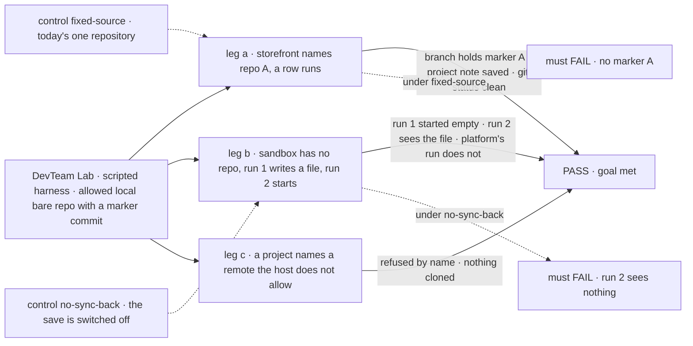
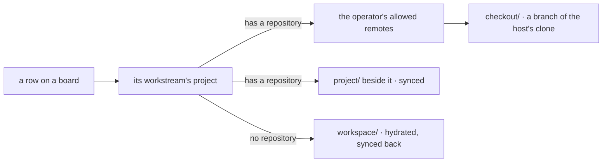

# FIX-1762 · A project records its repository, and a harness worktree is mapped from it

**Spec** · [Decisions](DECISIONS.md) · [Rules](BUSINESS-RULES.md) · [Plan](PLAN.md) · [Docs](DOCS.md) · [Evolution](EVOLUTION.md)

## Six people, before and after

| Someone who… | Today | After |
|---|---|---|
| **asks the chief of staff for a coding project on a repository** | Gets a project with no way to say which code it is about | Names the remote and approves it in Inbox. The project keeps it, and the Brief shows it |
| **approves a feature in that project** | The run works in whatever single repository the Lab's operator wired at boot | The run works in a fresh branch of that project's repository. Nobody names a folder |
| **starts a project with no repository** (a prototype from scratch) | Coding work has nowhere to keep its files | The first run starts from an empty set of files, and everything it writes is kept in the project. The next run picks up where it left off |
| **runs two projects on two codebases in one Lab** | Can't: one Lab, one repository | Each project's work lands in its own repository, as long as the Lab's operator allows that host |
| **has an agent keep notes for a repository project** | Notes go into the checkout, where they get committed or lost | Notes go in `project/`, beside the checkout, and are saved to the project. Git never sees them |
| **writes a worker that edits files itself** (bash and file tools, no vendor harness) | Gets no repository and no project files from the coding machinery | Gets the same repository worktree and project files from the same place a harness does |

## The goal, and how we'll know it's met

**A coding run for a project's work starts from the project's repository when it has one, and
from the project's own kept files when it has none; whatever the run writes to the project's
files is saved back to the project, never into the checkout; and only remotes the Lab's operator
allows are ever reached.**

| Is it the right goal? | |
|---|---|
| **The real need** | "The worktree is mapped from that repo. The user does not name a path" ([FIX-1762](https://linear.app/fixpoint-labs/issue/FIX-1762)). And Jake: "If a project has no repo, then it means we are starting with a clean slate of files. In this case we need to sync file system updates into resources … otherwise there is nothing to check into and how do we retain data?" |
| **Smaller, and rejected** | "The project row has a `repository` field," or "project files get a directory but nothing is saved." Both were on this PR; Jake rejected the second on 2026-10-04 ([D3](DECISIONS.md#d3)) |
| **Bigger, and not this issue's** | Uncommitted repository work surviving the loss of the machine ([FIX-1766](https://linear.app/fixpoint-labs/issue/FIX-1766)) · a sandbox host ([FIX-1767](https://linear.app/fixpoint-labs/issue/FIX-1767)) · push, pull request and cleanup ([FIX-1768](https://linear.app/fixpoint-labs/issue/FIX-1768)). The whole arc is in [EVOLUTION.md](EVOLUTION.md) |
| **Not done if** | A run in a repository project cuts its branch from the Lab's default repository · a no-repository project's second run does not see the first run's files · one project's run sees another project's files · a project file shows up in `git status` · a remote the operator did not allow is cloned |



The check reads the branch the run committed on, the files the second run was handed, and the
project's stored files. Each control switches off exactly the behaviour its leg depends on.

| How we verify | |
|---|---|
| **Goal check** | `goals/devforce-lab/it-codes-in-the-projects-repository/` · model `n/a` (scripted harness: the property is where files come from and where they go) · run by the implementer at completion · verdict in the implementation PR |
| **Signal** | Leg a: the run's branch contains marker A and the run's commit; the note it wrote in `project/` is in `project-files/storefront/` and absent from `git status`. Leg b: run 1's `workspace/` started empty; the file it wrote is in `project-files/sandbox/`; run 2's `workspace/` contains it; a run in another project does not. Leg c: refused naming the remote, no clone exists |
| **Input** | A `file://` bare repository the check makes with one marker commit, the host opting in to `file`; a project `sandbox` with no repository. A different file name or a nested path must pass too |
| **Anti-game** | No asserting on the resolver's return or the row field alone. No file seeded into the collection by the check. No fixed `sourceRepo` in the profile |
| **Control that must fail** | `GOAL_CONTROL=fixed-source`: leg a FAILS on *branch contains marker A*. `GOAL_CONTROL=no-sync-back`: leg b FAILS on *run 2 sees the file*. Today's `main` FAILS both |

## What changes


Left is today: one repository for every project. Right is after: the repository rides on the
project, its files are kept by the project, and a project with no repository works on its files alone.

**The person, or an app's own call:**

```diff
  createProject({
    id: "storefront",
    title: "Storefront",
    workstreams: ["eng.feature", "ops.release"],
+   repository: "https://github.com/acme/storefront.git",
  })
+ setRepository({ projectId: "storefront", repository: null })   // runs on its files from now on
```

**The Lab's operator, once, in its host:**

```diff
  harnessManager({
    boardCollectionId: work.id,
    boardCollection: work,
-   workspace: { root, sourceRepo, baseRef },
+   workspace: localWorkspaceHost({
+     root,
+     remotes: { allow: ["github.com"] },              // file:// only if listed
+     source: projectWorkspace({ board: work }),      // the same board the manager drains
+   }),
    harness: …,
  })
```

## How a run gets its files



Workforce answers which project and which source; the shared workspace layer provisions and
saves; harness-manager is its first caller. Every step reads stored, server-written data.

## What stays as it is

- **Layer 1.** No engine or core change. The repository is a field on the existing `projects` row
  ([FIX-1650 D2](../../epics/FIX-1650/DECISIONS.md#d2)); no second project store; a repository is
  not a projected resource ([EVOLUTION.md](EVOLUTION.md#why-a-repository-is-not-a-projected-resource)).
- **The run's own checkout.** Still derived from the row, still never reset. A fixed `sourceRepo`
  behaves as today.
- **The bash tool's projection.** Reused as it is, with a per-project key scope added.
- **Not built here:** keeping uncommitted repository work across a lost machine, sandboxes, push
  and cleanup: slices 2–4.

## Sign off

**[The goal](#the-goal-and-how-well-know-its-met), at that size:** both kinds of project run
coding work and keep it. Confirmed by Jake on 2026-10-04 ("I confirm all of your recommendations").

1. **[D1](DECISIONS.md#d1) · decided by Jake · A project with no repository runs coding rows on its
   files, starting empty and synced back.** If wrong: a project's code lives in FSD's store until
   someone adds a repository.
2. **[D2](DECISIONS.md#d2) · decided by Jake · The run source and the workspace host live in the
   shared workspace layer; harness-manager is the first caller.** If wrong: one more package edge
   for a tool-worker path nobody uses.
3. **[D3](DECISIONS.md#d3) · decided by Jake · Project files are synced back in this slice, scoped
   to one project.** If wrong: we built the save before anyone needed it.

**Open: none.** The other calls Jake made, and the round-1 calls still standing, are in
[DECISIONS.md](DECISIONS.md#decided-by-jake-2026-10-04). The cases: [BUSINESS-RULES.md](BUSINESS-RULES.md).

Feature · `workspace` + `workforce` + `harness-manager` + Shift Manager lab · large · 4 PRs (a
GitHub stack) · epic [FIX-1763](https://linear.app/fixpoint-labs/issue/FIX-1763), slice 1 of 4 ·
aligns with [FIX-1650](https://linear.app/fixpoint-labs/issue/FIX-1650)
