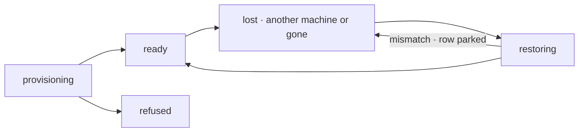

# FIX-1766 · Business rules

[Spec](SPEC.md) · [Decisions](DECISIONS.md) · **Rules** · [Plan](PLAN.md) · [Docs](DOCS.md) · [Evolution](EVOLUTION.md)

The cases, written as rules. *Proved by* names the kind of check; [PLAN.md](PLAN.md#checks) maps
each to its run. "A hold" writes one snapshot of the run's work; "the held-work store" is where it
goes ([D3](DECISIONS.md#d3)); "the record" is the run's row in `runs/**`. Repository runs only: a
run with no repository already keeps its work in its project's files. Every rule from BR-1 to
BR-27 applies only on a host with holding on; [BR-28 and BR-29](#holding-off) say what off means.

## Holding a run's work

| # | When | Then | Proved by |
|---|---|---|---|
| BR-1 | An attempt of a repository run ends: it completes, asks a question, or the harness fails | Its work is held: a snapshot of the working tree, taken through a temporary index on top of the run's head, and one pack of every object from the run's base to that snapshot ([Q1](DECISIONS.md#q1)) | CI · goal leg a |
| BR-2 | A hold runs after earlier ones | It is whole on its own: the newest snapshot is the run's work. Nothing is reconciled with an earlier hold, so a path committed or reverted since is simply as git now has it | CI |
| BR-3 | Git ignores a path (`.env`, `node_modules`, `.fsdev/`) | Not held. Never | CI |
| BR-4 | A changed file is over 10 MB, or the change is inside a submodule | Not held: the snapshot keeps the head's version of that path, or none, and the record names it as not held. Size is read from the file's `lstat` before git reads it, so an over-cap file is never loaded | CI · a 500 MB file is skipped without being read |
| BR-5 | A held file is binary, renamed, nested, executable, or a symlink | Held and rebuilt exactly, mode included. Not kept: which edits were staged, and empty directories. A rebuilt run's changes all read as unstaged, new files as untracked | CI · goal input |
| BR-6 | A hold finishes | The pack is written first, under a new key named by its snapshot. Then the record gets: the base, the head, the snapshot, the pack's key, hash and size, any path not held, the attempt, and when. Last, the pack the record named before is deleted, and no other, unless that pack parked: a pack that parked is never overwritten or deleted, and stays as evidence; a failed delete is logged and leaves an orphan, not a failed hold. A snapshot equal to the recorded one writes, switches and deletes nothing | CI · goal leg d |
| BR-7 | A hold fails | The record says so with the error. The attempt carries on, and the next save point holds again | CI |
| BR-8 | A hold fails on an attempt that would complete the run | The attempt fails instead, so its retry holds the work. A run is not done while its work is held nowhere | CI |
| BR-9 | An attempt displaced by a newer one tries to hold | Refused, like every write from a displaced attempt. The newer attempt's held work is untouched | CI |
| BR-10 | The run cut its branch from a repository the operator named on the host's own disk, or the run source names no place for held work | Nothing is held, and the record says the work is not held | CI |
| BR-11 | Any hold | Nothing is pushed, no ref is written anywhere, the agent's index is not touched, and no commit is made on the run's branch. The snapshot's objects are left unreferenced in the local clone | Goal leg a · remote refs unchanged |

## Where held work lives

| # | When | Then | Proved by |
|---|---|---|---|
| BR-12 | A run works in a shared project | Held under the org's prefix, the project and the run | CI |
| BR-13 | A run works in a private project | Held under the owner's user prefix, and never under the org's ([FIX-1793 BR-33](../FIX-1793/BUSINESS-RULES.md#coding-runs)). Until the source can tell a private project's owner, it names no place, and BR-10 applies | Goal leg c |
| BR-14 | Anyone tries to read held work through FSD's routes | There is nothing to read: the held-work store is not an FSD resource, and no collection or state route reaches it. Only the run's own attempts read it | CI |
| BR-15 | Any hold or restore | Reads and writes one exact key, under the prefix the run source answered for this attempt from the attempt's own context. It never lists. A recorded key outside that prefix is a mismatch naming `scope` | CI |

## Bringing a run back

| # | When | Then | Proved by |
|---|---|---|---|
| BR-16 | An attempt starts on the machine the record names, and the place is there | Used as it is, exactly as today: `origin` `live`, `place.state` `ready`. No fetch, reset or restore | Existing suite |
| BR-17 | An attempt starts and the record names another machine, or the place is gone | `place.state` goes `lost`, then `restoring`. A fresh clone of the recorded remote, the branch at the base, the pack unpacked, the snapshot's tree checked out, and the branch reset to the head with the changes left unstaged | Goal leg a |
| BR-18 | The rebuilt checkout matches the record: remote, branch, base, head, the pack's hash, and the rebuilt tree equal to the snapshot's | `origin` `held`; `place.state` `ready`, naming this machine. The harness starts there | Goal leg a |
| BR-19 | Anything disagrees: the pack is missing or its hash differs, the snapshot or head is not in it, the base is gone from the remote, the tree differs, or the key is outside this attempt's prefix | `provision` rejects with a mismatch naming the field; `place.state` goes back to `lost`; the run row goes to `parked`. A question goes to the run's owner naming what disagreed ([D2](DECISIONS.md#d2)). No harness runs; nothing held is changed. The operator's log names the run and the field, no contents | Goal leg b |
| BR-20 | The owner answers a parked mismatch | The next attempt starts from the base, with the snapshot's tree in `held/` beside the checkout when the pack can be read, never inside it; otherwise no `held/`, and the prompt says so. The mismatched pack is never overwritten or deleted: the next hold writes a new key and leaves it (BR-6) | CI |
| BR-21 | The record has a place but nothing was ever held (the machine died in the first turn, or in its first hold) | `origin` `base`, `place.state` `ready`: starts from the base, and the prompt says nothing was held | CI |
| BR-22 | This machine has a directory for the place, but the record names another machine | The directory is moved aside and kept, never deleted; the place is rebuilt | CI |
| BR-23 | The rebuilt attempt's coding agent cannot resume its conversation on this machine | It starts a fresh one; the prompt says what was restored and from which turn | CI |
| BR-24 | A record written before this change is read | No place state and no hold: provisions as today (BP-030) | CI over a stored legacy record |

## The place, on the record

| # | When | Then | Proved by |
|---|---|---|---|
| BR-25 | A place is provisioned | `place.state` names this machine and goes `provisioning`, then `ready`; a refused source or remote leaves it `refused` and the row `cancelled`, as today | CI |
| BR-26 | A person reads the run's status | Sees the machine, `place.state`, the row's status, and when the work was last held or why it was not | CI |
| BR-27 | The record's two roots are read together | Only these pairs exist. `place` null, `held` null: never provisioned, holding off ([BR-28](#holding-off)), or a record from before this change (BR-24). `place` set, `held` null: nothing held yet, or nowhere to hold it (BR-10, BR-21). Both set: the normal case; `held.snapshot` changes on every hold. `place` null with `held` set never happens: `place` is written first, so the pair is rejected as corrupt | CI |

## Holding off, and a crash mid-hold

| # | When | Then | Proved by |
|---|---|---|---|
| BR-28 | The host has no held-work store, which is the default, and the record names no held work | Exactly today's `main`: no snapshot, no git read at a save point, nothing stored, no `place` or `held` on the record. `provision` returns `new` or `live` only | Goal leg e |
| BR-29 | The record names a held snapshot, this host has holding off, and the run has no live place here | `provision` rejects with a mismatch naming `disabled`, before any clone, and the row parks for its owner as BR-19. The pack is left as it is. After the answer, the next attempt starts from the base with no `held/` (BR-20) | CI · goal leg f |
| BR-30 | The machine dies mid-hold | Before the switch: the record still names the previous snapshot, its pack intact, and the next attempt rebuilds from it as BR-18, with no question to anyone; the new pack is never read. After the switch, before the delete: the record names the new pack, and the old one is left. Either way one orphan, which FIX-1768's sweep finds with `list` and removes | Goal leg d |

### The three state vocabularies

Three layers report on one run, each with its own words. Use them exactly; none borrows another's.

| Moment | What `provision` returns | `place.state` on the run record | The run row's status on the board |
|---|---|---|---|
| Holding is off; the record names no held work | a place, `origin: "new"` or `"live"`, as today | not written | `in_progress` |
| Holding is off; the record names held work | rejects with a mismatch, `field: "disabled"` | `lost` | `parked`, a question to the run's owner |
| Provisioning a place | — | `provisioning` | `in_progress` |
| A new place is made | a place, `origin: "new"` | `ready` | `in_progress` |
| The recorded place is live here | a place, `origin: "live"` | `ready` | `in_progress` |
| The recorded place is elsewhere or gone | — | `lost` | `in_progress` |
| Rebuilding from held work | — | `restoring` | `in_progress` |
| Rebuilt and matching the record | a place, `origin: "held"` | `ready` | `in_progress` |
| Nothing was ever held | a place, `origin: "base"` | `ready` | `in_progress` |
| Held work disagrees with the record | rejects with a mismatch, naming the field | `lost` | `parked`, a question to the run's owner |
| The source or the remote is refused | rejects with a refusal, as today | `refused` | `cancelled`, as today |

**A mismatch shows in the run row's status only.** `place.state` stays `lost`, because no usable
place exists; the row is what waits for a person, so the row says `parked`. No `place.state` is
named `parked`, and no host call returns `restored`.

`place.state` alone, with holding on. Slice 2 adds `lost` and `restoring` and moves place state
onto the record; slice 4 adds `pushed` and `retired` after `ready`.

## Failure taxonomy

A failed hold degrades: it is recorded and retried at the next save point, except at completion
(BR-8), where it fails the attempt. A hold cut off by a crash is not a failure anyone sees: the
record still names the last good snapshot (BR-30). A mismatch is not a failure: it parks for a
person and does not retry on its own. A remote that cannot be read while rebuilding is FIX-1762's
refusal (`remote-unreadable`), before any harness runs. The only delete is BR-6's, of a pack the
record no longer names and that never parked.

## Acceptance criteria this issue owns

[The goal](SPEC.md#the-goal-and-how-well-know-its-met): legs a to f pass on the DevTeam Lab with
two machines sharing one store and one held-work store, and each leg with a control FAILS under it:
a under `no-checkpoint`, b under `no-verify`, d under `record-first` and `delete-first`, e under
`hold-always`.
