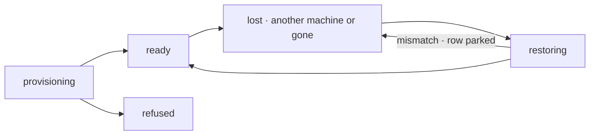

# FIX-1766 · Business rules

[Spec](SPEC.md) · [Decisions](DECISIONS.md) · **Rules** · [Plan](PLAN.md) · [Docs](DOCS.md) · [Evolution](EVOLUTION.md)

The cases, written as rules. *Proved by* names the kind of check; [PLAN.md](PLAN.md#checks) maps
each to its run. "Held work" is what a hold writes; "the record" is the run's row in `runs/**`.
Repository runs only: a run with no repository already keeps its work in its project's files.

## Holding a run's work

| # | When | Then | Proved by |
|---|---|---|---|
| BR-1 | An attempt of a repository run ends: it completes, asks a question, or the harness fails | Its work is held: every path git reports changed or untracked-and-not-ignored, a tombstone for each deleted path, and the commits from the run's base to its head as one bundle ([Q1](DECISIONS.md#q1)) | CI · goal leg a |
| BR-2 | A path was held, then committed or reverted | Its held row is removed at the next hold; the bundle carries a commit | CI |
| BR-3 | Git ignores a path (`.env`, `node_modules`, `.fsdev/`) | Not held. Never | CI |
| BR-4 | A changed file is over 10 MB, or is a submodule's change | Not held, and named on the record as not held. Size is read from the file's `lstat` before any content is read, so an over-cap file is never loaded | CI · a 500 MB file is skipped without being read |
| BR-5 | A held file is binary, or a path is renamed or nested | Held and rebuilt byte for byte | CI · goal input |
| BR-6 | A hold finishes | The record gets, last: the base commit, the head commit, the hash of every held path, the bundle's hash, the attempt that held it, and when | CI |
| BR-7 | A hold fails | The record says so with the error. The attempt carries on, and the next save point holds again | CI |
| BR-8 | A hold fails on an attempt that would complete the run | The attempt fails instead, so its retry holds the work. A run is not done while its work is held nowhere | CI |
| BR-9 | An attempt displaced by a newer one tries to hold | Refused, like every write from a displaced attempt. The newer attempt's held work is untouched | CI |
| BR-10 | The run cut its branch from a repository the operator named on the host's own disk | Nothing is held, as today, and the record says the work is not held | CI |
| BR-11 | Any hold | Nothing is pushed, no ref is written to the remote, and no commit is made for the user | Goal leg a · remote refs unchanged |

## Where held work lives

| # | When | Then | Proved by |
|---|---|---|---|
| BR-12 | A run works in a shared project | Held in the org's `worktree-overlay`, under the project and the run | CI |
| BR-13 | A run works in a private project | Held in the owner's user scope, and nowhere at org scope ([FIX-1793 BR-33](../FIX-1793/BUSINESS-RULES.md#coding-runs)) | Goal leg c |
| BR-14 | Anyone reads `worktree-overlay` through the collection route | Refused. Only the run's own attempts read held work | CI |
| BR-15 | Any hold or restore | Touches only that run's keys, filtered at the source; never another run's or project's | CI |

## Bringing a run back

| # | When | Then | Proved by |
|---|---|---|---|
| BR-16 | An attempt starts on the machine the record names, and the place is there | Used as it is, exactly as today: `origin` `live`, `place.state` `ready`. No fetch, reset or restore | Existing suite |
| BR-17 | An attempt starts and the record names another machine, or the place is gone | `place.state` goes `lost`, then `restoring`. A fresh clone of the recorded remote, the branch at the base, the bundle applied, the held files laid down, the tombstones applied | Goal leg a |
| BR-18 | The rebuilt checkout matches the record: remote, branch, base, head and every hash | `origin` `held`; `place.state` `ready`, naming this machine. The harness starts there | Goal leg a |
| BR-19 | Anything disagrees: a hash, the head, the branch, or the base is gone from the remote | `provision` rejects with a mismatch; `place.state` goes back to `lost`; the run row goes to `parked`. A question goes to the run's owner naming what disagreed ([D2](DECISIONS.md#d2)). No harness runs; nothing held is changed. The operator's log names the run and the reason, no contents | Goal leg b |
| BR-20 | The owner answers a parked mismatch | The next attempt starts from the base, with the held work in `held/` beside the checkout, never inside it. The mismatched rows are frozen; later holds use a new key | CI |
| BR-21 | The record has a place but nothing was ever held (the machine died in the first turn) | `origin` `base`, `place.state` `ready`: starts from the base, and the prompt says nothing was held | CI |
| BR-22 | This machine has a directory for the place, but the record names another machine | The directory is moved aside and kept, never deleted; the place is rebuilt | CI |
| BR-23 | The rebuilt attempt's coding agent cannot resume its conversation on this machine | It starts a fresh one; the prompt says what was restored and from which turn | CI |
| BR-24 | A record written before this change is read | No place state and no hold: provisions as today (BP-030) | CI over a stored legacy record |

## The place, on the record

| # | When | Then | Proved by |
|---|---|---|---|
| BR-25 | A place is provisioned | `place.state` names this machine and goes `provisioning`, then `ready`; a refused source or remote leaves it `refused` and the row `cancelled`, as today | CI |
| BR-26 | A person reads the run's status | Sees the machine, `place.state`, the row's status, and when the work was last held or why it was not | CI |
| BR-27 | The record's two roots are read together | Only these pairs exist. `place` null, `held` null: never provisioned, or a record from before this change (BR-24). `place` set, `held` null: nothing held yet, or the source names no overlay (BR-10, BR-21). Both set: the normal case; `held.epoch` moves only after an owner's answer (BR-20). `place` null with `held` set never happens: `place` is written first, so the pair is rejected as corrupt | CI |

### The three state vocabularies

Three layers report on one run, each with its own words. Use them exactly; none borrows another's.

| Moment | What `provision` returns | `place.state` on the run record | The run row's status on the board |
|---|---|---|---|
| Provisioning a place | — | `provisioning` | `in_progress` |
| A new place is made | a place, `origin: "new"` | `ready` | `in_progress` |
| The recorded place is live here | a place, `origin: "live"` | `ready` | `in_progress` |
| The recorded place is elsewhere or gone | — | `lost` | `in_progress` |
| Rebuilding from held work | — | `restoring` | `in_progress` |
| Rebuilt and matching the record | a place, `origin: "held"` | `ready` | `in_progress` |
| Nothing was ever held | a place, `origin: "base"` | `ready` | `in_progress` |
| Held work disagrees with the record | rejects with a mismatch, naming the field | `lost` | `parked`, a question to the run's owner |
| The source or the remote is refused | rejects with a refusal, as today | `refused` | `cancelled`, as today |

**A mismatch shows in the run row's status only.** `place.state` stays `lost`, because no usable
place exists; the row is what waits for a person, so the row says `parked`. No `place.state` is
named `parked`, and no host call returns `restored`.

`place.state` alone. Slice 2 adds `lost` and `restoring` and moves place state onto the record;
slice 4 adds `pushed` and `retired` after `ready`.

## Failure taxonomy

A failed hold degrades: it is recorded and retried at the next save point, except at completion
(BR-8), where it fails the attempt. A mismatch is not a failure: it parks for a person and does
not retry on its own. A remote that cannot be read while rebuilding is FIX-1762's refusal
(`remote-unreadable`), before any harness runs. Nothing in this slice deletes held work.

## Acceptance criteria this issue owns

[The goal](SPEC.md#the-goal-and-how-well-know-its-met): legs a to c pass on the DevTeam Lab with
two machines sharing one store, and leg a FAILS under `GOAL_CONTROL=no-checkpoint` and leg b under
`GOAL_CONTROL=no-verify`.
