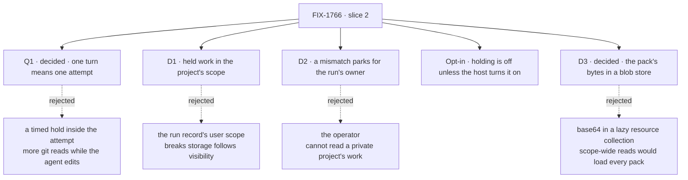

# FIX-1766 · Decisions

[Spec](SPEC.md) · **Decisions** · [Rules](BUSINESS-RULES.md) · [Plan](PLAN.md) · [Docs](DOCS.md) · [Evolution](EVOLUTION.md)

What was decided and what each choice locks in. Jake made the product calls on 2026-10-04 (FSD
guarantees this; FSD's storage, not a hidden git ref), approved Q1, D1 and D2 by merging
[#2878](https://github.com/fixpoint-labs/flow-state-dev/pull/2878), on 2026-10-08 asked for the
git snapshot shape and made holding optional, approved D3 by merging
[#2881](https://github.com/fixpoint-labs/flow-state-dev/pull/2881), and then approved the store's
`delete`, deleting superseded packs, and parking on a host with holding off. The FSD Architect set
the fences on 2026-10-08, recorded below as given.

## The tree

Solid edges are what was signed. Dashed edges lost, and the label says why.

## D3 · Decided at #2881's merge · The held snapshot's bytes: a blob store beside FSD's store, or text in FSD's store?

**In plain terms.** Each hold produces one file: a compressed git pack of the run's unpushed
commits and its working tree, usually kilobytes, at most a few megabytes, sized by what the run
changed rather than by the repository. FSD has nowhere to keep a binary file today. Its store
holds text, and a `blobs` slot is reserved in its store configuration but does nothing yet. So
either we add a small place for files (a folder by default, swappable for S3 or Vercel Blob),
or we encode the pack as text and keep it in FSD's store beside the project's files.

**The trade-off.**

- **(a) A blob store.** The bytes never enter FSD's text store, so no unrelated read ever loads
  them, nothing is inflated, and the store can only put, get and delete one exact key: there is
  nothing to list and no route to read it through. The price is a new, three-method port the
  operator wires. Its default is a folder, which survives a lost machine when it is shared
  storage, an NFS mount for one; without a shared disk, an S3 or Vercel Blob adapter, about
  twenty lines the operator writes until a package ships one. Its `put` must be atomic, never
  showing a partial object, because BR-30 depends on it: the folder does temp file and rename.
- **(b) Text in a resource collection,** read lazily by exact key. It works today wherever FSD's
  store works, shared Postgres included, and scope and access come from FIX-1793's declarations.
  The price: a third larger, and FSD's state routes read every content row in a user's or an
  org's scope at once, so every held pack would be loaded by unrelated reads of that scope
  until those routes learn to skip it. That is an engine change in a hot path, and the memory
  and SQLite stores would keep every pack in the process or the file.

| Deployment | (a) blob store | (b) collection |
|---|---|---|
| Tests, memory store | the folder store in a temp directory | works |
| Local dev, SQLite | the folder store; holding is off by default anyway | works; packs in the SQLite file |
| Postgres across machines | a shared folder, or an S3, R2 or Vercel Blob adapter | works |
| Vercel | a Vercel Blob adapter, only for a host that can lose its disk | works |
| DevTeam Lab, goal check | the folder store beside the host roots | works |

**Chosen: (a), a blob store.** Holding is opt-in ([below](#opt-in)), so the only operators who
wire it run hosts that can lose their disk, and those operators already have object storage. It
keeps megabytes of pack out of every scope-wide read for good, rather than until someone patches
the routes. The seam is the smallest that works: `HeldWorkStore` on the workspace host
(`put(key, bytes)`, `get(key)`, `delete(key)`, all required; deleting a missing key does nothing;
no list), with `fileHeldWorkStore({ dir })` as the shipped default. It sits on the host, not in the
engine's reserved `blobs` slot, because the host is built at boot outside any flow and depends
only on core. When the engine's binary store ships ([FIX-367](https://linear.app/fixpoint-labs/issue/FIX-367)),
a short adapter turns it into a `HeldWorkStore`; operators still wire a `HeldWorkStore`, and only
the default adapter changes.

**Scope and access under (a).** D1 holds unchanged. The key is
`worktree-overlay/<user|org>/<scopeId>/<projectId>/<run>/<snapshot>.pack`; Workforce picks the
first two segments from the project's visibility, exactly as it picks the project's files. No
route reads the store. The host reads only the exact key on the run record, and only when that
key sits under the prefix the run source answered for this attempt, from this attempt's own
context ([BR-14, BR-15](BUSINESS-RULES.md#where-held-work-lives)).

**What would reopen it:** the first deployment that will turn holding on runs on Postgres alone,
with no shared disk for the folder and no bucket, and must work without its operator writing an
adapter. Then (b), or (a) plus a Postgres adapter in this slice.

**If wrong:** cheap now, dearer later. The pack and the record's pointer are the same either way;
only where the bytes land changes, PR 1's port against PR 2's collection. Once packs are stored,
moving them is a sweep like FIX-1768's.

![D3, decided: where the held snapshot's bytes live. Chosen: a blob store, a three-method port on the workspace host with a folder as the default. Instead of: the pack base64-encoded in a lazy resource collection. Decides it: unrelated reads; FSD's state routes read a whole scope's content, so they would load every pack. Price: a new port, and an adapter where there is no shared disk, against a third more bytes and an engine change in a hot path. Locks in: a held-work store the operator wires. Flips if: the first deployment to opt in runs on Postgres alone, with no shared disk or bucket](figures/d3-blob-store.svg)

It comes down to unrelated reads: in the collection, every scope-wide read would load every pack.

## Given by Jake (2026-10-08) · Holding is optional, and off unless the host turns it on

*"It also needs to be entirely optional. When using sandboxes that preserve state or local file
systems, it's not necessary."* Recorded as given, not as a fork.

- **Who turns it on, and where:** the operator, on the workspace host, by passing a held-work
  store: `localWorkspaceHost({ …, heldWork: fileHeldWorkStore({ dir }) })`. The same option, with
  the same name, on every host kind. It is a host option because the host is what can or cannot
  lose its disk, and FIX-1762's host is configured the same way (`remotes`, `localRepositories`).
- **Default: off,** on every host kind. The local host keeps its disk; a sandbox that preserves
  its state (FIX-1767) keeps it too. No host turns holding on by itself.
- **Off means today's `main`:** no snapshot is taken, nothing is stored, no extra work at turn
  end, the run record gains no `place` or `held`, and `provision` behaves as it does now.
- **On, it still needs the run source** to name where held work lives (`heldPrefix`). A source
  that names none gets no hold, recorded as such ([BR-10](BUSINESS-RULES.md#holding-a-runs-work)).

## Q1 · Decided at merge · One turn is one attempt

**The fork was:** hold the work when each attempt of the run ends, or also every few minutes
while an attempt is running? Jake approved the recommendation by merging #2878.

**In plain terms.** A coding run works in attempts: the agent works until it finishes, asks a
question, or fails. One attempt can take minutes or over an hour. A crash loses everything since
the last hold.

**The trade-off.** An attempt-end hold uses save points that exist, never reads the checkout while
the agent edits it, and matches the run's own word "turn"; a crash in a long attempt loses it
whole. A timed hold caps the loss at minutes, but can hold a half-written file and puts a timer on
every run.

**Chosen: one turn is one attempt.** The timer can be added later: it calls the same hold.

**What would reopen it:** Lab runs routinely going past thirty minutes in one attempt.

**If wrong:** a person loses up to one long attempt of agent work on a crash, and we add the timer
in a follow-up. Nothing stored changes shape.

It came down to what a crash costs: an attempt-end hold loses a long attempt whole.

## D1 · The held work is kept in the project's scope

| | |
|---|---|
| **Instead of** | One place in the run record's user scope, whatever the project's visibility |
| **Because** | The Architect's fence: storage follows project visibility, and a private project's files sit in its owner's user scope ([FIX-1793 BR-33](../FIX-1793/BUSINESS-RULES.md#coding-runs)). Held work is that project's code, so it goes where the project's files go |
| **Locks in** | Each run's held work sits under `worktree-overlay/<user|org>/<scopeId>/<projectId>/<run>/`, the scope picked by the project's visibility exactly as FIX-1793 picks its files, so it moves whenever they do. Each hold is one pack under its own key ([D3](#d3) decides the store). No browser read. Slice 4 drops it by its prefix |

It comes down to a private project's work: the run record's scope would follow the runner, not the project.

## D2 · A mismatch parks the row for the run's owner

| | |
|---|---|
| **Instead of** | The Lab's operator, who runs the hosts |
| **Because** | The owner is the one person who can read the held work in every case: a private project's work is theirs alone, and a workstream's runs are its owner's ([FIX-1793 BR-34](../FIX-1793/BUSINESS-RULES.md#coding-runs)). The run's question already goes to that person through harness-manager's ask, so no new channel is built. The operator gets a log line naming the run and what disagreed, never file contents |
| **Locks in** | A parked mismatch waits for the owner's answer. After it, the next attempt starts from the base with the held snapshot laid beside the checkout in `held/`. The mismatched pack is never overwritten; it is deleted only once a later hold has switched the record away from it |

It comes down to who can read the work: the operator cannot see a private project's.

## Given, by the FSD Architect (2026-10-08)

Recorded as constraints, not decisions this spec makes:

- **Storage follows project visibility** ([FIX-1793 BR-33](../FIX-1793/BUSINESS-RULES.md#coding-runs)). D1 applies it.
- **FIX-1762's locks stay unchanged** ([its decisions](../FIX-1762/DECISIONS.md#decided-by-jake-2026-10-04)).
- **FIX-1786 leaves this issue outside that epic** ([its plan](../../epics/FIX-1786/PLAN.md#not-children-deliberately)); nothing here joins it.
- **No change to Workforce worker, coordinator, mailbox or task-board code.** Workforce gains one
  field on the run source's answer, in the projects module only.
- **None of the worker nouns [FIX-1796](../FIX-1796/SPEC.md) retired** appear in new code or prose.
- The issue's own fences are in [Considered and dropped](#considered-and-dropped) and the rules.

## Decided, not asked

- **The snapshot is git's own objects.** A temporary index takes the working tree (`git add -A`,
  `write-tree`, `commit-tree` on the head); the commits from the base and that snapshot go into
  one pack. It writes no ref, never touches the agent's index, and carries deletions, renames,
  binary files, exec bits and symlinks by construction. The rebuild checks one thing that matters:
  the rebuilt tree equals the recorded snapshot's. From jhoffner's [second look](https://github.com/fixpoint-labs/flow-state-dev/pull/2878#issuecomment-6066140305), finding 1.
- **The record switches last, to a new key, and the pack it replaced goes after.** Each hold
  writes its pack under a new, content-addressed key, points the record at it, and only then
  deletes the pack the record named before, and no other. A machine that dies before the switch
  leaves the record on the previous good pack; one that dies after it, before the delete, leaves
  the old pack behind. Either way one orphan, which FIX-1768's sweep removes. A run's storage is
  one live pack, plus at most one orphan for each hold a crash cut short. Finding 2 of each second
  look, [#2878](https://github.com/fixpoint-labs/flow-state-dev/pull/2878#issuecomment-6066140305)
  and [#2881](https://github.com/fixpoint-labs/flow-state-dev/pull/2881#issuecomment-6068041468).
- **Rebuilt files come back unstaged.** The rebuild resets the branch to the recorded head with
  the index at the head (`reset --mixed`), so edits read as unstaged and new files as untracked.
  Which edits were staged is not kept. The review proposed `--soft`, which would stage every
  change, new files included. Finding 4.
- **What is held, and the size cap:** [BR-1 to BR-5](BUSINESS-RULES.md#holding-a-runs-work).
- **Live, stale and lost places; a machine's identity is its root's:** [BR-16, BR-22](BUSINESS-RULES.md#bringing-a-run-back).
- **The vendor conversation on a new machine:** [BR-23](BUSINESS-RULES.md#bringing-a-run-back).
- **The state words, and that a mismatch shows only in the row's status:** [the three vocabularies](BUSINESS-RULES.md#the-three-state-vocabularies).
- **`place` and `held` stay two record roots**, not one object: they change at different times (per machine, per hold), and one object would still need both halves nullable. The allowed pairs are [BR-27](BUSINESS-RULES.md#the-place-on-the-record).
- **PR plan: four PRs**, PR 2 after FIX-1793's storage merges; shape in [PLAN.md](PLAN.md#pr-plan). An engineering call.

## Considered and dropped

| Alternative | Why not |
|---|---|
| A hidden git ref on the customer's repository | Jake, 2026-10-04: needs push rights and leaves refs on their host |
| Auto-commit the work onto the run's branch | Fence: no commit under the user's name for durability |
| Copy the whole checkout to the store | Fence; and a large repository costs a clone's size per run |
| Each dirty path as its own row through the workspace projection, with tombstones and one bundle (this spec as merged) | A second encoding of what git already expresses: binary encoding, tombstones and a baseline operation to make paths round-trip, and it lost modes and symlinks. Its incremental writes are its one advantage; a pack is bounded by the run's own changes |
| Overwrite the held work in place, record last | A machine dying mid-hold is the likeliest crash, and it would leave the record and the held work disagreeing: the owner gets a question and loses the previous turn |
| A provider snapshot as the record | Not crash-safe, one region, one provider; it is slice 3's fast path, with this as its fallback |
| Hold per tool call through a harness hook | Only one vendor exposes it; the others would hold less |

## How it got here

- **Draft** — framed as the slice the FIX-1762 design left as `checkpoint` and `restore`: hold
  dirty paths and a bundle through the existing projection in the project's scope, rebuild on any
  machine and check against the run record, park mismatches for the owner. Four PRs.
- **Merged** ([#2878](https://github.com/fixpoint-labs/flow-state-dev/pull/2878)) — Jake approved Q1, D1 and D2.
- **Amended, 2026-10-08** — Jake: "amend the spec to the git snapshot shape", "consider if this
  should only use blob storage", and "it also needs to be entirely optional". The per-path
  projection became one git snapshot per hold under a new key, switched to last; holding became
  an opt-in host option, off by default; D3 opened on where the bytes live. The record of the
  change is [EVOLUTION.md → The 2026-10-08 amendment](EVOLUTION.md#the-2026-10-08-amendment).
- **Merged** ([#2881](https://github.com/fixpoint-labs/flow-state-dev/pull/2881)), D3 with it; then
  amended from its second look: the store's `delete`, superseded packs deleted after the switch,
  and an off host parking. [EVOLUTION.md → The store-lifecycle amendment](EVOLUTION.md#the-store-lifecycle-amendment).
