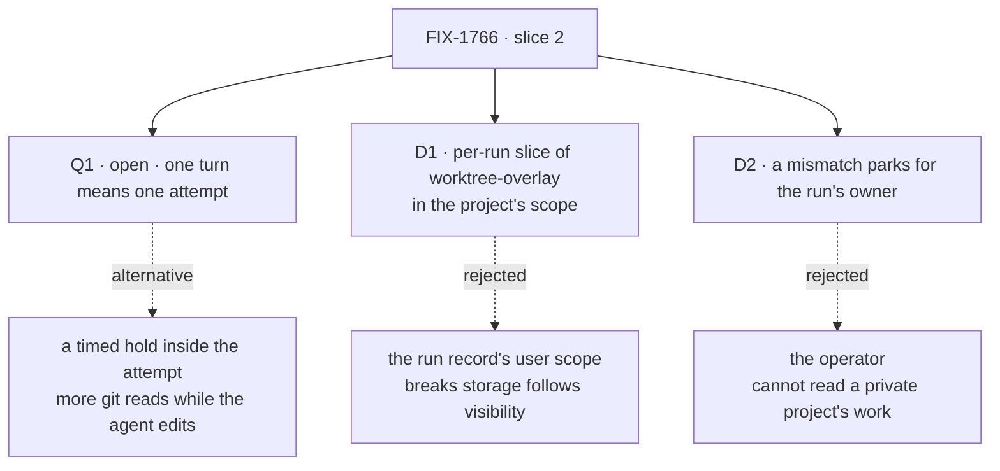

# FIX-1766 · Decisions

[Spec](SPEC.md) · **Decisions** · [Rules](BUSINESS-RULES.md) · [Plan](PLAN.md) · [Docs](DOCS.md) · [Evolution](EVOLUTION.md)

What was decided, what is still open, and what each choice locks in. Jake made the product calls
on 2026-10-04 (FSD guarantees this; an FSD collection, not a hidden git ref). The FSD Architect
set the fences on 2026-10-08, recorded below as given. This spec decides what those left open.

## The tree

Solid edges are what you sign; Q1 is the one fork still open. Dashed edges lost, and the label says why.

## Q1 · Open · What counts as "one turn" of lost work?

**The fork:** hold the work when each attempt of the run ends, or also every few minutes while
an attempt is running?

**In plain terms.** A coding run works in attempts: the agent works until it finishes, asks a
question, or fails. One attempt can take minutes or over an hour. A crash loses everything since
the last hold.

**The trade-off.** An attempt-end hold uses save points that exist, never reads the checkout while
the agent edits it, and matches the run's own word "turn"; a crash in a long attempt loses it
whole. A timed hold caps the loss at minutes, but can hold a half-written file and puts a timer on
every run.

**My recommendation: one turn is one attempt.** It is the issue's promise in its own words, and the
timer can be added later: it calls the same hold.

**What would change my mind:** Lab runs routinely going past thirty minutes in one attempt. Then a
lost machine costs the half-hour the issue is meant to save, and the timer belongs in this slice.

**If wrong:** a person loses up to one long attempt of agent work on a crash, and we add the timer
in a follow-up. Nothing stored changes shape.

It comes down to what a crash costs: an attempt-end hold loses a long attempt whole.

## D1 · The held work is a per-run slice of a `worktree-overlay` collection, kept in the project's scope

| | |
|---|---|
| **Instead of** | One collection in the run record's user scope, whatever the project's visibility |
| **Because** | The Architect's fence: storage follows project visibility, and a private project's files sit in its owner's user scope ([FIX-1793 BR-33](../FIX-1793/BUSINESS-RULES.md#coding-runs)). Held work is that project's code, so it goes where the project's files go. It is written through the projection the project's files already use, so two writers get the same outcomes and no second sync machine exists |
| **Locks in** | Each run's held work is `worktree-overlay/<projectId>/<run>/…`: the paths git reports dirty, a tombstone per deletion, and one bundle of unpushed commits. Declared at org and user scope beside FIX-1793's two project-files collections, so it moves whenever they do. No browser read. Slice 4 drops it by its prefix |

It comes down to a private project's work: the run record's scope would follow the runner, not the project.

## D2 · A mismatch parks the row for the run's owner

| | |
|---|---|
| **Instead of** | The Lab's operator, who runs the hosts |
| **Because** | The owner is the one person who can read the held work in every case: a private project's work is theirs alone, and a workstream's runs are its owner's ([FIX-1793 BR-34](../FIX-1793/BUSINESS-RULES.md#coding-runs)). The run's question already goes to that person through harness-manager's ask, so no new channel is built. The operator gets a log line naming the run and what disagreed, never file contents |
| **Locks in** | A parked mismatch waits for the owner's answer. After it, the next attempt starts from the base with the held work laid beside the checkout in `held/`, and the mismatched held rows are frozen: later holds go under a new key. Nothing held is ever overwritten or deleted in this slice |

It comes down to who can read the work: the operator cannot see a private project's.

## Given, by the FSD Architect (2026-10-08)

Recorded as constraints, not decisions this spec makes:

- **Storage follows project visibility** ([FIX-1793 BR-33](../FIX-1793/BUSINESS-RULES.md#coding-runs)). D1 applies it.
- **FIX-1762's locks stay unchanged** ([its decisions](../FIX-1762/DECISIONS.md#decided-by-jake-2026-10-04)).
- **FIX-1786 leaves this issue outside that epic** ([its plan](../../epics/FIX-1786/PLAN.md#not-children-deliberately)); nothing here joins it.
- **No change to Workforce worker, coordinator, mailbox or task-board code.** Workforce gains a
  collection and one field on the run source's answer, in the projects module only.
- **None of the worker nouns [FIX-1796](../FIX-1796/SPEC.md) retired** appear in new code or prose.
- The issue's own fences are in [Considered and dropped](#considered-and-dropped) and the rules.

## Decided, not asked

- **Reused machine.** The projection in `@flow-state-dev/workspace` (FIX-150's), over a place that
  lists only dirty paths. A `ProjectedResource` (FIX-1518) serves read-only records and cannot hold
  writes, as [FIX-1762's evolution](../FIX-1762/EVOLUTION.md#why-a-repository-is-not-a-projected-resource) found.
- **What is held:** tracked changes, untracked files git does not ignore, deletions as tombstones,
  and `base..head` as one bundle. Ignored files (`.env`, `node_modules`) are not held, on purpose.
- **Checked before trusted:** remote, branch, base, head and every held file's hash against the
  run record. The record is written last, fenced like every run-row write, so a hold cut off part
  way is caught as a mismatch rather than used.
- **A live place on the machine the record names is used as it is**, as today. A directory on any
  other machine's disk is stale: moved aside and kept, never deleted.
- **A machine's identity is its root's.** Hosts sharing a root share their places.
- **The vendor conversation** resumes only if that machine still has it; otherwise the attempt
  starts fresh and its prompt says what was restored and from which turn.
- **A file over 10 MB is not held** and is named on the run record. Large binaries belong in git or LFS.
- **PR plan: four PRs**, shape in [PLAN.md](PLAN.md#pr-plan). An engineering call.

## Considered and dropped

| Alternative | Why not |
|---|---|
| A hidden git ref on the customer's repository | Jake, 2026-10-04: needs push rights and leaves refs on their host |
| Auto-commit the work onto the run's branch | Fence: no commit under the user's name for durability |
| Copy the whole checkout to the store | Fence; and a large repository costs a clone's size per run |
| Write each hold as a fresh generation, then switch | Atomic, but it is a second sync machine beside the projection; the record-last check already catches a cut-off hold |
| A provider snapshot as the record | Not crash-safe, one region, one provider; it is slice 3's fast path, with this as its fallback |
| Hold per tool call through a harness hook | Only one vendor exposes it; the others would hold less |

## How it got here

- **Draft** — framed as the slice the FIX-1762 design left as `checkpoint` and `restore`: hold
  dirty paths and a bundle through the existing projection in the project's scope, rebuild on any
  machine and check against the run record, park mismatches for the owner. One fork left to Jake:
  what one turn means. Four PRs.
