# FIX-1766 · Plan

[Spec](SPEC.md) · [Decisions](DECISIONS.md) · [Rules](BUSINESS-RULES.md) · **Plan** · [Docs](DOCS.md) · [Evolution](EVOLUTION.md)

Written for the implementing agent. IDs cross-reference [BUSINESS-RULES.md](BUSINESS-RULES.md)
(BR-n) and [DECISIONS.md](DECISIONS.md) (Dn, Q1). `tdd`. Four PRs. Slice 2 of the design in
[FIX-1762's EVOLUTION.md](../FIX-1762/EVOLUTION.md): fills the `checkpoint` and `restore` seams
FIX-1762 shipped as no-ops. Written for Q1's recommendation (hold at attempt end); if Jake picks
the timed hold, S6 gains a timer calling the same hold, nothing else moves.

## Surfaces

| ID | Package · role | Change | Rules |
|---|---|---|---|
| S1 | `workspace` · run source | Repo answers gain an optional `overlay: RunFiles` beside `files`, with the same `projectId` as key prefix. No `overlay`, no hold | BR-10 BR-12 BR-13 |
| S2 | `workspace` · dirty-paths place | A `Place` over a checkout whose `list` is git's dirty set (`--no-optional-locks status -z`, untracked not ignored), plus tombstones and one bundle path. Binary content encoded so the utf-8 projection carries it byte for byte. Over-cap and submodule paths reported, not listed | BR-1–BR-5 |
| S3 | `workspace` · projection | Adopt a collection's current entries as the baseline without laying them down: a new process holding a live checkout can hold again without reading every row as someone else's | BR-2 BR-16 |
| S4 | `workspace` · local host `checkpoint` | Flush S2 through a scoped mount of `overlay` at `<projectId>/<run>/<epoch>/`; return the manifest (base, head, path hashes, bundle hash, skipped paths). Writes nothing to a remote | BR-1–BR-7 BR-11 BR-15 |
| S5 | `workspace` · local host `restore` and place identity | A host id kept at `<root>/.host-id`. `provision` takes the run's recorded place and manifest: live and recorded here → as today; else move a stale directory aside, clone, branch at base, apply bundle, lay down files and tombstones, verify every field, or answer a mismatch naming what disagreed. Mismatch answer can lay the held work in `held/` | BR-16–BR-23 |
| S6 | `harness-manager` · callers | Hold beside every existing save: turn end, park, harness failure (BR-8 at completion). Provision passes the record's place and manifest. A mismatch parks the row through the existing ask, to the run's owner; operator log line without contents. Prompt line on restore | BR-1 BR-7 BR-8 BR-9 BR-19 BR-20 BR-23 |
| S7 | `harness-manager` · run record | `.nullable().default(null)` fields: `place: { host, state }`, `held: { attempt, at, base, head, epoch, manifestHash, skipped, error }`. Written last, fenced. Status shows them | BR-6 BR-9 BR-24 BR-25 BR-26 |
| S8 | `workforce` · overlay collection | `worktree-overlay/**`, declared at org and at user scope beside FIX-1793's two project-files declarations, same schema as project files, no browser read, lazy | BR-12–BR-14 |
| S9 | `workforce` · `projectWorkspace` | Repo answers carry `overlay`, picked by the project's visibility as FIX-1793 picks its files. Capability declares S8 | BR-12 BR-13 |
| S10 | DevTeam Lab · `packages/shift-manager/teams/devteam/host.mts` | A second host root for the goal check; `GOAL_CONTROL` hooks `no-checkpoint` (S4 a no-op) and `no-verify` (S5 skips its check) | goal |
| S11 | Goal check | `goals/devforce-lab/it-keeps-a-runs-work-when-its-machine-is-lost/`, legs a–c | goal |
| S12 | Docs | Per [DOCS.md](DOCS.md); `minor` changesets for `workspace`, `harness-manager`, `workforce` | — |
| S13 | `harness-manager` README · Limits | **Remove** "One host's storage" | — |

## Sequence

```mermaid
flowchart TD
  S1["S1 · overlay on the answer"] --> S4["S4 · checkpoint"]
  S2["S2 · dirty-paths place"] --> S4
  S3["S3 · adopt baseline"] --> S4
  S4 --> S5["S5 · restore and verify"]
  S5 --> S6["S6 · harness-manager calls"]
  S7["S7 · record fields"] --> S6
  F["FIX-1793 · user-scope project files"] --> S8["S8 · overlay collection"]
  S1 --> S9["S9 · projectWorkspace"]
  S8 --> S9
  S6 --> S10["S10 · Lab wiring"]
  S9 --> S10
  S10 --> S11["S11 · goal check"]
  S11 --> S12["S12 · docs"]
```



### PR plan

| PR | Branch | Base | Deliverables | depends_on |
|---|---|---|---|---|
| 1 | `fix/FIX-1766-1-hold-and-restore` | `main` | S1–S5, workspace README | — |
| 2 | `fix/FIX-1766-2-overlay-collection` | PR 1, rebased on `main` once FIX-1793's storage PR merges | S8 S9, workforce README | 1 (and FIX-1793's storage, external) |
| 3 | `fix/FIX-1766-3-harness-manager` | PR 1 | S6 S7 S13, harness-manager README | 1 |
| 4 | `fix/FIX-1766-4-lab-and-goal` | PR 3 | S10 S11, rest of S12; merges `main` after PR 2 | 2, 3 |

PRs 1 and 3 need nothing from FIX-1793. **FIX-1793 is being built in the projects code now**:
PR 2 waits for its user-scope project-files declarations, then follows them; expect rebases
through `project-workspace.ts` and `collections.ts`. If FIX-1793 is late, PR 2 may land org-scope
only with BR-13 and leg c held back, said in the PR, never as a quiet fallback.

## Checks

| ID | Runs after | Passes when |
|---|---|---|
| V1 | S2 | Listing equals git's dirty set, ignored excluded, deletions as tombstones; binary and nested paths round-trip; over-cap named (BR-1–5) |
| V2 | S3 S4 | A second hold after commit removes the committed path's row (BR-2); a new process adopting the baseline writes only changes; nothing reaches the remote (BR-11, refs compared) |
| V3 | S5 | Live recorded place used untouched (BR-16); lost place rebuilt equal to the source checkout (BR-17, 18); each mismatch kind refused naming its field, nothing changed (BR-19); stale directory kept (BR-22); first-turn loss starts at base (BR-21) |
| V4 | S6 S7 | Hold at turn end, park and failure; completion fails on a failed hold (BR-8); displaced attempt refused (BR-9); mismatch parks with a question to the owner and no harness ran (BR-19); answer lays out `held/` and a new epoch (BR-20); legacy record (BR-24) |
| V5 | S8 S9 | Private run held in owner scope only; shared in org; route read refused; another project's keys never listed (BR-12–15) |
| VG | S11 | [The goal](SPEC.md#the-goal-and-how-well-know-its-met): legs a–c PASS after leg a FAILED under `no-checkpoint` and leg b under `no-verify` |

Q1 is V4's hold points. D1 is V5, D2 is V4's park. Second path (BP-035): legacy record, displaced
attempt, failed hold, concurrent hold and save, first-turn crash, stale directory.

## Pinned names

| Where | Name | Why pinned |
|---|---|---|
| Collection | `worktree-overlay/**` | Public storage key; FIX-1762's design named it; FIX-1768 drops it |
| Place states | `provisioning` `ready` `refused` `lost` `restoring` | FIX-1767's host reports the same states |
| Directory | `held/` | The agent and the person read it |
| Controls | `no-checkpoint`, `no-verify` | The goal check |

## Guardrails

| Rule | Because |
|---|---|
| Every hold goes through the one projection and S2's place; no direct row writes | The fence: no second sync machine; two writers get one set of outcomes |
| The record's `held` is written last and fenced; restore trusts nothing it does not match | A cut-off hold must read as a mismatch, never as the truth |
| Git reads in a hold use `--no-optional-locks` and never write the index or a ref | The agent may be using the repository; a hold must not move it |
| A live checkout is never fetched, reset or restored over | FIX-1762's lock: never discard work |
| Nothing deletes held rows or a stale directory | Slice 4 owns deletion, after a push |
| The workspace layer never says "project"; harness-manager never imports Workforce | FIX-1762 D2; Workforce fills the source |
| No change to worker, coordinator, mailbox or board code; no noun FIX-1796 retired | The Architect's fences |

## Docs

Publish [DOCS.md](DOCS.md) per PR: workspace with PR 1, workforce with PR 2, harness-manager and
the Limits removal with PR 3, the projects page with PR 4 after the goal check passes.

## Sketch · pseudocode, illustrative

```
at a save point:   manifest ← host.checkpoint(place)          dirty paths + bundle → overlay slice
                   record.held ← manifest   (fenced, last)
at provision:      rec ← record.place, record.held
                   live here and rec.host is us → hand back
                   else → aside(stale dir); clone; branch at rec.base
                          apply bundle; lay down files; tombstones
                          verify(rec) ? ready : park for owner
```

**POC:** none. The two premises (git bundles carry `base..head` and the projection round-trips
encoded content) are standard behaviour, proven by V1 and V3 on the first PR. This spec rests on
no counted facts, so no factual-base checker.

## At implement time

- Re-read FIX-1793's storage surfaces as merged; S8 and S9 copy their shape, not this plan's.
- FIX-1767 builds a sandbox host on S1, S5's states and the manifest; FIX-1768 reads `held.head`
  to know what is unpushed and drops `worktree-overlay/<projectId>/<run>/`. Keep both readable.
- Reuse `packages/shift-manager/teams/devteam/scratch-repo.mts` for the `file://` remote.

## Follow-ups

- A timed hold inside long attempts, if Q1 goes the other way later.
- Retention of frozen epochs and stale directories: FIX-1768.
