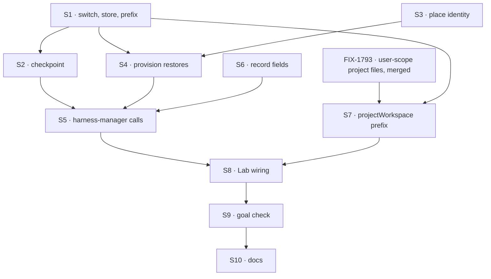

# FIX-1766 · Plan

[Spec](SPEC.md) · [Decisions](DECISIONS.md) · [Rules](BUSINESS-RULES.md) · **Plan** · [Docs](DOCS.md) · [Evolution](EVOLUTION.md)

Written for the implementing agent. IDs cross-reference [BUSINESS-RULES.md](BUSINESS-RULES.md)
(BR-n) and [DECISIONS.md](DECISIONS.md) (Dn, Q1). `tdd`. Four PRs. Slice 2 of the design in
[FIX-1762's EVOLUTION.md](../FIX-1762/EVOLUTION.md): fills the `checkpoint` and `restore` seams
FIX-1762 shipped as no-ops. One hold per attempt (Q1). Holding is off unless the host is given a
held-work store ([opt-in](DECISIONS.md#opt-in)); the bytes go in a blob store ([D3](DECISIONS.md#d3)).
The state words are [BUSINESS-RULES.md → The three state vocabularies](BUSINESS-RULES.md#the-three-state-vocabularies);
use them exactly.

## Surfaces

| ID | Package · role | Change | Rules |
|---|---|---|---|
| S1 | `workspace` · the switch and the store | `LocalWorkspaceHostOptions.heldWork?: HeldWorkStore`, absent by default. `HeldWorkStore` is `put(key, bytes: Uint8Array)`, `get(key) → Uint8Array \| undefined`, `delete(key)` and `list(prefix) → string[]`, all required; deleting a missing key does nothing; `list` returns keys only, under the prefix given, and nothing in this slice calls it. `put` is atomic: no partial object is ever visible. `fileHeldWorkStore({ dir })` writes each key as a file by temp file and rename, deletes by unlink, and lists by walking the prefix's folder. The repo answer gains an optional `heldPrefix: string`, opaque to the host like `projectId`. Without `heldWork`, every path below is skipped and the host is today's | BR-10 BR-14 BR-15 BR-28 |
| S2 | `workspace` · `checkpoint(place)`, `dropHeld(place, key)` | `checkpoint` returns the hold, or `null` unless [holding applies](#guardrails). In order: `lstat` every path `status -z --no-optional-locks` reports, and exclude any over 10 MB or inside a submodule; copy the worktree's index to a temp file; `GIT_INDEX_FILE=<tmp> git add -A` with those exclusions, `write-tree`, `commit-tree -p <head>` under a fixed identity; if that equals the recorded snapshot S5 passed in, return it as unchanged and stop; `rev-list --objects <snapshot> ^<base> \| pack-objects --stdout`; `put` the pack at `<heldPrefix>/<place>/<snapshot>.pack`. Returns base, head, snapshot, key, sha256, bytes and skipped paths. Writes no ref and never the real index. `dropHeld` deletes one key, refused outside the place's answered prefix | BR-1–BR-6 BR-11 BR-15 |
| S3 | `workspace` · place identity | A host id kept at `<root>/.host-id`; hosts sharing a root share it | BR-16 BR-22 |
| S4 | `workspace` · `provision` restores | Takes the run's recorded place and hold. Unless [holding applies](#guardrails), provisions as today, except that a recorded hold with no `heldWork` and no live place rejects `disabled` before any git process (BR-28, BR-29). Returns the place with `origin` (`new`, `live`, `held`, `base`), or rejects with `HeldWorkMismatchError` naming the field (`scope`, `pack`, `base`, `head`, `snapshot`, `tree`, `branch`, `remote`, `disabled`), distinct from `WorkspaceRefusedError`. Moves a stale directory aside; clones; cuts the branch at base; `get`s the pack and checks its sha256; `index-pack`s it; `read-tree -u --reset <snapshot>`; `reset --mixed <head>`; checks the rebuilt tree equals the snapshot's. After an owner's answer, checks the snapshot's tree out into `held/` | BR-15–BR-23 BR-29 BR-30 |
| S5 | `harness-manager` · callers | Hold beside every existing save: turn end, park, harness failure (BR-8 at completion). Record the hold, fenced, only after `checkpoint` returns; then `dropHeld` the key the record named before, unless it is the new one or it parked. Provision passes the record's place and hold, and writes `place.state` through the sequence in the rules. `HeldWorkMismatchError` parks the row through the existing ask, to the run's owner; operator log line without contents; `WorkspaceRefusedError` cancels as today. Prompt line on restore. Unless [holding applies](#guardrails), none of this runs and nothing is written, but a `disabled` mismatch parks like any other | BR-1 BR-6–BR-9 BR-17–BR-20 BR-23 BR-28 BR-29 |
| S6 | `harness-manager` · run record | Two `.nullable().default(null)` roots, `place: { host, state }` and `held: { attempt, at, base, head, snapshot, key, sha256, bytes, skipped, error, parked }`, combined only as BR-27 allows; `parked` is set when that key's pack parks the row, so BR-6 never deletes it. Status shows them | BR-6 BR-9 BR-24–BR-27 |
| S7 | `workforce` · `projectWorkspace` | Repo answers carry `heldPrefix`: `worktree-overlay/user/<ownerId>/<projectId>` for a private project, `worktree-overlay/org/<orgId>/<projectId>` for a shared one, picked by the project's visibility as FIX-1793 picks its files. No prefix for a private project until FIX-1793 can name its owner (BR-13). No collection is declared | BR-12 BR-13 BR-15 |
| S8 | DevTeam Lab · `packages/shift-manager/teams/devteam/host.mts` | A second host root and a `fileHeldWorkStore` outside both, for the goal check. `GOAL_CONTROL` hooks: `no-checkpoint` (S2 returns `null`), `no-verify` (S4 skips its checks), `record-first` (S5 records before S2's `put`), `delete-first` (S5 drops the recorded key before S2's `put`), `hold-always` (the default flipped to on: a host given no `heldWork` holds into the leg's folder anyway). A crash hook that kills machine A after a named pack's `put` returns. Leg f's B gets no `heldWork` | goal |
| S9 | Goal check | `goals/devforce-lab/it-keeps-a-runs-work-when-its-machine-is-lost/`, legs a–f | goal |
| S10 | Docs | Per [DOCS.md](DOCS.md), including **removing** "One host's storage" from both harness-manager Limits; `minor` changesets for `workspace`, `harness-manager`, `workforce` | — |

## Sequence



### PR plan

| PR | Branch | Base | Deliverables | depends_on |
|---|---|---|---|---|
| 1 | `fix/FIX-1766-1-snapshot-and-restore` | `main` | S1–S4, workspace README | — |
| 2 | `fix/FIX-1766-2-held-prefix` | PR 1, started only after FIX-1793's storage PR has merged to `main` | S7, workforce README | 1 (and FIX-1793's storage, external) |
| 3 | `fix/FIX-1766-3-harness-manager` | PR 1 | S5 S6, harness-manager README | 1 |
| 4 | `fix/FIX-1766-4-lab-and-goal` | PR 3 | S8 S9, rest of S10; merges `main` after PR 2 | 2, 3 |

**PR 1 shrank.** It no longer builds a dirty-paths place, a binary encoding, tombstones,
`projection.adopt()`, a per-path manifest or a bundle. It is now one port with a folder default,
one git snapshot and pack, and one rebuild with one tree comparison. **PR 2 shrank** to one field:
no collection declarations at two scopes.

PRs 1 and 3 need nothing from FIX-1793 and go in parallel with it. **PR 2 does not start until
FIX-1793's user-scope project-files declarations have merged**, because the prefix is picked the
way FIX-1793 picks a project's files. Until then a private project gets no prefix and nothing is
held for it; nothing is ever written under the org's prefix for a private project, even for a
while. Expect rebases through `project-workspace.ts`.

## Checks

| ID | Runs after | Passes when |
|---|---|---|
| V0 | S1 | Without `heldWork`, `checkpoint` returns `null`, no git process runs, and `provision` returns what `main` returns for the same inputs (BR-28); given a recorded hold and no live place, it rejects `disabled` and runs no git process (BR-29). `fileHeldWorkStore`'s `list` returns only keys under the prefix given, and `delete` of a missing key resolves |
| V1 | S2 | The snapshot's tree equals the working tree: edits, new files, deletions, a rename, a binary file, an exec bit and a symlink; ignored paths absent; an over-cap file keeps the head's version and is named, its content never read; the real index's bytes and every ref unchanged; nothing reaches the remote (BR-1–BR-5, BR-11) |
| V2 | S2 S4 | A second hold after a commit gives a whole new snapshot under a new key, the first left as it was; one with nothing changed returns unchanged and `put`s nothing (BR-2, BR-6). `origin` `live` for a live recorded place, untouched (BR-16); `held` for a lost place rebuilt equal to the source checkout, changes unstaged (BR-17, BR-18); `base` when nothing was held (BR-21); each mismatch field rejects naming it, nothing changed (BR-19); a key outside the answered prefix rejects as `scope` (BR-15); stale directory kept (BR-22) |
| V3 | S5 S6 | Hold at turn end, park and failure; the record is written after `put` returns, then the previous key alone is dropped, and a failed drop leaves the hold standing (BR-6); completion fails on a failed hold (BR-8); displaced attempt refused (BR-9); `place.state` follows the sequence in the rules; mismatch: row `parked`, `place.state` `lost`, question to the owner, no harness ran (BR-19), and the same for `disabled` (BR-29); answer lays out `held/`, and the next hold writes a new key and never drops the parked one (BR-6, BR-20); BR-27's impossible pair rejected; legacy record (BR-24) |
| V4 | S7 | Private run's prefix is the owner's user prefix; shared run's the org's; a private project before FIX-1793's owner is known gets none (BR-12, BR-13) |
| VG | S9 | [The goal](SPEC.md#the-goal-and-how-well-know-its-met): legs a–f PASS, after leg a FAILED under `no-checkpoint`, leg b under `no-verify`, leg d under `record-first` and under `delete-first`, and leg e under `hold-always` |

Q1 is V3's hold points. D1 is V4, D2 is V3's park, the opt-in is V0 and leg e. Second path
(BP-035): holding off, legacy record, displaced attempt, failed hold, crash mid-hold, concurrent
hold and save, first-turn crash, stale directory.

## Pinned names

| Where | Name | Why pinned |
|---|---|---|
| Host option | `heldWork` | Public on `localWorkspaceHost`; FIX-1767's host takes the same name |
| Port and default | `HeldWorkStore` (`put`, `get`, `delete`, `list`), `fileHeldWorkStore` | Public on `@flow-state-dev/workspace`; operators write adapters against it, so `delete` and `list` are in now and FIX-1768 sweeps without changing it |
| Host method | `dropHeld` | Harness-manager calls it after the record switches |
| Answer field | `heldPrefix` | Public on the repo answer; Workforce fills it |
| Key | `worktree-overlay/<user\|org>/<scopeId>/<projectId>/<run>/<snapshot>.pack` | FIX-1762's design named the root; FIX-1768 drops a run's prefix |
| Error | `HeldWorkMismatchError` with `field` | Harness-manager branches on it |
| `place.state` | `provisioning` `ready` `refused` `lost` `restoring` | FIX-1767's host reports the same states |
| Provision `origin` | `new` `live` `held` `base` | Public on the host; FIX-1767 returns the same |
| Directory | `held/` | The agent and the person read it |
| Controls | `no-checkpoint`, `no-verify`, `record-first`, `delete-first`, `hold-always` | The goal check |

## Guardrails

| Rule | Because |
|---|---|
| **Holding applies** when `heldWork ∧ heldPrefix ∧ remote`: the host has a store, the source named a prefix, and the branch came from a remote. S2, S4 and S5 act only then; otherwise no git read and no write at a save point | Jake: off is today's `main`, with no extra work at a turn's end. One predicate, so the three surfaces cannot drift |
| The pack is `put` before the record names it, under a key no earlier hold used | A machine dying mid-hold must leave the record on the last good snapshot (BR-30) |
| A hold deletes only the pack the record named before, only after the switch, never one that parked, and never overwrites the recorded key | Deleting first loses the last good turn to a crash (BR-30); a parked pack is evidence. Storage: one live pack per run, plus any orphans left by crashes and any pack that parked, which FIX-1768's sweep removes via `list` |
| Size is checked by `lstat` before git reads a path | A large dirty file must cost a stat, not its size in memory |
| Git in a hold uses a temporary index and `--no-optional-locks` reads, and writes no ref | The agent may be using the repository; a hold must not move it. Unreferenced objects are left in the local clone for git's own pruning |
| The host reads only the recorded key, under this attempt's answered prefix | The store has no access control of its own; the prefix is the check |
| Turn-end budget: each hold packs everything from the base, so a long-lived branch makes every hold larger | Name the cost; a hold that grows past a few megabytes is a sign the run should push. Packing from the last snapshot instead is a later optimisation only if the recorded pack still restores alone (BR-6, BR-30) |
| A live checkout is never fetched, reset or restored over | FIX-1762's lock: never discard work |
| The workspace layer never says "project"; harness-manager never imports Workforce | FIX-1762 D2; Workforce fills the source |
| No change to worker, coordinator, mailbox or board code; no noun FIX-1796 retired | The Architect's fences |

## Docs

Publish [DOCS.md](DOCS.md) per PR: workspace with PR 1, workforce with PR 2, harness-manager and
the Limits removal with PR 3, the projects page with PR 4 after the goal check passes.

## Sketch · pseudocode, illustrative

```
at a save point:   unless holding applies → nothing
                   snap ← temp-index add -A, write-tree, commit-tree -p head
                   snap == record.held.snapshot → nothing
                   pack ← rev-list --objects snap ^base | pack-objects
                   store.put(prefix/run/snap.pack, pack)
                   old ← record.held.key
                   record.held ← { base, head, snap, key, sha, bytes }   (fenced)
                   store.delete(old) unless old parked                    (last)
at provision:      no heldWork, record.held, not live here → mismatch disabled → row parked
                   no heldWork → as today
                   live here and record.place.host is us → origin live
                   no record.held → origin base
                   else → aside(stale dir); clone; branch at base
                          get pack, check sha; index-pack; read-tree snap; reset --mixed head
                          tree(worktree) == tree(snap) ? origin held : mismatch → row parked
```

**POC:** none. The premises (a temporary-index snapshot writes no ref and leaves the real index
alone; a pack of `snapshot ^base` restores onto a clone at base) are standard git behaviour,
proven by V1 and V2 on the first PR. This spec rests on no counted facts, so no factual-base
checker.

## At implement time

- Re-read FIX-1793's storage surfaces as merged; S7 copies their visibility rule, not this plan's.
- FIX-1767 builds a sandbox host on S1's option, S4's `origin` and states, and the record's hold;
  FIX-1768 reads `held.snapshot` to know what is unpushed and drops `worktree-overlay/…/<projectId>/<run>/`.
- Reuse `packages/shift-manager/teams/devteam/scratch-repo.mts` for the `file://` remote.

## Notes from review

- "Two independent `.nullable()` roots (`place`, `held`) multiply states… one optional object… not required if you document the cross-product explicitly." — Cursor ([thread](https://github.com/fixpoint-labs/flow-state-dev/pull/2878#discussion_r4222582709)). Kept as two roots; the cross-product is BR-27.
- "A hold that fails at completion fails the attempt, so the retry re-runs the agent to produce work that already exists. A bounded retry of just the hold (a few attempts, backoff) before failing would avoid re-spending an agent turn on a transient store error." — jhoffner, finding 5 ([comment](https://github.com/fixpoint-labs/flow-state-dev/pull/2878#issuecomment-6066140305)). Implementer's call: retry the `put` and the record write a bounded number of times inside S5 before BR-8 fails the attempt.
- "Confirm that the dispatcher runs the retry as the run's owner, per FIX-1793 BR-34, so a private run's held work is readable there. Otherwise D1 holds on paper and the restore finds nothing." — jhoffner, finding 6 (same comment). A check against FIX-1793's surfaces when PR 2 starts, not new design: the retry's context must resolve the same `heldPrefix` the first attempt did, or BR-15 reads it as `scope`.
- From jhoffner's [second look at #2881](https://github.com/fixpoint-labs/flow-state-dev/pull/2881#issuecomment-6068041468), finding 5:
  - "`commit-tree` under a 'fixed identity': also fix the author and committer dates (`GIT_*_DATE`). Otherwise the content-addressed key changes on every call." Set `GIT_AUTHOR_DATE` and `GIT_COMMITTER_DATE` with the identity, so an unchanged tree gives the same key; BR-6's unchanged case depends on it.
  - "A file deleted in the working tree but excluded from the add stays in the snapshot." Check the deleted over-cap file case against the exclude pathspec in V1.
  - "`reset --mixed` after `read-tree -u --reset` looks redundant with the `-u` checkout. Verify it cannot touch untracked new files." Verify that in V2, or drop it if redundant.

These are inputs, not instructions.

## Follow-ups

- A timed hold inside long attempts, only if attempts prove long. It would call the same
  `checkpoint` on a timer; nothing stored changes.
- A shipped S3, R2 or Vercel Blob `HeldWorkStore`, when an operator asks; and an adapter over the
  engine's `blobs` slot when its binary store ([FIX-367](https://linear.app/fixpoint-labs/issue/FIX-367)) ships.
- Retention of orphaned packs, frozen ones and stale directories: FIX-1768.
